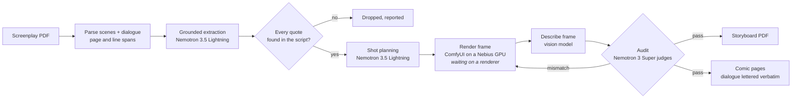
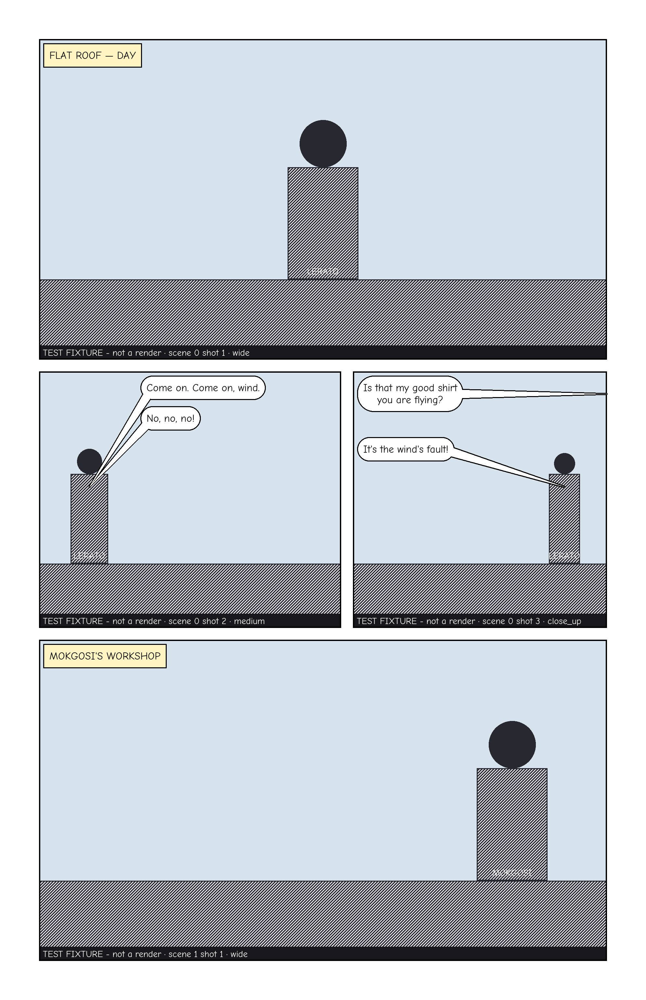

# Panelwise

**Script → storyboard → comic, grounded in the screenplay at every step.**

Panelwise turns a screenplay into a shot-by-shot storyboard and then into a comic book. Every panel
traces back to a verbatim span of the script. NVIDIA Nemotron on Nebius Token Factory extracts the
characters, props and locations and plans the shots. Code then checks every quote the model gives
against the script, and anything it can't find is dropped. Each frame is rendered, a vision model
describes it, and Nemotron audits that description against the shot. A frame that shows something
the script doesn't is re-rendered, and after the last try it is withheld, never shown. (The audit,
the re-render loop, its audit log and the withheld card are built and tested. Rendering itself waits
on a renderer: Token Factory serves no image model, and GPU access for ComfyUI isn't set up yet.)

Built for the [Nebius x NVIDIA Global AI Hackathon](https://nebiusglobalaihackathon.devpost.com/)
(Best Apps and Agents track). Panelwise builds on FrameFlow, an earlier private project by the same
team: [CHANGES-FROM-FRAMEFLOW.md](CHANGES-FROM-FRAMEFLOW.md) says what was ported and what is new.

## What works today

| Stage | State | Try it |
| --- | --- | --- |
| Parse a screenplay PDF into scenes, action and dialogue, each with its page and line span | built | [§ Run it](#run-it) |
| Grounded extraction on Nemotron: characters, props, locations, every quote located in the script | built, measured | `app.grounding.run` |
| Shot planning on Nemotron: every action paragraph and speech in exactly one shot | built, measured | `app.shots.run` |
| Frame prompts from the shot's own script words, names redacted | built | `app.storyboard.prompts` |
| Frame audit: a vision model describes, Nemotron judges, code runs the checks | built, run on real frames | `app.verify.run` |
| Comic layout and lettering: panels sized by shot, dialogue lettered verbatim | built, on test-fixture frames | `tools.build_comic_reference` |
| Rendering frames (ComfyUI on a Nebius AI Cloud GPU), the storyboard PDF | waiting on a renderer (GPU access, or an interim one) | — |
| The API behind the web app: sign-in check, upload, a job that runs parse → extract → plan, read endpoints for the project, its lines, shots and frames | built, run live on Supabase | `/api/v1/projects` (needs a Supabase sign-in) |
| The re-render loop: render, describe, audit, re-render on a mismatch, withhold after the last try; every attempt and its audit kept | built and tested (T021); runs as soon as a renderer is plugged in, and "Try another render" answers *unavailable* until then | the API's tests |
| Web app: sign-in, the projects list with upload and each job's live state, the script page (scenes, every entity with its quotes and their page/line spans, faithfulness and recall) | built, run live on Supabase (T040, T041) | `docker compose up --build --wait`, then `localhost:3000` ([§ Run it](#run-it)) |
| Web app: the storyboard (the script with a line over each shot's span, beside a board of frame cards that update live), and the frame sheet for a shot (its source lines, who is in it, and the audit log of every attempt with "Try another render") | built, run live on Supabase (T042, T045, T061); the cards say *Not rendered yet* until rendering lands | a project's *Storyboard* tab |
| Still to build: the comic reader; the hosted demo | designed (T024); the demo waits on the Render and Vercel accounts (T037, T030) | — |

[STATUS.md](STATUS.md) is the live board. The order of what's left is in its *Next action* section.

## How it works



The rule behind every box: **a panel may never show a character, prop, line of dialogue or event
that isn't in the screenplay.** It is enforced in code after each model call, not asked for in a
prompt:

- **Extraction.** Every entity the model proposes comes with quotes. Each quote must be found,
  word for word, inside one scene heading or element, and it keeps that page and line span. A quote
  that can't be found is dropped. An entity left with no found quote, or whose name the script never
  writes, is dropped too. Speaking characters the model misses are added from the script's own
  dialogue cues ([docs/design/grounding.md](docs/design/grounding.md)).
- **Shots.** Each shot covers a run of the scene's elements and cites their exact text and span.
  Character and prop names that weren't extracted for that scene are removed
  ([docs/design/shots.md](docs/design/shots.md)).
- **Frame prompts.** A prompt carries only the shot's own action lines, setting and time. Dialogue
  is left out, and character names are redacted ([docs/design/storyboard.md](docs/design/storyboard.md)).
- **Frame audit.** The vision model describes the frame without seeing the shot. Nemotron compares
  that description with the shot, and code runs seven checks. An unscripted person or object, text
  in the frame, or the wrong setting is a hard fail. An audit that errors never passes
  ([docs/design/verify.md](docs/design/verify.md)).
- **Comic.** Every bubble is a line of dialogue from the shot, verbatim, carrying its span. A frame
  that failed the audit is drawn as a card naming the failed checks, never as its pixels
  ([docs/design/comic.md](docs/design/comic.md)).

<p align="center">
  
  <br><sub>A comic page from the sample <code>the-red-kite</code>. The layout, captions and bubbles are produced by the real code; the
  frames are test fixtures, labelled as such, until rendering lands.</sub>
</p>

## How Nemotron and Token Factory are used

Every model call goes to **Nebius Token Factory**'s OpenAI-compatible API, through one client
(`services/api/app/llm`). Before writing any code we measured what the service actually does, with
real calls, in [docs/nebius-findings.md](docs/nebius-findings.md). Several answers differed from
the catalog, and the design follows the answers.

| Tier | Model | Used for | Why this model |
| --- | --- | --- | --- |
| fast | `nvidia/Nemotron-3_5-Lightning` | extraction, shot planning | Token Factory **enforces** a strict `json_schema` on it (U1), which schema-bound extraction needs. It allows 600 requests and 400K tokens a minute (U4) at $0.06 / $0.24 per million tokens. Thinking is switched off: that took a one-number answer from 271 output tokens to 4 (U2) |
| reasoning | `nvidia/nemotron-3-super-120b-a12b` | the frame-audit verdict | A judgement call over the shot's grounded spec and the frame's description, with thinking on |
| vision | `deepseek-ai/DeepSeek-V4.1-Flash` | describing a rendered frame, blind to the shot | **No Nemotron model on Token Factory accepts images** (U7), so this non-NVIDIA model only describes. Nemotron judges; code applies the checks |

Images render on ComfyUI on a **Nebius AI Cloud** GPU, because Token Factory serves no
image-generation model (U5).

Details that came out of measuring rather than reading the docs:

- Strict `json_schema` is enforced. `json_object` returns valid JSON in the wrong shape, and
  `guided_json` is ignored (U1). The client sends `json_schema` and keeps one repair retry as a
  backstop (`structured_chat`, [docs/design/llm.md](docs/design/llm.md)).
- Only two of the four switches we tried actually turn thinking off (U2).
- Rate limits are per model and come back on every response. The client honours `Retry-After`
  on 429 instead of backing off blindly (U4).
- The first vision model we chose silently stopped receiving images between two dates and began
  answering from text alone. A re-check caught it, and the describer moved to DeepSeek
  (findings § U7 re-check).

## Measured results

On the three self-written sample screenplays in [`samples/`](samples/README.md), 5 live runs each on
Nemotron 3.5 Lightning (2026-10-01):

| | Result |
| --- | --- |
| Ungrounded quotes or shot citations kept, re-checked in code | **0** in all 15 runs |
| Every action paragraph and speech in exactly one shot | all 15 runs |
| Faithfulness: the model's proposals fully found in the script (the rest loses its unfound quotes, or is dropped whole if its name or every quote is missing) | 0.898 (246 of 274 entities) |
| Recall: speaking characters the model found itself (cues supply the rest) | 0.944 (85 of 90) |
| Tokens per run | about 9,700 in and 3,800 out (≈ $0.0015 at catalog prices) |

Per-sample numbers, the method and the raw results are in [eval/README.md](eval/README.md). Rerun
them with `uv run python -m tools.evaluate --runs 5` from `services/api`. Frame-audit accuracy
(precision and recall on labelled renders) is measured once rendering lands (T049).

## Run it

You need Python 3.14 with [uv](https://docs.astral.sh/uv/), and a Nebius Token Factory API key.
Docker is only needed for the local stack and the full gate (its database tests start their own
Postgres), and Node 24 with pnpm only for the web app.

```bash
git clone https://github.com/Katlego-tech/Panelwise.git && cd Panelwise
bash install-hooks.sh            # contributors: the pre-push gate
cp .env.example .env             # set NEBIUS_API_KEY
cd services/api && uv sync
```

Every command below runs from `services/api` on a self-written sample. Only use public-domain or
self-written scripts.

```bash
uv run python -m app.llm.smoke                                      # the key works; fast tier answers with 0 reasoning tokens
uv run python -m app.grounding.run ../../samples/the-red-kite.pdf   # entities with page/line spans, faithfulness, recall
uv run python -m app.shots.run ../../samples/the-red-kite.pdf       # shots with the verbatim text each one cites
uv run python -m app.projects.run ../../samples/the-red-kite.pdf    # the pipeline core, stage by stage
uv run python -m app.storyboard.prompts ../../samples/the-red-kite.pdf --style ink   # frame prompts, each part citing its line
uv run python -m app.verify.run ../../samples/the-red-kite.pdf 1.2 frame.png  # audit a PNG against shot 2 of scene 1 (any PNG works as a smoke test; real frames come with rendering)
uv run python -m tools.evaluate --runs 5                            # the measured results above
```

Offline, no key needed:

```bash
uv run python -m tools.build_samples           # rebuild the sample PDFs and print what the parser reads
uv run python -m tools.build_comic_reference   # re-render the comic reference pages in docs/design/comic/
bash ../../scripts/gate.sh                     # every check the pre-push hook runs
```

The local stack (Postgres, the API and the web app on pinned versions) runs with
`docker compose up --build --wait`. Without a Supabase project in `.env` it serves the health
checks, `GET :8000/api/v1/health` and `GET :3000/api/health`. With one (`SUPABASE_URL`,
`SUPABASE_SECRET_KEY`, a private Storage bucket named in `SUPABASE_STORAGE_BUCKET`, and the
`NEXT_PUBLIC_SUPABASE_*` pair), open `localhost:3000`, sign in, upload a sample PDF and watch its
job read, extract and plan; then open its script page and its storyboard, and click a card for its
frame sheet. The app has a sign-in page only: sign-up is
off, so users are created in the Supabase dashboard (Authentication > Users).

## Feedback on Nebius Token Factory and NVIDIA Nemotron

⟨TBD: written by the team.⟩

## Repository layout

| Path | What |
| --- | --- |
| `services/api/app/` | the FastAPI service: `llm`, `script`, `grounding`, `shots`, `storyboard`, `verify`, `comic`, `characters`, `projects`, `jobs`, `frames`, `storage`, `api` (with Alembic migrations) |
| `services/api/tools/` | `build_samples`, `build_comic_reference`, `evaluate` |
| `apps/web/` | the Next.js app: sign-in, the projects page with upload, the script page, the storyboard and its frame sheet |
| `samples/` | self-written screenplays (Fountain source and PDF) |
| `eval/` | measured results and how they were produced |
| `styles/` | public storyboard styles (`clean`, `ink`, `pencil`) |
| `docs/design/` | a design doc per module: diagrams, contracts, decisions |

Full tree: [docs/project-structure.md](docs/project-structure.md).

## How we work

This repo uses the Cultivation kit. [AGENTS.md](AGENTS.md) holds the rules,
[STATUS.md](STATUS.md) the live board and [TASKS.md](TASKS.md) the backlog. Every push runs
`scripts/gate.sh`: ruff, pyright, pytest (database tests on a throwaway Postgres 17.11), eslint and tsc, vitest, next build, and placeholder,
secret, vulnerability and duplication scans.

## License

[Apache 2.0](LICENSE). The sample screenplays are original and under the same licence.
