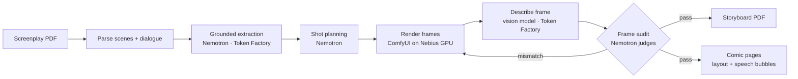

# Panelwise

**Script → storyboard → comic, grounded in the screenplay at every step.**

Panelwise turns a screenplay into a shot-by-shot storyboard and then into a comic book. Every panel
traces back to a verbatim span of the script: a vision model describes each rendered frame, Nemotron
audits it against the shot spec, and the frame is re-rendered when it shows something the script
doesn't.

Built for the [Nebius x NVIDIA Global AI Hackathon](https://nebiusglobalaihackathon.devpost.com/)
(Best Apps and Agents track).

> **Status:** scaffold. The pipeline is being built. See [STATUS.md](STATUS.md) for what works today.
> Panelwise builds on FrameFlow, a private earlier project by the same team. See
> [CHANGES-FROM-FRAMEFLOW.md](CHANGES-FROM-FRAMEFLOW.md) for the disclosure.

## How it works



| Stage | NVIDIA / Nebius |
| --- | --- |
| Extraction, shot planning | NVIDIA Nemotron on **Nebius Token Factory** (OpenAI-compatible API) |
| Frame audit (who's in frame, framing, time of day) | A vision model on Token Factory (`zai-org/GLM-5.3-Flash`, not NVIDIA: no Nemotron model there accepts images) describes each frame; **NVIDIA Nemotron** judges the description against the shot spec |
| Image rendering | ComfyUI on a **Nebius AI Cloud** GPU |

## Quick start

> Filled in as each lane lands. The commands below are the target shape.

```bash
git clone git@github.com:Katlego-tech/Panelwise.git && cd Panelwise
bash install-hooks.sh            # every contributor, once per clone
cp .env.example .env             # add your Nebius Token Factory key
docker compose up
```

## Repository layout

See [docs/project-structure.md](docs/project-structure.md).

## How we work

This repo uses the Cultivation kit: [AGENTS.md](AGENTS.md) holds the rules, [STATUS.md](STATUS.md)
the live board, and [TASKS.md](TASKS.md) the backlog.

## License

[Apache 2.0](LICENSE).
