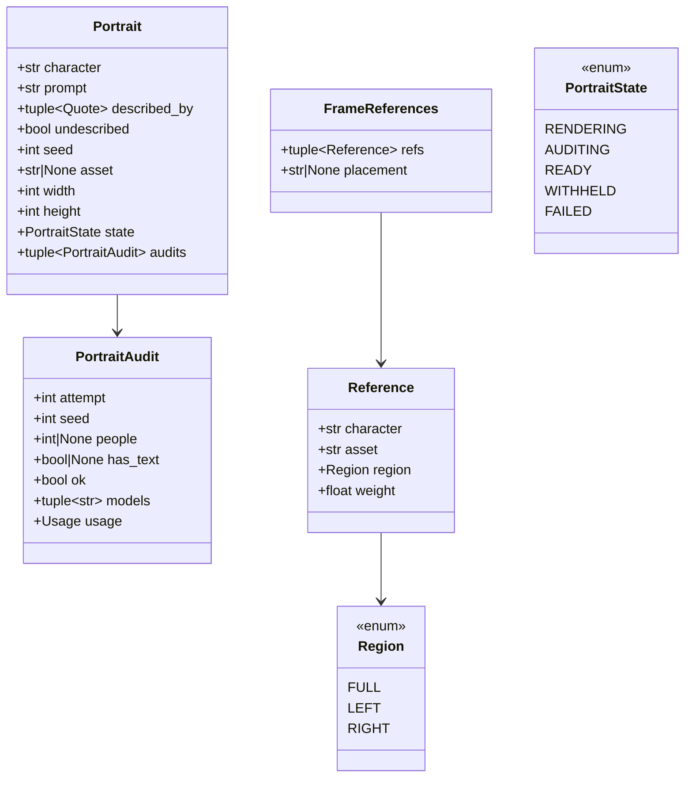
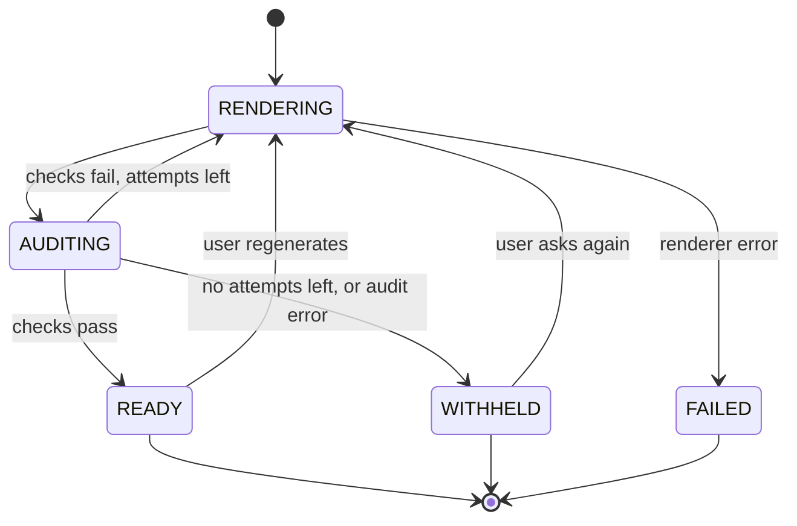

# Design — `characters` (reference portraits and consistent characters)

**Status:** agreed · **Owner:** Katlego (Claude) · **Tasks:** T025 (portraits, references in frames);
its ComfyUI nodes are installed on T003's GPU · **Spec:** [SPEC.md](../../SPEC.md) US4 (the same character
looks the same from panel to panel)

---

## 1. What this covers

Making a character recognisable across every frame and panel: one **reference portrait** per
character, built only from the script's words about them, audited, and then fed into each frame's
render as an **image reference** (IP-Adapter in ComfyUI). Also the rules every image prompt obeys
about characters.

**Not covered:** the frame renderer itself (T008), the audit (verify.md, reused here), the ComfyUI
box (T003).

## 2. Reference material

| Kind | Where |
| --- | --- |
| Prior art in FrameFlow | `portrait_service.py`, `portrait_jobs.py`: 3:4 head-and-shoulders casting portraits from the character's fields plus **director choices** (ethnicity, skin tone), job states queued/running/done/failed. **Never used as a reference for frames**; FrameFlow's frames got people only from free text. Its ComfyUI graph (built in Python, `image_provider.py::build_workflow`) had no IP-Adapter, ControlNet or LoRA nodes |
| Inputs | `Entity` (kind `CHARACTER`, `quotes`, `scenes`, `source`: grounding.md §6); `Shot` (shots.md §6); `Scene.elements` (script.md §6) |
| Audit | verify.md: the blind describer and `FrameState` rules |
| ComfyUI | `infra/comfyui/workflows/` (PLAN.md: "public node graphs (JSON)"); IP-Adapter via the `ComfyUI_IPAdapter_plus` custom nodes |

## 3. Domain model



**The character rules for every image prompt** (portraits and frames; T008 must follow them too):

1. **No character names in image prompts.** An image model reads a name as a style or likeness cue
   (a famous character's name summons a real actor's face). Names stay in the data, never in the
   prompt text.
2. **Only the script's words describe a character.** A portrait prompt carries the character's
   `described_by` quotes: their located quotes whose span is an **Action** element's span. A quote
   located in a Dialogue element (what they say, not how they look) or in a scene heading is
   excluded. No age, gender, ethnicity or skin tone is added unless those words are in a quote.
   **Redaction, the one change to a quote:** screenplays introduce a character by name inside the
   description ("NANDI (60s, oilskin coat) pours tea…"), so before a quote enters any image prompt,
   every whole-word occurrence of a name token of *this* character is replaced by `a person`, and of
   any *other* character by `another person`. Name tokens are the words of `normalise(entity.name)`
   (script.md), matched case-sensitively in UPPER or Title case at word boundaries, which is how
   screenplays write names. Rule 1 therefore holds by construction; redaction only removes words,
   never adds them. The one known cost: a sentence-initial common word that is also a name ("Will")
   is redacted too, which fails safe.
3. **Undescribed means undescribed.** A character with no descriptive quote (always true for
   `Source.CUE` backfills, whose only quote is a speech) gets a neutral portrait prompt, and
   `undescribed = True` is shown in the UI: "the script doesn't describe NANDI". Nothing is
   inferred to fill the gap.

Everything a drawn face shows beyond those words is the model's default. This design keeps that
default **consistent** (the reference) rather than pretending it is scripted.

- **`Portrait`**: 768 × 1024 (3:4), head and shoulders, plain background, in the storyboard style
  (so the reference matches the frames). `asset` is its Supabase Storage path, `None` until a
  render passes (a `WITHHELD` portrait has none). `Quote` is grounding.md's; `Audit` is verify.md's. `seed` is
  deterministic per character and attempt, as in verify.md.
- **`FrameReferences`** for a shot is chosen deterministically (§4): at most two references.
  `placement` is the phrase added to the frame prompt (`"one figure on the left, one on the
  right"`), never with names.

## 4. Flow

```mermaid
sequenceDiagram
    participant J as Portrait job (per character)
    participant C as ComfyUI (T003)
    participant D as Describer (verify.md)
    participant F as Frame render (T008)
    J->>J: described_by = the character's action-paragraph quotes; prompt (no name)
    loop attempt 1..3
        J->>C: portrait.json (prompt, seed, 768×1024)
        C-->>J: PNG
        J->>D: blind description
        J->>J: portrait checks: exactly 1 person, no text
    end
    J-->>J: READY (asset stored) or WITHHELD
    F->>F: choose_references(shot, portraits)
    F->>C: frame_ref1.json / frame_ref2.json with the portrait(s) as IP-Adapter input
```

**Portrait checks** (hard, no judge): verify.md's `describe_frame` (the blind describer, exposed on
its own) gives the description; the portrait passes when `len(people) == 1` and `has_text` is
false. Each attempt is a `PortraitAudit` (`people`/`has_text` are `None` when the describer call
failed, and then `ok` is false). Three attempts, then `WITHHELD`: frames for that character render
**without** a reference (text-only), which is what FrameFlow always did, and the UI says so.

**`choose_references(shot, portraits)`** (pure, deterministic):
1. Candidates: `shot.characters` whose portrait is `READY`.
2. Order: first, characters who **speak** in the shot's covered elements, each resolved from its
   `Dialogue.cue` with `match_speaker(cue, shot.characters)` (an unresolved cue is skipped), ordered
   by their **first** speech and listed **once** however often they speak; then the remaining
   candidates in `shot.characters` order. Each character appears in the order exactly once.
3. Take the first two. One → `FULL` region, weight 0.7, no placement phrase. Two → first `LEFT`,
   second `RIGHT`, weight 0.6 each, masks splitting the frame down the middle, placement "one
   figure on the left, one on the right".
4. Three or more characters: only the first two get references; the rest come from the prompt
   alone. Stated in the frame's provenance.

The verify audit's `positions` (verify.md) then show whether the figures landed as placed; a
mismatch is a soft `FRAMING`-class observation, logged, not a failure (T025 decides whether to
add a check).

**Failure paths:** ComfyUI lacks the IP-Adapter nodes or models → the frame job fails at start-up
with the missing names (T003's install is checked, not assumed); portraits never fail a frame
silently. A missing portrait asset → that character renders without a reference, logged.

## 5. State



A portrait is used as a reference only in `READY`. Portrait generation is a `Job` per character
(deploy.md §5).

## 6. Contracts

```python
# app/characters/model.py
class Region(StrEnum): FULL = "full"; LEFT = "left"; RIGHT = "right"
class PortraitState(StrEnum): RENDERING = "rendering"; AUDITING = "auditing"; READY = "ready"; WITHHELD = "withheld"; FAILED = "failed"
@dataclass(frozen=True) class PortraitAudit: attempt: int; seed: int; people: int | None; has_text: bool | None; ok: bool; models: tuple[str, ...]; usage: Usage
@dataclass(frozen=True) class Portrait: character: str; prompt: str; described_by: tuple[Quote, ...]; undescribed: bool; seed: int; asset: str | None; width: int; height: int; state: PortraitState; audits: tuple[PortraitAudit, ...]
@dataclass(frozen=True) class Reference: character: str; asset: str; region: Region; weight: float
@dataclass(frozen=True) class FrameReferences: refs: tuple[Reference, ...]; placement: str | None

# app/characters/portraits.py (T025)
def described_by(entity: Entity, screenplay: Screenplay) -> tuple[Quote, ...]: ...   # quotes whose span equals an Action element's span
def portrait_prompt(entity: Entity, screenplay: Screenplay, characters: Sequence[str], style_prefix: str) -> tuple[str, tuple[Quote, ...], bool]: ...
#   the redacted described_by quotes, joined; contains no name token of any character
def portrait_seed(character: str, attempt: int) -> int: ...  # int.from_bytes(sha256(f"portrait:{normalise(character)}:{attempt}").digest()[:4], "big")
async def make_portrait(renderer: PortraitRenderer, model: NebiusChatModel, entity: Entity,
                        screenplay: Screenplay, *, max_renders: int = 3) -> Portrait: ...

# app/characters/redact.py (built by T008, which needs it for frame prompts first: storyboard.md §6)
def redact_names(text: str, character: str, others: Sequence[str]) -> str: ...        # rule 2's redaction; pure

# app/characters/references.py (T025)
def choose_references(shot: Shot, scene: Scene, portraits: Mapping[str, Portrait]) -> FrameReferences: ...

class PortraitRenderer(Protocol):
    async def render_portrait(self, prompt: str, seed: int, width: int, height: int) -> bytes: ...   # PNG
```

**Workflows** (`infra/comfyui/workflows/`, ComfyUI API format, committed JSON): `portrait.json`,
`frame.json` (no reference), `frame_ref1.json` (one IP-Adapter, full frame), `frame_ref2.json` (two
IP-Adapters with left and right attention masks). Code sets inputs by node **title** (`"positive"`,
`"seed"`, `"ref_left"`, …), never by numeric id, so a re-saved graph keeps working.

**Cache and storage key**: sha256 of the fully substituted API graph that is submitted (canonical
JSON) plus the post-processing step, storyboard.md §3.3. The prompt, seed, size, checkpoint and, for
frames only, the IP-Adapter model and the reference image names are all inputs of that graph (a
portrait uses no IP-Adapter). FrameFlow's image cache keyed on a Gemini model id even when ComfyUI
drew the image; every input that changes the pixels is in this key.

## 7. Structure

| Path | New? | Responsibility | Task |
| --- | --- | --- | --- |
| `services/api/app/characters/{model,portraits,references}.py` | new | §3–§6 | T025 |
| `services/api/app/characters/{__init__,redact}.py` | new | `redact_names` (and storyboard.md's `redact_all`) | T008 |
| `infra/comfyui/workflows/{portrait,frame_ref1,frame_ref2}.json` | new | the graphs | T025 (with T003's box) |
| `infra/comfyui/workflows/frame.json` | new | the no-reference frame graph | T008 (storyboard.md §6) |
| `infra/nebius/README.md` | changed | installed custom nodes, model files, their licences and versions | T003 |
| `services/api/tests/characters/` | new | §9 | T025 |

## 8. Decisions & alternatives

| Decision | Chosen | Rejected, and why |
|---|---|---|
| Consistency mechanism | IP-Adapter with the portrait as reference | text-only descriptions (FrameFlow): a new face every frame; LoRA per character: minutes of training per character and a GPU budget we don't have |
| Which IP-Adapter | a CLIP-vision "plus face" adapter with Apache-2.0 weights (exact file chosen and recorded in T003) | FaceID, InstantID, PuLID: they depend on insightface models licensed for non-commercial research, a risk for a public open-source entry; T003/T025 verify every licence before download |
| Names in prompts | never | names: a likeness and IP risk, and no help to the image model |
| Undescribed characters | neutral prompt, flagged | inferring a look from the name or the dialogue: invention |
| FrameFlow's director choices (ethnicity, skin tone) | dropped | not in the script; if the team wants them, they come back as explicitly user-entered, labelled fields in their own change |
| More than two characters | references for the two most prominent | masks for three or more: unreliable, and slower |
| Workflow form | committed JSON, set by node title | FrameFlow's graph built in Python: harder to open, inspect and tweak in ComfyUI |

Deviations from [docs/architecture-defaults.md](../architecture-defaults.md): none.

## 9. How this is verified

- `described_by`: only action-paragraph quotes; a `CUE` character is `undescribed`.
- `redact_names`: "NANDI (60s, oilskin coat) pours tea" → "a person (60s, oilskin coat) pours tea";
  another character's name → "another person"; multi-word names token by token; lower-case common
  words untouched ("she will stay" with a character WILL); a sentence-initial "Will" redacted.
- `portrait_prompt`: contains no name token of any character, contains each described quote with only
  those redactions, and nothing about age, gender or ethnicity that isn't in a quote; heading- and
  dialogue-located quotes excluded.
- `choose_references`: speakers first, by first speech, each once (a character speaking twice gets
  one reference); cues resolved with `match_speaker`; at most two; `FULL` for one; `LEFT`/`RIGHT` for two; only
  `READY` portraits; the placement phrase never names anyone.
- Portrait loop with a fake renderer and a mocked describer: pass; fail then pass; three fails →
  `WITHHELD` and frames fall back to no reference.
- Live (T025, needs T003): the sample script's characters rendered in three frames each, with and
  without references, compared side by side; the pair of image sets is committed as the visual
  reference.

## 10. Open questions

- [ ] The base checkpoint (T003) decides which IP-Adapter files fit (SD 1.5 vs SDXL families);
  record the exact files and licences in `infra/nebius/README.md`.
- [ ] An automatic consistency score (image-embedding similarity between a portrait and each
  frame's figure) would be a good eval number (T032); it needs a CLIP model on the GPU.
- [ ] Should a director be able to add appearance notes? Only as explicitly user-entered, labelled
  fields, never as generated ones; out of scope until someone asks.
