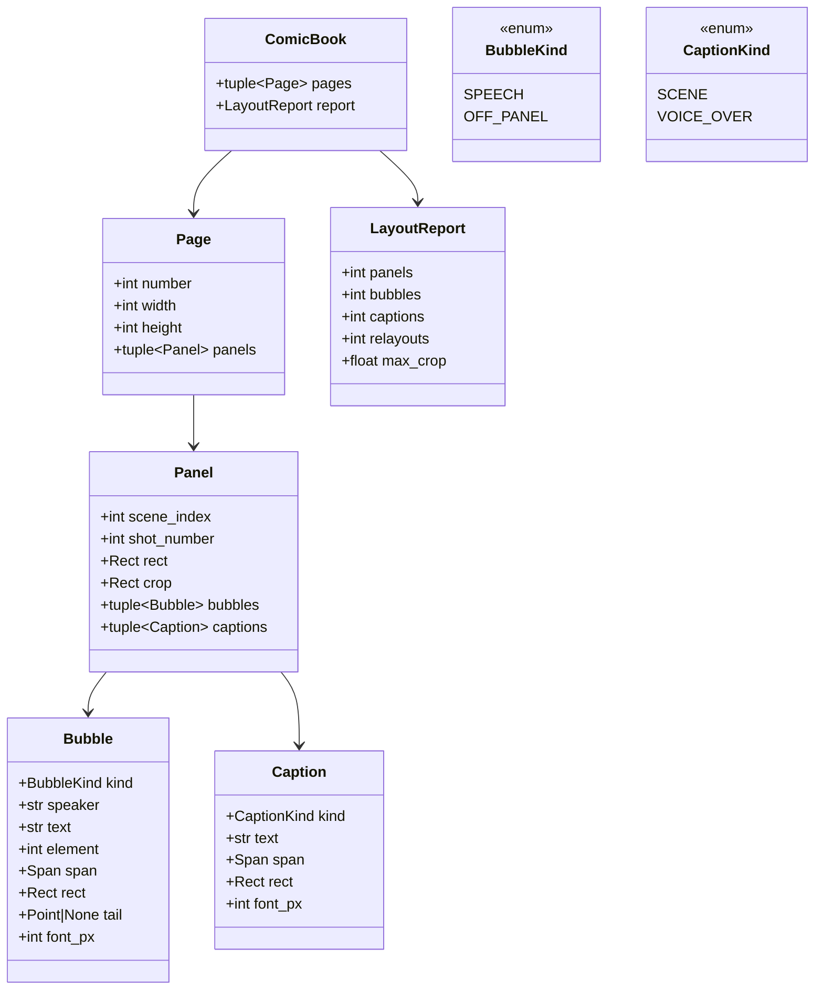

# Design — `comic` (page layout, panels, speech bubbles, export)

**Status:** agreed · **Owner:** Katlego (Claude) · **Tasks:** T022 (layout), T023 (bubbles, lettering,
export), T024 consumes it (reader) · **Spec:** US3 (script → comic); SPEC.md's stories are still
the template

---

## 1. What this covers

Turning a `ShotPlan` (docs/design/shots.md) and its rendered frames (T008) into comic pages: which
shots share a page and a row, how big each panel is, where each speech bubble sits, how it's
lettered, and the exported pages (PNG and PDF, plus a layout JSON for the web reader).

**Non-negotiable I applies to every letter on the page.** Bubbles and captions carry **verbatim
script text only**, each with its source `Span`; nothing is paraphrased, summarised, truncated,
dropped or invented. Action lines are never lettered (the art shows them), and there are no
invented sound effects.

**Not covered:** rendering frames (T008), the frame audit (T020; its frame description is an
optional input here), the web reader's UI (T024).

## 2. Reference material

| Kind | Where |
| --- | --- |
| Visual reference | none yet; producing a reference page from the self-written sample is part of T022's Verify |
| Inputs | `ShotPlan`, `Shot` (shots.md §6); `Screenplay`, `Scene`, `Dialogue`, `Span` (script.md §6); frame images (T008); optional per-character horizontal position from the audit description (verify.md) |
| Prior art in FrameFlow | none: FrameFlow made storyboard PDFs, never comics (its `storyboard_document.py` is the PDF precedent only) |
| Font | **Comic Neue** (SIL Open Font License 1.1), committed with its licence under `services/api/assets/fonts/`. Open-licensed, so the public repo can ship it |
| Page size | US comic trim, 6.625 × 10.25 in, rendered at 300 dpi = **1988 × 3075 px** |

## 3. Domain model



- `Rect` is `(x, y, w, h)` in page pixels; `Panel.crop` is in the frame image's pixels; `Point`
  is `(x, y)` in page pixels.
- **One panel per shot**, in plan order. `(scene_index, shot_number)` names the shot.
- **One bubble or caption per `Dialogue` element** the shot covers, in element order. `text` is
  `Dialogue.text` byte for byte; `element` is its index in `scene.elements`; `span` is its span.
  Parentheticals are direction for the art and are not lettered.
- **Extensions decide the kind:** none or `CONT'D` → `SPEECH` with a tail toward the speaker;
  `O.S.` or `O.C.` → `OFF_PANEL`, tail to the nearest panel edge; `V.O.` → a `VOICE_OVER` caption
  (a box, no tail).
- **`SCENE` caption** on a scene's first panel: `scene.location`, plus ` — ` and
  `scene.time_of_day` when that is an absolute time (`absolute_time`). Words from the heading only;
  a borrowed clock (`CONTINUOUS`) is not lettered. Its span is the heading line.

## 4. Flow

```mermaid
sequenceDiagram
    participant C as Caller (comic job)
    participant L as layout()
    participant B as place_bubbles()
    participant R as render_pages()
    C->>L: ShotPlan, Screenplay, frame sizes
    L->>L: weight each shot; build tiers (rows) and pages
    loop until every panel's lettering fits (at most 3 passes)
        L->>B: panels + frame images (+ speaker positions, if audited)
        B->>B: measure text; score candidate spots; place in reading order
        B-->>L: placed, or the panels that need more room
        L->>L: raise those panels' weights; rebuild
    end
    L-->>C: ComicBook (pure data)
    C->>R: ComicBook + frame images
    R-->>C: page PNGs, one PDF, layout JSON
```

**Weights (panel size by story beat).** Base by framing: `wide` 2.0, `medium`/`over_shoulder`/`pov`
1.0, `close_up` 0.8, `extreme_close_up`/`insert` 0.6. +0.5 for a scene's first shot (the
establishing beat). +0.25 per 60 characters of lettering the panel must hold.

**Tiers and pages.** A page has at most 3 tiers (rows); a tier at most 3 panels. Shots fill tiers
in order; a tier closes when its weights reach 2.0 or it holds 3 panels, and a shot of weight ≥ 2.0
takes a tier alone. A scene's first shot starts a new tier. Panel widths in a tier are proportional
to weights; a tier of one panel is 1.25× the height of the others on the page. Margins 118 px
(0.4 in), gutters 36 px.

**Crop.** A frame is cover-cropped into its panel: horizontally centred, vertically anchored at
the upper third (heads live there). A crop may remove at most **20%** of either dimension; a tier
whose panels would need more is rebuilt with one panel fewer. Cropping can only remove, never add;
the audited frame is the one shown.

**Bubbles.** Text is wrapped at the font size to at most 40% of the panel width. Candidate spots
are a 12 × 8 grid of positions inside the panel; each candidate's cost is the image detail under it
(mean edge magnitude, Pillow `FIND_EDGES`), plus a penalty for covering the speaker's position when
it's known, plus a reading-order penalty (a later bubble should sit lower or further right than an
earlier one). Bubbles never overlap each other or leave the panel. The tail points at the speaker's
position when known (left, centre or right third, at 45% height), otherwise at the panel's lower
centre.

**Fit, never shrink or cut.** Lettering is at least **28 px** (≈ 6.7 pt at 300 dpi), and is never
truncated or reworded. If a panel's bubbles can't all be placed, that panel's weight goes up and the
layout is rebuilt (at most 3 passes). A panel that still can't fit gets a whole tier; if even that
fails, the job fails with `ComicError` naming the shot. A missing line is worse than a failed job.

**Failure paths:** a missing frame image → `ComicError` naming the shot (T008 must render every shot
first). A font file missing → `ComicError` at start-up, not a fallback font.

## 5. State

Layout is pure. Producing a comic is a `Job` (docs/design/deploy.md §5: `QUEUED → RUNNING → DONE |
FAILED`), with progress = pages rendered.

## 6. Contracts

```python
# app/comic/model.py
type Rect = tuple[int, int, int, int]      # x, y, w, h
type Point = tuple[int, int]
class BubbleKind(StrEnum): SPEECH = "speech"; OFF_PANEL = "off_panel"
class CaptionKind(StrEnum): SCENE = "scene"; VOICE_OVER = "voice_over"
@dataclass(frozen=True) class Bubble: kind: BubbleKind; speaker: str; text: str; element: int; span: Span; rect: Rect; tail: Point | None; font_px: int
@dataclass(frozen=True) class Caption: kind: CaptionKind; text: str; span: Span; rect: Rect; font_px: int
@dataclass(frozen=True) class Panel: scene_index: int; shot_number: int; rect: Rect; crop: Rect; bubbles: tuple[Bubble, ...]; captions: tuple[Caption, ...]
@dataclass(frozen=True) class Page: number: int; width: int; height: int; panels: tuple[Panel, ...]
@dataclass(frozen=True) class LayoutReport: panels: int; bubbles: int; captions: int; relayouts: int; max_crop: float
@dataclass(frozen=True) class ComicBook: pages: tuple[Page, ...]; report: LayoutReport
class ComicError(RuntimeError): ...

# app/comic/layout.py (T022)
def panel_weight(shot: Shot, scene: Scene, first_in_scene: bool) -> float: ...
def layout(plan: ShotPlan, screenplay: Screenplay, frames: Mapping[tuple[int, int], FrameImage],
           positions: Mapping[tuple[int, int], Mapping[str, str]] | None = None) -> ComicBook: ...
#   FrameImage: (width, height, image: PIL.Image.Image); positions: shot → {character: "left" | "centre" | "right"}

# app/comic/render.py (T023)
def render_pages(book: ComicBook, frames: Mapping[tuple[int, int], FrameImage]) -> list[bytes]: ...   # PNG per page
def to_pdf(pages: Sequence[bytes]) -> bytes: ...
def to_json(book: ComicBook) -> dict[str, object]: ...   # for the reader (T024)
```

**Layout JSON** (T024's input): `{"pages": [{"number", "width", "height", "panels": [{"shot":
[scene_index, shot_number], "rect", "crop", "bubbles": [{"kind", "speaker", "text", "rect",
"tail", "span": {"page", "line_start", "line_end"}}], "captions": [...]}]}]}`. The span travels with
every piece of text, so the reader can show "from page 3, lines 12–14" on any bubble.

## 7. Structure

| Path | New? | Responsibility | Task |
| --- | --- | --- | --- |
| `services/api/app/comic/{__init__,model,layout,bubbles}.py` | new | §3–§4: weights, tiers, crop, bubble placement | T022 |
| `services/api/app/comic/render.py` | new | lettering, page PNGs, PDF, JSON | T023 |
| `services/api/assets/fonts/ComicNeue-*.ttf`, `OFL.txt` | new | the lettering font and its licence | T023 |
| `services/api/tests/comic/` | new | §9 | T022, T023 |

Dependencies: **Pillow** (compositing, edge detection, PNG, multi-page PDF via `save_all`). No
second PDF library.

## 8. Decisions & alternatives

| Decision | Chosen | Rejected, and why |
|---|---|---|
| Lettered text | `Dialogue.text` verbatim, with its span | a model rewriting speech for comic rhythm: invention, and the span would no longer point at what's shown |
| Action lines | not lettered | narration captions from action: the art already shows it, and captions would crowd panels |
| Sound effects | none | lettering "SLAM!" from "DOORS SLAM.": a styling decision the script didn't make; open question below |
| Too much text | the panel grows; the job fails before text is cut | shrinking the font below 28 px (illegible) or truncating (drops script) |
| Bubble position | image detail + speaker position + reading order | a vision model placing bubbles: another call per panel and not deterministic |
| Speaker position | from the audit's description when present | face detection: another model dependency for a tail direction |
| Panel shape | cover-crop, ≤ 20% per axis | re-rendering each frame at its panel's aspect: doubles GPU cost; noted as a stretch |
| Page flow | a scene starts a new tier, not a new page | a page per scene: short scenes waste pages |
| PDF | Pillow `save_all` | reportlab / img2pdf: a second library for what Pillow does |

Deviations from [docs/architecture-defaults.md](../architecture-defaults.md): none.

## 9. How this is verified

- **Traceability:** every `Dialogue` of every shot appears in exactly one bubble or caption, with
  `text` identical to `Dialogue.text` and `span` identical to its span; no other text is lettered
  except `SCENE` captions built only from heading words.
- **Layout:** one panel per shot in plan order; deterministic (same input, same output); tiers ≤ 3
  per page, panels ≤ 3 per tier; crop ≤ 20% per axis; panels inside the page margins without
  overlapping.
- **Bubbles:** inside their panel, not overlapping; font ≥ 28 px; reading order non-decreasing;
  `V.O.` → caption; `O.S.` → tail on the panel edge; an over-full panel grows rather than shrinking
  text, and an impossible one raises `ComicError`.
- **Export:** the PDF has one page per `Page`, at 1988 × 3075 px; the JSON round-trips every span.
- **Visual:** T022 renders the self-written sample's comic and commits the page PNGs as the
  reference later changes are compared against.

## 10. Open questions

- [ ] Sound effects from all-caps action ("DOORS SLAM.") would suit comics, but lettering them is a
  styling choice; decide with a sample page in hand (T023).
- [ ] Dual dialogue isn't parsed (script.md §10), so two simultaneous speeches read as sequential
  bubbles.
- [ ] Right-to-left reading order: not planned.
