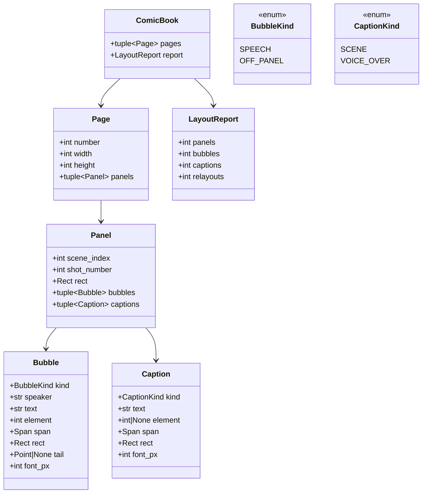

# Design — `comic` (page layout, panels, speech bubbles, export)

**Status:** agreed; §4a, the comic job, proposed (T064) · **Owner:** Katlego (Claude); §4a Tumo (Claude) · **Tasks:** T022 (layout), T023 (bubbles, lettering,
export), T064 (the comic job, storage, the API), T024 consumes it (reader) · **Spec:** [SPEC.md](../../SPEC.md) US3 (script →
comic)

---

## 1. What this covers

Turning a `ShotPlan` (docs/design/shots.md) into comic pages: which shots share a page and a row, how
big each panel is, the frame rendered for each panel, where each speech bubble sits, how it's
lettered, and the exported pages (PNG and PDF, plus a layout JSON for the web reader).

**Non-negotiable I applies to every letter on the page.** Bubbles and captions carry **verbatim
script text only**, each with its source `Span`; nothing is paraphrased, summarised, truncated,
dropped or invented. The single exception is typographic: the ` — ` that joins a scene caption's
location and time (§3). Action lines are never lettered (the art shows them), and there are no
invented sound effects.

**Not covered:** the renderer (T026, storyboard.md) and the audit (verify.md), which this calls; the web reader's UI
(T024, web.md §4.5).

## 2. Reference material

| Kind | Where |
| --- | --- |
| Visual reference | [`docs/design/comic/the-red-kite-page-*.png`](comic/): the self-written sample `samples/the-red-kite.pdf` rendered by T023's `render_pages`, built by `services/api/tools/build_comic_reference.py` from the real parser, a hand-planned shot list (every element in one shot) and **fixture frames** drawn with Pillow, each marked `TEST FIXTURE - not a render` (the real frames wait on T026). Six pages, 20 panels; one panel (scene 3, shot 3) is withheld, to show the card. The gate re-renders it and compares pixels (`tests/comic/test_reference.py`). T022's geometry test pins the rects |
| Inputs | `ShotPlan`, `Shot` (shots.md §6); `Screenplay`, `Scene`, `Dialogue`, `Span` (script.md §6); the frame renderer and audit (verify.md §6: `Renderer`, `render_until_accepted`, `Audit.positions`). **Depends on verify.md's `Renderer.render` and `render_until_accepted` taking `width`/`height`** (added in PR #17, T010), so this doc lands after it |
| Prior art in FrameFlow | none: FrameFlow made storyboard PDFs, never comics (its `storyboard_document.py` hand-wrote a PDF with base-14 fonts, two 16:9 panels per A4 page) |
| Font | **Comic Neue Regular** (`ComicNeue-Regular.ttf`, SIL Open Font License 1.1), committed with its licence under `services/api/assets/fonts/` by T022, because step 5's budget measures text with the same file the renderer letters with |
| Page size | US comic trim, 6.625 × 10.25 in, rendered at 300 dpi = **1988 × 3075 px**; margins **120 px** (0.4 in); gutters **36 px** |

## 3. Domain model



- `Rect` is `(x, y, w, h)` and `Point` is `(x, y)`, both in page pixels.
- **One panel per shot**, in plan order. `(scene_index, shot_number)` names the shot. **The panel's
  frame is rendered at exactly `rect`'s width × height** (§4), so nothing is ever cropped.
- **One bubble or caption per `Dialogue` element** the shot covers, in element order. `text` is
  `Dialogue.text` byte for byte; `element` is its index in `scene.elements`; `span` is its span;
  `speaker` is `Dialogue.cue` verbatim. Parentheticals are direction for the art and are not
  lettered.
- **Extension → kind**, exhaustive over any `Dialogue.extension` (free text in script.md): take
  `extension.upper()` (or `""`); if it contains `V.O.` → a `VOICE_OVER` caption (a box, no tail),
  so `V.O./CONT'D` is a voice-over too; else if it contains `O.S.`, `O.C.` or `OFF` → an
  `OFF_PANEL` bubble (tail to the panel edge nearest the speaker's side, or the right edge if
  unknown); else → a `SPEECH` bubble. `CONT'D`, `FILTERED`, `PRE-LAP`, `ON P.A.` and anything else
  are speech.
- **`SCENE` caption** on a scene's first panel: `scene.location`, then — only when
  `absolute_time(scene.time_of_day)` is not `None` — ` — ` and that time. Words from the heading
  only; a borrowed clock (`CONTINUOUS`) is never lettered. `element` is `None`; `span` is the
  heading line.

## 4. Flow

```mermaid
sequenceDiagram
    participant C as Comic job
    participant G as layout_geometry()
    participant V as render_until_accepted (verify.md)
    participant B as place_lettering()
    participant R as render_pages()
    C->>G: ShotPlan, Screenplay
    G->>G: weights → tiers → pages → rects; lettering area budget (≤ 3 passes)
    G-->>C: geometry (rects), or ComicError
    loop each panel
        C->>V: shot, width × height = the panel rect
        V-->>C: accepted frame + positions, or WITHHELD
    end
    C->>B: panels + frames + positions
    B-->>C: bubbles and captions placed
    C->>R: ComicBook + frames
    R-->>C: page PNGs, one PDF, layout JSON
```

Geometry and the lettering budget are settled **before** any frame exists, from text alone; frames
are then rendered to fit their panels. No step loops back to re-render.

**1. Weights (panel size by story beat).** Base by framing: `wide` 2.0; `medium`, `over_shoulder`,
`pov` 1.0; `close_up` 0.8; `extreme_close_up`, `insert` 0.6. +0.5 for a scene's first shot (the
establishing beat). Lettering: `c` = total characters of the texts the panel will letter (bubbles
and captions); add **0.25 × ⌈c / 60⌉** (integer ceiling; 0 when `c` = 0).

**2. Tiers.** Shots are taken in plan order. A shot of weight ≥ 2.0 gets a tier of its own (a
*solo* tier). Otherwise it joins the open tier; the tier closes when it holds 3 panels or its
weights reach ≥ 2.0 after adding. A scene's first shot always opens a new tier (closing any open
one).

**3. Pages.** Tiers fill pages in order, 3 per page. Usable height `H = 3075 − 2·120 − 36·(t−1)` for
`t` tiers on the page; with `s` solo tiers and `t − s` normal ones, unit `u = H / ((t − s) + 1.25·s)`;
a normal tier is `u` tall, a solo tier `1.25·u`, each rounded down to whole pixels with the
remainder added to the last tier. So every page's tiers fill it exactly. The last page
may have 1 or 2 tiers; the formula stretches them.

**4. Panels.** Usable width `W = 1988 − 2·120 − 36·(p−1)` for `p` panels in the tier; widths are
proportional to weights, rounded down to whole pixels, with the rounding remainder added to the
last panel. `rect` follows from the running x and y.

**5. Lettering budget (fit, never shrink or cut).** Each text is wrapped with the font at **32 px**
(nominal) to at most 40% of the panel width; its box is the wrapped block plus 16 px padding each
side (the bubble is drawn filling it: step 7, Drawing). If the boxes' total area exceeds **35% of the panel's area**,
that panel's weight is raised by 0.5 and steps 2–4 rerun (a *relayout*), at most 3 passes. A panel
still over budget gets a solo tier; if even that is over, the layout fails with `ComicError` naming
the shot. Wrapping is greedy on whitespace; a word wider than the limit keeps a line to itself
(never split), so its box is simply wider. A block is its widest line wide and `lines × (ascent +
descent)` tall. Wrapping splits on whitespace and rejoins with one space, so a run of whitespace
letters as one space (typography, not wording). **A line-break hyphen** (`south-` / `westerly`, samples/README.md finding 5) is joined by the
parser in the element text (`south-westerly`; script.md §3, T048), and lettered as the element
text has it: the bubble's `text` is `Dialogue.text` byte for byte. Joining it here instead would
make the lettered words differ from `text` and its span's contract (T023). *Passes* are the up-to-3 raising relayouts; a panel over budget after them (one a
late reshuffle squeezed) is given a solo tier in one more relayout, and a panel over budget that
already has a solo tier (weight ≥ 2.0, or given one) at that point fails the layout.
`LayoutReport.relayouts` counts every rerun of steps 2–4. Text is never below **28 px** (the renderer may drop from 32 to 28 to fit a box, never
lower) and never truncated or reworded.

**6. Frames.** Each panel's shot is rendered at `rect.w × rect.h` through verify.md's
`render_until_accepted` (the same audit, the same withhold rule). A `WITHHELD` frame's panel shows
the comic's **withheld card** instead, and its lettering is still placed:

- The card is `rect.w × rect.h`, white, with a 4 px mid-grey (`#808080`) border. **The withheld
  frame's pixels are never decoded or drawn**: `PanelFrame.withheld` is the switch, whatever
  `png` holds.
- It carries two lines, centred, in the comic font at 32 px, black (each wraps greedily on
  whitespace to the card's width less 2 × 16 px when it is wider, never cut): `Frame withheld: failed audit
  (<checks>)`, where `<checks>` is the names of the failed **hard** checks of the *last* attempt,
  in `Check` enum order, lower case with `_` as spaces, joined by `, ` (an `ERROR` audit reads
  `audit error`); and `Script p.<page> l.<line_start>–<line_end>` from the shot's span.
- It does not repeat the shot's `source`: the bubbles on it already letter the dialogue, and action
  text is never lettered. (The storyboard's card, which verify.md §4 describes, does show the
  source; the storyboard has no bubbles.)
- Placement on a card: `detail` is 0 everywhere, so boxes go to the earliest admissible cells;
  `positions` is empty (a failed attempt's positions describe a frame no one sees), so
  `OFF_PANEL` tails point at the right edge, and a `SPEECH` bubble has **no tail** (`tail` is
  `null`): no one is in the panel to point at, and a tail to the bottom centre crosses the card's
  own two lines (T023 found this on the reference page; the rule was "the bottom centre" before).
- `panel_frame(outcome, shot)` turns verify's `FrameOutcome` into a `PanelFrame`: `PASSED` or
  `WARNED` → the accepted frame's PNG and its (last) audit's `positions`; `WITHHELD` → no PNG, no
  positions, and a `WithheldCard` (`withheld_checks(last audit)`, the shot's span); any other state
  (a `FAILED` renderer, or not settled) → `ComicError`, since the frame job has failed. A
  `WITHHELD` outcome whose last audit is neither `ERROR` nor has a failed hard check → `ComicError`
  (a card never reads "failed audit ()").
- An accepted frame must decode to exactly `rect.w × rect.h`; any other size → `ComicError` naming
  the shot (never scaled or cropped). It is pasted at `rect` and gets a 4 px black border drawn
  inside the rect; the card keeps its own grey border instead.

**7. Placing lettering.** Candidate positions are the 12 × 8 grid of cell corners inside the panel
(columns × rows), each tried as a box's top-left. The grid is laid over the panel **inset by 16 px**
(the padding) on every side, the *inner rect*: corner `(row, col)` is at `inner.x + ⌊col · inner.w /
12⌋`, `inner.y + ⌊row · inner.h / 8⌋`, for `col` 0–11, `row` 0–7. A box is its text wrapped at the
font size (to 40% of the panel width) plus 16 px padding, as in step 5. **Hard constraints** (a
candidate that breaks one is never chosen): the box lies inside the inner rect; it overlaps no earlier box; **reading order**: its
grid cell `(row, col)` is after the previous box's in row-major order (`row > prev_row`, or `row ==
prev_row` and `col > prev_col`). **Cost** among the admissible: `detail + 2.0 × covers_speaker`,
where `detail` is the mean of Pillow `FIND_EDGES` over the box on the grayscale frame, divided by 255
(0–1), and `covers_speaker` is 1 when the box overlaps the speaker's third of the panel (from the
audit's `positions`, looked up by `match_speaker(speaker, list(positions))`; 0 when unknown). Lowest
cost wins; ties go to the earlier cell in row-major order. The `SCENE` caption, when present, is
placed first, at the panel's top-left (cell `(0, 0)`, subject to the same hard constraints). The
thirds split the panel's width at `⌊w/3⌋` and `⌊2w/3⌋`; a `VOICE_OVER` caption uses its cue as the
speaker, like a bubble. **Font size:** each box is tried at 32 px; only when no candidate is
admissible is it tried again at 28 px (the one smaller size, never lower). If a box has no
admissible candidate at 28 px either, `ComicError` names the shot. (The budget in step 5 makes this
rare, not impossible.)

**Drawing.** A bubble is a white rounded rectangle filling its box (corner radius `min(48, h/2,
w/2)`) with a 3 px black outline: an ellipse inscribed in a box with 16 px padding would cut the
text block's corners, and a radius ≤ 54 px never does. A caption is a pale yellow (`#FFF4C2`)
rectangle filling its box with a 3 px black outline, no tail. Lines are centred in the box, black,
in the comic font at `font_px`. Outlines of every box on a panel are drawn first, then every fill,
then every text, so a tail passing under another bubble never covers its words.

**8. Tails.** `SPEECH`: from the bubble's nearest edge to the speaker's point: horizontal centre of
their third (`left`/`centre`/`right`) at 45% of the panel height; when the position is unknown, the
panel's bottom centre (on a withheld card: no tail, step 6). `OFF_PANEL`: to the panel edge on the speaker's side, else the right edge.
Captions: no tail. `Bubble.tail` is the tip, in page pixels, always inside the panel: a third's
centre is `x + ⌊w/6⌋`, `x + ⌊w/2⌋` or `x + ⌊5w/6⌋`, at `y + ⌊0.45 h⌋`; the bottom centre is
`(x + ⌊w/2⌋, y + h − 1)`; an `OFF_PANEL` tip is on the left (`x`) or right (`x + w − 1`) edge at
the bubble's vertical centre (a speaker in the `centre` third has no side: right edge). The tail is
a triangle, 28 px wide at its base, from the point of the box shrunk by the corner radius nearest
the tip to the tip; a tip inside the box draws no tail.

**Failure paths:** layout over budget after the passes → `ComicError` (shot named); no admissible
spot for a box → `ComicError` (shot named); the renderer failing → the frame job fails (verify.md);
the font file missing → `ComicError` at start-up, never a fallback font; a character the font has no glyph for (it would letter as an empty box) → `ComicError` naming the shot (T023). A missing line is worse than
a failed job.

### 4a. The comic job (T064)

The steps above, run for one project as a job, stored, and served to the web reader (web.md §4.5).
Until T026 sets `app.state.renderer_factory`, the app answers `POST …/comic` with 503
`renderer_unavailable`; the comic is made locally by the architecture check's sketch renderer
(below), the same way T062 proved the frame loop.

```mermaid
sequenceDiagram
    participant W as Web (Make the comic)
    participant A as POST /projects/{id}/comic
    participant J as run_comic_job (background task)
    participant V as render_until_accepted (verify.md)
    participant S as Storage
    participant D as Postgres
    W->>A: (no body)
    A->>D: start_comic: lock the owner's project; the checks in order (below)
    A->>D: jobs row (kind comic, RUNNING, stage rendering, progress 0)
    A-->>W: 202 {job}
    A->>J: asyncio task (tracked in app.state.tasks)
    J->>J: layout_geometry(plan, screenplay)
    loop each panel, in plan order
        J->>D: the shot's comic audits: an accepted one at this size is reused (no render)
        J->>V: otherwise shot, width × height = rect, first_attempt after the last logged
        V->>D: frame_audits row per attempt (target comic)
        V-->>J: FrameOutcome
        J->>D: progress = round(90 × panels done / panels)
    end
    J->>J: panel_frame → place_lettering → render_pages → to_pdf → to_json
    J->>S: comics/<sha256>.png per page, comics/<sha256>.pdf
    J->>D: one transaction: upsert comics row, job DONE 100
```

- **Checks, in order** (each answers before anything is written), all in `start_comic`, inside one
  transaction that selects the project `FOR UPDATE` **filtered by owner**, so two clicks make one
  job: no such project, or not the caller's → `not_found`; no plan, or the latest `storyboard` job
  not `DONE` → `not_ready`; a `comic` job `queued` or `running` for the project → `comic_running`;
  `renderer` false (the route passes `app.state.renderer_factory is not None and app.state.model is
  not None`) → `renderer_unavailable`; `store` false → `storage_unavailable`. It raises
  `ComicRefused(code)` (app/comic, no API import); the route maps the codes to 404, 409, 409, 503,
  503 and `ApiError`.
- **Per panel**, in plan order, for the panel's shot `key` and its rect `w × h`:
  1. **Reuse.** The project's `frame_audits` rows with `target = 'comic'` for `key` are read. If the
     one with the greatest `attempt` among those with verdict `pass` or `warn` exists, its
     `frame_asset` is read from the store; if it decodes to exactly `w × h` the panel is **accepted
     from it**: no render, no audit, `positions` from that row. Otherwise (none, or another size)
     the panel is rendered.
  2. **Render.** `render_until_accepted(model, renderer, shot, screenplay, extraction, width=w,
     height=h, first_attempt=1 + the greatest comic attempt logged for key (0 if none),
     max_renders=3, log=log, on_state=on_state)`. Continuing the attempt numbers keeps every row
     (the unique key `(project_id, target, scene_index, shot_number, attempt)` never collides) and
     gives a re-run new seeds (`seed_for(shot, attempt)`). The hooks are comic's own, never
     `frame_hooks` (whose `on_state` writes a `frames` row): `log(audit)` →
     `writer.log(audit, renderer.record(key, audit.attempt).asset)` on a `FrameWriter(target=COMIC)`;
     `on_state(state, attempt)` only records the last state, so a `FAILED` state tells the job the
     **renderer** raised (the loop enters FAILED only then, verify.md §6), whatever else the
     exception could have been.
  3. **Size.** An accepted outcome's PNG must decode to exactly `w × h`, checked here, before the
     next panel: otherwise the renderer ignored the size → the job fails `COMIC_RENDER_FAILED` at
     once, not after every other panel (the same check `place_lettering` makes, made early).
  4. **Map.** `panel_frame(outcome, shot)` → `frames[key]` (PASSED/WARNED → the PNG and the last
     audit's positions; WITHHELD → the card). A reused panel's `PanelFrame` is built from its row
     the same way. `paths[key] = renderer.record(key, outcome.frame.attempt).asset` (or the reused
     row's `frame_asset`) for an accepted panel only; a withheld panel has no entry, so `to_json`
     marks it `withheld` (§6).
  5. **Progress** `round(90 × k / n)` after the k-th of n panels, in its own short transaction.
- Then `place_lettering(book, screenplay, plan, frames)`, `render_pages`, `to_pdf`,
  `to_json(lettered, paths)`. These and `layout_geometry` are CPU-bound Pillow work: each runs in
  `asyncio.to_thread`, so the API keeps answering polls while a comic is made.
- **No `frames` row is written**: those are the storyboard's 1280 × 720 frames, and a comic panel's
  state lives in the job and, once done, the layout. The storyboard's audit log reads only
  `target = 'storyboard'`, so the two never mix.
- **Stored by content**: each page PNG at `comics/<sha256 of its bytes>.png`, the PDF at
  `comics/<sha256>.pdf` (idempotent `put`, as storyboard.md §3.3). `to_json` gets each accepted
  panel's **Storage path**, not a URL: the layout is stored, and signed URLs expire, so `GET …/comic`
  signs at read time.
- **One comic per project.** The `comics` row is upserted only when everything is stored, in the same
  transaction that marks the job `DONE` with progress 100, so a reader never sees half a comic and a
  failed remake leaves the previous comic readable.
- **Progress order**: 0 when the job is created; after each panel, as above; held at 90 through
  lettering, pages, PDF and storage; 100 with the row. The stage stays `rendering` (jobs' stage CHECK
  allows it; the web words it "Making the comic").
- **Failure** → job `FAILED`, `error` one of (verbatim; the web shows it as written):
  - `COMIC_RENDER_FAILED` "A panel couldn't be drawn, so the comic stopped.": the panel's last
    recorded state was `FAILED` (the renderer raised), or an accepted PNG of the wrong size (step 3);
  - `COMIC_LAYOUT_FAILED` "Shot {shot_id}'s lettering didn't fit its panel, so the comic stopped."
    for a `ComicError` with `shot` set (`shot_id` as web.md's), else `COMIC_LAYOUT_FAILED_ANY` "The
    lettering didn't fit the panels, so the comic stopped.". `ComicError` can come from
    `layout_geometry`, `panel_frame`, `place_lettering` and `render_pages`; every raise in them that
    names a shot sets `shot`. Its message goes to the log. This is SPEC US3's "the comic job fails
    naming the shot";
  - `COMIC_UNEXPECTED` "Something went wrong on our side while making the comic. Make it again.":
    anything else (an audit or database error, storage), logged.
  The restart sweep's `RESTARTED` ("…Upload the script again.") is read back by `GET …/comic` as
  `COMIC_RESTARTED` "The server restarted while the comic was being made. Make it again.", since a
  comic is remade, not re-uploaded.
- **Cost**: two audit calls per attempt (verify.md), one to three attempts per panel, plus the
  renderer's. the-red-kite has 21 shots: 42–126 audit calls for the first comic. A re-run reuses
  every panel already accepted (step 1), so a job that fails late (lettering, storage) costs only the
  panels that were never accepted when it is made again; a withheld panel is tried three more times.

**The local check** (`python -m app.comic.check <project-id>`): runs `run_comic_job` on a project
with `SketchRenderer` (verify.md §6, T062) as the renderer and the real audit. It refuses
(`CheckRefused`, nothing written) unless the store's bucket is `panelwise-dev`, the project's title
ends with " (architecture check)" (a T062 copy, never a real project), and it has a plan; it creates
the `comic` job itself (`RUNNING`), so the web reader shows the result like any comic, and prints the
pages, the withheld panels and each panel's verdicts. It spends the audit calls above: **run it only
with the owner's go-ahead**. A sketch comic shows the path a comic takes, not a grounded one.

## 5. State

Layout geometry is pure. Producing a comic is a `Job` of kind `comic` (docs/design/deploy.md §5:
`QUEUED → RUNNING → DONE | FAILED`; T064 creates it `RUNNING`, as a "Try another render" job is);
progress follows §4a's order (0, then per panel to 90, held through lettering and pages, 100 with
the stored comic). A project has at most one comic, replaced only by a job that finishes.

## 6. Contracts

```python
# app/comic/model.py
type Rect = tuple[int, int, int, int]      # x, y, w, h (page px)
type Point = tuple[int, int]               # x, y (page px)
class BubbleKind(StrEnum): SPEECH = "speech"; OFF_PANEL = "off_panel"
class CaptionKind(StrEnum): SCENE = "scene"; VOICE_OVER = "voice_over"
@dataclass(frozen=True) class Bubble: kind: BubbleKind; speaker: str; text: str; element: int; span: Span; rect: Rect; tail: Point | None; font_px: int
@dataclass(frozen=True) class Caption: kind: CaptionKind; text: str; element: int | None; span: Span; rect: Rect; font_px: int
@dataclass(frozen=True) class Panel: scene_index: int; shot_number: int; rect: Rect; bubbles: tuple[Bubble, ...]; captions: tuple[Caption, ...]
@dataclass(frozen=True) class Page: number: int; width: int; height: int; panels: tuple[Panel, ...]
@dataclass(frozen=True) class LayoutReport: panels: int; bubbles: int; captions: int; relayouts: int
@dataclass(frozen=True) class ComicBook: pages: tuple[Page, ...]; report: LayoutReport
@dataclass(frozen=True) class WithheldCard: checks: str; span: Span   # the card's two variable parts (§4 step 6); lands with T023
@dataclass(frozen=True) class PanelFrame: png: bytes; positions: Mapping[str, Position]; withheld: bool; card: WithheldCard | None = None   # Position from verify.md; lands with T023, its first consumer. card is set exactly when withheld (else ComicError); a withheld png is never drawn
class ComicError(RuntimeError):   # T064: `shot`, set by every raise in layout.py, bubbles.py and render.py that names a shot
    def __init__(self, message: str, *, shot: tuple[int, int] | None = None) -> None: ...
    shot: tuple[int, int] | None    # (scene_index, shot_number)

# app/comic/layout.py (T022) — pure, no images
def panel_weight(shot: Shot, scene: Scene, first_in_scene: bool, lettered_chars: int) -> float: ...   # step 1; ComicError if the shot isn't in that scene
def layout_geometry(plan: ShotPlan, screenplay: Screenplay) -> ComicBook: ...   # rects set; bubbles/captions not yet placed (empty; report counts 0 of each)
def scene_caption(scene: Scene) -> str: ...   # the SCENE caption text (§3); weighed here, lettered by T023

# app/comic/bubbles.py (T023)
def place_lettering(book: ComicBook, screenplay: Screenplay, plan: ShotPlan,
                    frames: Mapping[tuple[int, int], PanelFrame]) -> ComicBook: ...

# app/comic/render.py (T023)
def withheld_checks(audit: Audit) -> str: ...   # the card's <checks>: "audit error", or the failed hard checks in Check order, "_" as spaces, ", "-joined
def panel_frame(outcome: FrameOutcome, shot: Shot) -> PanelFrame: ...   # §4 step 6; ComicError unless PASSED, WARNED or WITHHELD
def render_pages(book: ComicBook, frames: Mapping[tuple[int, int], PanelFrame]) -> list[bytes]: ...   # PNG per page
def to_pdf(pages: Sequence[bytes]) -> bytes: ...
def to_json(book: ComicBook, frame_urls: Mapping[tuple[int, int], str]) -> dict[str, object]: ...
```

**Layout JSON** (T024's input, verbatim shape):

```json
{
  "pages": [{
    "number": 1, "width": 1988, "height": 3075,
    "panels": [{
      "shot": [0, 1],
      "rect": [120, 120, 1748, 1062],
      "frame_url": "https://…/frames/…png",
      "withheld": false,
      "bubbles": [{
        "kind": "speech", "speaker": "NANDI", "text": "You came back.",
        "element": 2, "span": {"page": 1, "line_start": 14, "line_end": 14},
        "rect": [300, 180, 420, 160], "tail": [620, 574], "font_px": 32
      }],
      "captions": [{
        "kind": "scene", "text": "LIGHTHOUSE KITCHEN — NIGHT",
        "element": null, "span": {"page": 1, "line_start": 5, "line_end": 5},
        "rect": [136, 136, 640, 80], "font_px": 32
      }]
    }]
  }]
}
```

Every piece of text carries its span, so the reader can show "from page 1, line 14" on any bubble.
`frame_url` is the Supabase Storage URL of the accepted frame (absent and `withheld: true` for a
withheld one). `to_json` reads `withheld` as "the shot has no entry in `frame_urls`": the comic
job passes a URL for every accepted frame and none for a withheld one. A bubble's `tail` is
`[x, y]` or `null`; a caption has no `tail` key.

**The comic job** (T064; §4a). Migration `0005_comics`, upgrade: the `jobs_kind` CHECK is dropped and
re-made with `'comic'` (`JobKind.COMIC = "comic"`); `frame_audits` gains `target` (text, not null,
default `'storyboard'`, CHECK `frame_audits_target`: `target IN ('storyboard', 'comic')`), and its
unique constraint `frame_audits_frame` is dropped and re-made under the same name over
`(project_id, target, scene_index, shot_number, attempt)` (`FrameAuditRow.__table_args__` the same);
then this table (`lock_down` like every table, deploy.md §6). **Downgrade** deletes the `comic` jobs
(cascading to `comics` and their `frame_audits`) and every `target = 'comic'` row first, then restores
the old constraints and drops `target` and the table, so it succeeds with comics present:

| Column | Type | Notes |
|---|---|---|
| `project_id` | uuid, primary key, FK `projects` on delete cascade | one comic per project |
| `job_id` | uuid, FK `jobs` on delete cascade | the job that made it |
| `layout` | jsonb | `to_json(book, paths)`: the Layout JSON above, `frame_url` holding a Storage **path** |
| `pages` | text[] | page PNG paths in page order, `comics/<sha256>.png` |
| `pdf` | text | `comics/<sha256>.pdf` |
| `made_at` | timestamptz, `clock_timestamp()` | set on every upsert |

```python
# app/comic/rows.py
class ComicRow(Base): ...   # the table above

# app/comic/job.py
COMIC_RENDER_FAILED: str; COMIC_LAYOUT_FAILED: str; COMIC_LAYOUT_FAILED_ANY: str; COMIC_UNEXPECTED: str; COMIC_RESTARTED: str   # §4a, verbatim; COMIC_LAYOUT_FAILED takes .format(shot_id=...)
async def run_comic_job(job_id: uuid.UUID, *, sessions: async_sessionmaker[AsyncSession], store: AssetStore,
                        model: NebiusChatModel, factory: RendererFactory) -> None: ...
#   §4a end to end for the job's project, per panel exactly as §4a's steps 1–5; never raises: every
#   failure is the job FAILED with one of §4a's messages (the cause logged). RendererFactory is
#   app/frames/attempt.py's; the factory is called once per job. Hooks: comic's own (§4a step 2),
#   never frame_hooks.
class ComicRefused(RuntimeError):
    code: Literal["not_found", "not_ready", "comic_running", "renderer_unavailable", "storage_unavailable"]
async def start_comic(session: AsyncSession, project_id: uuid.UUID, owner: uuid.UUID, *,
                      renderer: bool, store: bool) -> JobRow: ...
#   §4a's checks in order, in the caller's transaction (the route's `session.begin()`): selects the
#   project FOR UPDATE where id and owner match, then adds the RUNNING comic job (progress 0) and
#   flushes; raises ComicRefused(code) before writing anything. The route maps the code to its status
#   and ApiError, commits, then starts run_comic_job as a tracked task (as the upload does).

# app/comic/views.py
def comic_view(project: ProjectRow, job: JobRow | None, row: ComicRow | None,
               page_urls: Sequence[str], pdf_url: str | None, *, can_make: bool) -> ComicView: ...
#   web.md §6 ComicView; pure (URLs signed by the route). Lettering per panel: the SCENE caption,
#   then bubbles and voice-over captions in element order (reading order, T023); `cue` is the
#   Dialogue's cue, then " (" extension ")" when it has one, read from the screenplay; a job error
#   equal to RESTARTED reads COMIC_RESTARTED.

# app/comic/check.py
async def run_comic_check(sessions, store: AssetStore, model: NebiusChatModel, project_id: uuid.UUID,
                          *, bucket: str) -> uuid.UUID: ...   # §4a The local check; → the comic job's id
```

## 7. Structure

| Path | New? | Responsibility | Task |
| --- | --- | --- | --- |
| `services/api/app/comic/{__init__,model,layout}.py` | new | weights, tiers, pages, rects, lettering budget | T022 |
| `services/api/app/comic/{bubbles,render}.py` | new | placement, tails, lettering, the withheld card, page PNGs, PDF, JSON | T023 |
| `services/api/assets/fonts/ComicNeue-Regular.ttf`, `OFL.txt` | new | the lettering font and its licence (the budget measures with it; the Dockerfile copies `assets/`) | T022 |
| `services/api/tests/comic/` | new | §9 | T022, T023 |
| `services/api/tools/build_comic_reference.py`, `docs/design/comic/the-red-kite-page-*.png` | new | the rendered reference (§2): hand-planned shots and fixture frames, rebuilt with `uv run python -m tools.build_comic_reference` | T023 |
| `services/api/app/comic/{rows,job,views,check}.py`, migration `0005_comics` | new | the comics table, the comic job, `ComicView`, `python -m app.comic.check` (§4a) | T064 |
| `services/api/app/api/v1/{projects,schemas}.py` | edited | `POST`/`GET /projects/{id}/comic`, `ComicView` (web.md §6) | T064 |

Dependency: **Pillow** (text measurement, edge detection, compositing, PNG, multi-page PDF via
`save_all`). No second PDF library.

## 8. Decisions & alternatives

| Decision | Chosen | Rejected, and why |
|---|---|---|
| Lettered text | `Dialogue.text` verbatim, with its span | a model rewriting speech for comic rhythm: invention, and the span would no longer point at what's shown |
| Action lines | not lettered | narration captions from action: the art already shows it |
| Sound effects | none | lettering "SLAM!" from "DOORS SLAM.": a styling decision the script didn't make (open question) |
| Frame shape | rendered at the panel's size | cover-cropping the storyboard's 16:9 frames: two-panel tiers are near-square, so a ≤ 20% crop limit forced almost every tier to one panel, and deeper crops can cut a character out. **Cost:** a comic renders its own frames (and audits them), on top of the storyboard's |
| Order of work | geometry and lettering budget from text first, frames second | placing bubbles on images and growing panels afterwards: every growth would mean a re-render |
| Too much text | the panel grows; the job fails before text is cut | shrinking below 28 px (illegible) or truncating (drops script) |
| Reading order | a hard constraint | a cost term: the cheapest spot could still break reading order |
| Bubble position | image detail + speaker position | a vision model placing bubbles: another call per panel, not deterministic |
| Speaker position | from the audit's `positions` | face detection: another model for a tail direction |
| Page flow | a scene starts a new tier, not a new page | a page per scene: short scenes waste pages |
| PDF | Pillow `save_all` | reportlab / img2pdf: a second library for what Pillow does |

Deviations from [docs/architecture-defaults.md](../architecture-defaults.md): none.

## 9. How this is verified

- **Traceability:** every `Dialogue` of every shot is in exactly one bubble or caption, `text` equal
  to `Dialogue.text` and `span` to its span; no other text is lettered except `SCENE` captions built
  from heading words and the ` — ` joiner.
- **Extension mapping:** `None`, `CONT'D`, `FILTERED`, `PRE-LAP` → speech; `O.S.`, `O.C.`,
  `OFF SCREEN` → off-panel; `V.O.`, `V.O./CONT'D` → voice-over caption.
- **Geometry** (pure, no images): one panel per shot in plan order; deterministic; ≤ 3 tiers per
  page, ≤ 3 panels per tier; solo tiers for weight ≥ 2.0; a scene's first shot opens a tier; tiers
  fill the page height exactly; panels inside the margins, gutters respected, no overlap; the
  lettering-weight rounding (`⌈c/60⌉`); the budget raising weights and, past 3 passes, a solo tier,
  then `ComicError`.
- **Placement:** boxes inside their panel, never overlapping, strictly in reading order; font ≥ 28
  px; `O.S.` tails on the edge; `V.O.` as captions; no admissible spot → `ComicError`.
- **Frames:** each panel's render request is exactly its `rect` size; a withheld frame yields the
  card (its two lines, the failed hard checks in enum order, `audit error` for an ERROR audit, no
  source text) plus its lettering, placed in grid order, `OFF_PANEL` tails to the right edge and no `SPEECH` tail.
- **Export:** one PDF page per `Page` at 1988 × 3075; the JSON matches §6's shape and round-trips
  every span.
- **Visual:** T022/T023 render the self-written sample's comic and commit the page PNGs as the
  reference later changes are compared against.
- **The comic job** (T064; a real Postgres, a fake recording renderer, a scripted audit, an
  in-memory store): every panel is requested at exactly its rect's size, in plan order; every attempt
  is a `frame_audits` row with `target` `comic` and no `frames` row is written, and the storyboard's
  audits read is unchanged by them; pages and PDF land at their content hashes and the `comics` row
  holds those paths and a layout whose `frame_url`s are paths (none for a withheld panel); progress
  only rises and ends at 100 with the job `DONE`; a renderer error → `COMIC_RENDER_FAILED`, a
  `ComicError` → `COMIC_LAYOUT_FAILED` naming its shot (or `COMIC_LAYOUT_FAILED_ANY` without one), every shot-naming `ComicError` raise carrying `shot`, anything else → `COMIC_UNEXPECTED`, each leaving a previous
  comic untouched; **two jobs in a row** both settle cleanly: the second reuses every panel the first
  accepted at its size (no render, no audit call for it) and numbers a re-rendered panel's attempts
  after the first job's (new seeds, no unique-key error); an accepted PNG of the wrong size fails the
  job at that panel with `COMIC_RENDER_FAILED`; the renderer raising is told from an audit error by
  the recorded `FAILED` state; no `frames` row is written; the migration's downgrade succeeds with
  comic jobs and comic audit rows present, and `tests/db`'s table and CHECK assertions include
  `comics`, `'comic'` and `target`; `POST` answers each §4a check in order with nothing written, and two concurrent
  POSTs make one job; `GET` signs every page and the PDF, orders lettering as §6 says, builds `cue`
  with its extension, maps `RESTARTED`; `list_summaries` ignores `comic` jobs; the local check's
  three refusals. Then, with the owner's go-ahead, `python -m app.comic.check` on a T062 copy of
  the-red-kite.

## 10. Open questions

- [ ] Sound effects from all-caps action ("DOORS SLAM.") would suit comics, but lettering them is a
  styling choice; decide with a sample page in hand. T023 letters none (§8); the reference page is
  now the sample page to decide with.
- [x] A line-break hyphen in element text (`south- westerly`) was lettered with its space; the
  parser joins it at source since T048 (samples/README.md finding 5; §4 step 5).
- [ ] Dual dialogue isn't parsed (script.md §10), so two simultaneous speeches read as sequential
  bubbles.
- [ ] Right-to-left reading order: not planned.
