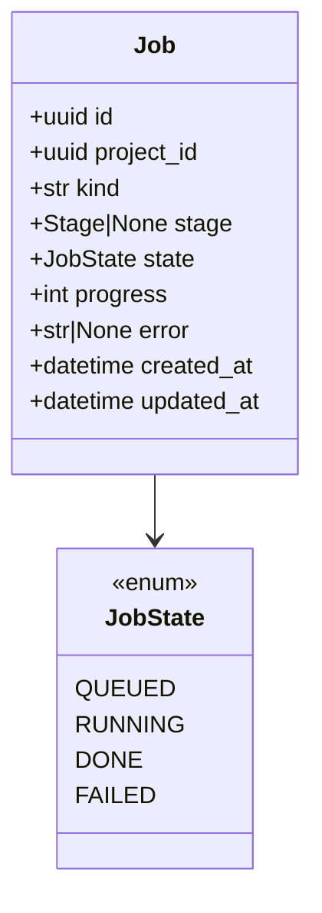
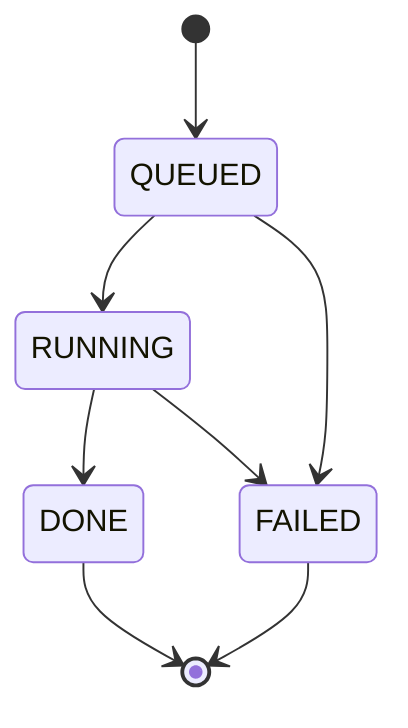

# Design — `infra` deploy (Vercel + Render + Supabase)

**Status:** agreed · **Owner:** Katlego (Claude) · **Tasks:** T037 (stack), T063 (API on Render), T009 (database), T053 (Storage, first for uploads; T026 adds frames), T053/T040/T030 (Auth)
· **Spec:** cross-cutting (hosting for every story in [SPEC.md](../../SPEC.md))
· **Decided:** 2026-09-29 by Katlego, adopting the Hackathon kit's REACT + FASTAPI stack;
**API host changed 2026-10-08 by Katlego: Railway → Render** (§8, §11). Nothing had been deployed to
Railway (T037's deploy check was still blocked on accounts), so the change is configuration and
docs only: no data, domain or running service moves

---

## 1. What this covers

Where Panelwise runs once it leaves a laptop, and what each hosted service is for. It replaces
PLAN.md's earlier target ("API + web on Nebius; Postgres + Redis self-hosted"). **Not covered:**
ComfyUI on the Nebius GPU (T003, `infra/nebius/`), which is unchanged.

| Piece | Runs on | Why |
|---|---|---|
| Web app (`apps/web`, Next.js 16) | **Vercel** | Next.js's native host; preview deploy per PR |
| API (`services/api`, FastAPI) | **Render** (a Docker web service, Free, Frankfurt), from `services/api/Dockerfile` | extraction runs for minutes; it needs a real container, not a serverless function |
| Database | **Supabase Postgres** | hosted Postgres; the SQLAlchemy + asyncpg code is unchanged |
| Images (frames, portraits, comic pages) | **Supabase Storage** | PLAN's "content-addressed file store", hosted |
| Sign-in, seeded judge account | **Supabase Auth** | T030 needs a judge login in the testing instructions |
| Job status and progress | **a Postgres table** | replaces Redis: one fewer service to host and pay for |
| Models | Nebius Token Factory | unchanged; this call is what satisfies "runs on Nebius" |
| Rendering | ComfyUI on a Nebius AI Cloud GPU (T003) | unchanged |

**Hackathon rules still hold:** "runs on Nebius" means a runtime Token Factory call *or* Nebius
compute. Panelwise makes both (Nemotron calls, ComfyUI GPU). Hosting the app elsewhere is allowed
(frameflow-nebius-hackathon/PLAN.md, rules). The demo must stay up, free, until 15 Dec.

## 2. Reference material

| Kind | Where |
| --- | --- |
| Source of the stack | `~/Documents/projects/personal/Hackathon/stacks/react-fastapi` and `stacks/_parts/{web-react,api-fastapi}` (`vercel.json`, `railway.json`, `db.py`, `supabase.ts`, the PREP steps); the kit's API host was Railway, replaced by Render (§11) |
| Render (checked 2026-10-08) | render.com/docs: `blueprint-spec` (the `render.yaml` fields), `deploys` (pre-deploy command: paid instances only, a separate instance, a failure stops the deploy), `health-checks` (5 s timeout; a deploy not healthy in 15 min is cancelled; a running instance failing 60 s is restarted), `web-services` (`PORT` defaults to 10000, bind `0.0.0.0`), `free` (spins down after 15 min idle, ~1 min to wake, 750 instance hours a month per workspace, no pre-deploy command, "Render might restart a Free web service at any time"), `monorepo-support` (`dockerfilePath`/`dockerContext` relative to `rootDir`; build filters relative to the repo root), `cli` (`render blueprints validate`); the schema at render.com/schema/render.yaml.json; Starter $7/month (0.5 CPU, 512 MB), not affordable: the project's only money is $25 of Token Factory credit (2026-10-08) |
| Supabase connections | supabase.com/docs/guides/database/connecting-to-postgres (checked 2026-09-29): for a long-running server on IPv4, the **shared pooler, session mode**, port 5432 — IPv4 on every plan; transaction mode (6543) doesn't support prepared statements, which asyncpg uses |
| Current code | `services/api/app/main.py` (health checks Postgres **and Redis** today), `docker-compose.yml`, `.env.example` |

## 3. Domain model

One new entity, built with its first consumer (T009): a job row, so progress survives an API
restart and needs no Redis. `project_id` and `stage` (and the `Project` it belongs to) are defined in
[web.md](web.md) §3.



## 4. Flow

```mermaid
sequenceDiagram
    participant B as Browser
    participant W as Next.js on Vercel
    participant A as FastAPI on Render
    participant S as Supabase (Postgres, Storage, Auth)
    participant N as Token Factory / ComfyUI
    B->>W: page, sign-in (Supabase Auth cookies via @supabase/ssr)
    W->>A: server-side fetch, API_URL, with the user's access token
    A->>S: SQL over the session pooler; Storage with the secret key
    A->>N: Nemotron calls; render calls
    A-->>W: JSON
    W-->>B: HTML / JSON
```

- **The browser never calls the API directly.** Next.js route handlers and server components call
  it server-side (`API_URL`, as `app/api/health` already does). So the API needs no CORS setup, and
  only the Supabase *publishable* key ever reaches a browser.
- **Secrets by place:** `SUPABASE_SECRET_KEY`, `DATABASE_URL`, `NEBIUS_API_KEY` live only on
  Render. `NEXT_PUBLIC_SUPABASE_URL` and `NEXT_PUBLIC_SUPABASE_PUBLISHABLE_KEY` live on Vercel.
  `API_URL` (server-only, Vercel) points at the Render domain (`https://<name>.onrender.com`).

**Failure paths:** the API down → the web health route answers 502 (already built); Supabase
Postgres down → the API health answers 503 `degraded`; a Render deploy whose instance isn't
healthy on `/api/v1/health` within 15 minutes → Render cancels it and keeps the previous deploy
running; a failed migration exits the container before uvicorn starts, so it is never healthy and
the deploy is cancelled the same way (§6 *Who runs migrations*). **Free-tier paths:** an instance
idle 15 minutes spins down and takes about a minute to wake, which the web app would show as a 502;
the keep-alive ping (§6) prevents that. Render may also restart a Free instance at any time; the
restart sweep (web.md §4.1) then fails the jobs that were running, as on any restart. **New with Render:** it keeps checking a running instance,
stops routing to it after 15 s of failed checks and restarts it after 60 s. Because our health
check includes Postgres, a Supabase outage over a minute restarts the API, and the restart sweep
(web.md §4.1) fails the jobs that were running. Accepted (§8): those jobs can't write their
progress without the database anyway, so they would fail either way.

## 5. State



No transition out of `DONE` or `FAILED`: a retry is a new job.

## 6. Contracts

**Environment** (`.env.example` is the source; names are exact):

| Variable | Where | What |
|---|---|---|
| `DATABASE_URL` | API (Render, local) | `postgresql+asyncpg://…` — locally the compose Postgres; deployed, the Supabase **session pooler** URL (port 5432) |
| `SUPABASE_URL`, `SUPABASE_SECRET_KEY` | API only | Storage (T053 for uploads, T026 for frames), verifying users (T053) |
| `NEXT_PUBLIC_SUPABASE_URL`, `NEXT_PUBLIC_SUPABASE_PUBLISHABLE_KEY` | web (Vercel) | Auth in the browser (T040) |
| `API_URL` | web, server-side only | the Render domain, no trailing slash |
| `NEBIUS_*`, `LLM_*` | API only | unchanged (docs/design/llm.md) |
| `COMFYUI_MAX_WORDS` | API | the frame prompt's word budget, default 55 (storyboard.md §3.1, T008) |
| `PANELWISE_PRIVATE_STYLES` | API, optional | a directory of private style TOMLs outside the repo; **never set on the hosted demo** (storyboard.md §3.2, T008) |
| `REDIS_URL` | — | **removed** |

**Deploy configs:** `apps/web/vercel.json` (framework `nextjs`, pnpm, root directory `apps/web`).
The API is a Render **Blueprint**, `render.yaml` at the repository root (T063), exactly:

```yaml
# The API on Render (docs/design/deploy.md §6). Secrets are entered once, in Render's
# dashboard, when the Blueprint is first applied; never here.
services:
  - type: web
    name: panelwise-api
    runtime: docker
    plan: free
    region: frankfurt
    rootDir: services/api
    dockerfilePath: ./Dockerfile
    dockerContext: .
    healthCheckPath: /api/v1/health
    autoDeployTrigger: checksPass
    numInstances: 1
    buildFilter:
      paths:
        - services/api/**
      ignoredPaths:
        - services/api/tests/**
    envVars:
      - key: DATABASE_URL
        sync: false
      - key: NEBIUS_API_KEY
        sync: false
      - key: SUPABASE_URL
        sync: false
      - key: SUPABASE_SECRET_KEY
        sync: false
```

Validated against render.com/schema/render.yaml.json on 2026-10-08. What each line holds us to:
- `region: frankfurt` — the nearest Render region to the Supabase project (eu-west-1, Ireland), so
  the API keeps the 2 s health timeout.
- `rootDir` + `dockerContext: .` — the build context is `services/api`, as the Dockerfile's `COPY`
  lines expect (paths relative to `rootDir`).
- `autoDeployTrigger: checksPass` — a push to `main` deploys only after its GitHub checks (the gate,
  `ci.yml`) pass; `buildFilter` paths are relative to the repository root, so a web-only or docs-only
  change doesn't redeploy the API.
- `plan: free` — the project has no cash budget (§8). Free has no pre-deploy command, so the
  image's own start command runs the migration before uvicorn (*Who runs migrations*); no
  `dockerCommand`, so Render, compose and a plain `docker run` start the API the same way.
- `numInstances: 1` — jobs run in the API process (web.md §3), so one instance owns them, and no
  second instance can race the migration (Free can't scale anyway).
- `PORT`: Render sets 10000; the Dockerfile's `CMD` already listens on `${PORT:-8000}`. Render
  ignores the Dockerfile's `HEALTHCHECK` (compose still uses it).
- Every other setting has a default in `app/core/config.py` (`NEBIUS_MODEL_*`, `LLM_*`,
  `SUPABASE_STORAGE_BUCKET=panelwise`, `UPLOAD_MAX_BYTES`), so only the four secrets are listed.
  T030 adds the spend caps here when code reads them.

**Keep-alive** (`.github/workflows/keepalive.yml`, T063), exactly:

```yaml
# Keeps the API on Render's free tier awake, and with it the Supabase project
# (docs/design/deploy.md §6). Pings nothing until the API_HEALTH_URL variable is set.
name: keep-alive
on:
  schedule:
    - cron: "*/10 * * * *"
  workflow_dispatch:
permissions: {}
jobs:
  ping:
    runs-on: ubuntu-latest
    timeout-minutes: 3
    steps:
      - name: Ping the API's health check
        env:
          API_HEALTH_URL: ${{ vars.API_HEALTH_URL }}
        run: |
          if [ -z "$API_HEALTH_URL" ]; then
            echo "::notice::API_HEALTH_URL is not set; nothing to ping until T037 deploys the API"
            exit 0
          fi
          curl --fail --silent --show-error --max-time 90 --retry 2 "$API_HEALTH_URL"
```

- Every 10 minutes, under Render's 15-minute idle limit. GitHub may delay a scheduled run; a late
  one only means one cold start (~1 minute).
- One awake service uses at most 744 of the workspace's 750 free hours a month, so **the workspace
  holds no other free service**.
- `API_HEALTH_URL` is a repository *variable* (not a secret: the URL is public), set to
  `https://<render-domain>/api/v1/health` after T037's deploy.
- The health check queries Postgres, so the same ping keeps the free Supabase project from being
  paused for inactivity. A 503 fails the run, and GitHub's failed-run email is our uptime alert.
- GitHub turns off scheduled workflows in a public repository after 60 days with no activity.
  The last planned commit is around 30 Oct, which is 60 days before 29 Dec, after the demo ends on
  15 Dec.
- `PANELWISE_PRIVATE_STYLES` is absent on purpose (storyboard.md §3.2: never on the hosted demo).

**`DATABASE_URL`** may be `postgresql://`, `postgres://` or `postgresql+asyncpg://`; the API adds the
`+asyncpg` driver and rewrites libpq's `sslmode=` to asyncpg's `ssl=` (same values). asyncpg rejects
`sslmode` at connect time.

**API health** (`GET /api/v1/health`, T002 contract) keeps its shape; its checks become
`{"postgres": …}` only.

**Schema and migrations (T009).** SQLAlchemy 2 async models; **Alembic** migrations in
`services/api/migrations/` (`alembic.ini` beside `pyproject.toml`; an async `env.py` that reads
`Settings().database_url`). Tables live in Supabase's `public` schema. Enumerations are `text` with a
`CHECK` constraint, not Postgres enums, so a later state (T021's) is one migration that swaps a
constraint. Migration `0001` creates:

| Table | Columns | Constraints and indexes |
|---|---|---|
| `projects` | `id uuid pk`, `owner uuid not null`, `title text not null`, `pdf_path text not null`, `screenplay jsonb`, `extraction jsonb`, `plan jsonb`, `created_at timestamptz not null default clock_timestamp()` | index `(owner, created_at desc)` |
| `jobs` | `id uuid pk`, `project_id uuid not null references projects(id) on delete cascade`, `kind text not null`, `state text not null`, `stage text`, `progress int not null default 0`, `error text`, `created_at`, `updated_at timestamptz not null default clock_timestamp()` | `kind in ('storyboard','frame_attempt')`; `state in ('queued','running','done','failed')`; `stage in ('parsing','extracting','planning','rendering')` or null; `progress between 0 and 100`; index `(project_id, created_at desc)` |

Timestamps default to `clock_timestamp()`, not `now()`: `now()` is the transaction's start, so rows inserted in one transaction would tie and "newest first" would be arbitrary. `owner` is not a foreign key to `auth.users`: that schema exists only on Supabase, and the compose
Postgres and the test Postgres must run the same migration. **Who runs migrations:** never the app
while two replicas could race. Render's Free tier runs exactly one instance and has no pre-deploy
command, so the Dockerfile's `CMD` runs it:
`sh -c ".venv/bin/alembic upgrade head && exec .venv/bin/uvicorn app.main:app --host 0.0.0.0 --port ${PORT:-8000}"`
from `WORKDIR /srv/api` (`alembic` is a main dependency, so `uv sync --no-dev` installs it).
Compose's `api` drops its own `command` and uses this `CMD`, so the local stack starts the API
exactly as Render does. A failed migration exits the container before it serves, so the
new deploy never becomes healthy and Render keeps the old one (§4). During a deploy the old
instance serves while the new one migrates, the same timing a pre-deploy command would give.
If the API ever runs more than one instance, the migration moves back to a pre-deploy command; compose's `api` runs it before uvicorn; the DB tests run it once per test session, which
also tests the migration.

**Row-level security (T009; closes §10).** Every table in `public` — the API's and Alembic's own
`alembic_version` — gets `ENABLE ROW LEVEL SECURITY` and **no policies**, and its privileges are
revoked from Supabase's `anon` and `authenticated` roles when those roles exist (a `DO` block; they
don't exist in the compose or test Postgres). Supabase's default privileges grant those roles every
new table, so this is not automatic: each migration that creates a table calls the shared helper
`lock_down(table)` (`migrations/helpers.py`), and a test (`db`) fails if any table in `public` has
RLS off or grants anything to `anon`/`authenticated` (on the test Postgres it checks RLS; the grant
check is live, against the Supabase project, in T009's Verify). So the publishable key reads nothing through Supabase's Data API. The API connects
as the tables' owner, which RLS does not restrict unless forced, and enforces ownership itself
(web.md §6: another user's project is a 404). Storage: the bucket is private and has no policies;
only the secret key reads or writes it, and the browser sees images only through signed URLs
(storyboard.md §8).

**Test Postgres (T009; option A, decided by Katlego 2026-10-01, Postgres 17.11 on 2026-10-02).**
`scripts/gate.sh` provides it, so the hook and CI run the same thing (CI's `ubuntu-latest` runner
has Docker; `ci.yml` needs no service of its own):
- `TEST_DATABASE_URL` set → use it.
- else Docker available → `docker run -d --rm -p 127.0.0.1::5432 postgres:17.11-trixie` with a
  throwaway password, wait for `pg_isready` (60 s at most), export `TEST_DATABASE_URL`, and stop the
  container on exit (a `trap`).
- else → the gate **fails** ("no Postgres for the database tests: start Docker or set
  TEST_DATABASE_URL"). Never a silent skip.
- The gate exports `PANELWISE_REQUIRE_DB=1`. Tests marked `db` use `TEST_DATABASE_URL`; without it
  they **skip** when run by hand and **fail** under the gate. The `db` fixture upgrades a fresh
  database to `head` once per session and truncates every table except `alembic_version` before each test.
- **Safety:** the fixture refuses (fails) any `TEST_DATABASE_URL` whose database name doesn't end
  in `_test`, so pointing it at Supabase or the dev database can never wipe it. The gate's container
  creates `panelwise_test`.
- **Where in the gate:** started once, before the per-project checks (so every `pyrun` subshell
  inherits the export), and only when a Python project has tests to run: never for `--list` or
  `--install-deps`. The host port is Docker's choice (`-p 127.0.0.1::5432`), read back with
  `docker port`. One `trap … EXIT` stops the container on every exit path, including the early
  `exit 1`s.

## 7. Structure

| Path | New? | Responsibility | Task |
|---|---|---|---|
| `apps/web/vercel.json` | new | Vercel build settings | T037 |
| `services/api/app/main.py`, `app/core/config.py`, `docker-compose.yml`, `.env.example`, `pyproject.toml` | changed | Redis out; Supabase settings in | T037 |
| `services/api/Dockerfile` `CMD`, `docker-compose.yml` `api` | changed | the migration in the image's start command; compose uses it | T063 |
| `docs/deploy.md` | new (T037), changed (T063) | the account steps (Supabase, Render, Vercel), in order, with checks | T037, T063 |
| `render.yaml` (repository root) | new | the API's Render Blueprint, §6 verbatim | T063 |
| `.github/workflows/keepalive.yml` | new | the keep-alive ping, §6 verbatim | T063 |
| `services/api/app/storage/` | new | Supabase Storage: uploaded PDFs (T053), frame images (T026) | T053, T026 |
| `services/api/app/jobs/` + migration | new | the `Job` table (with web.md §3's `project_id`, `stage`) | T009 |
| `apps/web` auth (`@supabase/ssr`) + API token check | new | sign-in (T040), the token check (T053), judge account (T030) | T040 / T053 / T030 |

## 8. Decisions & alternatives

| Decision | Chosen | Rejected, and why |
|---|---|---|
| API host | **Render**, Docker web service (Katlego, 2026-10-08) | Railway (chosen 2026-09-29, never deployed): its config-as-code is deprecated and dies 2026-12-01, inside the demo's life, so its settings would live only in a dashboard, and its price is usage-based; Nebius VM: more setup, not covered by credit; the GPU box: couples API uptime to the GPU (Katlego, 2026-09-29) |
| Render instance | **Free**, $0 (Katlego, 2026-10-08: the project's only money is $25 of Token Factory credit, for model calls) | Starter ($7/month, ~$13–21 to 15 Dec): no cash budget for it. Free's gaps are covered in §6: migrations in the start command, a keep-alive ping against spin-down. Revisit if the free instance runs out of memory on T026's rendering or T023's page export |
| Migrations on Render | in the Dockerfile's `CMD`, before uvicorn (compose uses the same `CMD`) | a pre-deploy command: paid instances only; by hand from a laptop: easy to forget, and a deploy could start against an old schema |
| Keeping Free awake | a scheduled GitHub Actions ping every 10 minutes | none: every visit after 15 idle minutes waits ~1 minute (a judge sees the web app's 502 first), and a job with no one watching dies when the instance sleeps; an external uptime service: another account, outside the repo |
| API config | `render.yaml` Blueprint in the repo | Render dashboard settings: config the gate and review can't see; Railway's dashboard was only chosen because its file was deprecated, and Render's Blueprint is not |
| Health check path | `/api/v1/health`, Postgres included | a liveness path without the database: avoids restarts during a Supabase outage, but a new endpoint for a case where the running jobs fail anyway (§4) |
| Postgres client | SQLAlchemy + asyncpg over the session pooler | the `supabase` REST client for data (the kit's `db.py`): we already have SQL code, and REST can't do transactions |
| Pooler mode | session (5432) | transaction (6543): no prepared statements, which asyncpg relies on; direct connection: IPv6-only without the paid add-on |
| Redis | removed; job state in Postgres | keep Redis: a second hosted service for one table's worth of state |
| Browser → API | always through Next.js server-side | direct browser calls: CORS, and the API URL and tokens in the browser |
| Local development | compose Postgres, no Supabase needed for tests | the Supabase CLI locally: heavier, and tests never touch the network |
| Storage and Auth timing | built with their first consumer (Storage: T053's upload; Auth: T053/T040/T030) | now: a module with no caller is a placeholder (AGENTS.md §2a) |

Deviations from [docs/architecture-defaults.md](../architecture-defaults.md): "Docker for every
service" still holds (both services have Dockerfiles; Vercel builds the web app itself). No
message broker, as before.

## 9. How this is verified

- T037: the gate green with Redis gone (health tests updated test-first); `docker compose up` still
  healthy locally; `vercel.json` validated against its schema.
- T063: `render.yaml` validates (`uvx check-jsonschema --schemafile
  https://render.com/schema/render.yaml.json render.yaml`, and `render blueprints validate` once the
  CLI is logged in); `grep -rni railway` finds only the history (this doc's §8 and §11, STATUS.md's
  log, docs/HANDOFF.md) and the sample screenplay's railway station.
- T037 done means deployed: the Render URL answers `/api/v1/health` `ok` against Supabase, the
  service log shows `alembic upgrade head` before uvicorn starts, the Vercel URL's `/api/health`
  answers 200 through it, and with `API_HEALTH_URL` set a manual run of `keep-alive` passes. That needs Katlego's Render and Vercel accounts, so the task is **blocked on accounts** until
  they exist, and says so.

## 10. Open questions

- [x] Storage in local development: a dev bucket in the same Supabase project, or a local
  filesystem adapter behind the same interface? **Decided (storyboard.md §8):** a dev bucket through
  the same `SupabaseStore`; tests use an in-memory fake.
- [x] Row-level security policies for Storage and the `Job` table: **decided in T009's design
  (2026-10-02):** RLS on, no policies, privileges revoked from `anon`/`authenticated`; private bucket,
  secret key only (§6 *Row-level security*).
- [ ] **A deploy overlaps the old and new instance** (both on Railway and Render): the new
  instance's restart sweep runs while the old one may still be finishing a job, and fails it.
  Pre-existing, not caused by T063; acceptable while deploys are rare during the demo. A fix
  (sweeping only jobs older than the process, or draining before exit) would be its own design.

## 11. The change from Railway to Render (2026-10-08)

| What | Railway (2026-09-29) | Render (T063) |
|---|---|---|
| Config | dashboard settings, written down in `docs/deploy.md` | `render.yaml` in the repo, §6 |
| Migrations | pre-deploy command, dashboard | the image's `CMD`, before uvicorn (Free has no pre-deploy) |
| Health check | `/api/v1/health` at deploy | `/api/v1/health` at deploy **and** while running (§4) |
| Region | EU (to be picked) | `frankfurt` |
| Deploy trigger | every push to `main` | a push to `main` that touches `services/api/**`, after its checks pass |
| `PORT` | set by Railway | 10000, set by Render; the Dockerfile reads it either way |
| Price | trial credit, then usage-based | Free, $0; kept awake by a scheduled ping |

Unchanged: the Dockerfile's build, every environment variable's name and meaning, Vercel, Supabase,
the web app's `API_URL` contract (only its value's domain changes). Nothing ran on Railway, so there
is nothing to move, switch over or shut down. T063 carries the change into the files; T037's deploy
check and T030 then run against Render.
