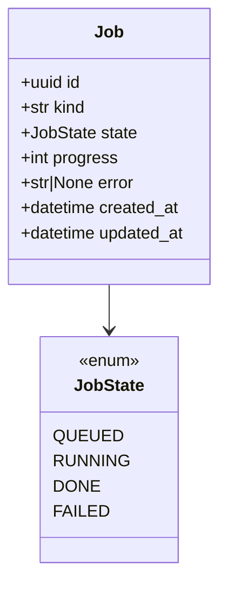
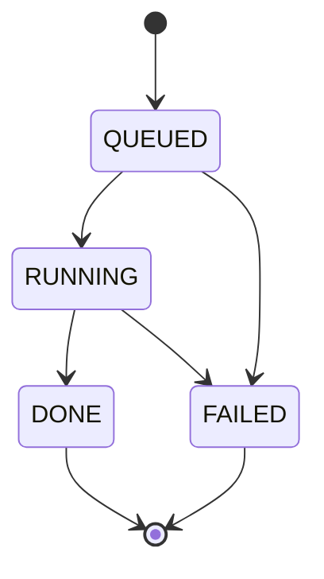

# Design — `infra` deploy (Vercel + Railway + Supabase)

**Status:** agreed · **Owner:** Katlego (Claude) · **Tasks:** T037 (stack), T008 (Storage), T009/T030 (Auth)
· **Spec:** cross-cutting (hosting for every story; SPEC.md's stories are still the template)
· **Decided:** 2026-09-29 by Katlego, adopting the Hackathon kit's REACT + FASTAPI stack

---

## 1. What this covers

Where Panelwise runs once it leaves a laptop, and what each hosted service is for. It replaces
PLAN.md's earlier target ("API + web on Nebius; Postgres + Redis self-hosted"). **Not covered:**
ComfyUI on the Nebius GPU (T003, `infra/nebius/`), which is unchanged.

| Piece | Runs on | Why |
|---|---|---|
| Web app (`apps/web`, Next.js 16) | **Vercel** | Next.js's native host; preview deploy per PR |
| API (`services/api`, FastAPI) | **Railway**, from `services/api/Dockerfile` | extraction runs for minutes; it needs a real container, not a serverless function |
| Database | **Supabase Postgres** | hosted Postgres; the SQLAlchemy + asyncpg code is unchanged |
| Images (frames, portraits, comic pages) | **Supabase Storage** | PLAN's "content-addressed file store", hosted |
| Sign-in, seeded judge account | **Supabase Auth** | T030 needs a judge login in the testing instructions |
| Job status and progress | **a Postgres table** | replaces Redis: one fewer service to host and pay for |
| Models | Nebius Token Factory | unchanged; this call is what satisfies "runs on Nebius" |
| Rendering | ComfyUI on a Nebius AI Cloud GPU (T003) | unchanged |

**Hackathon rules still hold:** "runs on Nebius" means a runtime Token Factory call *or* Nebius
compute. Panelwise makes both (Nemotron calls, ComfyUI GPU). Hosting the app elsewhere is allowed
(frameflow-nebius-hackathon/PLAN.md, rules). The demo must stay up, free, until 15 Dec.

## 2. Reference material

| Kind | Where |
| --- | --- |
| Source of the stack | `~/Documents/projects/personal/Hackathon/stacks/react-fastapi` and `stacks/_parts/{web-react,api-fastapi}` (`vercel.json`, `railway.json`, `db.py`, `supabase.ts`, the PREP steps) |
| Supabase connections | supabase.com/docs/guides/database/connecting-to-postgres (checked 2026-09-29): for a long-running server on IPv4, the **shared pooler, session mode**, port 5432 — IPv4 on every plan; transaction mode (6543) doesn't support prepared statements, which asyncpg uses |
| Current code | `services/api/app/main.py` (health checks Postgres **and Redis** today), `docker-compose.yml`, `.env.example` |

## 3. Domain model

One new entity, built with its first consumer (T009): a job row, so progress survives an API
restart and needs no Redis.



## 4. Flow

```mermaid
sequenceDiagram
    participant B as Browser
    participant W as Next.js on Vercel
    participant A as FastAPI on Railway
    participant S as Supabase (Postgres, Storage, Auth)
    participant N as Token Factory / ComfyUI
    B->>W: page, sign-in (Supabase Auth cookies via @supabase/ssr)
    W->>A: server-side fetch, API_URL, with the user's access token
    A->>S: SQL over the session pooler; Storage with the secret key
    A->>N: Nemotron calls; render calls
    A-->>W: JSON
    W-->>B: HTML / JSON
```

- **The browser never calls the API directly.** Next.js route handlers and server components call
  it server-side (`API_URL`, as `app/api/health` already does). So the API needs no CORS setup, and
  only the Supabase *publishable* key ever reaches a browser.
- **Secrets by place:** `SUPABASE_SECRET_KEY`, `DATABASE_URL`, `NEBIUS_API_KEY` live only on
  Railway. `NEXT_PUBLIC_SUPABASE_URL` and `NEXT_PUBLIC_SUPABASE_PUBLISHABLE_KEY` live on Vercel.
  `API_URL` (server-only, Vercel) points at the Railway domain.

**Failure paths:** the API down → the web health route answers 502 (already built); Supabase
Postgres down → the API health answers 503 `degraded`; a Railway deploy fails its
`/api/v1/health` check → Railway keeps the previous deploy running.

## 5. State



No transition out of `DONE` or `FAILED`: a retry is a new job.

## 6. Contracts

**Environment** (`.env.example` is the source; names are exact):

| Variable | Where | What |
|---|---|---|
| `DATABASE_URL` | API (Railway, local) | `postgresql+asyncpg://…` — locally the compose Postgres; deployed, the Supabase **session pooler** URL (port 5432) |
| `SUPABASE_URL`, `SUPABASE_SECRET_KEY` | API only | Storage (T008), verifying users (T009) |
| `NEXT_PUBLIC_SUPABASE_URL`, `NEXT_PUBLIC_SUPABASE_PUBLISHABLE_KEY` | web (Vercel) | Auth in the browser (T009) |
| `API_URL` | web, server-side only | the Railway domain, no trailing slash |
| `NEBIUS_*`, `LLM_*` | API only | unchanged (docs/design/llm.md) |
| `REDIS_URL` | — | **removed** |

**Deploy configs:** `apps/web/vercel.json` (framework `nextjs`, pnpm, root directory `apps/web`).
Railway is configured in its dashboard (root `/services/api`, Dockerfile, health check
`/api/v1/health`, restart on failure), written down step by step in `docs/deploy.md`: Railway's
`railway.json` is deprecated, new services can't use it, and existing files stop working on
2026-12-01 (T037 review, checked against Railway's docs 2026-09-29).

**`DATABASE_URL`** may be `postgresql://`, `postgres://` or `postgresql+asyncpg://`; the API adds the
`+asyncpg` driver and rewrites libpq's `sslmode=` to asyncpg's `ssl=` (same values). asyncpg rejects
`sslmode` at connect time.

**API health** (`GET /api/v1/health`, T002 contract) keeps its shape; its checks become
`{"postgres": …}` only.

## 7. Structure

| Path | New? | Responsibility | Task |
|---|---|---|---|
| `apps/web/vercel.json` | new | Vercel build settings | T037 |
| `services/api/app/main.py`, `app/core/config.py`, `docker-compose.yml`, `.env.example`, `pyproject.toml` | changed | Redis out; Supabase settings in | T037 |
| `docs/deploy.md` | new | the account steps (Supabase, Railway, Vercel), in order, with checks | T037 |
| `services/api/app/storage/` | new | Supabase Storage for images | T008 |
| `services/api/app/jobs/` + migration | new | the `Job` table | T009 |
| `apps/web` auth (`@supabase/ssr`) + API token check | new | sign-in, judge account | T009 / T030 |

## 8. Decisions & alternatives

| Decision | Chosen | Rejected, and why |
|---|---|---|
| API host | Railway | Nebius VM: more setup, not covered by credit; the GPU box: couples API uptime to the GPU (Katlego, 2026-09-29). Railway isn't free either: a trial credit, then a small monthly minimum; budget it for the demo's life to 15 Dec |
| Railway config | dashboard settings, documented in `docs/deploy.md` | `railway.json` (the kit's): deprecated, closed to new services, dead on 2026-12-01; `.railway/railway.ts`: unverified code for four settings |
| Postgres client | SQLAlchemy + asyncpg over the session pooler | the `supabase` REST client for data (the kit's `db.py`): we already have SQL code, and REST can't do transactions |
| Pooler mode | session (5432) | transaction (6543): no prepared statements, which asyncpg relies on; direct connection: IPv6-only without the paid add-on |
| Redis | removed; job state in Postgres | keep Redis: a second hosted service for one table's worth of state |
| Browser → API | always through Next.js server-side | direct browser calls: CORS, and the API URL and tokens in the browser |
| Local development | compose Postgres, no Supabase needed for tests | the Supabase CLI locally: heavier, and tests never touch the network |
| Storage and Auth timing | built with their first consumer (T008, T009/T030) | now: a module with no caller is a placeholder (AGENTS.md §2a) |

Deviations from [docs/architecture-defaults.md](../architecture-defaults.md): "Docker for every
service" still holds (both services have Dockerfiles; Vercel builds the web app itself). No
message broker, as before.

## 9. How this is verified

- T037: the gate green with Redis gone (health tests updated test-first); `docker compose up` still
  healthy locally; `vercel.json` validated against its schema; Railway's dashboard settings written
  down in `docs/deploy.md`.
- T037 done means deployed: the Railway URL answers `/api/v1/health` `ok` against Supabase, and the
  Vercel URL's `/api/health` answers 200 through it. That needs Katlego's accounts, so the task is
  **blocked on accounts** until they exist, and says so.

## 10. Open questions

- [ ] Storage in local development: a dev bucket in the same Supabase project, or a local
  filesystem adapter behind the same interface? Decide in T008.
- [ ] Row-level security policies for Storage and the `Job` table: decide with Auth in T009.
