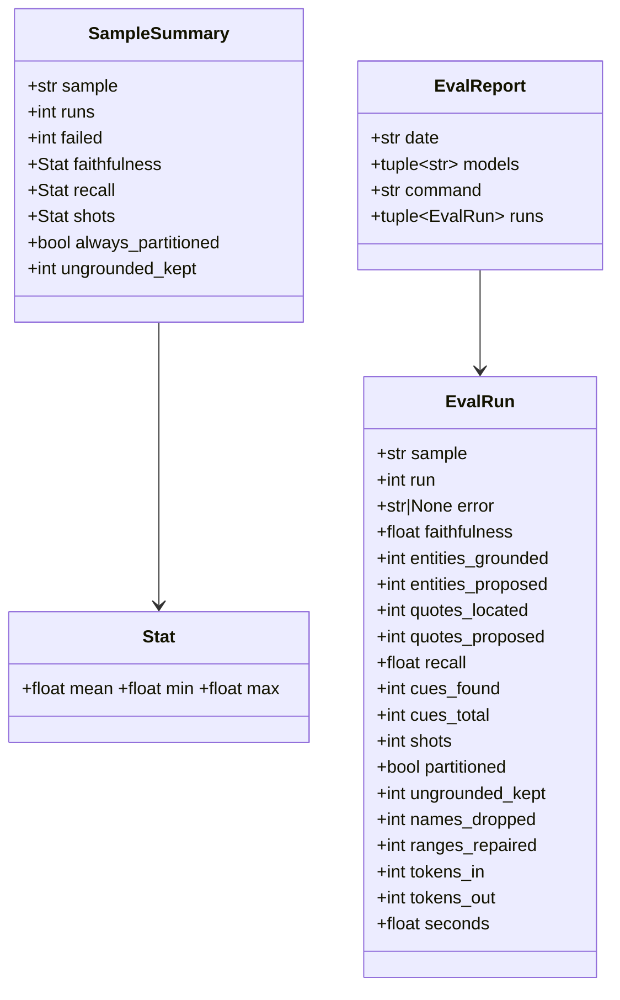
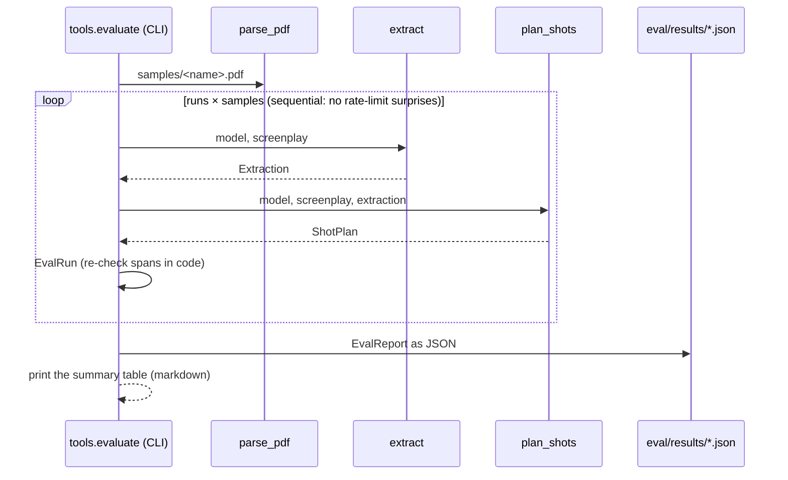

# Design — `eval` (the numbers in the README)

**Status:** proposed · **Owner:** Katlego (Claude) · **Tasks:** T032, T049 · **Spec:** [SPEC.md](../../SPEC.md)
§ Success criteria ("Measured: faithfulness, recall and frame-audit accuracy numbers in the README")

---

## 1. What this covers

Repeatable measurements on the three self-written samples (`samples/`, T031), run on the real
Token Factory account and committed with the date, the model and the command that produced them:

- **Extraction and shot planning (T032):** grounding faithfulness and recall (grounding.md §4), and
  for the shot plan: every element in exactly one shot, and every kept quote and every shot's
  `source` re-checked in code as verbatim script text. Several runs per sample, because Lightning
  at temperature 0 still varies run to run (samples/README.md).
- **Frame-audit accuracy (T049):** the audit's precision and recall on a labelled set of rendered
  frames, including frames with a deliberately injected extra person or object (verify.md §8, §9),
  and the false-FAIL rate on frames that are correct. Designed in §6a; the frames come from T026's
  renderer (Workers AI).

**Not covered:** the README's prose (T033); costs in dollars (tokens are recorded; prices change);
any copyrighted script, ever.

## 2. Reference material

| Kind | Where |
| --- | --- |
| Metric definitions | grounding.md §4 (faithfulness) and `GroundingReport` §6 (recall), shots.md §9 (partition), verify.md §9 (accuracy) |
| Inputs | `samples/*.pdf` (T031); `extract` (grounding.md §6), `plan_shots` (shots.md §6) |
| Existing one-run CLIs | `app.grounding.run`, `app.shots.run` (same calls; eval repeats them and aggregates) |
| Previous numbers | samples/README.md § Live runs (one run each, T039, T048) |

## 3. Domain model



- **`EvalRun`** is one `extract` + `plan_shots` over one sample. A run that raises
  `ExtractionError` / `ShotError` / `LLMError` is kept with `error` set (its message) and zeroed
  numbers, and is **counted** in `failed`, never silently dropped.
- **`ungrounded_kept`** re-checks Non-negotiable I in code, independently of the filter: the number
  of kept quotes whose `text` is not inside their `span`'s lines (`normalize_for_grounding`), plus
  shots that don't cite exactly what they cover. A shot with elements cites them when its `source`
  is `"\n".join(e.text for e in covered)` (planner, shots.md), its `span` runs from the first
  covered element's start to the last one's end, and each covered element's text normalises to its
  own span's lines (script.md §3). A shot with **no** elements (the establishing shot of a
  heading-only scene) cites the heading: `source == scene.heading` and `span` is the heading line.
  It must be 0; anything else is a bug, and the eval exits non-zero.
- **Field mapping:** `cues_found` is `GroundingReport.cues_found_by_model`; `tokens_in` /
  `tokens_out` are extraction's plus planning's `prompt_tokens` / `completion_tokens`
  (`reasoning_tokens` is left out: thinking is off on the fast tier, llm.md).
- **`names_dropped`** = the planner's `characters_dropped + props_dropped` (names the model put in a
  shot that aren't extracted for that scene; dropped by code, shots.md §4).
- **`SampleSummary`** is computed from the runs that didn't fail. `Stat` is mean / min / max.

## 4. Flow



The committed `eval/README.md` table is the printed table, pasted with its date and command. A gate
test recomputes the table from the committed JSON and compares, so the README can't drift from
the data. The gate never calls a model.

## 5. State

None: a run is a pure function of the sample and the model's answers. Results are append-only
files named by date.

## 6. Contracts

```python
# services/api/tools/evaluate.py
@dataclass(frozen=True) class EvalRun: ...          # §3 fields, in that order
@dataclass(frozen=True) class Stat: mean: float; min: float; max: float
@dataclass(frozen=True) class SampleSummary: ...    # §3 fields
@dataclass(frozen=True) class EvalReport: date: str; models: tuple[str, ...]; command: str; runs: tuple[EvalRun, ...]

def check_run(screenplay: Screenplay, extraction: Extraction, plan: ShotPlan, *, sample: str, run: int, seconds: float) -> EvalRun: ...  # pure
def summarise(runs: Sequence[EvalRun]) -> list[SampleSummary]: ...   # pure; one per sample, in first-seen order
def table(report: EvalReport) -> str: ...                            # pure; the markdown table eval/README.md carries
def to_json(report: EvalReport) -> str: ...; def from_json(text: str) -> EvalReport: ...  # round-trip
async def main(argv: list[str]) -> int: ...  # [--runs N (default 5)] [--out PATH] [sample ...]; exit 1 if any ungrounded_kept > 0
```

`cd services/api && uv run python -m tools.evaluate --runs 5` runs all three samples and writes
`eval/results/extraction-<YYYY-MM-DD>.json` (a second run the same day gets `-2`, never
overwrites).

**The table** (one row per sample, then a pooled row over all runs):

| Sample | Runs (failed) | Faithfulness mean (min–max) | Recall mean (min–max) | Shots mean (min–max) | Every element once | Ungrounded kept |

Pooled faithfulness is entities grounded ÷ entities proposed over every run (micro), not a mean of
means; same for recall over cues.

**T049** has its own section, §6a.

## 6a. Frame-audit accuracy (T049)

**Why now.** The first live storyboard run (2026-10-10, T026, `the-red-kite`) withheld every frame:
39 audits, 39 FAILs, almost all on `unscripted_object`. Looking at the frames shows that the audit
**fails good things and misses bad ones**:
- **Good things it failed:** a kite's string, washing on the line (the script's "washing lines"),
  windows and chimneys.
- **Bad things it missed:** a second kite, and the words "RED KITE" painted on the kite.
- **What it got right:** the artist's signature klein sometimes draws in a corner.

T049 measures this before anything changes. The audit wording fix (§6a.6) is then judged by the
same numbers.

### 6a.1 The frame set

`eval/frames/<story>/`, one directory per project the frames were drawn for:

- **`story.json`:** that project's `screenplay`, `extraction` and `plan`, dumped by
  `app.projects.codec`. Each upload re-extracts and re-plans, so a frame is judged against exactly
  the shot it was drawn for.
- **`labels.json`:** one `LabelledFrame` per frame (§6a.4), in plan order.

**The frames themselves stay in Supabase Storage** at the asset key the renderer gave them. Each is
0.5 to 0.6 MB, so the ~50 frames would add about 25 MB to the repo. `labels.json` records each
frame's sha256, and the run refuses any frame whose bytes don't match.

**Labels are four kinds:**

| Label | Meaning | The right verdict |
|---|---|---|
| `correct` | Nothing in the frame contradicts the shot: every person, object and word is scripted, set dressing or part of a scripted thing | `PASS` or `WARN` |
| `unscripted` | A natural render that shows something the script doesn't: a second kite, a signature, painted words | `FAIL` |
| `injected_person` | Drawn from the shot's prompt plus one sentence adding a person (§6a.3) | `FAIL`, with `unscripted_person` among the failed checks |
| `injected_object` | Drawn from the shot's prompt plus one sentence adding an object (§6a.3) | `FAIL`, with `unscripted_object` among the failed checks |

Each label carries `seen`: what a person looking at the frame sees that isn't scripted (empty for
`correct`). **Claude drafts every label by looking at the frame next to the shot's text, and
Katlego reviews every label in the code PR.** No label is merged unreviewed.

### 6a.2 Collecting the frames

`uv run python -m tools.audit_eval collect <project-id> <story>` does the following:
- writes `eval/frames/<story>/story.json` from the project's row;
- appends one entry to `labels.json` per attempt in that project's `frame_audits`, with the asset
  key, sha256, shot and attempt, and with `label: null` and `seen: []`;
- reads only the database and Storage, and calls no model.

A frame already in any story's `labels.json` is skipped: a re-upload's store hits are the same
drawing, measured once. The 2026-10-10 runs give **27 distinct frames** (21 from `4911b46f…`, 6 more
from `ff0018d6…`; its other 12 were store hits). An entry with `label: null` stops `run` (§6a.5),
so every frame is labelled before it is measured.

**What the labels found (2026-10-10, 27 frames): 20 should FAIL, 7 are correct.** The renderer, not
only the audit, is the problem:
- 14 frames carry an artist's signature or illegible writing in a corner;
- 13 draw a grown man or woman where the shot has Lerato (10), or a man decades younger than
  Mokgosi (70s);
- 2 draw a second kite.

So the 39 FAILs were mostly right, often for the wrong reason (washing, windows and kite strings).
T049's numbers say how often for which.

### 6a.3 Injected frames

`uv run python -m tools.audit_eval inject <story> <scene.shot> (--person TEXT | --object TEXT) --seed N`
does the following:
- builds the shot's `FramePrompt` exactly as the renderer does (storyboard.md §3.1, the default
  style, `RENDER_MAX_WORDS`);
- appends `TEXT` as one sentence;
- draws it through Workers AI with `WorkersAIRenderer.render_text` (storyboard.md §6): the
  renderer's own path (`draw_size`, `workers_ai_request`, retries, `fit`, post-processing, the
  store) with the prompt text given;
- stores it at `frames/<render_key>.png` (the render key covers the changed prompt, so an injected
  frame never collides with a real one);
- appends its entry to `labels.json` with the label set, and `seen` set to `[TEXT]`.

**Six of each kind**, on six shots across the three scenes:
- the person is one adult not in the scene, e.g. "a man in a red cap stands at the edge of the
  roof";
- the object is one thing the location wouldn't hold, e.g. "a bicycle leans against the wall".

Twelve drawings is about 1,250 of a day's 10,000 free neurons. To reach the 45 frames T049's
`Done` asks for, the next day's allowance also draws the shots the live runs never reached
(scenes 3 onwards, one attempt each), labelled the same way. **Each one's label is still
checked by eye.** If klein didn't draw the injected thing, the frame is relabelled from what it
does show.

### 6a.4 Contracts

```python
# services/api/tools/audit_eval.py
type Label = Literal["correct", "unscripted", "injected_person", "injected_object"]

@dataclass(frozen=True)
class LabelledFrame:
    frame: str                   # the Storage key, frames/<render_key>.png
    sha256: str
    story: str                   # eval/frames/<story>/
    shot: tuple[int, int]        # (scene_index, number) in that story's plan
    attempt: int
    label: Label | None          # None only between collect and labelling; run refuses it
    seen: tuple[str, ...]        # what isn't scripted, as a person sees it; () for correct
    note: str = ""

@dataclass(frozen=True)
class AuditRun:                  # one audit of one frame
    frame: str
    shot: tuple[int, int]
    label: Label
    run: int
    verdict: Verdict             # verify.md's PASS | WARN | FAIL | ERROR
    failed_checks: tuple[Check, ...]   # every check with ok = False, hard and soft, in enum order
    unscripted: tuple[str, ...]        # the object names the judge called unscripted
    tokens_in: int
    tokens_out: int
    error: str | None            # an ERROR's reason; None otherwise

@dataclass(frozen=True)
class AuditSummary:              # over every run of every frame; ERROR runs excluded from the rates, counted
    frames: int
    runs: int
    errors: int
    true_fail: int               # label != correct and FAIL
    false_fail: int              # label == correct and FAIL
    missed: int                  # label != correct and PASS or WARN
    true_pass: int               # label == correct and PASS or WARN
    precision: float             # true_fail / (true_fail + false_fail)
    recall: float                # true_fail / (true_fail + missed)
    false_fail_rate: float       # false_fail / (false_fail + true_pass)
    recall_by_label: dict[str, float]      # unscripted, injected_person, injected_object
    right_reason: float          # of true_fail runs on injected frames: the expected check failed (§6a.1)
    false_fail_checks: dict[str, int]      # check -> how many false_fail runs it failed in

@dataclass(frozen=True)
class AuditReport:
    date: str
    variant: str                 # "<git short sha>+<sha256(DESCRIBE_PROMPT + JUDGE_PROMPT)[:8]>"
    models: tuple[str, ...]      # the describer and the judge
    command: str
    runs: tuple[AuditRun, ...]

def load_labels(root: Path) -> list[LabelledFrame]: ...          # every eval/frames/*/labels.json, sorted by story then shot then attempt
def summarise(runs: Sequence[AuditRun]) -> AuditSummary: ...      # pure
def table(reports: Sequence[AuditReport]) -> str: ...             # pure; one row per report (variant), §6a.5's columns
def to_json(report: AuditReport) -> str: ...; def from_json(text: str) -> AuditReport: ...   # round-trip
async def main(argv: list[str]) -> int: ...   # collect | inject | run [--runs N (default 3)] [--out PATH]
```

### 6a.5 The run and the table

`uv run python -m tools.audit_eval run --runs 3` goes through each labelled frame in
`load_labels` order:
1. It checks the sha256 and reads the frame from Storage.
2. It calls verify.md's `audit_frame` `--runs` times, against the frame's story and shot. The audit
   varies run to run, so one run per frame would hide that.
3. It writes `eval/results/audit-<YYYY-MM-DD>.json` (a second report the same day gets `-2`) and
   prints the table.

Other rules:
- Runs are sequential, like T032.
- An unlabelled frame, or a sha256 that doesn't match, exits 2 before any model call.
- **Cost:** about 50 frames × 3 runs × (one describer call and one judge call) on Token Factory.
  The tokens are recorded.

**The table** in `eval/README.md` has one row per committed report, oldest first. The gate
recomputes it from the committed JSON, as it does for T032.

| Date | Variant | Frames (runs, errors) | Precision | Recall | False-FAIL rate | Recall: unscripted / person / object | Right reason | Top false-FAIL checks |

### 6a.6 What follows T049

1. **The baseline** is the first report, on today's `main` prompts.
2. **The audit wording fix** is the uncommitted part of `fix/prompts-audit`:
   - the judge counts parts of the place (windows, roofs, chimneys) and parts of a scripted prop (a
     kite's string or tail) as scripted;
   - worn clothes belong to their wearer;
   - the describer reports letters, not scribbles.

   It gets its own design change to verify.md §3 and its own PR. Its run is the table's second row.
   It merges only if the false-FAIL rate drops and recall doesn't.
3. **The prompt-side half**, "sparse background" in the styles, changes the frames rather than the
   audit. So it's measured by T026's next live run, not here.

## 7. Structure

| Path | New/changed | What |
| --- | --- | --- |
| `services/api/tools/evaluate.py` | new | §6 |
| `services/api/tests/tools/__init__.py` | new | package marker, as `tests/samples/` has |
| `services/api/tests/tools/test_evaluate.py` | new | pure functions; the README table equals `table(from_json(latest))` |
| `eval/README.md` | changed | what is measured, the command, the latest table, what the numbers don't show |
| `eval/results/extraction-<date>.json` | new | raw runs |
| `services/api/tools/audit_eval.py` | new | §6a (T049): `collect`, `inject`, `run` |
| `services/api/tests/tools/test_audit_eval.py` | new | §6a's pure functions; the README's audit table equals `table` over the committed reports |
| `eval/frames/<story>/{story.json,labels.json}` | new | §6a.1: the stories and the reviewed labels (the frames stay in Storage) |
| `eval/results/audit-<date>.json` | new | raw audit runs, one file per variant run |

## 8. Decisions & alternatives

| Decision | Chosen | Rejected, and why |
| --- | --- | --- |
| Runs per sample | 5, reported with min–max | 1 run: the T039 numbers moved 0.625 → 0.143 between two runs of the same sample |
| Where the runner lives | `services/api/tools/` (like `build_samples`) | a separate `eval/` package: it would need its own env to import `app` |
| Re-check grounding | in the eval, in code, independent of the filter | trusting `GroundingReport`: the eval would then measure the filter with itself |
| Failed runs | counted and shown | dropped: hides the case a judge most needs to see |
| Gate | recomputes the table from JSON, offline | runs the eval: costs credit and isn't deterministic |
| T049's frames | the live run's own frames, labelled by eye, plus 12 injected | only injected frames: they measure recall, never the false-FAIL rate that withheld the whole storyboard; a synthetic set: not what the renderer draws |
| Where T049's frames live | Supabase Storage, with sha256s in `labels.json` | in git: about 25 MB of PNGs; downscaled copies: the audit would see different pixels than it measured |
| Who labels | Claude drafts each label by looking at the frame; Katlego reviews every one in the PR | the audit's own verdicts as labels: measures the audit with itself |
| T049's runner | its own module, `tools/audit_eval.py` | an `audit` mode in `tools/evaluate.py` (TASKS' first sketch): different inputs, outputs and table; one module per measure keeps each readable |
| Audit runs per frame | 3 | 1: the describer and the judge vary run to run even at temperature 0 (as T032's extraction does), so a single run would make a frame's verdict look settled when it isn't |

Deviations from [docs/architecture-defaults.md](../architecture-defaults.md): none.

## 9. How this is verified

- `check_run` on hand-built extractions and plans: a quote moved to the wrong span and a shot
  whose `source` was edited or whose `span` was moved each count as `ungrounded_kept`; a
  heading-only scene's establishing shot (no elements, cites the heading) does not; an
  unpartitioned plan reads `False`.
- `summarise` / `table` on fixed runs: mean/min/max, a failed run excluded from stats but counted,
  pooled micro averages.
- `to_json` / `from_json` round-trip; the committed README table equals the table recomputed from
  the newest committed JSON.
- Live: `uv run python -m tools.evaluate --runs 5` on the real account, results committed.
- **T049:**
  - `summarise` on hand-built runs: precision, recall and the false-FAIL rate, with an `ERROR` run
    counted but excluded from the rates; `recall_by_label`; `right_reason`; `false_fail_checks`.
  - `load_labels` refuses a `null` label or an unknown kind.
  - `run` exits 2 on a sha256 mismatch before any model call (a fake store, and a model that fails
    if it's called).
  - `to_json` and `from_json` round-trip.
  - The README's audit table equals `table` over every committed `audit-*.json`.
  - Live: `collect` on both 2026-10-10 projects; 12 `inject` drawings; the labels reviewed; then
    `run --runs 3` on the real account, results committed.

## 10. Open questions

- [ ] A target bar for faithfulness / recall: SPEC.md open question 5 asks the same for audit
  accuracy. Reported without a bar until the team sets one.
- [ ] **T049's frames come from one script.** `the-red-kite` is the only sample drawn so far.
  `lost-property` and `sipho-and-siphokazi` are added when a day's neurons allow (about 100 frames
  a day), and the table then says so.
