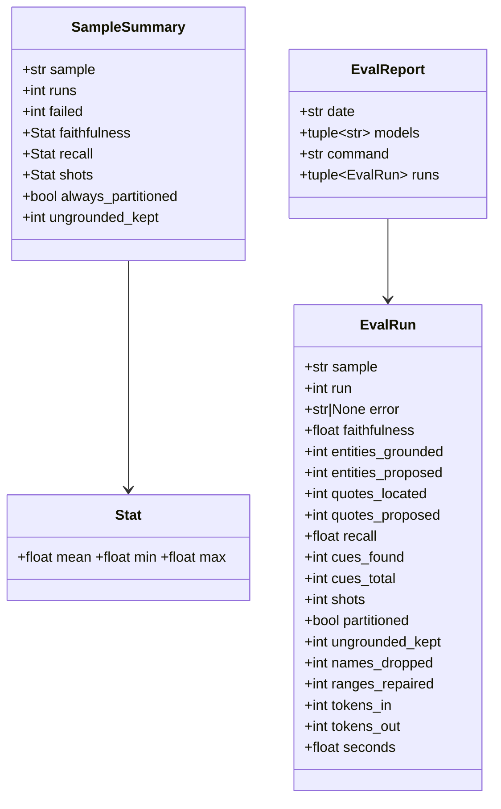
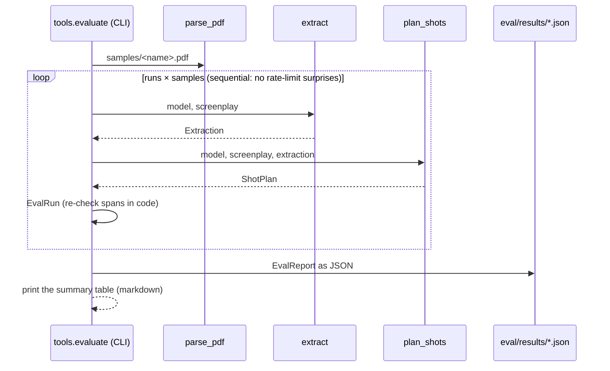

# Design — `eval` (the numbers in the README)

**Status:** proposed · **Owner:** Katlego (Claude) · **Tasks:** T032, T049 · **Spec:** [SPEC.md](../../SPEC.md)
§ Success criteria ("Measured: faithfulness, recall and frame-audit accuracy numbers in the README")

---

## 1. What this covers

Repeatable measurements on the three self-written samples (`samples/`, T031), run on the real
Token Factory account and committed with the date, the model and the command that produced them:

- **Extraction and shot planning (T032):** grounding faithfulness and recall (grounding.md §4), and
  for the shot plan: every element in exactly one shot, and every kept quote and every shot's
  `source` re-checked in code as verbatim script text. Several runs per sample, because Lightning
  at temperature 0 still varies run to run (samples/README.md).
- **Frame-audit accuracy (T049):** the audit's precision and recall on a labelled set of rendered
  frames, including frames with a deliberately injected extra person or object (verify.md §8, §9).
  **Blocked on T026** (no image model on Token Factory, T001; renders need T003's GPU). Only its
  contract is fixed here, so T049 doesn't have to redesign the report.

**Not covered:** the README's prose (T033); costs in dollars (tokens are recorded; prices change);
any copyrighted script, ever.

## 2. Reference material

| Kind | Where |
| --- | --- |
| Metric definitions | grounding.md §4 (faithfulness, recall), shots.md §9 (partition), verify.md §9 (accuracy) |
| Inputs | `samples/*.pdf` (T031); `extract` (grounding.md §6), `plan_shots` (shots.md §6) |
| Existing one-run CLIs | `app.grounding.run`, `app.shots.run` (same calls; eval repeats them and aggregates) |
| Previous numbers | samples/README.md § Live runs (one run each, T039, T048) |

## 3. Domain model



- **`EvalRun`** is one `extract` + `plan_shots` over one sample. A run that raises
  `ExtractionError` / `ShotError` / `LLMError` is kept with `error` set (its message) and zeroed
  numbers, and is **counted** in `failed`, never silently dropped.
- **`ungrounded_kept`** re-checks Non-negotiable I in code, independently of the filter: the number
  of kept quotes whose `text` is not inside their `span`'s lines (`normalize_for_grounding`), plus
  shots whose `source` is not the covered elements' text. It must be 0; anything else is a bug, and
  the eval exits non-zero.
- **`names_dropped`** = the planner's `characters_dropped + props_dropped` (names the model put in a
  shot that aren't extracted for that scene; dropped by code, shots.md §4).
- **`SampleSummary`** is computed from the runs that didn't fail. `Stat` is mean / min / max.

## 4. Flow



The committed `eval/README.md` table is the printed table, pasted with its date and command. A gate
test recomputes the table from the committed JSON and compares, so the README can't drift from
the data. The gate never calls a model.

## 5. State

None: a run is a pure function of the sample and the model's answers. Results are append-only
files named by date.

## 6. Contracts

```python
# services/api/tools/evaluate.py
@dataclass(frozen=True) class EvalRun: ...          # §3 fields, in that order
@dataclass(frozen=True) class Stat: mean: float; min: float; max: float
@dataclass(frozen=True) class SampleSummary: ...    # §3 fields
@dataclass(frozen=True) class EvalReport: date: str; models: tuple[str, ...]; command: str; runs: tuple[EvalRun, ...]

def check_run(screenplay: Screenplay, extraction: Extraction, plan: ShotPlan, *, sample: str, run: int, seconds: float) -> EvalRun: ...  # pure
def summarise(runs: Sequence[EvalRun]) -> list[SampleSummary]: ...   # pure; one per sample, in first-seen order
def table(report: EvalReport) -> str: ...                            # pure; the markdown table eval/README.md carries
def to_json(report: EvalReport) -> str: ...; def from_json(text: str) -> EvalReport: ...  # round-trip
async def main(argv: list[str]) -> int: ...  # [--runs N (default 5)] [--out PATH] [sample ...]; exit 1 if any ungrounded_kept > 0
```

`cd services/api && uv run python -m tools.evaluate --runs 5` runs all three samples and writes
`eval/results/extraction-<YYYY-MM-DD>.json` (a second run the same day gets `-2`, never
overwrites).

**The table** (one row per sample, then a pooled row over all runs):

| Sample | Runs (failed) | Faithfulness mean (min–max) | Recall mean (min–max) | Shots mean (min–max) | Every element once | Ungrounded kept |

Pooled faithfulness is entities grounded ÷ entities proposed over every run (micro), not a mean of
means; same for recall over cues.

**T049 (blocked) report shape:** per frame `{frame, shot, label: "correct" | "injected_person" |
"injected_object", verdict, failed_checks}`; precision and recall of FAIL against the injected
labels, and the false-FAIL rate on correct frames (verify.md §10). Same file and table conventions,
`eval/results/audit-<date>.json`.

## 7. Structure

| Path | New/changed | What |
| --- | --- | --- |
| `services/api/tools/evaluate.py` | new | §6 |
| `services/api/tests/tools/test_evaluate.py` | new | pure functions; the README table equals `table(from_json(latest))` |
| `eval/README.md` | changed | what is measured, the command, the latest table, what the numbers don't show |
| `eval/results/extraction-<date>.json` | new | raw runs |

## 8. Decisions & alternatives

| Decision | Chosen | Rejected, and why |
| --- | --- | --- |
| Runs per sample | 5, reported with min–max | 1 run: the T039 numbers moved 0.625 → 0.143 between two runs of the same sample |
| Where the runner lives | `services/api/tools/` (like `build_samples`) | a separate `eval/` package: it would need its own env to import `app` |
| Re-check grounding | in the eval, in code, independent of the filter | trusting `GroundingReport`: the eval would then measure the filter with itself |
| Failed runs | counted and shown | dropped: hides the case a judge most needs to see |
| Gate | recomputes the table from JSON, offline | runs the eval: costs credit and isn't deterministic |

## 9. How this is verified

- `check_run` on hand-built extractions and plans: a quote moved to the wrong span and a shot
  whose `source` was edited each count as `ungrounded_kept`; an unpartitioned plan reads `False`.
- `summarise` / `table` on fixed runs: mean/min/max, a failed run excluded from stats but counted,
  pooled micro averages.
- `to_json` / `from_json` round-trip; the committed README table equals the table recomputed from
  the newest committed JSON.
- Live: `uv run python -m tools.evaluate --runs 5` on the real account, results committed.

## 10. Open questions

- [ ] A target bar for faithfulness / recall: SPEC.md open question 5 asks the same for audit
  accuracy. Reported without a bar until the team sets one.
