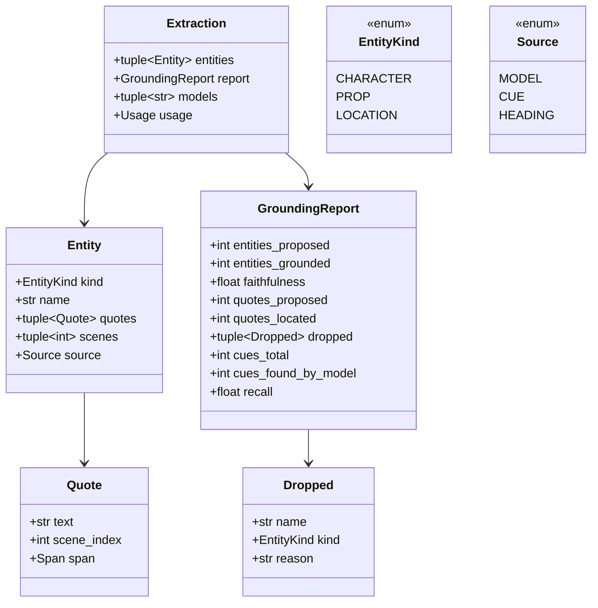

# Design — `grounding` (entity extraction + grounding filter; lane `script+grounding`)

**Status:** agreed · **Owner:** Katlego (Claude) · **Tasks:** T006 · **Spec:** PLAN.md Non-negotiable I
(SPEC.md's stories are still the template)

---

## 1. What this covers

Turning a parsed `Screenplay` (docs/design/script.md) into the cast, props and locations every
later stage draws from — **where every entity and every description is a verbatim quote located
back to a page and line span**, and anything the model says that can't be located is dropped.
Plus the two numbers that say how well it worked: **faithfulness** (precision) and **recall**.

**Not covered:** storage, shots (T007), frame prompts (T008). Portraits use these entities later
(T025).

## 2. Reference material

| Kind | Where |
| --- | --- |
| Code ported from | FrameFlow `services/api/app/services/grounding.py` (`normalize_for_grounding`, 26 Aug), `extraction_service.py` (scene chunking, merge, the filter), `governance_service.py` (faithfulness, recall) |
| Why recall matters | FrameFlow: faithfulness 1.0 on 15 entities of a script with 77 speaking characters — "a recall failure wearing a green badge" |
| API behaviour | docs/nebius-findings.md: `json_schema` enforced (U1); thinking off on the fast tier (U2); TPM is the binding limit (U4); `json_object` invented a detail (U1) |
| LLM seam | docs/design/llm.md (`structured_chat`, `Tier.FAST`) |

## 3. Domain model



- **What the model decides vs what the parser already knows.** Locations come from scene headings
  (`Source.HEADING`, the heading line is the quote). Speaking characters are known from dialogue
  cues. The model is asked only for what the parser can't know: characters and props **as the
  script describes them**, each with verbatim quotes.
- **Descriptions are quotes, never attributes.** No age, gender or role fields: FrameFlow asked for
  them, and inferring them is inventing (findings U1: "likely a lighthouse keeper"). A later stage
  that needs to draw a character reads its quotes.
- **`Quote.text`** is the model's quote; **`Quote.span`** is the element (action paragraph, speech
  or heading) it was found inside. A quote is *located* only when its normalised text is a
  substring of one element's normalised text — so its span is exact, never "somewhere in the
  script".
- **`Entity.scenes`**: 0-based scene indexes, derived from where its quotes and (for characters)
  its matched cues sit. Never taken from the model's say-so.
- **Speaking characters the model missed** are added with `Source.CUE`, quoting their first
  speech, so the cast is complete. They don't count toward the model's recall — that measures
  the model.

## 4. Flow

```mermaid
sequenceDiagram
    participant C as Caller
    participant X as extract()
    participant M as structured_chat (FAST)
    participant G as grounding filter
    C->>X: Screenplay, NebiusChatModel
    X->>X: chunk_scenes: whole scenes, ≤ chunk_chars each; refuse > max_chunks
    par each chunk (≤ concurrency at once)
        X->>M: system prompt + render_chunk(scenes) → ChunkEntities
        M-->>X: proposed entities + ChatResult
    end
    X->>G: all proposals + Screenplay
    G->>G: per quote: locate in one element → Quote(span) or unlocated
    G->>G: per entity: name found in script AND ≥1 quote located → keep (bad quotes dropped); else Dropped
    G->>G: merge by (kind, normalise(name)); add HEADING locations; add CUE characters the model missed
    G-->>X: entities + GroundingReport
    X-->>C: Extraction
```

**Faithfulness** = entities fully grounded (name found **and every** quote located) ÷ entities
proposed, after merging. **Filtering** is per quote: an entity with one bad quote keeps its good
ones, because FrameFlow lost its lead character to exactly this (one quote broken by a line-break
hyphen). The two differ on purpose: the score measures the model; the filter decides what the
product may show, and it only ever shows located quotes.

**Recall** = distinct speaking cues matched (`match_speaker`) by a model-proposed, grounded
character ÷ distinct speaking cues. 1.0 when the script has no dialogue.

**Failure paths:** more chunks than `max_chunks` → `ExtractionError` before any call is made (each
chunk is billed). A chunk whose call fails (an `LLMError`, or a `ValidationError` after the repair
retry) fails the whole extraction with `ExtractionError` naming the chunk's scene range — a silent
gap in the cast is worse than a loud failure. No partial results are returned.

## 5. State

None. `extract` is a pure async function of its inputs plus the model calls.

## 6. Contracts

```python
# app/grounding/model.py
class EntityKind(StrEnum): CHARACTER = "character"; PROP = "prop"; LOCATION = "location"
class Source(StrEnum): MODEL = "model"; CUE = "cue"; HEADING = "heading"
@dataclass(frozen=True) class Quote: text: str; scene_index: int; span: Span
@dataclass(frozen=True) class Entity: kind: EntityKind; name: str; quotes: tuple[Quote, ...]; scenes: tuple[int, ...]; source: Source
@dataclass(frozen=True) class Dropped: name: str; kind: EntityKind; reason: str
@dataclass(frozen=True) class GroundingReport: entities_proposed: int; entities_grounded: int; faithfulness: float; quotes_proposed: int; quotes_located: int; dropped: tuple[Dropped, ...]; cues_total: int; cues_found_by_model: int; recall: float
@dataclass(frozen=True) class Extraction: entities: tuple[Entity, ...]; report: GroundingReport; models: tuple[str, ...]; usage: Usage
class ExtractionError(RuntimeError): ...

# app/grounding/text.py
def normalize_for_grounding(text: str) -> str: ...        # FrameFlow's: join line-break hyphens, collapse whitespace, upper-case
type Index = list[tuple[int, Span, str]]                  # (scene_index, heading/element span, normalised source lines)
def build_index(screenplay: Screenplay) -> Index: ...     # built once per screenplay; the filter reuses it
def locate_in(index: Index, quote: str) -> tuple[int, Span] | None: ...
def locate(quote: str, screenplay: Screenplay) -> tuple[int, Span] | None: ...   # (scene_index, element or heading span)

# app/grounding/schema.py — what the model is asked for (strict json_schema via structured_chat).
# Its own module because both extract and filter use it.
class ProposedEntity(BaseModel): name: str; kind: Literal["character", "prop"]; quotes: list[str]
class ChunkEntities(BaseModel): entities: list[ProposedEntity]

# app/grounding/extract.py
def chunk_scenes(screenplay: Screenplay, chunk_chars: int) -> list[tuple[Scene, ...]]: ...
def render_chunk(scenes: Sequence[Scene]) -> str: ...
async def extract(model: NebiusChatModel, screenplay: Screenplay, *, chunk_chars: int = 12_000,
                  max_chunks: int = 40, concurrency: int = 4, temperature: float = 0.0) -> Extraction: ...

# app/grounding/filter.py
def ground(proposals: Sequence[ProposedEntity], screenplay: Screenplay) -> tuple[tuple[Entity, ...], GroundingReport]: ...
```

`render_chunk` writes each scene as its heading, then its elements in order — action paragraphs as
text, speeches as `CUE`, `(parenthetical)`, text on separate lines — every piece verbatim from
the parser, so a faithful quote is always locatable.

## 7. Structure

| Path | New? | Responsibility |
| --- | --- | --- |
| `services/api/app/grounding/{__init__,model,text,schema,filter,extract}.py` | new | §6 |
| `services/api/app/grounding/run.py` | new | `python -m app.grounding.run <script.pdf>`: parse, extract on the real account, print entities, faithfulness, recall, model, tokens — the Phase 1 checkpoint |
| `services/api/tests/grounding/` | new | `locate`, `ground` (pure), `extract` with `httpx2.MockTransport` |

## 8. Decisions & alternatives

| Decision | Chosen | Rejected, and why |
| --- | --- | --- |
| Locations | from headings | model-extracted: the parser already knows them exactly |
| Character attributes | quotes only | age/gender/role fields: inference is invention |
| Quote location | inside one element | anywhere in the full text (FrameFlow): gives no span a panel can cite |
| Filter granularity | per quote | per entity (FrameFlow): one wrap-broken quote dropped the lead |
| Recall | model-only, cues via `match_speaker` | FrameFlow's name-set intersection: exact-name only, missed "THABO" vs "THABO MOLEFE" |
| Chunk failure | fail the extraction | skip the chunk: a silent gap in the cast |
| Concurrency | 4 chunks at once | sequential (FrameFlow): Lightning allows 600 RPM / 400K TPM (U4) |
| Chunk size | 12,000 chars | FrameFlow's 20,000: smaller chunks help recall, and Lightning is cheap |

## 9. How this is verified

- `normalize_for_grounding` / `locate`: line-break hyphen, case, whitespace; a quote spanning two
  elements is not located; a heading is locatable.
- `ground`: bad quote dropped but entity kept; entity whose name isn't in the script dropped with a
  reason; merge across chunks; HEADING locations; CUE backfill; faithfulness and recall arithmetic.
- `extract`: chunks never split a scene; `max_chunks` refusal makes no call; a failing chunk fails
  the extraction; request uses `Tier.FAST`, thinking off, strict `json_schema`.
- Checkpoint: `python -m app.grounding.run` on the self-written sample PDF, on the real account.

## 10. Open questions

- [ ] U6 (sampling): `temperature` defaults to 0.0. Compare 0.0 vs 1.0/0.95 on a full-length sample
  once one exists (T031).
- [ ] The sample is tiny; recall on a feature-length public-domain script needs T031's samples.
- [ ] Usage undercounts a repaired chunk: `StructuredResult.chat` is the final call only. Fine
  while repairs are rare (U1); revisit if the trace shows them.
