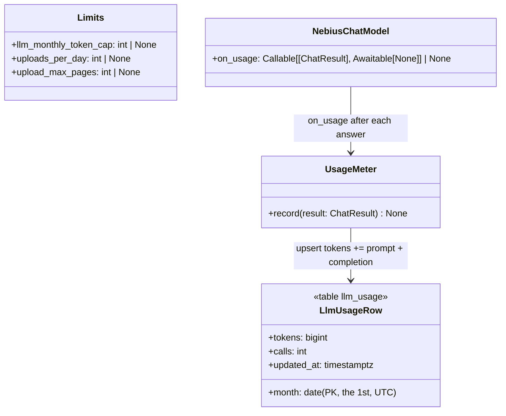

# Design — `limits` (the hosted demo's caps and its judge account)

**Status:** proposed · **Owner:** Tumo (Claude) · **Tasks:** T069 (split from T030 on 2026-10-10:
T030 keeps the hosting itself and the image-spend cap, which waits on the renderer decision) ·
**Spec:** [SPEC.md](../../SPEC.md) US1, US3

---

## 1. What this covers

What keeps the hosted demo standing from submission to the end of judging (15 Dec 2026) on a
project with no cash: Token Factory's $25 credit pays every model call, and every upload, "Try
another render" and "Make the comic" spends it.

- **A monthly token budget** for every Token Factory call the API makes, counted per calendar month
  (UTC); at the budget, new work that would call a model is refused with a clear message.
- **Uploads per account per day**: 3 on the hosted demo.
- **Pages per script**: 15 on the hosted demo.
- **The judge account**: one shared login, made by an idempotent seed script, holding a ready-made
  copy of the sample project so a judge sees a finished storyboard and comic without spending
  anything.

Decided by Tumo on 2026-10-10: one shared judge account, 3 uploads a day, 15 pages, a monthly token
cap. All four are settings; unset, each is off, so local development is unchanged.

**Not covered:** the image renderer's spend (T030, after the renderer is chosen: fal.ai bills in
dollars, Workers AI in a daily neuron allowance, so the cap is a different design for each); the
hosting itself (T030, T037, T063); sign-up (off, web.md §10).

## 2. Reference material

| Kind | Where |
|---|---|
| The model client | `services/api/app/llm/client.py` `NebiusChatModel.chat` → `ChatResult.usage` (prompt, completion, reasoning tokens) |
| The routes that spend | web.md §6: `POST /projects` (the upload's job: extract, plan, render, audit), `POST …/frames/{s}/{n}/attempts` (T021: render + audit), `POST …/comic` (T064: render + audit per panel) |
| Supabase Auth admin | `POST /auth/v1/admin/users` (create, `email_confirm`), `GET /auth/v1/admin/users` (list, paged), `PUT /auth/v1/admin/users/{id}` (password); the secret key in the `apikey` header |
| Prior art in the repo | T062's `app/frames/check.py` copies a planned project for a throwaway run; this copies a finished one |
| Ported | nothing |

## 3. Domain model



`tokens` counts `prompt_tokens + completion_tokens` (Token Factory bills both; reasoning tokens are
part of completion). One row per month; nothing per user: the budget protects the credit, and the
upload cap is what spreads it across judges.

## 4. Flow

```mermaid
sequenceDiagram
    participant B as Browser (web)
    participant A as API route
    participant L as limits.py
    participant D as Postgres
    participant M as NebiusChatModel
    B->>A: POST /projects (or …/attempts, …/comic)
    A->>A: who (401/503), ownership (404), state (409), as today
    A->>L: budget_left(session)
    L->>D: SELECT tokens FROM llm_usage WHERE month = this month
    alt at or over LLM_MONTHLY_TOKEN_CAP
        A-->>B: 429 {"error": "llm_budget_spent"} (nothing written)
    end
    A->>L: uploads_today(session, owner) (upload only)
    alt at UPLOADS_PER_DAY
        A-->>B: 429 {"error": "upload_limit", "per_day": 3}
    end
    A->>A: read the PDF; count its pages (upload only, before storing)
    alt over UPLOAD_MAX_PAGES
        A-->>B: 413 {"error": "too_many_pages", "max_pages": 15}
    end
    A-->>B: 202 as today; the job runs
    M->>L: on_usage(result) after every answer
    L->>D: INSERT … ON CONFLICT (month) DO UPDATE SET tokens = tokens + n
```

- **Where each check sits.** `POST /projects`: after who and storage (the 503s), the budget, then the
  day's count, then the existing length, form, size and header checks, then the **page count**
  (`pdfplumber` opens the bytes in a thread; a PDF it can't open falls through to the job's own
  `not_a_pdf`), and only then storage. `…/attempts` and `…/comic`: the budget after their 404 and
  409 checks and before their 503s, so nothing is written for a refused request.
- **A job already running finishes** over the budget: stopping mid-storyboard would waste what it
  already spent and leave a half board. The budget is a ceiling on starting work, so the month can
  end slightly over it; the cap is set below the credit with room for one job.
- **Uploads today** = the owner's `projects` rows with `created_at` in the last 24 hours (rolling, so
  no time zone decides when "tomorrow" starts). Copies made by the seed keep their source's
  `created_at`, so the sample never counts.
- **Metering never fails a call**: `on_usage` errors are logged at `WARNING` and swallowed (a lost
  count under-counts a little; a failed model call would lose the work). It runs after the answer
  is parsed, so a failed or repaired call counts only the answers that came back.

**The judge seed** (`python -m app.demo.seed --from <project id>`, run once against the hosted
database; `JUDGE_EMAIL` and `JUDGE_PASSWORD` from the environment, never the command line):
1. Supabase Auth: create the user (`email_confirm: true`); if the email exists, find its id and set
   the password. Idempotent.
2. If `--from` is given and the judge owns no project with the source's `pdf_path`: copy the source
   project into the judge's account in one transaction: the `projects` row (new id, the judge as
   owner, the source's title, `pdf_path`, `created_at` and stage columns), a `done` storyboard job,
   every `frames` row and its storyboard `frame_audits` rows (the assets are content addresses,
   shared, never copied), and the comic (its job and `comics` row) if the source has one. The
   source must be the owner's settled storyboard (`done`, no frame `rendering` or `auditing`), else
   the script refuses before writing.
3. Print the judge's id, the copied project's id and its title. Never the password.

## 5. State

No new lifecycle: a refused request writes nothing, and the job and frame state machines are
unchanged.

## 6. Contracts

```python
# app/core/config.py (Settings)
llm_monthly_token_cap: int | None = None   # LLM_MONTHLY_TOKEN_CAP; None or 0: no budget
uploads_per_day: int | None = None         # UPLOADS_PER_DAY; None or 0: no cap
upload_max_pages: int | None = None        # UPLOAD_MAX_PAGES; None or 0: no cap

# app/limits/usage.py (T069)
class LlmUsageRow(Base): ...               # table llm_usage: month date PK, tokens bigint, calls int, updated_at
def this_month(now: datetime) -> date: ...                 # the 1st of now's month, UTC
async def record_usage(sessions: async_sessionmaker[AsyncSession], result: ChatResult) -> None: ...
#   upsert this month's row: tokens += prompt + completion, calls += 1; logs and swallows any error
async def tokens_this_month(session: AsyncSession) -> int: ...
async def uploads_today(session: AsyncSession, owner: uuid.UUID) -> int: ...   # created_at > now() - 24 h

# app/limits/checks.py (T069): each raises ApiError, writes nothing
async def budget_spent(request: Request, session: AsyncSession) -> bool: ...    # tokens this month >= the cap
async def check_budget(request: Request, session: AsyncSession) -> None: ...    # 429 llm_budget_spent
async def check_uploads(request: Request, session: AsyncSession, owner: uuid.UUID) -> None: ...   # 429 upload_limit
def check_pages(request: Request, pdf: bytes) -> None: ...                      # 413 too_many_pages (a thread call)

# app/comic/job.py: the comic's refusals stay in start_comic, in comic.md §4a's order
start_comic(..., budget_spent: bool = False)   # → ComicRefused("llm_budget_spent") after comic_running, before the 503s

# app/llm/client.py
NebiusChatModel(..., on_usage: Callable[[ChatResult], Awaitable[None]] | None = None)
#   awaited after each successful answer; create_app passes record_usage bound to its sessions

# app/api/errors.py
ApiError(status, code, *, headers=None, extra: Mapping[str, object] | None = None)   # extra fields join {"error": code}

# app/demo/seed.py (T069): python -m app.demo.seed [--from PROJECT_ID]
async def main(argv: list[str]) -> int: ...
```

**Migration** `0006_llm_usage`: the `llm_usage` table; downgrade drops it.

**Responses** (web.md §6 gains these rows):

| Route | New answers |
|---|---|
| `POST /projects` | 429 `{"error": "llm_budget_spent"}` · 429 `{"error": "upload_limit", "per_day": n}` · 413 `{"error": "too_many_pages", "max_pages": n}` |
| `POST …/attempts`, `POST …/comic` | 429 `{"error": "llm_budget_spent"}` |

**Copy** (web.md §6 Copy):

| Where | Text |
|---|---|
| Upload, `llm_budget_spent` | "The demo has used this month's model budget. Your existing storyboards still open; new uploads start again next month." |
| Upload, `upload_limit` | "This demo makes {per_day} storyboards a day per account. Try again tomorrow." |
| Upload, `too_many_pages` | "This demo takes scripts of up to {max_pages} pages." |
| Try another render / Make the comic, `llm_budget_spent` | "The demo has used this month's model budget." |

**Environment** (`.env.example`, deploy.md §6): `LLM_MONTHLY_TOKEN_CAP` (already listed, read by
no code until now), `UPLOADS_PER_DAY`, `UPLOAD_MAX_PAGES`, each off when unset **or blank** (the
example file lists them empty); `JUDGE_EMAIL`, `JUDGE_PASSWORD` for the
seed only (local `.env`, never the hosted API's environment). `IMAGE_MONTHLY_GENERATION_CAP` stays
T030's.

## 7. Structure

| Path | New? | Responsibility | Task |
|---|---|---|---|
| `services/api/app/limits/{__init__,usage,checks}.py` | new | §6 | T069 |
| `services/api/migrations/versions/0006_llm_usage.py` | new | the table | T069 |
| `services/api/app/llm/client.py`, `app/main.py` | changed | `on_usage`; the meter wired in the lifespan | T069 |
| `services/api/app/api/errors.py` | changed | `extra` | T069 |
| `services/api/app/api/v1/projects.py` | changed | the checks in the three routes | T069 |
| `services/api/app/demo/{__init__,seed}.py` | new | the judge seed | T069 |
| `apps/web/components/projects/upload.ts`, the retry and comic copy | changed | §6 Copy | T069 |
| `services/api/app/core/config.py`, `.env.example`, `docs/design/deploy.md` §6 | changed | the settings | T069 |

## 8. Decisions & alternatives

| Decision | Chosen | Rejected, and why |
|---|---|---|
| What the budget counts | tokens the API's calls report, per month, in Postgres | Token Factory's own billing: no API to read it; a per-process counter: lost on restart, and Render restarts |
| Where it bites | refusing new work at the start | stopping running jobs: wastes what they spent and leaves half a board |
| Per user or global | global budget + per-account upload cap | a per-user token budget: a judge can't see tokens, and the shared account makes "per user" one user anyway |
| "Per day" | rolling 24 h | a calendar day: whose time zone? judges are worldwide |
| Page count | at upload, before storing | in the job's parse: the judge waits for a failure the upload could have told them |
| Judge sample | a copy of a finished project | rendering it on the judge's first visit: spends on every fresh account and makes the judge wait |

## 9. How this is verified

- `record_usage` adds prompt + completion and one call to this month's row (two calls → one row);
  an error inside it is logged and swallowed; `NebiusChatModel` awaits `on_usage` once per answer
  and not for a failed call.
- `POST /projects` at the budget → 429 `llm_budget_spent`, nothing stored, no job; the fourth upload
  in 24 h → 429 `upload_limit` with `per_day`; a 16-page PDF with `UPLOAD_MAX_PAGES=15` → 413
  `too_many_pages` with `max_pages`, nothing stored; each off when its setting is unset.
- `…/attempts` and `…/comic` at the budget → 429, the frame and jobs untouched.
- The seed against a fake Auth transport: creates then, on a second run, updates the password;
  copies a settled project once (a second run copies nothing); refuses an unsettled source; never
  prints the password.
- Web: each new error code maps to its copy (`upload.ts`, the retry button, Make the comic).
- **Live** (Tumo's go-ahead, no spend): the seed against the dev Supabase with a throwaway judge
  email, signing in as it in the browser and opening the copied storyboard and comic.

## 10. Open questions

- [ ] The cap's figure for the hosted demo: the-red-kite's upload + comic is about _ tokens (from
  `llm_usage` after the next live run); `LLM_MONTHLY_TOKEN_CAP` is set to leave one job's room
  under what's left of the credit. Set in T030 with the hosting.
- [ ] Devpost's rules on a login for judges: the rules page couldn't be read by the assistant
  (403); Tumo checks it signed in before the testing instructions are written (T030).
