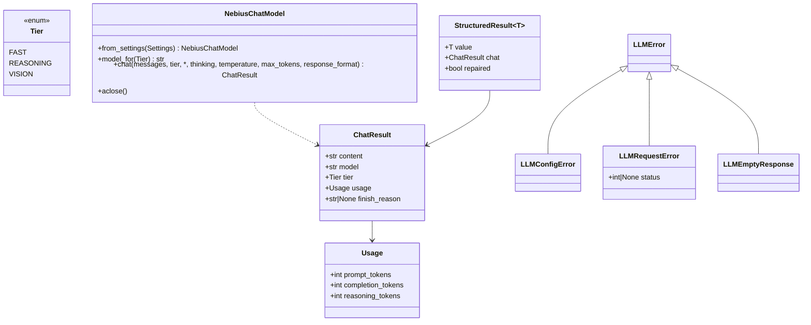
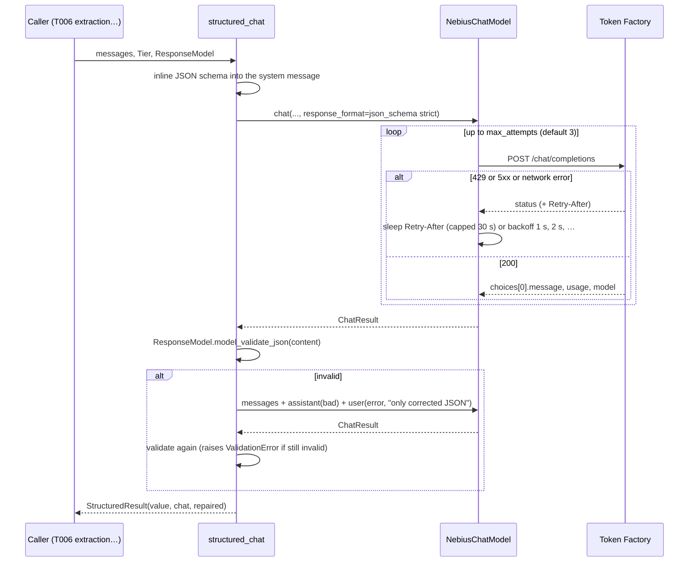

# Design — `llm` (Nebius Token Factory provider)

**Status:** agreed · **Owner:** Katlego (Claude) · **Tasks:** T004 · **Spec:** [SPEC.md](../../SPEC.md)
(every story calls a model through this)

---

## 1. What this covers

The one seam every model call in Panelwise goes through: an async client for Nebius Token Factory
with three tiers (fast, reasoning, vision), and `structured_chat`, which turns a call into a
validated Pydantic object. **Not covered:** prompts and schemas (each caller owns its own — T006
extraction, T007 shots, T020 audit), spend caps (T030), tracing spans (arrives with `core`
tracing; until then, usage is returned on every result and logged).

## 2. Reference material

| Kind | Where |
| --- | --- |
| Measured API behaviour this is built to | [docs/nebius-findings.md](../nebius-findings.md) (T001, 2026-09-28) |
| Code ported from | FrameFlow `services/api/app/services/openai_compat.py` (retries, reasoning-but-no-content error) and `llm_provider.py` (`structured_chat` repair retry) |
| External API | OpenAI-compatible `POST /v1/chat/completions` at `https://api.tokenfactory.nebius.com/v1` |

## 3. Domain model



- `ChatResult.model` is the model the server says answered (`response.model`), falling back to the
  requested ID — anything that names a model to a user reports this, never a configured default.
- `content` has a leading `<think>…</think>` removed and is `.strip()`ped (findings U2: Super
  returns `"\n391"` with thinking on). Content that arrives as a list of parts is the
  concatenation of its `text` parts.
- `Usage.reasoning_tokens` comes from `usage.completion_tokens_details.reasoning_tokens`; 0 when
  absent. It is already included in `completion_tokens` (that is how it's billed).

## 4. Flow



**Failure paths:**
- 4xx other than 429 → `LLMRequestError(status)` immediately, no retry (retrying a bad request
  wastes credit). The error names the status and model; it never includes the API key or the
  request body (the body quotes the screenplay).
- Retries exhausted on 429 / 5xx / network → `LLMRequestError` with the last status (`None` for
  network).
- 200 whose body isn't JSON (something in front of Token Factory answered) → `LLMRequestError(200)`,
  no retry. Every failure this module raises is an `LLMError`.
- 200 with empty content → `LLMEmptyResponse`. If the message carries `reasoning_content`, the
  error says thinking consumed the budget and to call with `thinking=False` or raise `max_tokens`.
- Tier with no model configured (e.g. `NEBIUS_MODEL_VISION` empty) → `LLMConfigError` at call time;
  a missing `NEBIUS_API_KEY` → `LLMConfigError` in `from_settings`.
- Repair also invalid → the `ValidationError` propagates. The caller decides; the grounding filter
  is never loosened to absorb it.

## 5. State

Stateless per call. The client holds one `httpx2.AsyncClient` (connection pool) for its lifetime.

## 6. Contracts

```python
# app/llm/client.py
class Tier(StrEnum):
    FAST = "fast"            # NEBIUS_MODEL_FAST       — extraction, shots (bulk, schema-bound)
    REASONING = "reasoning"  # NEBIUS_MODEL_REASONING  — judgement calls
    VISION = "vision"        # NEBIUS_MODEL_VISION     — describes images only (nebius-findings § The vision decision)

type Message = dict[str, Any]   # OpenAI chat message; content may be a str or a list of parts

class NebiusChatModel:
    def __init__(self, *, api_key: str, base_url: str, models: Mapping[Tier, str],
                 timeout_s: float = 120.0, max_attempts: int = 3,
                 transport: httpx2.AsyncBaseTransport | None = None,
                 sleep: Callable[[float], Awaitable[None]] = asyncio.sleep) -> None: ...
    @classmethod
    def from_settings(cls, settings: Settings) -> "NebiusChatModel": ...
    def model_for(self, tier: Tier) -> str: ...
    async def chat(self, messages: Sequence[Message], tier: Tier = Tier.FAST, *,
                   thinking: bool | None = None,          # None = the tier's default (below)
                   temperature: float = 0.0,
                   max_tokens: int | None = None,
                   response_format: Mapping[str, Any] | None = None) -> ChatResult: ...
    async def aclose(self) -> None: ...

# app/llm/structured.py
async def structured_chat[T: BaseModel](model: NebiusChatModel, messages: Sequence[Message],
        response_model: type[T], tier: Tier = Tier.FAST, *, max_repair_attempts: int = 1,
        thinking: bool | None = None, temperature: float = 0.0,
        max_tokens: int | None = None) -> StructuredResult[T]: ...
```

**Thinking defaults** (findings U2): `FAST` → `False`; `REASONING` → `True`; `VISION` → nothing
sent (the toggle was only measured on Nemotron). `False` sends
`chat_template_kwargs: {"enable_thinking": false}`; `True` sends `{"enable_thinking": true}`.

**Request body** (exactly these keys; absent ones are omitted):
`model, messages, temperature, max_tokens?, response_format?, chat_template_kwargs?`

**Structured request:** `response_format = {"type": "json_schema", "json_schema": {"name":
<ResponseModel.__name__>, "schema": <model_json_schema()>, "strict": true}}` (findings U1), plus
`"Reply with JSON only, matching this JSON Schema: <schema>"` appended to the first system message,
(as an extra `text` part when its content is a list of parts), or a new leading system message
if there is none. Never a second system message: some chat templates accept only one.

**Settings** (`app/core/config.py`, env names in `.env.example`): `nebius_api_key`,
`nebius_base_url`, `nebius_model_fast`, `nebius_model_reasoning`, `nebius_model_vision`,
`llm_request_timeout_s` (120), `llm_max_attempts` (3).

## 7. Structure

| Path | New? | Responsibility |
| --- | --- | --- |
| `services/api/app/llm/__init__.py` | new | re-exports the contract above |
| `services/api/app/llm/client.py` | new | `Tier`, `Usage`, `ChatResult`, errors, `NebiusChatModel` |
| `services/api/app/llm/structured.py` | new | `StructuredResult`, `structured_chat` |
| `services/api/app/llm/smoke.py` | new | `python -m app.llm.smoke`: one real call per configured tier, prints model + usage (the T004 Verify step) |
| `services/api/app/core/config.py` | changed | the Nebius settings |
| `services/api/tests/llm/test_client.py`, `test_structured.py` | new | `httpx2.MockTransport` tests, no network |

## 8. Decisions & alternatives

| Decision | Chosen | Rejected, and why |
| --- | --- | --- |
| Providers | Nebius only | FrameFlow's Gemini → Ollama chain: Panelwise's locked stack is Nemotron on Token Factory; a silent fallback to another vendor would also make "which model answered" harder to trust |
| Sync or async | async (`httpx2.AsyncClient`) | FrameFlow's sync client: the API is async, and T006 runs chunk extraction concurrently (findings U4: TPM, not RPM, is the limit) |
| JSON mode | `json_schema` strict + schema in prompt | `json_object`: wrong shapes and one invented detail in the probe (U1). `guided_json`: ignored |
| Thinking | off by default on FAST | on everywhere: ~68× output tokens for a one-number answer (U2) |
| One base URL | yes | per-tier URLs: every Nemotron model answers on the default host (U3) |
| Retry on 4xx | never (except 429) | a malformed request fails the same way every time and costs credit |

Deviations from [docs/architecture-defaults.md](../architecture-defaults.md): none.

## 9. How this is verified

- Unit tests with `httpx2.MockTransport` assert the **exact request body** per tier and thinking
  setting, retry and `Retry-After` behaviour (with an injected `sleep`), no retry on 400, the
  empty-content errors, `<think>` stripping, usage parsing, and that no error message contains the
  API key.
- `structured_chat` tests: schema inlined into the existing system message (not a second one),
  valid on the first try → `repaired=False`, invalid then valid → `repaired=True` with the repair
  turn shaped as specified, invalid twice → `ValidationError`.
- `uv run python -m app.llm.smoke` against the real account: FAST and REASONING answer, and FAST
  reports `reasoning_tokens == 0`.

## 10. Open questions

- [ ] Sampling for grounded extraction (U6) is decided in T006; `temperature` defaults to 0.0 here
  and callers may override.
