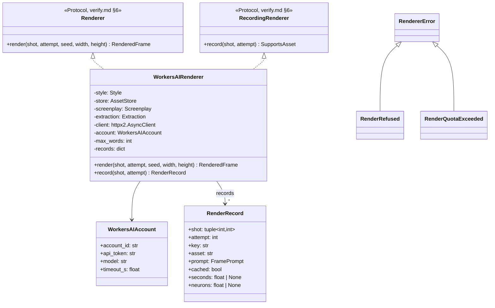

# Design — `renderer` (FLUX.2 [klein] 4B on Cloudflare Workers AI)

**Status:** proposed · **Owner:** Katlego (Claude) · **Tasks:** T026 (retargeted: this renderer,
Supabase Storage, the storyboard job); T003 superseded · **Spec:** [SPEC.md](../../SPEC.md) US1, US3
· **Replaces:** storyboard.md's ComfyUI renderer (§3.3 draw size and render key, §4's ComfyUI calls,
§6 `workflow.py` and `ComfyRenderer`, the `COMFYUI_*` environment). Everything else in
storyboard.md (prompts, styles, `build_storyboard`, the document) stands unchanged.

---

## 1. What this covers

The image model behind verify.md §6's `Renderer` Protocol, and so behind every frame the app draws:
the storyboard's (T026), "Try another render" (T021) and the comic's panels (T064). One class,
`WorkersAIRenderer`, sends a shot's grounded prompt (storyboard.md §3.1, unchanged) to
**FLUX.2 [klein] 4B on Cloudflare Workers AI**, fits the image to the requested size, applies the
style's grayscale pass, stores it in Supabase Storage by a content address and returns it.

**Why the change.** The project has no cash budget: its only money is $25 of Token Factory credit,
which pays for model calls only (STATUS.md, 2026-10-08). Nebius AI Cloud is billed separately and
its free trial closed on 13 Jul 2026, so T003's ComfyUI GPU can't be paid for. Token Factory serves
no image model (docs/nebius-findings.md U5, re-checked 2026-10-08). Workers AI's free allocation
(10,000 neurons a day, no card) is the one image budget the project has.

**Not covered:** the prompt (storyboard.md §3.1), the audit and the loop (verify.md), the storyboard
job and document (storyboard.md §4–§6), the comic job (comic.md §4a), reference portraits (T025,
characters.md; see §10 for what this model changes there), spend caps on the hosted demo (T030).

## 2. Reference material

| Kind | Where |
| --- | --- |
| The trial (2026-10-09) | `services/api/storage/render-trial/` (git-ignored; tools `probe.py`, `klein.py`, `audit.py`, `comic.py`, `pages.py`; every call in `cloudflare/calls.jsonl` with its `cf-ai-neurons` header). Findings in §8 |
| The model | `@cf/black-forest-labs/flux-2-klein-4b`, <https://developers.cloudflare.com/workers-ai/models/flux-2-klein-4b/>: multipart form input (`prompt`, `width`, `height`, `seed`, `input_image_0..3`), fixed 4 steps, returns `{"result": {"image": <base64 JPEG>}}` |
| Pricing | <https://developers.cloudflare.com/workers-ai/platform/pricing/> (updated 2026-10-01): klein 4B 26.05 neurons per output 512 × 512 tile, 5.37 per input tile; 10,000 neurons a day free on Workers Free, reset 00:00 UTC; past it, requests fail |
| Errors | <https://developers.cloudflare.com/workers-ai/platform/errors/>: `3036` (429) daily free allocation used; `3040` (429) out of capacity, retry; `8007` (400) "Input prompt contains NSFW content" (seen in the trial, not in that table) |
| The seam | verify.md §6 `Renderer`, `RecordingRenderer`, `SupportsAsset`; `app/frames/attempt.py` `RendererFactory`; `app/main.py` `create_app(renderer_factory=…)` |
| Ported | nothing: FrameFlow had no Workers AI provider |

## 3. Domain model



### 3.1 Sizes

- **Draw size.** `draw_size(width, height)` scales the requested size to `NATIVE_AREA` (1024 × 1024 =
  1,048,576 px) at the same aspect, up or down, and rounds each side to a multiple of 16 (FLUX's
  latent step). The storyboard's 1280 × 720 draws at **1360 × 768**; a comic panel of any rect draws
  near one megapixel at its own aspect. Never above `NATIVE_AREA` + rounding, so a frame always
  costs the same (§3.3).
- **Fit.** The drawn image is scaled to **cover** the requested size and centre-cropped by the
  rounding excess only (at most a few pixels a side), so `RenderedFrame.width × height` is exactly
  what was asked (comic.md §4 step 6's size check holds). storyboard.md §3.3's `fit`, kept.
- **Post-processing**, after the fit: the style's grayscale pass (`ImageOps.grayscale`, then
  `autocontrast(cutoff=0.5)`), then PNG. The audit sees exactly the stored pixels (storyboard.md
  §3.3, unchanged).

### 3.2 The request

`POST https://api.cloudflare.com/client/v4/accounts/<CLOUDFLARE_ACCOUNT_ID>/ai/run/<RENDER_MODEL>`,
`Authorization: Bearer <CLOUDFLARE_API_TOKEN>`, `multipart/form-data` with exactly four fields, all
strings: `prompt` (`FramePrompt.text()` exactly: no weighting syntax, since FLUX reads
`(phrase:1.3)` as characters, and so no escaping of the script's own parentheses, which
storyboard.md §3.1 did only for ComfyUI's weights), `width` and `height` (the draw size), `seed` (verify.md's `seed_for(shot, attempt)`).
No negative prompt and no steps (klein is distilled to a fixed 4 steps with no guidance; a style's
`negative` and `emphasis` are ignored by this renderer, and `load_styles` still validates them).
Reference images (`input_image_0..3`) are T025's (§10).

### 3.3 Cost and the daily budget

- One frame at the draw size is 4 output tiles × 26.05 = **104.2 neurons** (measured: three calls at
  1280 × 720, `cf-ai-neurons: 104.20` each, 2026-10-09). Every frame, storyboard or panel, costs
  the same, because the draw size is always about one megapixel.
- The free allocation is **10,000 neurons a day** (00:00 UTC reset): **95 renders a day**. A
  storyboard of n shots takes n renders at best and 3n at worst (verify.md's `max_renders`); the
  21-shot demo script's comic took about 40 in the trial, so **about one project's storyboard and comic a
  day** fits, and the demo project must be rendered ahead and served from the cache (§3.4).
- **Each render's neurons are recorded** in its `RenderRecord.neurons` (the response's
  `cf-ai-neurons` header) and logged at `INFO` with the shot and attempt, so a day's spend can be
  read from the API's logs. No database column (a later task can add one if T030 needs a cap).

### 3.4 The render key and the cache

- **Key**: `sha256` of the canonical JSON (sorted keys, no whitespace) of
  `{"model", "prompt", "seed", "width", "height"}` (the four form fields as sent, plus the model),
  then, each after a `"\x1f"`: the **requested** `<width>x<height>`, `RENDER_VERSION` and the
  post-processing step (`grayscale` or `none`). Every input that changes the stored pixels is in it.
- **The store is the cache** (storyboard.md §3.3, unchanged): `frames/<key>.png`; `exists` before
  any call; a hit is read back with `cached = True`, `neurons = None` and no call. Because the seed
  is `seed_for(shot, attempt)`, each attempt has its own key: a rerun of a job (or the demo) is all
  hits and costs nothing, and a re-render is a new key.
- **Not reproducible from the seed.** Workers AI accepts the seed but the same request returns a
  different image (trial: mean absolute pixel difference 39.7 of 255 between two calls with seed 1,
  50.8 between seeds 1 and 2). So the **stored PNG is the reproduction**, not the seed: an attempt
  is reproducible because its key always reads back the same bytes. The seed still goes in the
  request (it varies attempts) and in `frame_audits.seed` (verify.md, unchanged).

## 4. Flow

```mermaid
sequenceDiagram
    participant V as render_until_accepted (verify.md)
    participant R as WorkersAIRenderer
    participant P as build_frame_prompt
    participant T as AssetStore (Supabase Storage)
    participant W as Workers AI (flux-2-klein-4b)
    V->>R: render(shot, attempt, seed_for(shot, attempt), width, height)
    R->>P: shot, screenplay, extraction, style, max_words
    P-->>R: FramePrompt (or PromptError → RendererError)
    R->>R: draw_size; render key
    R->>T: exists(frames/key.png)?
    alt cached
        T-->>R: PNG
        R->>R: record(cached = True, neurons = None)
    else not cached
        loop up to 3 tries (§4 retries)
            R->>W: POST multipart prompt, width, height, seed
            W-->>R: 200 {"result": {"image": base64}} · or an error
        end
        R->>R: decode; fit to width × height; grayscale; PNG
        R->>T: put(frames/key.png)
        R->>R: record(cached = False, seconds, neurons from cf-ai-neurons)
    end
    R-->>V: RenderedFrame(shot, attempt, seed, png, width, height, prompt text)
```

**Retries, inside one `render` call** (the attempt number never changes for them):

| Response | Meaning | What `render` does |
| --- | --- | --- |
| 200 with `result.image` | drawn | decode, fit, store, return |
| 200 without an image, or an image that won't decode | broken response | retry |
| transport error or timeout (`RENDER_TIMEOUT_S`, default 120) | no answer | retry |
| 5xx, or 429 with code `3040` | out of capacity | retry |
| 400 with code `8007` | the NSFW filter refused the prompt | retry (the filter is not deterministic: shot 3.4's prompt passed once and was refused twice) |
| 429 with code `3036` | the day's free neurons are used | raise `RenderQuotaExceeded` at once, no retry |
| 401, 403, any other 4xx | configuration (token, account, model) | raise `RendererError` at once |

Up to **3 tries**, waiting 2 s then 8 s between them. When the tries run out: `RenderRefused` if the
last answer was `8007`, else `RendererError`. Each raise names the shot, the attempt and Cloudflare's
code and message (never the token).

**Failure paths** (storyboard.md §4's, with this renderer's errors):

- `RendererError` and its subclasses → verify.md's `FAILED` → the storyboard job fails naming the
  shot (storyboard.md §4), the comic job fails `COMIC_RENDER_FAILED` (comic.md §4a), "Try another
  render" fails the frame `render` (T021). Frames already stored stay; a rerun pays only for the
  rest. No fallback model and no placeholder image (storyboard.md §8).
- `RenderQuotaExceeded` is logged as `the day's free Workers AI neurons are used (resets 00:00 UTC)`.
  Its user-facing wording is §10's open question (a web.md change, Tumo's lane); until then the
  existing failed-frame and failed-job wordings show.
- `StorageError` on `exists` or `put` → the job fails (storyboard.md §4, unchanged).

## 5. State

None of its own. A frame's lifecycle is verify.md §5, unchanged; a render is one call inside
`RENDERING`. The renderer's `records` live for one renderer, which `RendererFactory` makes fresh per
job or attempt (app/frames/attempt.py).

## 6. Contracts

```python
# app/storyboard/render.py  (replaces storyboard.md §6's workflow.py and ComfyRenderer)
NATIVE_AREA: int = 1024 * 1024
RENDER_VERSION: int = 2                  # 1 was ComfyUI's; bump whenever fit, draw_size or post-processing changes
TILE: int = 512 * 512                    # Workers AI's billing tile

def draw_size(width: int, height: int) -> tuple[int, int]: ...
#   scale to NATIVE_AREA at the same aspect (up or down), each side round(side * s / 16) * 16, at least 16;
#   draw_size(1280, 720) == (1360, 768)
def fit(image: Image.Image, width: int, height: int) -> Image.Image: ...   # cover + centre-crop, exact size (storyboard.md §3.3)
def render_key(model: str, prompt: str, seed: int, draw: tuple[int, int], requested: tuple[int, int],
               postprocess: str) -> str: ...                               # sha256 hex, §3.4

class RendererError(RuntimeError): ...
class RenderRefused(RendererError): ...          # Workers AI 8007 on every try
class RenderQuotaExceeded(RendererError): ...    # Workers AI 3036: the day's free neurons are used

@dataclass(frozen=True)
class WorkersAIAccount:
    account_id: str
    api_token: str
    model: str = "@cf/black-forest-labs/flux-2-klein-4b"
    timeout_s: float = 120.0
    @classmethod
    def from_settings(cls, settings: Settings) -> "WorkersAIAccount | None": ...   # None unless both CLOUDFLARE_* are set

@dataclass(frozen=True)
class RenderRecord:
    shot: tuple[int, int]; attempt: int; key: str; asset: str; prompt: FramePrompt
    cached: bool; seconds: float | None; neurons: float | None

class WorkersAIRenderer:                         # implements app.verify.RecordingRenderer
    def __init__(self, *, style: Style, store: AssetStore, screenplay: Screenplay, extraction: Extraction,
                 client: httpx2.AsyncClient, account: WorkersAIAccount, max_words: int,
                 retry_waits_s: tuple[float, ...] = (2.0, 8.0)) -> None: ...   # len + 1 = tries; tests pass (0, 0)
    async def render(self, shot: Shot, attempt: int, seed: int, width: int, height: int) -> RenderedFrame: ...
    def record(self, shot: tuple[int, int], attempt: int) -> RenderRecord: ...   # KeyError if not rendered

def renderer_factory(settings: Settings, store: AssetStore | None, client: httpx2.AsyncClient,
                     styles: StyleRegistry) -> RendererFactory | None: ...
#   None unless WorkersAIAccount.from_settings and store are both set; else
#   lambda screenplay, extraction: WorkersAIRenderer(style=styles.get(None), store=store, …,
#   max_words=settings.render_max_words). create_app calls it in the lifespan with its shared client
#   and assigns app.state.renderer_factory, unless a test passed renderer_factory.
```

`build_storyboard` (storyboard.md §6) takes `renderer: RecordingRenderer` instead of `ComfyRenderer`;
nothing else in its signature changes. `RenderedFrame.prompt` is `FramePrompt.text()` as sent.

**Environment** (`.env.example`, `config.py`, deploy.md §6; `COMFYUI_URL` and `COMFYUI_MAX_WORDS` are
removed):

| Variable | Where | What |
|---|---|---|
| `CLOUDFLARE_ACCOUNT_ID` | API | the Workers AI account |
| `CLOUDFLARE_API_TOKEN` | API, secret | a token with the Workers AI permission only |
| `RENDER_MODEL` | API | default `@cf/black-forest-labs/flux-2-klein-4b` |
| `RENDER_TIMEOUT_S` | API | per call, default 120 |
| `RENDER_MAX_WORDS` | API | the prompt word budget (storyboard.md §3.1), default **120** (klein's Qwen3 text encoder reads well past CLIP's 77 tokens; the trial ran 120). Replaces `COMFYUI_MAX_WORDS` |

On the hosted API (deploy.md, Render) the two `CLOUDFLARE_*` values are set as secrets; without them
the factory is `None` and the render routes answer 503, as today.

## 7. Structure

| Path | New? | Responsibility | Task |
| --- | --- | --- | --- |
| `services/api/app/storyboard/render.py` | new | §6: `draw_size`, `fit`, `render_key`, the errors, `WorkersAIAccount`, `RenderRecord`, `WorkersAIRenderer`, `renderer_factory` | T026 |
| `services/api/app/storyboard/{model,build,run}.py` | new | storyboard.md §6 (`build_storyboard` on `RecordingRenderer`); `run` prints each render's neurons and the total | T026 |
| `services/api/app/main.py` | changed | the lifespan calls `renderer_factory(...)` when none was passed | T026 |
| `services/api/app/projects/pipeline.py` | changed | the RENDERING stage (storyboard.md §7, unchanged) | T026 |
| `services/api/app/core/config.py`, `.env.example`, `docs/design/deploy.md` §6 | changed | §6's environment; `comfyui_max_words` → `render_max_words` (T008's `prompts.py` reads the new name) | T026 |
| `services/api/tests/storyboard/test_render.py` | new | §9 | T026 |
| `infra/comfyui/`, `infra/nebius/` | not built | T003 superseded (§8) | — |

## 8. Decisions & alternatives

| Decision | Chosen | Rejected, and why |
|---|---|---|
| Where images are drawn | Workers AI, free allocation | ComfyUI on a Nebius AI Cloud GPU (T003): L40S at $1.55/h, billed outside Token Factory, no trial since 13 Jul 2026, and the project has no cash. A laptop GPU: the team's AMD Barcelo iGPU can't run a 4B+ diffusion model usefully. build.nvidia.com's free FLUX endpoint: every trial call timed out in its queue (2026-10-09) |
| Which model | FLUX.2 [klein] 4B | FLUX.1 [schnell] on Workers AI (the first trial): **1024 × 1024 only** (no `width`/`height`), refuses a seed (HTTP 400, code 5006), 172.8 neurons a frame, so a 16:9 frame is a crop of a square that loses a third of the picture and needs an upscale; it also wrote artist signatures in the corners. klein draws the requested aspect natively, takes a seed, costs 104.2 neurons, and its trial frames (shot 2.1, two seeds) had no signature and staged the action as written. FLUX.2 [dev]: 37.5 neurons per output tile *per step* at 25 steps, ~3,750 a frame. klein 9B: 1,363.6 neurons for the first megapixel. Leonardo models: 530–636 per tile |
| One draw size | about one megapixel at the requested aspect, then fit | drawing at the requested size: a comic panel can be 2–3 MP, so 2–3× the neurons for pixels the page scales anyway; a fixed 1024²: a crop for every non-square panel |
| Seeds | `seed_for(shot, attempt)` sent, recorded, part of the key | no seed: attempts would only differ by luck, and the key couldn't tell attempts apart. **Cost:** not reproducible from the seed (§3.4); the stored PNG is |
| The NSFW refusal | retried inside `render`, then `RenderRefused` (`FAILED`) | treating it as `WITHHELD`: that changes verify.md's state machine (§10). Rewording the prompt: the prompt is grounded words only (storyboard.md §3.1); the renderer never edits it |
| Daily budget | fail loudly on `3036`; record neurons per render | a pre-flight budget check: Workers AI exposes no "remaining today" call, and a local count drifts from the account's (other tools, the dashboard). The Workers Paid plan: $5 a month, no cash |
| Negative prompt, emphasis | not sent | klein has no negative input and FLUX doesn't parse `(x:1.3)`; sending them would put literal text in the prompt |
| Multipart | `httpx2` `files=` with `(None, value)` fields | JSON body: klein accepts multipart only (Cloudflare's docs; schnell takes JSON) |

## 9. How this is verified

No network in the gate: `httpx2.MockTransport` for Workers AI, an in-memory `AssetStore`.

- `draw_size`: `(1280, 720) → (1360, 768)`; a tall panel and a wide one each within `NATIVE_AREA` ±
  rounding, multiples of 16, aspect within 2 %.
- `render_key`: changes with each of model, prompt, seed, draw size, requested size,
  `RENDER_VERSION`, post-processing; stable under dict ordering.
- `render`, the request: one multipart POST to the account's URL with exactly `prompt`, `width`,
  `height`, `seed`; the bearer token in the header and nowhere in a raised message or log line.
- `render`, the result: the PNG is exactly `width × height`, grayscale for a grayscale style, stored
  at `frames/<key>.png`; the record has the asset, `cached = False` and the `cf-ai-neurons` value.
- Cache: a second `render` of the same shot and attempt makes no request (`cached = True`, the same
  bytes); a different attempt makes one.
- Retries (§4's table, one test per row): `3040` then 200 → one frame, two requests; `8007` × 3 →
  `RenderRefused` after three requests; `3036` → `RenderQuotaExceeded` after one; 401 → `RendererError`
  after one; a timeout then 200 → a frame.
- `renderer_factory`: `None` without either `CLOUDFLARE_*` or without a store; else a factory whose
  renderers use the default style.
- **Live** (owner's go-ahead; about 21–60 renders, 2,200–6,300 of a day's neurons, plus the audits'
  Token Factory credit): `uv run python -m app.storyboard.run samples/the-red-kite.pdf --out /tmp/sb`
  ends with every shot `passed`, `warned` or `withheld`, every attempt's frame in the dev bucket and
  the neurons printed; run again, it renders nothing (every frame a hit).

## 10. Open questions

- [ ] **The NSFW refusal as a withheld frame?** A refusal is the model declining harmless grounded
  words (shot 3.4: "…a person stares at the empty spool in her hands."). As `FAILED` it stops the
  whole storyboard job. verify.md could treat `RenderRefused` like an audit error (the attempt is
  logged, the next attempt is tried, the frame ends `WITHHELD` with a `refused` reason). A verify.md
  change in Tumo's lane (`loop.py`), its own PR; this design works without it.
- [ ] **Wording for the daily budget** (web.md, Tumo's lane): e.g. "Today's free drawing budget is
  used up. Frames already drawn are kept; try again after 02:00 SAST." for a job or frame that ended
  on `RenderQuotaExceeded`. Needs `FrameView.failure` (or the job error) to say which.
- [ ] **T025 on this model**: klein takes up to four reference images (`input_image_0..3`, each
  under 512 × 512, 5.37 neurons per input tile). That replaces characters.md's IP-Adapter graphs
  (`frame_ref1.json`, `frame_ref2.json`) with two form fields, and it is the fix for the trial's
  worst problem: a character drawn as a different person in every panel. characters.md changes in
  T025's own design PR.
- [ ] **The demo's daily budget**: one project a day on the free allocation. The hosted demo shows
  `the-red-kite` from the cache; a judge uploading a new script spends that day's neurons. T030
  decides whether new uploads are allowed on the hosted demo, or capped per day.
- [ ] **The audit on real frames** (T049): the trial's audit withheld about half of the schnell
  frames, mostly for `unscripted_object` (background clutter) and `text_in_frame`. klein's cleaner
  frames may change that; T049 measures it on this renderer.
