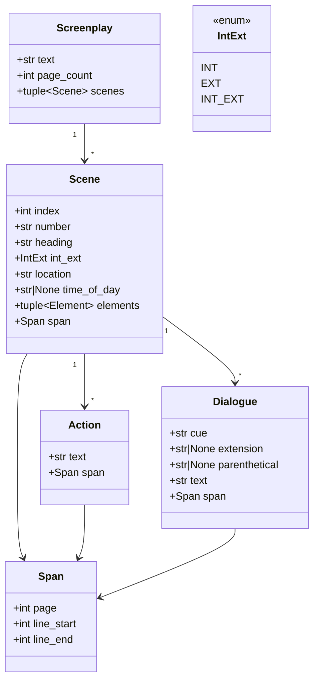
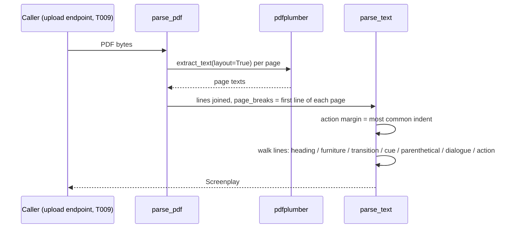

# Design — `script` (screenplay parsing; lane `script+grounding`)

**Status:** agreed · **Owner:** Katlego (Claude) · **Tasks:** T005 · **Spec:** [SPEC.md](../../SPEC.md)
US1 (script → grounded storyboard)

---

## 1. What this covers

Turning a screenplay PDF into ordered, typed scenes where **every piece of text carries the page
and lines it came from**. This is the foundation of Non-negotiable I: a panel can only trace back to
a verbatim span if the parser kept one. Also here: resolving a scene's clock when the heading
borrows it (`CONTINUOUS`), and matching a dialogue cue to an extracted character name.

**Not covered:** storage (no DB models yet, so everything here is a pure function over values),
entity extraction and the grounding filter (T006, `docs/design/grounding.md`), shots (T007).

## 2. Reference material

| Kind | Where |
| --- | --- |
| Code ported from | FrameFlow `services/api/app/services/screenplay_parser.py` (margin-based classification, heading regex, page-furniture filter), `scene_time.py` (absolute/relative times), `dialogue_linker.py` (`normalise`, `match_speaker`) |
| Test fixture | a self-written 3-scene screenplay, rendered to PDF in the test with fpdf2 at standard screenplay margins. No copyrighted script, ever (PLAN.md constraints) |
| External | pdfplumber `extract_text(layout=True)`; screenplay format conventions (action at the margin, cue ~3.7", dialogue ~2.5", parenthetical ~3.1") |

## 3. Domain model



- **`Screenplay.text`** is the extracted text, one line per layout row, pages joined in order. It is
  the source every `Span` indexes, and the text grounding (T006) checks quotes against.
- **`Span`**: `page` is 1-based (the page of `line_start`); `line_start`/`line_end` are 1-based,
  inclusive line numbers in `Screenplay.text`. `Screenplay.text.splitlines()[line_start-1:line_end]`
  is the exact source of the element, verbatim.
- **`Scene.elements`** keeps action and dialogue **in script order** (a comic needs the
  interleaving). Consecutive action lines form one `Action` until a blank line or a non-action
  line. Consecutive dialogue lines under one cue form one `Dialogue`; a parenthetical starts a new
  one for the same cue. Wrapped lines are joined with a single space.
- **`Scene.number`**: the number printed in the script ("12A") when there is one, else the 1-based
  sequence. `index` is always the 0-based position.
- **`time_of_day`** is the heading's time as written, upper-cased (`NIGHT`, `CONTINUOUS`), or
  **`None` when the heading gives none**. FrameFlow defaulted to `DAY`, which states a fact the
  script doesn't.
- **`Dialogue.cue`** is the name only ("WAYNE"); `extension` is the cue's bracket ("O.S.", "V.O.",
  "CONT'D") or `None`.

## 4. Flow



**Classification** (per non-blank line; page furniture — `(CONTINUED)`, `CONTINUED: (2)`, `(MORE)`,
bare page numbers — is dropped whole. A line is never rewritten, so an element's text is always
exactly the lines its span names):
1. Scene heading (`INT`/`EXT`/`INT/EXT`/`EXT/INT`, dot optional; optional scene number on the
   left) → new scene. The number repeated at the right edge is dropped only when it sits after a
   layout gap of 2+ spaces, so `INT. ROOM 1` keeps its "1".
2. Before the first heading → ignored (title page).
3. Transition (`CUT TO:`, `FADE OUT.`, `DISSOLVE TO:` …) → dropped; it is editing, not content.
4. Indented past the action margin + 4:
   parenthetical `(…)` → attaches to the current cue; all-caps ≤ 5 words **at the cue column**
   (within 2 of the last cue's indent; any column for the first cue) → cue; otherwise, under a cue
   → dialogue. The cue-column rule keeps a shouted "NO!" at the dialogue column from reading as a
   new speaker.
5. Anything else → action (and it ends the current cue).
A blank line ends the current action paragraph and the current cue. A page break ends the current
element but keeps the speaker, so dialogue continuing onto the next page stays dialogue.

**Action margin:** the column scene headings start at (they always sit at the action margin); only
without headings, the most common indent. FrameFlow used the most common indent alone, which in a
dialogue-heavy script is the dialogue column.

**Failure paths:** a PDF with no text layer (a scan) → `ScriptParseError("no text layer")`, never an
empty screenplay that looks like success. No scene heading anywhere → `ScriptParseError("no scene
headings")`. A malformed PDF → `ScriptParseError` wrapping pdfplumber's error type only.

## 5. State

None. Values in, values out.

## 6. Contracts

```python
# app/script/model.py
class IntExt(StrEnum): INT = "INT"; EXT = "EXT"; INT_EXT = "INT/EXT"
@dataclass(frozen=True) class Span: page: int; line_start: int; line_end: int
@dataclass(frozen=True) class Action: text: str; span: Span
@dataclass(frozen=True) class Dialogue: cue: str; extension: str | None; parenthetical: str | None; text: str; span: Span
type Element = Action | Dialogue
@dataclass(frozen=True) class Scene: index: int; number: str; heading: str; int_ext: IntExt; location: str; time_of_day: str | None; elements: tuple[Element, ...]; span: Span
@dataclass(frozen=True) class Screenplay: text: str; page_count: int; scenes: tuple[Scene, ...]
class ScriptParseError(ValueError): ...

# app/script/parser.py
def parse_pdf(data: bytes) -> Screenplay: ...
def parse_text(text: str, page_breaks: Sequence[int] = ()) -> Screenplay: ...
#   page_breaks: 1-based line numbers where pages 2, 3, … begin; () means one page.

# app/script/scene_time.py
ABSOLUTE_TIMES: frozenset[str]; RELATIVE_TIMES: frozenset[str]
def absolute_time(value: str | None) -> str | None: ...
def resolve_times(scenes: Sequence[Scene]) -> list[str | None]: ...
#   one entry per scene: its own absolute time, else the nearest earlier scene's, else None.

# app/script/speakers.py
def normalise(name: str) -> str: ...
def match_speaker(cue: str, names: Sequence[str]) -> str | None: ...
#   exact normalised match wins; else the cue's words ⊆ exactly one name's words; ambiguous → None.
```

## 7. Structure

| Path | New? | Responsibility |
| --- | --- | --- |
| `services/api/app/script/__init__.py` | new | re-exports §6 |
| `services/api/app/script/model.py` | new | the dataclasses and `ScriptParseError` |
| `services/api/app/script/parser.py` | new | `parse_pdf`, `parse_text` |
| `services/api/app/script/scene_time.py` | new | `absolute_time`, `resolve_times` |
| `services/api/app/script/speakers.py` | new | `normalise`, `match_speaker` |
| `services/api/tests/script/` | new | unit tests on layout text; an end-to-end test on a PDF built with fpdf2 |

## 8. Decisions & alternatives

| Decision | Chosen | Rejected, and why |
| --- | --- | --- |
| Source positions | page + line range per element | FrameFlow's none: Non-negotiable I needs a verbatim span per panel |
| Element order | one ordered `elements` tuple | FrameFlow's separate action/dialogue lists: loses the interleaving a comic page needs |
| Wrapped lines | joined into one element | FrameFlow's one entry per printed line: a speech bubble needs the whole speech |
| Missing time of day | `None` | FrameFlow's `DAY` default: invents a fact |
| Page numbers | real, from per-page extraction | FrameFlow's proportional estimate: a span must point at the actual page |
| Eighths / page-length estimates | dropped | scheduling data; Panelwise doesn't schedule |
| DB linking (`link_project_dialogue`) | not ported | no models yet; `match_speaker` is the reusable part and T006/T023 call it |
| Parser | pdfplumber layout text | Docling: truncated a 150-page script to a third (FrameFlow T283) |

Deviations from [docs/architecture-defaults.md](../architecture-defaults.md): none.

## 9. How this is verified

- Layout-text unit tests: every classification rule in §4, each field in §3 (including `None` time,
  cue extensions, parenthetical splitting, wrapped-line joining, furniture and transitions dropped,
  scene numbers on either side), and **every element's `Span` slicing back to text that contains the
  element's words**.
- End-to-end: a 3-scene, 2-page self-written screenplay rendered to PDF with fpdf2 parses into the
  expected scenes, with the second-page element reporting `page == 2`.
- Error paths: an image-only PDF and a text with no headings raise `ScriptParseError`.
- `resolve_times` and `match_speaker` tables, including the ambiguous-cue case.

## 10. Open questions

- [ ] A parenthetical that wraps onto two lines (`(quietly, almost` / `to herself)`) is read as
  dialogue text. Spans stay exact; only the typing is wrong. Fix if a sample script needs it.
- [ ] Dual dialogue (two speakers side by side) is not detected; both columns read as one speaker's
  lines or as action. Rare in the scripts we'll demo; revisit if a sample needs it.
