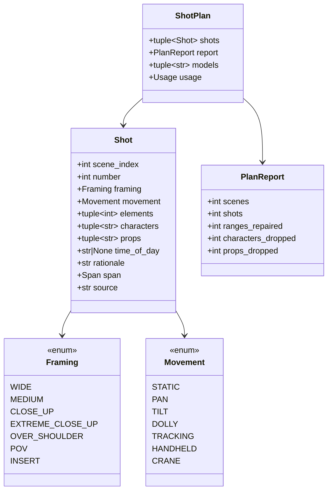

# Design — `shots` (the shot planner)

**Status:** agreed · **Owner:** Katlego (Claude) · **Tasks:** T007 · **Spec:** US1 (script → grounded
storyboard); SPEC.md's stories are still the template

---

## 1. What this covers

Turning each parsed scene (docs/design/script.md) plus its grounded entities
(docs/design/grounding.md) into an ordered list of **shots**: one storyboard frame, or one comic
panel, each. A shot says which of the scene's elements it covers, how it is framed, and which
extracted characters and props are in it. **Every shot traces back to a verbatim span**
(Non-negotiable I), and every element of a scene lands in exactly one shot, so no line of dialogue
is left without a panel.

**Not covered:** the image prompt and rendering (T008), comic page layout and panel sizing (T022),
the frame audit (T020).

## 2. Reference material

| Kind | Where |
| --- | --- |
| Code ported from | FrameFlow `services/api/app/services/shot_service.py` (the shot-list call, the camera vocabularies, the explicit time of day) |
| What FrameFlow learned | a `CONTINUOUS` heading with no clock made the model write "soft overcast light" into a night scene → the resolved time of day goes in explicitly (`resolve_times`) |
| Inputs | `Screenplay`, `Scene`, `Element`, `Span` (script.md §6); `Extraction`, `Entity` (grounding.md §6) |
| LLM seam | `structured_chat`, `Tier.FAST` (llm.md §6) |

## 3. Domain model



- **`elements`**: 0-based indexes into `scene.elements`, contiguous and ascending. Across one
  scene's shots they **partition** the elements: each element in exactly one shot, in order.
- **`span`** runs from the first covered element's `line_start` to the last one's `line_end`;
  `page` is the first element's. A scene with no elements gets one shot with `elements == ()`
  and the heading's span.
- **`source`**: the covered elements' texts, verbatim, one per line; the heading for an empty
  scene. This is the text a panel cites.
- **`characters` / `props`**: entity names from the extraction, **only** entities present in this
  scene (`scene_index in entity.scenes`). The model proposes names; anything not matching an
  allowed entity (`match_speaker`, so "Thabo" finds "THABO MOLEFE") is dropped and counted.
- **`time_of_day`**: `resolve_times(screenplay.scenes)[scene_index]`, never the model's.
- **`rationale`**: the model's one-line reason for the framing. Metadata for the reader, never
  drawn and never used in an image prompt.
- **No free-text frame description.** FrameFlow asked for composition, lighting and placement in
  prose, and that is where invention lives. The image prompt (T008) is built from the grounded
  fields above plus the entities' quotes.

## 4. Flow

```mermaid
sequenceDiagram
    participant C as Caller
    participant P as plan_shots()
    participant M as structured_chat (FAST)
    C->>P: Screenplay, Extraction, NebiusChatModel
    P->>P: resolve_times; per scene, the characters and props present in it
    par each scene with ≥1 element (≤ concurrency at once)
        P->>M: system prompt + render_scene(scene, characters, props, time) → ScenePlan
        M-->>P: proposed shots (first, last, framing, movement, characters, props, rationale)
    end
    P->>P: normalise_ranges → a partition of the elements; filter names to allowed entities
    P->>P: build Shot (span, source, time_of_day) per range; empty scenes get one wide static shot
    P-->>C: ShotPlan
```

**`normalise_ranges(proposed, n)`**, deterministic, so a sloppy model answer still yields a valid
partition: clamp each `(first, last)` to `[0, n-1]` and swap reversed pairs; sort by `first`; walk
in order with `next = 0`: a range wholly before `next` is dropped; otherwise it starts at `next`
(a gap is absorbed by the shot after it, an overlap trimmed) and ends at `max(start, last)`. After
the walk, any uncovered tail extends the last shot; with no usable range at all, one shot covers
the whole scene. Every change from the proposal counts as one repair.

**Failure paths:** a scene's call fails (an `LLMError`, or a `ValidationError` after the repair
retry) → `ShotError` naming the scene number, and the whole plan fails; a storyboard with a silent
hole is worse than a loud failure. Names the model invents are dropped, never shown, and counted
in the report.

## 5. State

None. `plan_shots` is a pure async function of its inputs plus the model calls.

## 6. Contracts

```python
# app/shots/model.py
class Framing(StrEnum): WIDE = "wide"; MEDIUM = "medium"; CLOSE_UP = "close_up"; EXTREME_CLOSE_UP = "extreme_close_up"; OVER_SHOULDER = "over_shoulder"; POV = "pov"; INSERT = "insert"
class Movement(StrEnum): STATIC = "static"; PAN = "pan"; TILT = "tilt"; DOLLY = "dolly"; TRACKING = "tracking"; HANDHELD = "handheld"; CRANE = "crane"
@dataclass(frozen=True) class Shot: scene_index: int; number: int; framing: Framing; movement: Movement; elements: tuple[int, ...]; characters: tuple[str, ...]; props: tuple[str, ...]; time_of_day: str | None; rationale: str; span: Span; source: str
@dataclass(frozen=True) class PlanReport: scenes: int; shots: int; ranges_repaired: int; characters_dropped: int; props_dropped: int
@dataclass(frozen=True) class ShotPlan: shots: tuple[Shot, ...]; report: PlanReport; models: tuple[str, ...]; usage: Usage
class ShotError(RuntimeError): ...

# app/shots/schema.py — what the model is asked for (strict json_schema)
class ProposedShot(BaseModel): first: int; last: int; framing: Framing; movement: Movement; characters: list[str]; props: list[str]; rationale: str
class ScenePlan(BaseModel): shots: list[ProposedShot]

# app/shots/planner.py
def normalise_ranges(proposed: Sequence[tuple[int, int]], n: int) -> tuple[list[tuple[int, int]], int]: ...   # (partition, repairs)
def render_scene(scene: Scene, characters: Sequence[str], props: Sequence[str], time_of_day: str | None) -> str: ...
async def plan_shots(model: NebiusChatModel, screenplay: Screenplay, extraction: Extraction, *,
                     concurrency: int = 4, temperature: float = 0.0) -> ShotPlan: ...
```

`render_scene` numbers the elements `[0]`, `[1]`, … (an action as its text; a speech as `CUE
(extension) (parenthetical): text`), states the bounds ("4 elements, [0] to [3]: no shot goes past
[3], and at most 4 shots."; without it the model padded a one-element scene with six shots), then lists "Characters in this scene" and "Props in this
scene" (only the allowed names) and "Time of day" when known. The system prompt asks for 1 to 6
shots per scene, never more than the elements, that together cover every element in order, with the framing and movement
vocabularies above.

## 7. Structure

| Path | New? | Responsibility |
| --- | --- | --- |
| `services/api/app/shots/{__init__,model,schema,planner}.py` | new | §6 |
| `services/api/app/shots/run.py` | new | `python -m app.shots.run <script.pdf>`: parse, extract, plan on the real account; print each shot with its span and source |
| `services/api/tests/shots/` | new | `normalise_ranges` (pure), name filtering, `plan_shots` with `httpx2.MockTransport` |

## 8. Decisions & alternatives

| Decision | Chosen | Rejected, and why |
|---|---|---|
| Frame description | none; grounded fields only | FrameFlow's free-text `storyboard_description`: invented lighting and details, e.g. "soft overcast light" in a night scene |
| Coverage | every element in exactly one shot | shots cherry-picking moments: a comic would drop lines of dialogue |
| Bad ranges from the model | repaired deterministically, counted | rejecting the answer: a retry costs a call and can fail the same way; the repair can't invent anything, it only regroups real elements |
| Names in a shot | only extracted entities present in the scene | trusting the model: the one place a shot could smuggle in someone the script never put there |
| Separate size and angle fields | one `framing` field (FrameFlow's merged list, plus `insert`) | size × angle: twice the vocabulary for storyboard frames that don't need it |
| No-model fallback shots | none | FrameFlow's hard-coded shots: a placeholder (AGENTS.md §2a) |
| Cache | none | FrameFlow's Redis cache: Redis is gone (deploy.md); revisit with the `Job` table if repeat runs cost too much |

Deviations from [docs/architecture-defaults.md](../architecture-defaults.md): none.

## 9. How this is verified

- `normalise_ranges`: gaps, overlaps, reversed and out-of-bounds pairs, fully covered duplicates,
  an empty proposal, and a property check that the output is always a partition of `range(n)`.
- Planning with `httpx2.MockTransport`: one call per non-empty scene on `Tier.FAST` with thinking off
  and a strict `json_schema`; empty scenes get a shot without a call; invented names dropped and
  counted; `time_of_day` from `resolve_times`, even when the model says otherwise; spans and `source`
  match the covered elements exactly; a failing scene fails the plan with its number.
- Live: `python -m app.shots.run` on the sample script, on the real account.

## 10. Open questions

- [ ] Shots per scene (1 to 6) is a prompt instruction, not enforced. Panel sizing (T022) may want
  a hard cap; revisit then.
