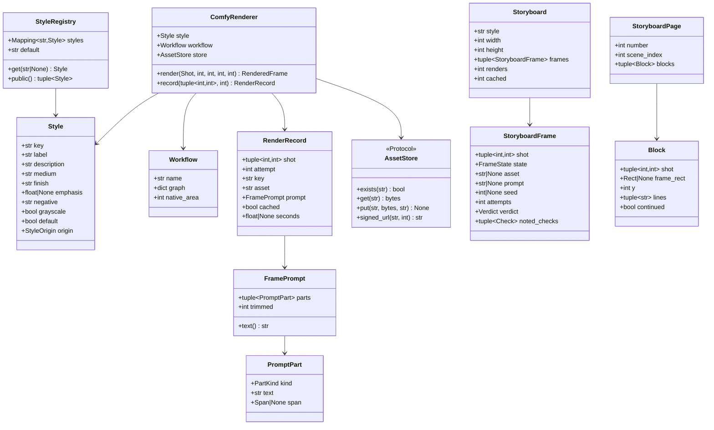

# Design — `storyboard` (frames, styles, the image chain, the storyboard PDF)

**Status:** draft · **Owner:** Katlego (Claude) · **Tasks:** T008 (blocked on T003's GPU and T021's
loop) · **Spec:** [SPEC.md](../../SPEC.md) US1 (script → grounded storyboard)

---

## 1. What this covers

Turning a `ShotPlan` (shots.md) into a **storyboard**: one frame per shot, rendered by ComfyUI on
the Nebius GPU in a chosen **style**, audited by verify.md's loop before anyone sees it, stored in
**Supabase Storage**, and exported as one **PDF**. It owns four things:

1. **The frame prompt**: built only from the shot's grounded fields (§3.1). This is where
   Non-negotiable I is enforced on the *input* to the image model; verify.md enforces it on the
   output.
2. **The style registry**: public styles in `styles/`, an optional private pack from
   `PANELWISE_PRIVATE_STYLES`, the same validation for both.
3. **The ComfyUI renderer**: verify.md's `Renderer` Protocol, implemented against a committed
   workflow graph; each render stored by a content address, which is also the render cache.
4. **The storyboard document**: the page layout and the PDF, with the withheld-frame text card.

**Not covered:** the audit, the re-render loop, the frame state machine and the `frame_audits`
table (verify.md, T020/T021); reference portraits and IP-Adapter (characters.md, T025, which
extends this renderer); comic pages (comic.md, which calls this renderer at panel size); the ComfyUI
box itself (T003, `infra/nebius/`); the `Job` table and the web screens (T009); spend caps (T030).

## 2. Reference material

| Kind | Where |
| --- | --- |
| Code ported from | FrameFlow `services/api/app/services/`: `storyboard_service.py` (prompt assembly, `_setting`, `_ANGLE_WORDS`), `storyboard_styles.py` (the style dataclass, the three drawn styles and their A/B notes), `image_provider.py` (`ComfyUIImageProvider`: submit, poll `/history`, queue-aware deadline, cancel, `/view`), `image_postprocess.py` (`storyboard_grayscale`), `storyboard_document.py` (A4, two 16:9 frames a page, spec line under each). What is dropped and why: §8 |
| What FrameFlow learned | CLIP can't read negation ("no borders" drew borders); the setting reads best as "inside \<place\>, \<time\>" straight after the framing; SDXL-Turbo tints pencil frames sepia whatever the prompt says, so grayscale is a pixel pass; a free-text frame description is where invention lived (shots.md §8) |
| Inputs | `ShotPlan`, `Shot`, `Framing` (shots.md §6); `Screenplay`, `Scene`, `Action`, `Dialogue`, `Span`, `normalise` (script.md §6); `Extraction`, `Entity`, `Quote` (grounding.md §6) |
| Contract this provides | verify.md §6 `RenderedFrame` and `Renderer`, verbatim (built in `app/verify/model.py`, PR #22) |
| Contract this calls | verify.md §6 `render_until_accepted`, `seed_for`, `Audit`, `FrameOutcome`, `FrameState`, `Check`, `Verdict` |
| Character rules | characters.md §3 rules 1–3 (no names in prompts; only the script's words; undescribed stays undescribed) and its redaction |
| Hosting | deploy.md §1 (Supabase Storage for images), §6 (env), §10 (local Storage: decided here, §8) |
| ComfyUI | `infra/comfyui/workflows/` (committed API-format JSON, inputs set by node title: characters.md §6) |
| Visual reference | none yet. The first live run of `python -m app.storyboard.run` on the self-written sample commits its PDF pages as PNGs under `docs/design/reference/storyboard/`, the reference later changes are compared against (T008 Done) |
| Fonts | **Courier Prime** Regular and Bold (SIL OFL 1.1), committed under `services/api/assets/fonts/` with their licence: the screenplay's own typeface, and the PDF prints script text verbatim |

## 3. Domain model



`ComfyRenderer` implements verify.md's `Renderer`; `RenderedFrame` is verify.md's, unchanged.
`FrameState`, `Verdict` and `Check` are verify.md's. `Rect` is `(x, y, w, h)` in page pixels.

### 3.1 The frame prompt (Non-negotiable I on the input)

`build_frame_prompt` is a **pure function** of the shot, its scene, the extraction and the style. It
takes no free text: not the shot's `rationale` (shots.md: never used in a prompt), not a model's
output, not a user's note. A prompt is an ordered tuple of **parts**, each tagged with where it came
from, and `text()` joins them with `", "` (comma phrases, the way CLIP reads captions: FrameFlow's
finding). Every part is one of three origins:

| `PartKind` | Origin | Text | `span` |
|---|---|---|---|
| `STYLE` | the style (§3.2) | `medium` (weighted by the renderer when `emphasis` is set), then `finish` | `None` |
| `FRAMING` | a fixed table in code, keyed by `shot.framing` | `wide` → "wide shot", `medium` → "medium shot", `close_up` → "close-up", `extreme_close_up` → "extreme close-up", `over_shoulder` → "over-the-shoulder shot", `pov` → "point-of-view shot", `insert` → "close-up insert shot" | `None` |
| `SETTING` | the scene heading | `inside` / `outside` / `at` (from `scene.int_ext`: `INT`, `EXT`, `INT_EXT`) + `scene.location` lower-cased and name-redacted | the heading's span |
| `TIME` | `shot.time_of_day` (resolved, shots.md) | lower-cased; omitted when `None` | the heading's span |
| `COUNT` | code, from `len(shot.characters)` | 1 → "one figure", 2 → "two figures", 3 → "three figures", 4 → "four figures", ≥ 5 → "a group of figures"; omitted at 0 | `None` |
| `PLACEMENT` | characters.md `FrameReferences.placement` (a fixed phrase, never a name) | e.g. "one figure on the left, one on the right"; T008 always passes `None`, T025 passes it | `None` |
| `ACTION` | each covered `Action` element's text, in element order | verbatim, whitespace collapsed, name-redacted | the element's span |
| `DIRECTION` | each covered `Dialogue.parenthetical`, in element order | verbatim, name-redacted | the element's span |
| `CHARACTER` | for each of `shot.characters` in order: its **first** `described_by` quote (characters.md: a quote located in an `Action` element), unless that element is already covered by the shot | verbatim, name-redacted | the quote's span |
| `PROP` | for each of `shot.props` in order: its first quote located in an `Action` element **of this shot's scene**, unless that element is already covered | verbatim, name-redacted | the quote's span |

**The invariant** (tested, §9): for every part whose `span` is not `None`, its text (after the
`SETTING` part's leading preposition) is, under `normalize_for_grounding`, a substring of
`redact_all` applied to the element or heading at that span (lower-cased for `SETTING` and `TIME`);
every part whose `span` is `None` is from the fixed tables above or the style. So nothing in a
prompt is unscripted except the style's medium words and the code's fixed framing, preposition,
count and placement vocabulary, and none of those names a person, prop or event.

- **Dialogue text never enters a prompt.** Speech isn't visible, and words in a prompt are how
  letters appear in the art (verify.md's hard `TEXT_IN_FRAME`). The speakers are drawn because they
  are in `shot.characters` (the `COUNT` part) and, with T025, as reference figures.
- **Movement never enters a prompt.** A still can't show a pan; FrameFlow's movement words
  ("handheld", "tracking with the subject") read as motion blur. Movement is printed under the frame.
- **Names never enter a prompt** (characters.md rule 1). Every script-derived part goes through
  `redact_all`: every whole-word name token of every `CHARACTER` entity in the extraction, in UPPER
  or Title case, becomes `a person`. The location too ("NANDI'S KITCHEN" → "a person's kitchen").
  Redaction only removes words (characters.md rule 2); it is the one change a script span undergoes
  besides lower-casing the location and time and collapsing whitespace.
- **Undescribed stays undescribed** (characters.md rule 3): a character with no `described_by`
  quote contributes no `CHARACTER` part. Nothing is inferred.
- **Parentheses are escaped.** ComfyUI reads `(words)` as a weight, and screenplays are full of
  them ("NANDI (60s, oilskin coat)", every parenthetical). The renderer escapes `(` and `)` as `\(`
  and `\)` in every part but `STYLE` (whose weight it adds itself), so script text is never
  re-weighted.
- **No negations** (FrameFlow's finding: "no borders" drew borders). What must not appear is kept
  out by not being said, and caught by the audit. The style's `negative` goes to the negative prompt,
  which only subtracts.
- **Word budget.** The text encoder reads a limited prompt (CLIP: 77 tokens). When `text()` exceeds
  `max_words` (a property of the workflow, §6), whole parts are dropped, never cut mid-part, in this
  order: `CHARACTER` (last first), then `PROP` (last first), then `DIRECTION`, then `ACTION` from
  the last element backwards, keeping at least the first `ACTION` part. `STYLE`, `FRAMING`, `SETTING`,
  `TIME`, `COUNT` and `PLACEMENT` are never dropped. `trimmed` counts the dropped parts. Dropping can
  only remove script, never add to it; what's left is still grounded.

### 3.2 Styles

A style is **how** a frame is drawn, never **what** is in it. One TOML file per style, the file stem
is the key (`[a-z0-9-]+`):

```toml
# styles/clean.toml
label = "Clean sketch"
description = "Pencil storyboard at full size. Keeps a wide shot as one panel inside the location."
medium = "storyboard sketch, pencil drawing"
finish = "grayscale, monochrome, loose linework"
# emphasis = 1.3     # optional: ComfyUI weight on `medium` (FrameFlow's `ink` and `pencil` used 1.3)
negative = ""         # optional: negative prompt (subtractive only)
grayscale = true      # the pixel pass after rendering (FrameFlow's image_postprocess)
default = true        # exactly one PUBLIC style sets this
```

- **Public** styles are the files in the repo's `styles/`; **private** ones are the `*.toml` files in
  the directory `PANELWISE_PRIVATE_STYLES` names (unset or empty → none). `origin` is set by where a
  file was loaded from, never by the file.
- **`load_styles` fails the start-up** (`StyleError`, naming the file) when: a field is missing,
  unknown or mistyped; a private key repeats a public one (a private pack can't shadow a public
  style); there is no public style; not exactly one style sets `default`, or the one that does is
  private (the demo must run on public styles, PLAN.md NN2); `medium` or `finish` contains `(`, `)`
  or `:` (weight syntax is the renderer's); or `medium` or `finish` contains a **subject word**: a
  whole-word, case-insensitive match against a fixed list in code (`person`, `people`, `man`, `men`,
  `woman`, `women`, `boy`, `girl`, `child`, `children`, `figure`, `figures`, `crowd`, `character`,
  `face`, `portrait`, `animal`, `text`, `letters`, `words`, `caption`, `logo`, `sign`, `signature`,
  `watermark`). The list can't prove a style is content-free; it stops the obvious ways a style could
  put someone in the frame, and the audit catches the rest regardless of style.
- The same checks apply to private styles. A private style is never needed for anything the demo
  shows (PLAN.md NN2); the hosted API never sets `PANELWISE_PRIVATE_STYLES` (T030 verifies).

### 3.3 Frames, renders and storage

- **Storyboard frame size**: **1280 × 720** (16:9: a storyboard frame is a frame of the film). Comic
  panels call the same renderer at their rect's size (comic.md §4 step 6).
- **Draw size.** A diffusion model draws near its native pixel area in multiples of 64. `draw_size`
  scales the requested width × height to the workflow's `native_area` (the committed graph's latent
  width × height), rounding each side to a multiple of 64. The drawn image is scaled to **cover** the
  requested size and centre-cropped by at most the rounding excess (never a composition crop), so
  `RenderedFrame.width × height` is exactly what was asked.
- **Post-processing**, after the resize: the style's grayscale pass (`ImageOps.grayscale` then
  `autocontrast(cutoff=0.5)`, FrameFlow's), and PNG encoding. **The audit sees exactly the pixels
  that are shown and stored**; nothing touches a frame after it is audited.
- **The render key** is `sha256` of the canonical JSON (sorted keys, no whitespace) of the **fully
  substituted API graph** that is submitted, plus `"\x1f"` and the post-processing step (`grayscale`
  or `none`). Prompt, negative, seed, draw size, checkpoint, sampler, steps, cfg and, with T025, the
  IP-Adapter model and reference image names are all inputs of that graph, so every input that
  changes the pixels is in the key (characters.md §6, which this makes exact).
- **Storage paths**: `frames/<render key>.png` for every rendered attempt (the `frame_audits.frame_asset`
  column, verify.md §6, points at it, including attempts that failed their audit);
  `storyboards/<sha256 of the PDF bytes>.pdf` for an export. Paths are content addresses: the same
  bytes always land at the same path, so a `put` is idempotent.
- **The store is the render cache.** Before submitting a graph, the renderer checks `exists(frames/<key>.png)`;
  a hit is read back and returned without touching the GPU (`RenderRecord.cached`). A failed job's
  already-rendered frames therefore cost nothing when the job is run again. There is no other image
  cache (no Redis, no disk cache: §8).
- **`StoryboardFrame`** is the storyboard's view of verify.md's `FrameOutcome`: `asset` is the accepted
  frame's storage path (`None` unless `PASSED` or `WARNED`); `prompt` and `seed` are the accepted
  attempt's (the last attempt's for a withheld frame, for the log); `attempts` = `len(outcome.audits)`;
  `verdict` is the last audit's; `noted_checks` are the last audit's failed checks: the failed
  **hard** checks for a `WITHHELD` frame (what its card names), the failed **soft** checks for a
  `WARNED` one (a note under the frame), empty otherwise, all in `Check` enum order.

### 3.4 The document

- **Page**: A4 portrait at 150 dpi, **1240 × 1754 px**; margins **90 px**; the frame is drawn at
  **1060 × 596** (16:9, 1280 × 720 scaled), left-aligned at the margin; **40 px** between blocks.
- **Scenes start a new page.** Each page's header: `STORYBOARD` (Bold, 22 px), then the scene's
  heading **verbatim** (Bold, 26 px), then a rule. Footer (Regular, 18 px): `Panelwise · <style label> ·
  page <n>` and "A vision model describes each frame; Nemotron audits it against the script."
- **A block per shot**, in plan order: the frame box; line 1 (Bold, 24 px): `<scene number>.<shot
  number>  <FRAMING> / <MOVEMENT>` (enum values upper-cased, `_` as space) and, right-aligned,
  `p.<page> l.<line_start>–<line_end>`; line 2 (Regular, 20 px): `Audit: pass`, `Audit: warn
  (<noted checks>)`, or nothing for a withheld frame (its card says it); then the shot's **`source`,
  verbatim**, in Regular 22 px, wrapped on whitespace to the frame width (a word wider than the
  line keeps a line to itself). **Never truncated, never folded to ASCII** (FrameFlow folded em dashes
  and curly quotes for its base-14 fonts; with a TrueType font nothing needs folding).
- **Fitting**: a block goes on the current page if it fits between the header and the footer; else a
  new page (same scene header). A block taller than an empty page puts its frame and as many source
  lines as fit on that page and continues the rest at the top of the next, under `<scene>.<shot>
  (cont.)`, with `continued = True` and `frame_rect = None`.
- **Withheld card** (verify.md §4), in the frame box: white, 4 px `#808080` border, two centred lines
  in Regular 26 px: `Frame withheld: failed audit (<checks>)` (the `noted_checks` names, lower case,
  `_` as spaces, joined by `, `; `audit error` for an `ERROR` verdict), and `Script p.<page>
  l.<line_start>–<line_end>`. The shot's `source` is printed under it as under every frame, so the
  card with its block shows exactly what verify.md §4 asks: the verbatim source, the span and the
  reason.

## 4. Flow

```mermaid
sequenceDiagram
    participant J as Storyboard job
    participant S as StyleRegistry
    participant V as render_until_accepted (verify.md)
    participant R as ComfyRenderer
    participant P as build_frame_prompt
    participant T as AssetStore (Supabase Storage)
    participant C as ComfyUI (Nebius GPU)
    participant L as frame_audits log (T021)
    J->>S: get(style key)
    J->>R: ComfyRenderer(style, workflow, store, screenplay, extraction, client)
    R->>C: check_workflow: node titles present, checkpoint installed
    par each shot in plan order (≤ concurrency at once)
        J->>V: shot, width 1280, height 720, log
        loop attempt 1 .. max_renders
            V->>R: render(shot, attempt, seed_for(shot, attempt), 1280, 720)
            R->>P: shot, scene, extraction, style, max_words
            P-->>R: FramePrompt
            R->>R: substitute graph by node title; render key
            R->>T: exists(frames/key.png)?
            alt cached
                T-->>R: PNG
            else not cached
                R->>C: POST /prompt; poll /history; GET /view
                C-->>R: image
                R->>R: cover-resize to 1280×720; grayscale; PNG
                R->>T: put(frames/key.png)
            end
            R-->>V: RenderedFrame (prompt = the text sent)
            V->>V: describe, judge, checks, verdict (verify.md)
            V->>L: log(audit) with frame_asset = record(shot, attempt).asset
        end
        V-->>J: FrameOutcome (PASSED / WARNED / WITHHELD / FAILED)
    end
    J->>J: any FAILED → StoryboardError; else Storyboard
    J->>J: layout_document → pages; render_pdf
    J->>T: put(storyboards/sha.pdf)
    J-->>J: Storyboard + PDF path
```

- **Seeds** are verify.md's `seed_for(shot, attempt)`; the renderer never picks one. FrameFlow's
  random regenerate seed is gone: an attempt is reproducible, and "another attempt" is the next
  attempt number.
- **Concurrency** defaults to 2: one GPU renders one graph at a time (ComfyUI queues the rest), so
  more than two only lengthens the queue; two lets shot *n + 1* render while shot *n* is audited.
- **Frame state** is verify.md §5's state machine, unchanged; this design adds no states. Only a
  `PASSED` or `WARNED` frame's image appears in the storyboard, the JSON or the PDF.
- **ComfyUI calls** (ported from FrameFlow): `POST /prompt` with the graph and a client id; poll `GET
  /history/<id>` every second (an absent entry means still running); at `COMFYUI_TIMEOUT_S`, ask
  `/queue`: still queued or running → extend by the same again, up to 3× in total; then cancel it
  (`/interrupt` if running, `/queue` delete if pending) and fail. A history `status_str` of `error`
  fails with ComfyUI's message. The first image output is fetched from `GET /view`.

**Failure paths:**

- **ComfyUI unreachable, a rejected graph, a render error or a timeout** → `RendererError` →
  verify.md's `FAILED` → the storyboard job fails with `StoryboardError` naming the shot. No
  fallback provider and no placeholder image (§8). The frames already rendered stay in Storage, so a
  rerun pays only for the rest.
- **A workflow missing a titled node, or a checkpoint ComfyUI doesn't have** → `RendererError` from
  `check_workflow` before any shot is rendered.
- **An audit error or the last attempt failing** → `WITHHELD` (verify.md): the block shows the card;
  the job succeeds. A withheld frame is information, not a failure.
- **Storage `put` or `exists` fails** → `StorageError` → the job fails. A frame that can't be stored
  can't be logged with its asset, and verify.md logs every attempt.
- **An unknown style key** → `StyleError` before anything renders.

## 5. State

The frame's lifecycle is **verify.md §5**, unchanged; not redrawn here. A storyboard is produced by
a `Job` (deploy.md §5: `QUEUED → RUNNING → DONE | FAILED`); `progress` = frames finished (any
terminal frame state) × 100 ÷ shots, then 100 when the PDF is stored. The style registry is loaded
once at start-up and immutable.

## 6. Contracts

```python
# app/storyboard/styles.py
class StyleOrigin(StrEnum): PUBLIC = "public"; PRIVATE = "private"
@dataclass(frozen=True) class Style: key: str; label: str; description: str; medium: str; finish: str; emphasis: float | None; negative: str; grayscale: bool; default: bool; origin: StyleOrigin
@dataclass(frozen=True)
class StyleRegistry:
    styles: Mapping[str, Style]
    default: str
    def get(self, key: str | None) -> Style: ...        # None → default; unknown → StyleError
    def public(self) -> tuple[Style, ...]: ...          # sorted by key
class StyleError(ValueError): ...
SUBJECT_WORDS: frozenset[str]                           # §3.2's list
def load_styles(public_dir: Path, private_dir: Path | None) -> StyleRegistry: ...

# app/characters/redact.py  (built by T008; T025 uses it: characters.md §6)
def name_tokens(names: Sequence[str]) -> frozenset[str]: ...   # words of normalise(name), for each name
def redact_names(text: str, character: str, others: Sequence[str]) -> str: ...   # characters.md rule 2: this character → "a person", others → "another person"
def redact_all(text: str, characters: Sequence[str]) -> str: ...                 # every character's name tokens → "a person"

# app/storyboard/prompt.py — pure
class PartKind(StrEnum): STYLE = "style"; FRAMING = "framing"; SETTING = "setting"; TIME = "time"; COUNT = "count"; PLACEMENT = "placement"; ACTION = "action"; DIRECTION = "direction"; CHARACTER = "character"; PROP = "prop"
@dataclass(frozen=True) class PromptPart: kind: PartKind; text: str; span: Span | None
@dataclass(frozen=True)
class FramePrompt:
    parts: tuple[PromptPart, ...]
    trimmed: int
    def text(self) -> str: ...                          # ", ".join(p.text for p in parts)
FRAMING_WORDS: Mapping[Framing, str]                    # §3.1's table
def build_frame_prompt(shot: Shot, screenplay: Screenplay, extraction: Extraction, style: Style, *,
                       max_words: int, placement: str | None = None) -> FramePrompt: ...
#   placement: characters.md FrameReferences.placement; T008 passes None, T025 passes it

# app/storyboard/workflow.py — pure
@dataclass(frozen=True) class Workflow: name: str; graph: Mapping[str, Any]; native_area: int; max_words: int
REQUIRED_TITLES: tuple[str, ...] = ("checkpoint", "positive", "negative", "seed", "latent", "save")
def load_workflow(path: Path, max_words: int) -> Workflow: ...     # WorkflowError if a title is missing or repeated
def draw_size(width: int, height: int, native_area: int) -> tuple[int, int]: ...   # multiples of 64
def substitute(workflow: Workflow, *, positive: str, negative: str, seed: int, width: int, height: int) -> dict[str, Any]: ...
def render_key(graph: Mapping[str, Any], postprocess: str) -> str: ...            # sha256 hex, §3.3
def fit(png: bytes, width: int, height: int) -> Image.Image: ...                  # cover + centre-crop, exact size
def weighted(text: str, phrase: str, emphasis: float | None) -> str: ...          # "(phrase:1.3)" on its first occurrence

# app/storyboard/render.py
class RendererError(RuntimeError): ...
@dataclass(frozen=True) class RenderRecord: shot: tuple[int, int]; attempt: int; key: str; asset: str; prompt: FramePrompt; cached: bool; seconds: float | None
class ComfyRenderer:                                    # implements app.verify.Renderer
    def __init__(self, *, style: Style, workflow: Workflow, store: AssetStore, screenplay: Screenplay,
                 extraction: Extraction, client: httpx2.AsyncClient, base_url: str,
                 timeout_s: float, poll_interval_s: float = 1.0) -> None: ...
    async def check_workflow(self) -> None: ...         # GET /object_info: titled nodes' classes exist, checkpoint installed
    async def render(self, shot: Shot, attempt: int, seed: int, width: int, height: int) -> RenderedFrame: ...
    def record(self, shot: tuple[int, int], attempt: int) -> RenderRecord: ...     # KeyError if not rendered

# app/storage/store.py
class StorageError(RuntimeError): ...
class AssetStore(Protocol):
    async def exists(self, path: str) -> bool: ...
    async def get(self, path: str) -> bytes: ...
    async def put(self, path: str, data: bytes, content_type: str) -> None: ...   # idempotent: an existing path is left as is
    async def signed_url(self, path: str, expires_in_s: int) -> str: ...
class SupabaseStore:                                    # Supabase Storage REST (/storage/v1/object/...), secret key, httpx2
    def __init__(self, *, url: str, secret_key: str, bucket: str, client: httpx2.AsyncClient) -> None: ...

# app/storyboard/model.py
type Rect = tuple[int, int, int, int]
@dataclass(frozen=True) class StoryboardFrame: shot: tuple[int, int]; state: FrameState; asset: str | None; prompt: str | None; seed: int | None; attempts: int; verdict: Verdict; noted_checks: tuple[Check, ...]
@dataclass(frozen=True) class Storyboard: style: str; width: int; height: int; frames: tuple[StoryboardFrame, ...]; renders: int; cached: int
@dataclass(frozen=True) class Block: shot: tuple[int, int]; frame_rect: Rect | None; y: int; lines: tuple[str, ...]; continued: bool
@dataclass(frozen=True) class StoryboardPage: number: int; scene_index: int; blocks: tuple[Block, ...]
class StoryboardError(RuntimeError): ...

# app/storyboard/build.py
def frame_of(outcome: FrameOutcome, record: RenderRecord | None) -> StoryboardFrame: ...   # pure, §3.3
async def build_storyboard(model: NebiusChatModel, renderer: ComfyRenderer, plan: ShotPlan,
                           screenplay: Screenplay, extraction: Extraction, *,
                           log: Callable[[Audit, str], Awaitable[None]],      # (audit, frame_asset) → the frame_audits row
                           progress: Callable[[int], Awaitable[None]] | None = None,
                           width: int = 1280, height: int = 720, concurrency: int = 2,
                           max_renders: int = 3) -> Storyboard: ...

# app/storyboard/document.py
def layout_document(storyboard: Storyboard, plan: ShotPlan, screenplay: Screenplay) -> tuple[StoryboardPage, ...]: ...   # pure; measures with Courier Prime
def render_pdf(pages: Sequence[StoryboardPage], storyboard: Storyboard, plan: ShotPlan,
               screenplay: Screenplay, style: Style, frames: Mapping[tuple[int, int], bytes]) -> bytes: ...
#   frames: PNG bytes of the PASSED/WARNED frames only; Pillow page images, one PDF via save_all
def to_json(storyboard: Storyboard, plan: ShotPlan, frame_urls: Mapping[tuple[int, int], str]) -> dict[str, object]: ...
```

**Storyboard JSON** (T009's input, verbatim shape):

```json
{
  "style": "clean", "width": 1280, "height": 720,
  "frames": [{
    "shot": [0, 1], "framing": "wide", "movement": "static",
    "span": {"page": 1, "line_start": 5, "line_end": 9},
    "source": "The kettle screams. NANDI lifts it off the flame.",
    "state": "passed", "verdict": "pass", "noted_checks": [],
    "attempts": 1, "seed": 2718281828,
    "prompt": "storyboard sketch, pencil drawing, grayscale, monochrome, loose linework, wide shot, inside lighthouse kitchen, night, one figure, The kettle screams. a person lifts it off the flame.",
    "frame_url": "https://…/storage/v1/object/sign/panelwise/frames/…png?token=…"
  }]
}
```

`frame_url` is present only for `passed` and `warned`; a `withheld` frame has none. `source` and
`span` are the shot's, so the web app shows "from page 1, lines 5–9" on every frame (SPEC US1).

**Environment** (added to `.env.example` and deploy.md §6 by T008):

| Variable | Where | What |
|---|---|---|
| `COMFYUI_URL` | API | ComfyUI's base URL on the Nebius GPU (already in `.env.example`) |
| `COMFYUI_TIMEOUT_S` | API | per-render deadline before the queue-aware extension, default 300 |
| `COMFYUI_MAX_WORDS` | API | the workflow's prompt word budget (§3.1), set with the T003 model; default 55 (CLIP's 77 tokens) |
| `SUPABASE_STORAGE_BUCKET` | API | the private bucket for frames and PDFs, default `panelwise` |
| `PANELWISE_PRIVATE_STYLES` | API, optional | a directory of private style TOMLs outside the repo (already in `.env.example`); never set on the hosted demo |

**Workflow**: `infra/comfyui/workflows/frame.json` (T008; `portrait.json`, `frame_ref1.json`,
`frame_ref2.json` stay T025's). Nodes by title: `checkpoint` (its checkpoint name is fixed in the
file: no "first available checkpoint" fallback), `positive`, `negative` (text encodes), `seed` and
the sampler settings on the sampler, `latent` (width, height; its committed size is `native_area`),
`save`.

## 7. Structure

| Path | New? | Responsibility | Task |
| --- | --- | --- | --- |
| `services/api/app/storyboard/{__init__,model,styles,prompt,workflow,render,build,document,run}.py` | new | §3–§6; `run.py`: `python -m app.storyboard.run <script.pdf> [--style KEY] --out DIR` parses, extracts, plans, renders and audits on the real account and GPU, writes the PDF and frames to `DIR` and Storage, prints each shot's state and prompt | T008 |
| `services/api/app/characters/{__init__,redact}.py` | new | `name_tokens`, `redact_names`, `redact_all` (moved here from characters.md's `portraits.py` so frames can use them before T025) | T008 |
| `services/api/app/storage/{__init__,store}.py` | new | `AssetStore`, `SupabaseStore` (deploy.md §7) | T008 |
| `services/api/app/core/config.py`, `.env.example`, `docs/design/deploy.md` §6 | changed | §6's environment | T008 |
| `styles/*.toml`, `styles/README.md` | new / changed | the public styles the team keeps public (§10); the file format | T008 |
| `infra/comfyui/workflows/frame.json` | new | the frame graph, on T003's model | T008 (with T003's box) |
| `services/api/assets/fonts/{CourierPrime-Regular,CourierPrime-Bold}.ttf`, `CourierPrime-OFL.txt` | new | the document's font and its licence | T008 |
| `services/api/app/images/README.md` | removed | the provider chain and cache it described are not built (§8); the renderer lives in `storyboard/` | T008 |
| `docs/design/reference/storyboard/*.png` | new | the sample's rendered pages, the visual reference | T008 |
| `services/api/tests/{storyboard,storage,characters}/` | new | §9 | T008 |
| `CHANGES-FROM-FRAMEFLOW.md` | changed | a row per ported file | T008 |

## 8. Decisions & alternatives

| Decision | Chosen | Rejected, and why |
|---|---|---|
| What a frame prompt is made of | tagged parts from the shot's grounded fields, each script part carrying its span (§3.1) | FrameFlow's `storyboard_description` (free text: shots.md dropped it) or its fallback to the scene's first 400 characters of action (a cut mid-sentence, and other shots' events); a model writing the prompt: invention with extra steps |
| Dialogue in the prompt | never; speakers enter as the `COUNT` and, with T025, as references | the speech text: not visible, and the surest way to get letters in the art (hard `TEXT_IN_FRAME`) |
| Camera movement in the prompt | never; printed under the frame | FrameFlow's movement words: a still can't pan, and "handheld" reads as blur |
| Entity quotes from outside the shot | the first `described_by` quote per character, the first same-scene action quote per prop; dropped first when over budget | none: a dialogue-only shot would carry no description at all; all quotes: an introduction ("pours tea") drags another shot's event in, which the audit then fails (`UNSCRIPTED_OBJECT`) and a render is wasted. Measured in T032 (§10) |
| Over-long prompts | drop whole parts, entity quotes first | cutting mid-quote (a half-sentence can change meaning); letting the encoder truncate silently (it drops the end, whatever is there) |
| Names | redacted to "a person" in every script part (`redact_all`) | names in the prompt: characters.md rule 1 |
| Style format | one TOML per style, stdlib `tomllib`, validated at start-up | FrameFlow's Python dict: a private pack would have to be code, imported from outside the repo |
| Public / private split | two directories, same validation, private can't shadow or be default | a `private = true` flag in the file: one directory, so a private file could land in the public repo by accident |
| FrameFlow's `classic` style | dropped | it kept a pre-styles cache key and its prompt used the negations CLIP can't read ("no borders", "Do not add characters") |
| FrameFlow's `fast` draft (draw small, upscale) | dropped | a CPU-time saving measured on SDXL-Turbo on a laptop; revisit only if T003's GPU numbers need it |
| Image providers | ComfyUI only | FrameFlow's chain: A1111 WebUI (not deployed), Gemini (paid, not Nebius), and the labelled mock image (a placeholder, AGENTS.md §2a: a job without a GPU fails loudly instead) |
| Image cache | the content-addressed Storage path is the cache | FrameFlow's disk record/replay cache (a dev tool whose key named a Gemini model even for ComfyUI images) and Redis (gone: deploy.md); tests use a fake renderer, so replay mode has no job left |
| Checkpoint choice | fixed in the committed `frame.json` | FrameFlow's "first checkpoint ComfyUI lists": changes the pixels without changing any key |
| Seeds | verify.md's `seed_for(shot, attempt)` | FrameFlow's per-subject hash plus a random regenerate seed: not reproducible |
| Size mismatch between request and model | draw near native area in multiples of 64, cover-resize, crop only the rounding | drawing at the requested size (off-native sizes duplicate subjects: FrameFlow saw a close subject drawn twice) |
| Grayscale | a pixel pass before the audit, per style | in the prompt (SDXL-Turbo ignores it); after the audit (the audit would judge different pixels than are shown) |
| PDF | Pillow page images, one PDF with `save_all` (comic.md's choice) | FrameFlow's hand-written PDF writer (base-14 fonts, so it folded em dashes and curly quotes: not verbatim); reportlab: a second PDF library. **Cost:** the PDF's text isn't selectable |
| What prints under a frame | the shot's verbatim `source`, never truncated, plus its span | FrameFlow's frame description cut at four lines: a storyboard block must show exactly the lines it cites |
| One PDF per | screenplay, scenes starting new pages | FrameFlow's one PDF per scene: a crew hands around one document |
| Local development Storage (deploy.md §10) | a dev bucket in the same Supabase project, through the same `SupabaseStore`; tests use an in-memory fake `AssetStore` | a local filesystem adapter: a second code path to keep honest, plus an API route to serve its files to the browser |
| Signed URLs | the bucket is private; the API hands out signed URLs | a public bucket: frames of unreleased scripts readable by anyone with the path (RLS itself is T009's) |
| Renderer failure | the job fails, naming the shot | a placeholder frame: AGENTS.md §2a, and a board that looks complete but isn't |

Deviations from [docs/architecture-defaults.md](../architecture-defaults.md): none.

## 9. How this is verified

- **The prompt invariant** (property test over the self-written sample's plan and extraction, every
  shot × every public style): every part with a `span` satisfies §3.1's invariant against that span's
  element or heading; every part without one is from `FRAMING_WORDS`, the count
  phrases, the placement phrase or the style; `text()` contains no name token of any character; no
  `Dialogue.text` appears; `rationale` never appears (a shot built with a sentinel rationale).
- **`build_frame_prompt`** cases: `INT`/`EXT`/`INT_EXT` prepositions; a `None` time omitted; counts 0
  to 5; a dialogue-only shot (no `ACTION`, parentheticals as `DIRECTION`); an undescribed character
  (no `CHARACTER` part); a prop quote from another scene excluded; a quote already covered by the shot
  not repeated; the budget dropping `CHARACTER`, then `PROP`, then `DIRECTION`, then trailing
  `ACTION`, keeping the first `ACTION`, and `trimmed` counting them; "NANDI'S KITCHEN" redacted.
- **`redact_names` / `redact_all`**: characters.md §9's redaction cases, plus `redact_all`.
- **`load_styles`**: the repo's `styles/` loads with exactly one public default; each §3.2 failure
  raises `StyleError` naming the file (a private key shadowing a public one, a private default, a
  subject word in `medium`, weight syntax, a missing field, an unknown field).
- **Workflow**: the committed `frame.json` has every `REQUIRED_TITLES` node once; `substitute` sets
  inputs by title and leaves every other input untouched; `render_key` changes when any substituted
  input or the post-process changes and is stable across dict ordering; `draw_size` returns multiples
  of 64 near the native area for 16:9 and for comic.md's tall and wide panel rects; `fit` returns
  exactly the requested size.
- **`ComfyRenderer`** with `httpx2.MockTransport` and an in-memory `AssetStore`: submit → poll
  (absent, then present) → view → resize → grayscale → `put` at `frames/<key>.png`; a store hit makes
  **no** ComfyUI call; the queue-aware extension then cancel; a history error, a 4xx on submit and no
  image output each raise `RendererError`; `check_workflow` fails on a missing checkpoint;
  `RenderedFrame.prompt` is the weighted, escaped text actually sent; parentheses in script parts escaped; `record` returns the asset.
- **`SupabaseStore`** with `MockTransport`: the Storage REST paths, the secret key header, an existing
  object left alone on `put`, errors raised as `StorageError`, no key in any error message.
- **`build_storyboard`** with a fake renderer and a mocked audit: one frame per shot in plan order;
  every attempt logged with its asset; `PASSED`, `WARNED` (soft checks noted) and `WITHHELD` (hard
  checks noted, `asset` `None`) frames; a `FAILED` frame raising `StoryboardError` naming the shot;
  progress reported.
- **Document**: `layout_document` is deterministic; scenes start pages; blocks never overlap the
  header or footer; a long source continues onto the next page with every line present (the joined
  lines equal the `source` modulo wrapping); `render_pdf` makes one PDF page per `StoryboardPage` at
  1240 × 1754; a withheld block draws the card with the checks in enum order and `audit error` for
  an `ERROR`; no withheld frame's pixels are ever read (its bytes are not passed in). `to_json`
  matches §6's shape and omits `frame_url` for a withheld frame.
- **Live** (needs T003, T021): `python -m app.storyboard.run` on the self-written sample in the default
  public style: every shot ends `PASSED`, `WARNED` or `WITHHELD`; the PDF and frames are in Storage;
  seconds per frame and renders per frame are recorded in `infra/nebius/README.md` for T032; the
  pages are committed as the visual reference.

## 10. Open questions

- [ ] **Which styles stay private?** (STATUS.md § Open decisions, SPEC.md open question 3.) FrameFlow's
  three drawn styles (`clean`, `ink`, `pencil`) are the candidates to port; the team decides which go
  in `styles/` and which into a private pack, and which public one is the default. The design only
  requires at least one public style, exactly one public default.
- [ ] **The ComfyUI model and graph** (T003): which checkpoint, sampler, steps and cfg go in
  `frame.json`, its native size, and its licence (recorded in `infra/nebius/README.md`). The model
  decides `COMFYUI_MAX_WORDS` (CLIP's 77 tokens vs a T5 encoder's few hundred), whether comma phrases
  or sentences prompt it better, whether a negative prompt does anything (cfg 1 models ignore it:
  verify.md §8), and which IP-Adapter family T025 can use (characters.md §10).
- [ ] **GPU cost** (STATUS.md: the $50 credit covers Token Factory, not a GPU VM): cost per hour and
  seconds per frame from T003 decide whether the box runs always-on for the demo to 15 Dec or is
  started on demand, and what T030's image cap (`IMAGE_MONTHLY_GENERATION_CAP`) is set to. A
  storyboard costs at most shots × 3 renders (verify.md's `max_renders`), fewer with cache hits.
- [ ] **How ComfyUI is exposed** (T003): a private network between Railway and Nebius isn't
  available, so the endpoint needs authentication (a reverse proxy with a token, or a Nebius-managed
  endpoint). If a header is needed, `COMFYUI_*` gains a secret; T003 names it and this doc's §6
  changes with it.
- [ ] **Unaudited frames at the US1 checkpoint** (SPEC.md open question 1): this design follows the
  agreed verify.md (no frame shown without `PASS` or `WARN`), so T008 depends on T021's loop. Confirm
  the US1 checkpoint waits for T021 rather than showing unaudited frames.
- [ ] **Entity quotes from outside the shot** (§8): T032 measures how often a `CHARACTER` or `PROP`
  part leads to an `UNSCRIPTED_OBJECT` failure; if often, those parts are restricted to the shot's own
  scene or dropped once T025's references carry appearance.
- [ ] **Scripts outside Latin-1-plus**: Courier Prime covers Latin scripts; a script in another writing
  system would print missing-glyph boxes. Out of scope until a sample needs it.
