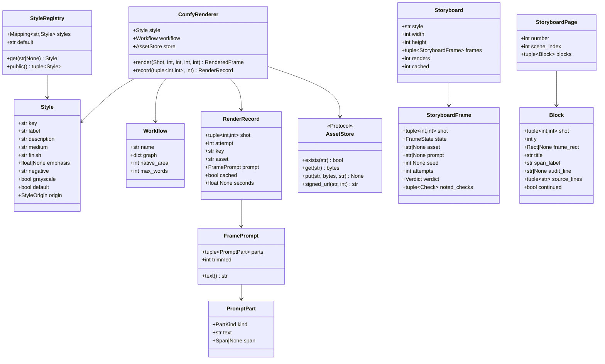

# Design — `storyboard` (frames, styles, the image chain, the storyboard PDF)

**Status:** draft · **Owner:** Katlego (Claude) · **Tasks:** T008 (styles, redaction, prompts and a
prompt-printing CLI: buildable now), T026 (the Workers AI renderer, Storage, the storyboard job: §3.5;
T021's loop is merged), T027 (the PDF and JSON, after T026) · **Spec:** [SPEC.md](../../SPEC.md) US1 (script → grounded storyboard)

---

## 1. What this covers

Turning a `ShotPlan` (shots.md) into a **storyboard**: one frame per shot, rendered by FLUX.2 [klein] 4B on
Cloudflare Workers AI (§3.5; ComfyUI on a Nebius GPU is an optional backend) in a chosen **style**, audited by verify.md's loop before anyone sees it, stored in
**Supabase Storage**, and exported as one **PDF**. It owns four things:

1. **The frame prompt**: built only from the shot's grounded fields (§3.1). This is where
   Non-negotiable I is enforced on the *input* to the image model; verify.md enforces it on the
   output.
2. **The style registry**: public styles in `styles/`, an optional private pack from
   `PANELWISE_PRIVATE_STYLES`, the same validation for both.
3. **The renderer**: verify.md's `Renderer` Protocol, implemented on Cloudflare Workers AI (§3.5, the default) and,
   optionally, against a committed ComfyUI workflow graph (T003); each render stored by a content
   address, which is also the render cache.
4. **The storyboard document**: the page layout and the PDF, with the withheld-frame text card.

**Not covered:** the audit, the re-render loop, the frame state machine and the `frame_audits`
table (verify.md, T020/T021); reference portraits and IP-Adapter (characters.md, T025, which
extends this renderer); comic pages (comic.md, which calls this renderer at panel size); the ComfyUI
box itself (T003, `infra/nebius/`); the `Job` table, the `frames` table and the web screens
(docs/design/web.md: T009, T053, T043, T044, T046, T047, T040–T045); spend caps (T030).

## 2. Reference material

| Kind | Where |
| --- | --- |
| Code ported from | FrameFlow `services/api/app/services/`: `storyboard_service.py` (prompt assembly, `_setting`, `_ANGLE_WORDS`), `storyboard_styles.py` (the style dataclass, the three drawn styles and their A/B notes), `image_provider.py` (`ComfyUIImageProvider`: submit, poll `/history`, queue-aware deadline, cancel, `/view`), `image_postprocess.py` (`storyboard_grayscale`), `storyboard_document.py` (A4, two 16:9 frames a page, spec line under each). What is dropped and why: §8 |
| What FrameFlow learned | CLIP can't read negation ("no borders" drew borders); the setting reads best as "inside \<place\>, \<time\>" straight after the framing; SDXL-Turbo tints pencil frames sepia whatever the prompt says, so grayscale is a pixel pass; a free-text frame description is where invention lived (shots.md §8) |
| Inputs | `ShotPlan`, `Shot`, `Framing` (shots.md §6); `Screenplay`, `Scene`, `Action`, `Dialogue`, `Span`, `normalise` (script.md §6); `Extraction`, `Entity`, `Quote` (grounding.md §6) |
| Contract this provides | verify.md §6 `RenderedFrame` and `Renderer`, verbatim (built in `app/verify/model.py`, PR #22) |
| Contract this calls | verify.md §6 `render_until_accepted`, `seed_for`, `Audit`, `FrameOutcome`, `FrameState`, `Check`, `Verdict` |
| Character rules | characters.md §3 rules 1–3 (no names in prompts; only the script's words; undescribed stays undescribed) and its redaction |
| Hosting | deploy.md §1 (Supabase Storage for images), §6 (env), §10 (local Storage: decided here, §8) |
| ComfyUI | `infra/comfyui/workflows/` (committed API-format JSON, inputs set by node title: characters.md §6) |
| Visual reference | none yet. The first live run of `python -m app.storyboard.run` on the self-written sample commits its PDF pages as PNGs under `docs/design/reference/storyboard/`, the reference later changes are compared against (T027 Done) |
| Fonts | **Courier Prime** Regular and Bold (SIL OFL 1.1), committed under `services/api/assets/fonts/` with their licence: the screenplay's own typeface, and the PDF prints script text verbatim |

## 3. Domain model



`ComfyRenderer` implements verify.md's `Renderer`; `RenderedFrame` is verify.md's, unchanged.
`FrameState`, `Verdict` and `Check` are verify.md's. `Rect` is `(x, y, w, h)` in page pixels.

### 3.1 The frame prompt (Non-negotiable I on the input)

`build_frame_prompt` is a **pure function** of the shot, the screenplay, the extraction and the
style. Its script text comes **only from the shot's own scene heading and the elements the shot
covers**. It takes no free text: not the shot's `rationale` (shots.md: never used in a prompt), not a
user's note, not any model's prose. Two inputs are model-proposed and code-filtered, and the prompt
narrows them further: `shot.characters` (shots.md filters them to entities present in the scene;
`COUNT` below keeps only those the covered elements show on screen) and the extraction's names (used
only to **remove** words, by redaction). A prompt is an ordered tuple of **parts**, each tagged with
where it came from; `text()` joins them with `", "` (comma phrases, the way CLIP reads captions:
FrameFlow's finding).

**Order**, fixed: `STYLE`, `FRAMING`, `SETTING`, `TIME`, `COUNT`, `PLACEMENT`, then one `ACTION`
part per covered `Action` element, **in element order**. The scene-level parts lead because a text encoder that
truncates drops the tail.

| `PartKind` | Origin | Text | `span` |
|---|---|---|---|
| `STYLE` | the style (§3.2) | `medium` (weighted by the renderer when `emphasis` is set), then `finish` | `None` |
| `FRAMING` | a fixed table in code, keyed by `shot.framing` | `wide` → "wide shot", `medium` → "medium shot", `close_up` → "close-up", `extreme_close_up` → "extreme close-up", `over_shoulder` → "over-the-shoulder shot", `pov` → "point-of-view shot", `insert` → "close-up insert shot" | `None` |
| `SETTING` | this scene's heading | `inside` / `outside` / `at` (from `scene.int_ext`: `INT`, `EXT`, `INT_EXT`) + `scene.location`, **redacted, then** lower-cased | this scene's heading span |
| `TIME` | `shot.time_of_day` (resolved, shots.md) | lower-cased; omitted when `None` | the heading span of the scene that **supplied** the clock (`time_source`, below) |
| `COUNT` | code, from `visible_characters(shot, screenplay, extraction)` (below) | 1 → "one figure", 2 → "two figures", 3 → "three figures", 4 → "four figures", ≥ 5 → "a group of figures"; omitted at 0 | `None` |
| `PLACEMENT` | characters.md `FrameReferences.placement`, which must be one of `PLACEMENT_PHRASES` (a closed set owned here: `{"one figure on the left, one on the right"}`; anything else is a `ValueError`), and is accepted only when `visible_characters` has exactly two members (else `ValueError`), so it can never contradict `COUNT` | the phrase; T026's renderer passes `None`, T025 passes it | `None` |
| `ACTION` | a covered `Action` element's text | verbatim, whitespace collapsed, redacted | the element's span |

- **The heading span** of a scene is `Span(scene.span.page, scene.span.line_start,
  scene.span.line_start)`: the heading line (`Scene.span` itself runs to the scene's last element).
- **`time_source(scenes, scene_index) -> int | None`** returns the index of the scene whose own
  `absolute_time` `resolve_times` used: this scene when its heading has an absolute time, else the
  nearest earlier one that does, else `None`. So a `CONTINUOUS` scene's "night" cites the earlier
  heading that says NIGHT. The image uses a borrowed clock and the comic caption doesn't (comic.md
  §3) because they answer different questions: the caption quotes *this* heading's words, while the
  image must not draw a night scene in daylight (shots.md §2: the reason `resolve_times` exists).
- **`visible_characters(shot, screenplay, extraction)`**: the members of `shot.characters`, in that order, that the
  covered elements put on screen. A character is on screen if a covered `Dialogue` cue resolves to
  them with `match_speaker` and its extension, upper-cased, contains none of `V.O.`, `O.S.`, `O.C.`,
  `OFF` (comic.md's list), or if one of their name tokens (below, `other_names` included) appears in
  a covered `Action` text. A planner-listed character the covered text never shows is not counted,
  and neither is an off-screen or voice-over speaker. **People only (T052):** the signature becomes
  `visible_characters(shot, screenplay, extraction)` (the screenplay for pairing, below), it skips every *animal* (below), and it detects an
  action-line mention with that one character's labels (its name and paired other names). `COUNT`
  and `PLACEMENT`'s "exactly two" both use it, so a cat is never a figure; the action line that
  names it already says "the cat" after redaction.
- **Entity quotes from outside the shot never enter a prompt.** A character's introduction ("NANDI
  (60s, oilskin coat) pours tea…") or a prop's first mention carries that moment's event, so quoting
  it into another shot draws an event this shot doesn't have. A quote located *inside* a covered
  element is already in the prompt as that element's `ACTION` text. A character's appearance reaches
  the frame through T025's reference portrait (characters.md), which is built from those quotes and
  audited on its own.

**The invariant** (tested, §9): for every part whose `span` is not `None`, that span is this scene's
heading span, the heading span of `time_source`'s scene (only for `TIME`), or the span of an element
the shot covers; and the part's text (after the `SETTING` part's leading preposition) is, under `normalize_for_grounding`, a substring of `redact(text,
redaction_labels(extraction, screenplay))` applied to that heading or element text (`redact_all`
before T052). Every part whose `span` is `None` is from the fixed tables
above or the style. So a prompt says nothing that isn't in this shot's lines or its heading, except
the style's medium words and the code's fixed framing, preposition, count and placement vocabulary,
none of which names a person, prop or event.

- **Parentheticals never enter a prompt.** `Dialogue.parenthetical` ("beat", "without turning") is
  a delivery note, not a picture; it isn't part of `Dialogue.text`, its line lies outside the
  element's span (script.md's parser), and it isn't in the shot's `source`, so it could not be traced
  to the span a prompt part cites.
- **Dialogue text never enters a prompt.** Speech isn't visible, and words in a prompt are how
  letters appear in the art (verify.md's hard `TEXT_IN_FRAME`). The speakers are drawn because they
  are counted (`COUNT`) and, with T025, as reference figures.
- **Movement never enters a prompt.** A still can't show a pan; FrameFlow's movement words
  ("handheld", "tracking with the subject") read as motion blur. Movement is printed under the frame.
- **Names never enter a prompt** (characters.md rule 1). Every script-derived part is redacted
  **before** any lower-casing, with `redact(text, redaction_labels(extraction, screenplay))` (T052;
  `redact_all` before it), which follows characters.md rule 2's matching:
  - **Name tokens** are the words of `normalise(name)` for every `CHARACTER` entity in the extraction,
    **minus `NAME_STOP_WORDS`**, a fixed list of words that are not names on their own (`THE`, `A`,
    `AN`, `OLD`, `YOUNG`, `LITTLE`, `BIG`, `MR`, `MRS`, `MS`, `MISS`, `DR`, `SIR`, `LADY`, `MAN`,
    `WOMAN`, `BOY`, `GIRL`, `STRANGER`, `OFFICER`, `NURSE`, `DOCTOR`). A cue like `THE STRANGER` thus
    has no name token and nothing is redacted for it; "The kettle screams." stays as written.
  - A **maximal run** of name tokens (with an optional possessive `'S` on its last token), in UPPER
    or Title case at word boundaries, becomes one `a person` (`a person's` for a possessive): "NANDI
    MOLEFE pours" → "a person pours", "NANDI'S KITCHEN" → "a person's kitchen".
  - **Labels, not only "a person" (T052).** Redaction covers every character's name **and its
    `other_names`**, and every prop's `other_names` (a prop's own name, "VIOLIN", is a thing to draw
    and stays). `redaction_labels(extraction, screenplay)` gives **token → label**, inserted in rank
    order (persons, animals, named props, `it`; extraction order within each), and a token is placed
    at the position of the label that wins it; `redact` gives a run the label of its token that comes
    first:
    - **Animals.** A character is an animal when it has a `species`, or when `match_speaker` binds
      its name to an animal's name (so a CUE backfill or a second entry of the same cat, which has
      no species of its own, is still the cat). Its label is `the <species>`, lower-cased.
    - **Persons.** Every other character: `a person`, as before.
    - **Named props.** A prop's label is `the <prop name>`, lower-cased, with a leading
      `a`/`an`/`the` stripped from the name. The definite article throughout means no
      `a`/`an` rule and no plural problem ("the umbrellas"), and it reads as the thing already
      in the frame, not a second one.
    - **Fallback `it`.** A label whose words include any name token of any character or other name
      ("NANDI'S UMBRELLA" → would be "the nandi's umbrella") is `it` instead, so a lower-cased
      label can never carry a name past `names_in`.
    - **Pairing.** An other name gets its entity's label only when it shares a **scene** with
      that entity: some scene whose heading or elements mention the other name as a whole word
      also mentions the entity's name, its species, or holds one of its located quotes. On
      `lost-property`, "Gerald" and "giraffe" share scenes 6 and 11, so Gerald → `the giraffe`.
      An unpaired other name is still redacted, to `it`: the model's pairing is otherwise
      unverified (grounding.md §8), and `it` adds no person and no thing. An other name claimed by
      two paired entities follows **Conflicts** below.
    - **Conflicts.** A token claimed by several entities takes, in this order, a person's label, then
      an animal's, then a prop's, then `it`; between two of the same kind, the earlier entity in
      `extraction.entities`. A run's label is the highest-ranked of its tokens' labels by the same
      order. **Accepted:** a run that mixes a person and an animal ("Nandi Marmalade") is one
      `a person`, and the cat is lost from that line.
    - "Even Marmalade comes back to the doorway" → "Even the cat comes back…"; "Amahle dances with
      Gerald" → "a person dances with the giraffe"; "Marmalade's tail" → "the cat's tail".
      **Known cost:** an appositive repeats the species, "A ginger cat, MARMALADE, sleeps" → "A
      ginger cat, the cat, sleeps"; the definite article keeps it one cat in English, and the
      audit catches a frame with two (an unscripted animal is `UNSCRIPTED_OBJECT`).
    A possessive keeps its `'s` (`a person's`, `the cat's`), except `it`, whose possessive is `its`
    ("Gerald's leg", unpaired → "its leg").
    Every label word is `a`, `person`, `the`, `it`, `its` or a word the script itself writes (the species
    is in the entity's own description; a prop name is found in the script), so the invariant below
    still compares against the same redaction (`cites_this_shot` and `build_frame_prompt` call the
    same `redact` with the same labels), and `names_in` checks every labelled name and other name.
  - **A title goes with the name it precedes** (T050). One or more of `TITLE_WORDS` (`MR`, `MRS`,
    `MS`, `MISS`, `DR`, `SIR`, `LADY`, `OFFICER`, `NURSE`, `DOCTOR`: the stop words that are forms
    of address), each in UPPER or Title case and separated from the next by whitespace, directly
    before a name run, join that run: "MR. DUBE" → "a person", "Officer Van Wyk's" → "a person's".
    Only the abbreviations `MR`, `MRS`, `MS`, `DR` may carry a `.`: "…the OFFICER. Moloi turns" is
    a sentence end, so the title stays and only "Moloi" is redacted. Before T050 the title stayed
    ("MR. a person"). A title with no name run directly after it is left alone ("the OFFICER",
    "Mr. Nobody" when NOBODY isn't a name, the "MR." of "MR. AND MRS. DUBE").
  - Speaking characters are always in the extraction (grounding.md backfills every cue as a
    `Source.CUE` entity), so every speaker's name is covered. **Residual risk:** a named person who
    never speaks and whom extraction missed isn't known to be a name, so it is not redacted. §9 pins
    this with an adversarial fixture; §8 records it.
  Redaction only removes words (characters.md rule 2). Besides it, a script span undergoes only
  whitespace collapsing and lower-casing for `SETTING` and `TIME`. **`TIME` is not redacted**: its
  text is `absolute_time`'s word, a closed vocabulary (`ABSOLUTE_TIMES`) that names no one, and a
  character named DAWN must not turn the clock into "a person" (PR #27 review). The invariant
  checks it against the unredacted heading and the vocabulary.
- **Undescribed stays undescribed** (characters.md rule 3): nothing about how anyone looks is added
  unless the covered text says it.
- **Parentheses are escaped.** ComfyUI reads `(words)` as a weight, and screenplays are full of
  them ("NANDI (60s, oilskin coat)"). The renderer escapes `(` and `)` as `\(` and `\)` in every part
  but `STYLE` (whose weight it adds itself), so script text is never re-weighted.
- **No negations** (FrameFlow's finding: "no borders" drew borders). What must not appear is kept
  out by not being said, and caught by the audit. The style's `negative` goes to the negative prompt,
  which only subtracts.
- **Word budget.** `max_words` (the workflow's, §6) counts **whitespace-separated words** of
  `text()`, a deliberately conservative proxy for the encoder's token limit (the default 55 for
  CLIP's 77 tokens; T003 sets it for the real encoder). The **fixed parts** (`STYLE`, `FRAMING`,
  `SETTING`, `TIME`, `COUNT`, `PLACEMENT`) are never dropped; if they alone exceed `max_words`,
  `build_frame_prompt` raises `PromptError` naming the shot (a style or location too long for the
  encoder is a configuration error, surfaced as the renderer's failure, never a silently truncated
  prompt). Otherwise, over budget, whole `ACTION` parts are dropped from the **tail** backwards,
  never the first; if still over, the first `ACTION` part is cut to its longest prefix that fits and
  ends at a sentence end (`.`, `!`, `?`), else at a word boundary, and dropped altogether if not even
  one word fits. `trimmed` counts dropped and cut parts. Cutting only removes script words; what's
  left is a verbatim prefix, and a returned prompt never exceeds `max_words`.

### 3.2 Styles

A style is **how** a frame is drawn, never **what** is in it. One TOML file per style, the file stem
is the key (`[a-z0-9-]+`):

```toml
# styles/clean.toml
label = "Clean sketch"
description = "Pencil storyboard at full size. Keeps a wide shot as one panel inside the location."
medium = "storyboard sketch, pencil drawing"
finish = "grayscale, monochrome, loose linework"
# emphasis = 1.3     # optional: ComfyUI weight on `medium` (FrameFlow's `ink` and `pencil` used 1.3)
negative = ""         # optional: negative prompt (subtractive only)
grayscale = true      # the pixel pass after rendering (FrameFlow's image_postprocess)
default = true        # exactly one PUBLIC style sets this
```

- **Public** styles are the files in the repo's `styles/`; **private** ones are the `*.toml` files in
  the directory `PANELWISE_PRIVATE_STYLES` names (unset or empty → none). `origin` is set by where a
  file was loaded from, never by the file.
- **`load_styles` fails the start-up** (`StyleError`, naming the file) when: a field is missing,
  unknown or mistyped; a private key repeats a public one (a private pack can't shadow a public
  style); there is no public style; not exactly one style sets `default`, or the one that does is
  private (the demo must run on public styles, PLAN.md NN2); `medium`, `finish` or `negative`
  contains `(`, `)` or `:` (weight syntax is the renderer's); or `medium` or `finish` contains a **subject word**: a
  whole-word, case-insensitive match against a fixed list in code (`person`, `people`, `man`, `men`,
  `woman`, `women`, `boy`, `girl`, `child`, `children`, `figure`, `figures`, `crowd`, `character`,
  `face`, `portrait`, `animal`, `text`, `letters`, `words`, `caption`, `logo`, `sign`, `signature`,
  `watermark`). The list can't prove a style is content-free; it stops the obvious ways a style could
  put someone in the frame, and the audit catches the rest regardless of style.
- The same checks apply to private styles. A private style is never needed for anything the demo
  shows (PLAN.md NN2); the hosted API never sets `PANELWISE_PRIVATE_STYLES` (T030 verifies).

### 3.3 Frames, renders and storage

- **Storyboard frame size**: **1280 × 720** (16:9: a storyboard frame is a frame of the film). Comic
  panels call the same renderer at their rect's size (comic.md §4 step 6).
- **Draw size.** A diffusion model draws near its native pixel area in multiples of 64. `draw_size`
  scales the requested width × height to the workflow's `native_area` (the committed graph's latent
  width × height), rounding each side to a multiple of 64. The drawn image is scaled to **cover** the
  requested size and centre-cropped by at most the rounding excess (never a composition crop), so
  `RenderedFrame.width × height` is exactly what was asked.
- **Post-processing**, after the resize: the style's grayscale pass (`ImageOps.grayscale` then
  `autocontrast(cutoff=0.5)`, FrameFlow's), and PNG encoding. **The audit sees exactly the pixels
  that are shown and stored**; nothing touches a frame after it is audited.
- **The render key** is `sha256` of the canonical JSON (sorted keys, no whitespace) of the **fully
  substituted API graph** that is submitted, then, each after a `"\x1f"`: the **requested**
  `<width>x<height>`, `RENDER_VERSION` (a constant bumped whenever `fit` or a post-processing pass
  changes), and the post-processing step (`grayscale` or `none`). The requested size is in the key because two
  requests can round to one draw size (a comic rect and 1280 × 720), and the stored PNG is the
  fitted one. Prompt, negative, seed, draw size, checkpoint, sampler, steps, cfg and, with T025, the
  IP-Adapter model and reference image names are all inputs of that graph, so every input that
  changes the pixels is in the key (characters.md §6, which this makes exact).
- **Storage paths**: `frames/<render key>.png` for every rendered attempt (the `frame_audits.frame_asset`
  column, verify.md §6, points at it, including attempts that failed their audit);
  `storyboards/<sha256 of the PDF bytes>.pdf` for an export (built on demand by T027's
  `GET /projects/{id}/storyboard.pdf`, web.md §6). Paths are content addresses: the same
  bytes always land at the same path, so a `put` is idempotent.
- **The store is the render cache.** Before submitting a graph, the renderer checks `exists(frames/<key>.png)`;
  a hit is read back and returned without touching the GPU (`RenderRecord.cached`). A failed job's
  already-rendered frames therefore cost nothing when the job is run again. There is no other image
  cache (no Redis, no disk cache: §8).
- **`StoryboardFrame`** is the storyboard's view of verify.md's `FrameOutcome`, built by `frame_of`
  from the outcome and the `RenderRecord` of its **last** attempt (`outcome.audits[-1].attempt`;
  `None` only when no audit exists, i.e. the renderer failed on the first attempt): `asset` is the accepted
  frame's storage path (`None` unless `PASSED` or `WARNED`); `prompt` (the text actually sent, as in `RenderedFrame.prompt`: weighted and escaped; the
  record keeps the tagged `FramePrompt`) and `seed` are the last attempt's, which
  for a `PASSED` or `WARNED` frame is the accepted one; `attempts` = `len(outcome.audits)`;
  `verdict` is the last audit's; `noted_checks` are the last audit's failed checks: the failed
  **hard** checks for a `WITHHELD` frame (what its card names), the failed **soft** checks for a
  `WARNED` one (a note under the frame), empty otherwise, all in `Check` enum order.

### 3.4 The document

- **Page**: A4 portrait at 150 dpi, **1240 × 1754 px**; margins **90 px**; content width **1060 px**;
  the frame is drawn at **1060 × 596** (16:9, 1280 × 720 scaled); **40 px** between blocks.
- **Scenes start a new page.** Header, from the top margin: `STORYBOARD` (Bold 22 px, one line),
  8 px, then the scene's heading **as printed in the script** (the line of `Screenplay.text` at
  `heading_span`, sliced the way script.md's spans slice back; not `Scene.heading`, which the parser
  normalises) (Bold 26 px, 34 px line pitch), wrapped to the content
  width like source text (below), then 12 px, a 2 px rule, and 24 px: `22 + 8 + 34 × lines + 38` px
  in all. Footer, above the bottom margin: a 1 px rule, 8 px, then (Regular 18 px, 24 px pitch)
  `Panelwise · <style label> · page <n> · A vision model describes each frame; Nemotron audits it
  against the script.`, wrapped to the content width; it grows upwards.
- **A block per shot**, in plan order (`Block` fields in brackets):
  - the frame box (`frame_rect`; `None` on a continuation);
  - `title` (Bold 24 px): `<Scene.number>.<Shot.number>  <FRAMING> / <MOVEMENT>`, e.g. `12A.3  CLOSE
    UP / STATIC` (the script's own scene number, a string; the shot number is shots.md's, 1-based;
    enum values upper-cased, `_` as space). On a continuation: `<Scene.number>.<Shot.number> (cont.)`;
  - `span_label` (Regular 20 px, right-aligned on the title's line): `p.<page> l.<line_start>–<line_end>`;
  - `audit_line` (Regular 20 px): `Audit: pass` or `Audit: warn (<noted checks>)`; `None` for a
    withheld frame (its card says it) and on a continuation;
  - `source_lines` (Regular 22 px, 30 px line pitch): the shot's **`source`, verbatim**. Each of its
    lines (one per covered element, shots.md) is wrapped on whitespace to the content width
    separately, so element breaks are kept; a word wider than the line keeps a line to itself.
    **Never truncated, never folded to ASCII** (FrameFlow folded em dashes and curly quotes for its
    base-14 fonts; with a TrueType font nothing needs folding).
  - Heights: frame 596, 12, title line 34, audit line 30 when present, 8, then 30 per source line.
    `y` is the block's top, in px from the page top.
- **Fitting**: a block goes on the current page if it fits between the header and the footer; else a
  new page (same scene header). A block taller than an empty page puts its frame and as many source
  lines as fit on that page and continues the rest at the top of the next, `continued = True`.
- **Withheld card** (verify.md §4), in the frame box: white, 4 px `#808080` border, centred text in
  Regular 26 px, wrapped to 1000 px: `Frame withheld: failed audit (<checks>)` (the `noted_checks`
  names, lower case, `_` as spaces, joined by `, `; `audit error` for an `ERROR` verdict), then
  `Script p.<page> l.<line_start>–<line_end>`. The shot's `source` is printed under it as under every
  frame, so the card with its block shows exactly what verify.md §4 asks: the verbatim source, the
  span and the reason.

### 3.5 The renderer: FLUX.2 [klein] 4B on Cloudflare Workers AI (T026; decided 2026-10-10)

**Decided by Katlego, 2026-10-10**, on top of Tumo's fal.ai design (2026-10-09). Tumo's structure
stays as it was: the cache covers every attempt, no failure is silent, CPU work runs off the event
loop, the concurrency limit, the rendering stage in `run_job` and `create_app`'s factory. Only the
service changes. The default renderer is **FLUX.2 [klein] 4B** (`@cf/black-forest-labs/flux-2-klein-4b`,
Apache-2.0) on **Cloudflare Workers AI**, behind verify.md's `RecordingRenderer`. ComfyUI on a Nebius
GPU (T003, `ComfyRenderer` below) stays an **optional** backend. Why:

- **The project has no cash** (PLAN.md's budget: the only money is $25 of Token Factory credit,
  for model calls). Every renderer that bills per frame is out, including **fal.ai** ($0.003 a frame,
  the choice of 2026-10-09).
- **Workers AI's free allocation** is **10,000 neurons a day** on Workers Free, with no card and a
  reset at 00:00 UTC. Past it, requests fail.
- **Not Workers AI's FLUX.1 [schnell].** 2026-10-09's research ruled it out: it takes no seed and
  draws 1024 × 1024 only. **klein 4B takes both**: `seed`, and `width`/`height` in multiples of 16.
- **Measured in the trial of 2026-10-09** (`services/api/storage/render-trial/`, git-ignored):
  - klein's frames carry no artist signature, unlike schnell's;
  - they stage the action as written;
  - each costs **104.2 neurons** (4 output tiles × 26.05; three calls, `cf-ai-neurons: 104.20`).
- **Nebius Token Factory serves no image model** (404 on 2026-10-08). A Nebius GPU costs about $1.55
  an hour. "Runs on Nebius" is still met by every Nemotron call on Token Factory (deploy.md §1).

**How the renderer works:**

- **One call per try.** The request:
  - `POST https://api.cloudflare.com/client/v4/accounts/{CLOUDFLARE_ACCOUNT_ID}/ai/run/{RENDER_MODEL}`,
    with `Authorization: Bearer {CLOUDFLARE_API_TOKEN}`.
  - The body is `multipart/form-data` with exactly four string fields: `prompt`, `width`, `height`
    (the draw size) and `seed`.
  - The answer is `{"result": {"image": <base64 JPEG>}}`. An answer whose image doesn't decode counts
    as a failed try.
  - Reference images (`input_image_0..3`, each under 512 × 512) are T025's (§10).
- **The draw size is about one megapixel.** `draw_size(width, height)` scales the requested size to at most
  `NATIVE_AREA` = 1024 × 1024 at the same aspect, **up or down**. Each side is rounded **down** to a
  multiple of 16, and is at least 16. So a drawing never starts a fifth 512 × 512 tile, and every
  frame and panel costs 104.2 neurons.
  - 1280 × 720 draws at 1360 × 768.
  - A 1748 × 986 comic panel draws at 1360 × 768.
  - The drawing is then fitted to exactly the requested size by §3.3's `fit` (cover, then a
    centre-crop by at most the rounding excess), and post-processed (the style's grayscale).
- **The prompt sent** is `FramePrompt.text()`, plain:
  - FLUX reads no ComfyUI weight syntax, so nothing is escaped and the style's `emphasis` isn't
    applied.
  - klein is distilled to 4 steps with no guidance, so there's no negative prompt and no step count.
    The style's `negative` isn't sent, though `load_styles` still validates it.
  - `RenderedFrame.prompt` is exactly this text.
- **The word budget** is `RENDER_MAX_WORDS`, default **120**. It replaces `COMFYUI_MAX_WORDS` (55,
  which was CLIP's 77 tokens). klein's text encoder is a Qwen3 language model, so it reads far more
  than CLIP's limit. That closes §10's FLUX word-budget question.
- **The render key** (§3.3) is the sha256 of the canonical JSON of
  `{"model": RENDER_MODEL, "request": {"prompt", "width", "height", "seed"}}` (the four fields as
  sent). After it come the requested `<width>x<height>`, `RENDER_VERSION` and the post-processing
  step, each after a `"\x1f"`.
  - The store is the cache, as §3.3 says. If `frames/<key>.png` exists, it is read back with no call,
    and `RenderRecord.cached` is set.
  - A re-run of a script spends no neurons on frames it already drew.
- **Not reproducible from the seed.** Workers AI accepts the seed but returns a different image for
  the same request. In the trial, two calls with seed 1 differed by a mean of 39.7 of 255 per pixel,
  against 50.8 between seeds 1 and 2.
  - So **the stored PNG is the reproduction**: an attempt's key always reads back the same bytes.
  - The seed still goes in the request (it varies the attempts) and in `frame_audits.seed`.
- **Failures,** inside one `render` call (the attempt never changes for them). Up to **3 tries**, with
  `sleep` waits of 1 s and then 2 s:

  | Answer | What `render` does |
  |---|---|
  | 200 with an image that decodes | fit, post-process, store, return |
  | 200 without one; a network error or timeout; a 5xx; a 429 with code `3040` (out of capacity) | retry |
  | 400 with code `8007` (the NSFW filter refused the prompt) | retry: the filter isn't deterministic (in the trial, shot 3.4's prompt passed once and was refused twice) |
  | code `3036` (the day's free neurons are used) | `RenderQuotaExceeded` at once, with no retry |
  | 401, 403 or any other 4xx | `RendererError` at once (a token, account or model problem) |

  When the tries run out, the error is a `RendererError`, which says the prompt was refused if the
  last answer was `8007`. Every message names the status, Cloudflare's code and the model, never the
  token or the prompt.
  - `RENDER_TIMEOUT_S` (default 120) is httpx's per-phase timeout, per try.
  - A timed-out call that Cloudflare finished is billed again. That's bounded (at most 3 tries per
    attempt) and accepted.
  - `RendererError` and `RenderQuotaExceeded` lead to verify's `FAILED`, and the job fails as §4
    says.
- **A uniformly black drawing is treated as a failed try** and never stored. Workers AI refuses
  with `8007` rather than blacking a frame out, but T062 showed the audit would pass a black frame,
  so the renderer checks anyway.
- **No failure is silent** (Tumo's live run, 2026-10-10).
  - Each retry is logged at `WARNING` with the model, the try and the status, plus the code or the
    exception's type.
  - Each drawing is logged at `INFO` with the shot, the attempt, the seconds and its neurons.
  - `build_storyboard` logs the `RendererError` of a frame that fails at `WARNING`.
  - Never the token or the prompt.
- **Neurons are recorded.** `RenderRecord.neurons` holds the response's `cf-ai-neurons` header (None
  for a store hit), so a day's spend can be read from the API's logs. There's no database column.
- **CPU work runs off the event loop.** The decode, `fit`, the post-processing and the PNG encoding
  run in `asyncio.to_thread`.
- **Privacy.** Each prompt (the redacted, grounded script words of one shot, with no character names,
  §3.1) is sent to Cloudflare. The README says so (T033).
- **Concurrency** is `RENDER_CONCURRENCY`, default **2**, at least 1 (a bad value fails at start-up).
  More frames at once only spend the day's allocation faster.
- **The daily budget.** The free allocation is about **95 frames a day**. A storyboard of n shots
  takes n to 3n drawings (verify.md's `max_renders`), and the same again for its comic. The trial's
  21-shot comic took about 40. So **about one project's storyboard and comic fits in a day**, and the
  demo project must be rendered ahead and served from the cache. T030's demo account and §10 decide
  what a judge's upload may spend.

**The rendering stage in the job** (`run_job(…, factory)`, web.md §6):
- Progress is 60 at its start and `60 + round(40 × settled / shots)` as frames settle, then 100 with
  `DONE`. It's written with `GREATEST`, so it never moves back.
- `build_storyboard` runs with concurrency `settings.render_concurrency`.
- A progress write that fails is logged and skipped. It never fails a shot.

**The job's failure copy.** A `StoryboardError` (a shot's renderer failed, §4) fails the upload's job
at stage `rendering`. The shot is named as the web names it (`ShotView.id`), and web.md §4.1a's
`failed`/`rendering` row shows the copy verbatim:
- `RENDER_BUDGET_SPENT` when the cause was `RenderQuotaExceeded`;
- `RENDER_STAGE_FAILED` for any other renderer failure.

Anything else in the stage is web.md §4.1's `UNEXPECTED`. A re-upload is a new project, but the same
script makes the same prompts, seeds and keys. So every drawing already made is a store hit, and
nothing is drawn twice.

**The app's factory.** `create_app(render=True)` is used by the module's `app`, never by a test.
- It sets `app.state.renderer_factory` when `CLOUDFLARE_ACCOUNT_ID`, `CLOUDFLARE_API_TOKEN` and the
  store are all set and the public styles load.
- The factory makes a fresh renderer per job or attempt, as verify.md §6 says:
  `lambda screenplay, extraction: WorkersAIRenderer(style=<the registry's default>, store=…,
  screenplay=…, extraction=…, client=<the app's shared httpx2 client>, account=WorkersAIAccount(…))`.
- Credentials set but styles that don't load are logged as an error at start-up, and the app runs
  with no renderer (never half-configured).
- Without the credentials it stays `None`. "Try another render" and "Make the comic" then answer 503
  `renderer_unavailable`, as today, and the storyboard job skips the RENDERING stage (planning is the
  last stage, as before T026).

**The styles ship in the API image.** The public styles move from the repo root `styles/` to
`services/api/styles/`, inside the image's build context, and the Dockerfile copies them.
- The root keeps a `styles` symlink, so the paths in docs and in `styles/README.md` still work.
- `PUBLIC_STYLES` is `parents[2] / "styles"` from `styles.py`: `services/api/styles` in the repo,
  and `/srv/api/styles` in the image.
- Compose mounts nothing, and the hosted API (T063) needs nothing extra.

## 4. Flow

```mermaid
sequenceDiagram
    participant J as Storyboard job
    participant S as StyleRegistry
    participant V as render_until_accepted (verify.md)
    participant R as ComfyRenderer
    participant P as build_frame_prompt
    participant T as AssetStore (Supabase Storage)
    participant C as ComfyUI (Nebius GPU)
    participant L as frame_audits log (T021)
    J->>S: get(style key)
    J->>R: ComfyRenderer(style, workflow, store, screenplay, extraction, client)
    R->>C: check_workflow: node titles present, checkpoint installed
    par each shot in plan order (≤ concurrency at once)
        J->>V: shot, width 1280, height 720, log = _log
        loop attempt 1 .. max_renders
            V->>R: render(shot, attempt, seed_for(shot, attempt), 1280, 720)
            R->>P: shot, screenplay, extraction, style, max_words
            P-->>R: FramePrompt
            R->>R: substitute graph by node title; render key
            R->>T: exists(frames/key.png)?
            alt cached
                T-->>R: PNG
            else not cached
                R->>C: POST /prompt; poll /history; GET /view
                C-->>R: image
                R->>R: cover-resize to 1280×720; grayscale; PNG
                R->>T: put(frames/key.png)
            end
            R-->>V: RenderedFrame (prompt = the text sent)
            V->>V: describe, judge, checks, verdict (verify.md)
            V->>J: _log(audit)
            J->>L: log(audit, renderer.record(audit.shot, audit.attempt).asset)
        end
        V-->>J: FrameOutcome (PASSED / WARNED / WITHHELD / FAILED)
    end
    J->>J: any FAILED → StoryboardError; else Storyboard
    J-->>J: Storyboard (the PDF is built on demand by T027's endpoint, not here)
```

- **With Workers AI** (§3.5, the default): `R` is `WorkersAIRenderer` and `C` is Workers AI's `ai/run` endpoint.
  There is no `check_workflow` step, and one call per drawing replaces the submit/poll/view. The job
  calls `build_storyboard(…, concurrency=settings.render_concurrency)`. The diagram's ComfyUI path is the optional backend (T003).
- **The writer and its hooks** (T021). `build_storyboard` takes T021's `FrameWriter` (verify.md
  §6) and, for each shot, calls `frame_hooks(writer, renderer, shot)` to get the `(log, on_state)`
  pair it passes to `render_until_accepted`: `log` writes each attempt's `frame_audits` row with the
  path `renderer.record(shot, attempt).asset` (the renderer records an attempt before returning it,
  so the lookup can't miss), and `on_state` writes the shot's `frames` row, with the asset only on a
  `PASSED` or `WARNED` terminal state. "Try another render" uses the same `frame_hooks`, so every
  `frames` row is written by one path and the asset rule is stated once.
- **Seeds** are verify.md's `seed_for(shot, attempt)`; the renderer never picks one. FrameFlow's
  random regenerate seed is gone: an attempt is reproducible, and "another attempt" is the next
  attempt number.
- **Concurrency** defaults to 2: one GPU renders one graph at a time (ComfyUI queues the rest), so
  more than two only lengthens the queue; two lets shot *n + 1* render while shot *n* is audited.
- **Frame state** is verify.md §5's state machine, unchanged; this design adds no states. Only a
  `PASSED` or `WARNED` frame's image appears in the storyboard, the JSON or the PDF.
- **ComfyUI calls** (ported from FrameFlow): `POST /prompt` with the graph and a client id; poll `GET
  /history/<id>` every second (an absent entry means still running); at `COMFYUI_TIMEOUT_S`, ask
  `/queue`: still queued or running → extend by the same again, up to 3× in total; then cancel it
  (`/interrupt` if running, `/queue` delete if pending) and fail. A history `status_str` of `error`
  fails with ComfyUI's message. The first image output is fetched from `GET /view`.

**Failure paths:**

- **ComfyUI unreachable, a rejected graph, a render error or a timeout** → `RendererError` →
  verify.md's `FAILED` → the storyboard job fails with `StoryboardError` naming the shot. Shots
  already in flight are **awaited**, not cancelled (their renders and audits are paid for; their
  frames and log rows are kept); no new shot starts. No
  fallback provider and no placeholder image (§8). The frames already rendered stay in Storage, so a
  rerun pays only for the rest.
- **A prompt whose fixed parts exceed the word budget** → `PromptError`, raised by the renderer as
  `RendererError` → `FAILED`, naming the shot: a configuration error (style or budget), never a
  truncated prompt.
- **A workflow missing a titled node, or a checkpoint ComfyUI doesn't have** → `RendererError` from
  `check_workflow` before any shot is rendered.
- **An audit error or the last attempt failing** → `WITHHELD` (verify.md): the block shows the card;
  the job succeeds. A withheld frame is information, not a failure.
- **Storage `put` or `exists` fails** → `StorageError` → the job fails. A frame that can't be stored
  can't be logged with its asset, and verify.md logs every attempt.
- **An unknown style key** → `StyleError` before anything renders.

## 5. State

The frame's lifecycle is **verify.md §5**, unchanged; not redrawn here. A storyboard is produced by
the upload's `Job` in its `RENDERING` stage (web.md §3, §5); `build_storyboard` reports
`progress(settled, total)` after each frame reaches a terminal state, and the runner maps it into the
job's 60–100 band. The PDF is not part of the job. The style registry is loaded
once at start-up and immutable.

## 6. Contracts

```python
# app/storyboard/styles.py
class StyleOrigin(StrEnum): PUBLIC = "public"; PRIVATE = "private"
@dataclass(frozen=True) class Style: key: str; label: str; description: str; medium: str; finish: str; emphasis: float | None; negative: str; grayscale: bool; default: bool; origin: StyleOrigin
@dataclass(frozen=True)
class StyleRegistry:
    styles: Mapping[str, Style]
    default: str
    def get(self, key: str | None) -> Style: ...        # None → default; unknown → StyleError
    def public(self) -> tuple[Style, ...]: ...          # sorted by key
class StyleError(ValueError): ...
SUBJECT_WORDS: frozenset[str]                           # §3.2's list
PUBLIC_STYLES: Path                                     # the repo's styles/ (T026 must ship it in the API image)
def load_styles(public_dir: Path, private_dir: Path | None) -> StyleRegistry: ...

# app/characters/redact.py  (built by T008; T025 uses it: characters.md §6)
NAME_STOP_WORDS: frozenset[str]                                # §3.1's list
def name_tokens(names: Sequence[str]) -> frozenset[str]: ...   # words of normalise(name), for each name, minus NAME_STOP_WORDS
def redact_names(text: str, character: str, others: Sequence[str]) -> str: ...   # characters.md rule 2: this character → "a person", others → "another person"
def redact_all(text: str, characters: Sequence[str]) -> str: ...                 # every character's name tokens → "a person"
# app/characters/labels.py (T052; its own module because it imports app.grounding, whose filter imports redact.py.
# app/characters/__init__.py must never import labels, or app.grounding -> filter -> app.characters -> labels -> app.grounding cycles)
def animals(extraction: Extraction) -> dict[str, str]: ...                      # character name → species, for every animal (§3.1 Labels: own species, or bound to one by match_speaker)
def redaction_labels(extraction: Extraction, screenplay: Screenplay, only: str | None = None) -> dict[str, str]: ...  # name token → label (§3.1 Labels), in rank order (persons, animals, named props, `it`; extraction order within each); `only` limits it to one character's name and paired other names. The screenplay is for pairing (a shared scene)
# app/characters/redact.py
def redact(text: str, labels: Mapping[str, str]) -> str: ...                    # T052: redact_all's matching (runs, possessives, titles), each run → the label of its token that comes first in `labels` (rank order); a possessive `it` is `its`

# app/storyboard/prompt.py — pure
class PartKind(StrEnum): STYLE = "style"; FRAMING = "framing"; SETTING = "setting"; TIME = "time"; COUNT = "count"; PLACEMENT = "placement"; ACTION = "action"
@dataclass(frozen=True) class PromptPart: kind: PartKind; text: str; span: Span | None
@dataclass(frozen=True)
class FramePrompt:
    parts: tuple[PromptPart, ...]
    trimmed: int
    def text(self) -> str: ...                          # ", ".join(p.text for p in parts)
class PromptError(ValueError): ...                      # the fixed parts alone exceed max_words (names the shot)
FRAMING_WORDS: Mapping[Framing, str]                    # §3.1's table
PLACEMENT_PHRASES: frozenset[str] = frozenset({"one figure on the left, one on the right"})
OFF_SCREEN_MARKS: tuple[str, ...] = ("V.O.", "O.S.", "O.C.", "OFF")   # comic.md §3's list
def heading_span(scene: Scene) -> Span: ...             # Span(scene.span.page, scene.span.line_start, scene.span.line_start)
def time_source(scenes: Sequence[Scene], scene_index: int) -> int | None: ...   # the scene resolve_times took the clock from
def visible_characters(shot: Shot, screenplay: Screenplay, extraction: Extraction) -> tuple[str, ...]: ...  # §3.1; people in shot.characters (no animals), same order (T052: the screenplay, for pairing, and the extraction)
def build_frame_prompt(shot: Shot, screenplay: Screenplay, extraction: Extraction, style: Style, *,
                       max_words: int, placement: str | None = None) -> FramePrompt: ...
#   placement must be in PLACEMENT_PHRASES (else ValueError); T026 passes None, T025 passes
#   characters.md FrameReferences.placement; a placement with len(visible_characters) != 2 is a ValueError;
#   a shot.time_of_day that isn't the absolute time of time_source's heading is a ValueError (the
#   planner copies resolve_times, so any other clock is one the headings don't give)

# app/storyboard/prompts.py — T008's live check (python -m app.storyboard.prompts <script.pdf> [--style KEY])
async def main(argv: list[str]) -> int: ...             # parse, extract, plan; print each shot's parts, kinds and spans
#   run as `sys.exit(asyncio.run(main(sys.argv[1:])))` under `if __name__ == "__main__"`, like app/shots/run.py;
#   max_words = Settings().render_max_words (RENDER_MAX_WORDS, §3.5; T008 named it COMFYUI_MAX_WORDS)

# app/storyboard/workflow.py — pure
@dataclass(frozen=True) class Workflow: name: str; graph: Mapping[str, Any]; native_area: int; max_words: int
REQUIRED_TITLES: tuple[str, ...] = ("checkpoint", "positive", "negative", "seed", "latent", "save")
def load_workflow(path: Path, max_words: int) -> Workflow: ...     # WorkflowError if a title is missing or repeated
def draw_size(width: int, height: int, native_area: int) -> tuple[int, int]: ...   # multiples of 64
def substitute(workflow: Workflow, *, positive: str, negative: str, seed: int, width: int, height: int) -> dict[str, Any]: ...
RENDER_VERSION: int = 1
def render_key(graph: Mapping[str, Any], width: int, height: int, postprocess: str) -> str: ...   # sha256 hex, §3.3 (requested size, RENDER_VERSION)
def fit(png: bytes, width: int, height: int) -> Image.Image: ...                  # cover + centre-crop, exact size
def weighted(text: str, phrase: str, emphasis: float | None) -> str: ...          # "(phrase:1.3)" on its first occurrence

# app/storyboard/render.py
class RendererError(RuntimeError): ...
@dataclass(frozen=True) class RenderRecord: shot: tuple[int, int]; attempt: int; key: str; asset: str; prompt: FramePrompt; cached: bool; seconds: float | None; neurons: float | None = None   # neurons: cf-ai-neurons, None for a store hit
class RenderRecorder(RecordingRenderer, Protocol):     # what build_storyboard needs: a RecordingRenderer whose records are RenderRecords
    style: Style
    def record(self, shot: tuple[int, int], attempt: int) -> RenderRecord: ...
class RenderQuotaExceeded(RendererError): ...           # Workers AI 3036: the day's free neurons are used (§3.5)
RENDER_STAGE_FAILED: str = "Shot {shot_id} couldn't be drawn, so the storyboard stopped. Upload the script again to try once more: drawings already made aren't drawn twice."
RENDER_BUDGET_SPENT: str = "Today's free drawing budget ran out at shot {shot_id}, so the storyboard stopped. It resets at 00:00 UTC: upload the script again after that, and drawings already made aren't drawn twice."
class ComfyRenderer:                                    # implements app.verify.Renderer
    def __init__(self, *, style: Style, workflow: Workflow, store: AssetStore, screenplay: Screenplay,
                 extraction: Extraction, client: httpx2.AsyncClient, base_url: str,
                 timeout_s: float, poll_interval_s: float = 1.0) -> None: ...
    async def check_workflow(self) -> None: ...         # GET /object_info: titled nodes' classes exist, checkpoint installed
    async def render(self, shot: Shot, attempt: int, seed: int, width: int, height: int) -> RenderedFrame: ...
    def record(self, shot: tuple[int, int], attempt: int) -> RenderRecord: ...     # KeyError if not rendered
#   ComfyRenderer is the optional backend (T003, §3.5); WorkersAIRenderer is the default.

# app/storyboard/workers_ai.py (T026, §3.5)
NATIVE_AREA: int = 1024 * 1024                           # klein's native area: 4 billed 512 x 512 tiles
DEFAULT_MODEL: str = "@cf/black-forest-labs/flux-2-klein-4b"
def draw_size(width: int, height: int) -> tuple[int, int]: ...   # scaled up or down to ≤ NATIVE_AREA, each side floored to a multiple of 16
def workers_ai_request(prompt: str, seed: int, draw: tuple[int, int]) -> dict[str, str]: ...   # the four form fields, §3.5
@dataclass(frozen=True)
class WorkersAIAccount:
    account_id: str; api_token: str; model: str = DEFAULT_MODEL; timeout_s: float = 120.0
    @classmethod
    def from_settings(cls, settings: Settings) -> WorkersAIAccount | None: ...   # None unless both CLOUDFLARE_* are set
class WorkersAIRenderer:                                 # implements app.verify.RecordingRenderer
    def __init__(self, *, style: Style, store: AssetStore, screenplay: Screenplay, extraction: Extraction,
                 client: httpx2.AsyncClient, account: WorkersAIAccount, max_words: int = 120,
                 sleep: Callable[[float], Awaitable[None]] = asyncio.sleep) -> None: ...
    async def render(self, shot: Shot, attempt: int, seed: int, width: int, height: int) -> RenderedFrame: ...
    #   prompt → render key → store hit, or up to 3 tries → decode → fit → post-process → put; records before returning
    def record(self, shot: tuple[int, int], attempt: int) -> RenderRecord: ...     # KeyError if not rendered
def workers_ai_factory(registry: StyleRegistry, store: AssetStore, client: httpx2.AsyncClient,
                       account: WorkersAIAccount, settings: Settings) -> RendererFactory: ...   # §3.5 The app's factory; the registry's default style

# app/storage/store.py
class StorageError(RuntimeError): ...
class AssetStore(Protocol):
    async def exists(self, path: str) -> bool: ...
    async def get(self, path: str) -> bytes: ...
    async def put(self, path: str, data: bytes, content_type: str) -> None: ...   # idempotent: an existing path is left as is
    #   SupabaseStore uploads without upsert and treats Supabase's 409 "already exists" as success
    async def signed_url(self, path: str, expires_in_s: int) -> str: ...
class SupabaseStore:                                    # Supabase Storage REST (/storage/v1/object/...), secret key, httpx2
    def __init__(self, *, url: str, secret_key: str, bucket: str, client: httpx2.AsyncClient) -> None: ...

# app/storyboard/model.py
type Rect = tuple[int, int, int, int]
@dataclass(frozen=True) class StoryboardFrame: shot: tuple[int, int]; state: FrameState; asset: str | None; prompt: str | None; seed: int | None; attempts: int; verdict: Verdict; noted_checks: tuple[Check, ...]
@dataclass(frozen=True) class Storyboard: style: str; width: int; height: int; frames: tuple[StoryboardFrame, ...]; renders: int; cached: int
@dataclass(frozen=True) class Block: shot: tuple[int, int]; y: int; frame_rect: Rect | None; title: str; span_label: str; audit_line: str | None; source_lines: tuple[str, ...]; continued: bool
@dataclass(frozen=True) class StoryboardPage: number: int; scene_index: int; blocks: tuple[Block, ...]
class StoryboardError(RuntimeError): ...

# app/storyboard/build.py
def frame_of(outcome: FrameOutcome, record: RenderRecord | None) -> StoryboardFrame: ...   # pure, §3.3; record = the last attempt's
async def build_storyboard(model: NebiusChatModel, renderer: RenderRecorder, plan: ShotPlan,
                           screenplay: Screenplay, extraction: Extraction, *,
                           writer: FrameWriter,                                # T021's; frame_hooks(writer, renderer, shot) per shot (§4)
                           progress: Callable[[int, int], Awaitable[None]] | None = None,   # (settled, total) after each terminal frame
                           width: int = 1280, height: int = 720, concurrency: int = 2,
                           max_renders: int = 3) -> Storyboard: ...

# app/storyboard/document.py
def layout_document(storyboard: Storyboard, plan: ShotPlan, screenplay: Screenplay) -> tuple[StoryboardPage, ...]: ...   # pure; measures with Courier Prime
def render_pdf(pages: Sequence[StoryboardPage], storyboard: Storyboard, plan: ShotPlan,
               screenplay: Screenplay, style: Style, frames: Mapping[tuple[int, int], bytes]) -> bytes: ...
#   frames: PNG bytes of the PASSED/WARNED frames only; Pillow page images, one PDF via save_all
def to_json(storyboard: Storyboard, plan: ShotPlan, frame_urls: Mapping[tuple[int, int], str]) -> dict[str, object]: ...
```

**Storyboard JSON** (an export, written by `run` and T027; the web pages read `frames` rows instead, web.md §6):

```json
{
  "style": "clean", "width": 1280, "height": 720,
  "frames": [{
    "shot": [0, 1], "framing": "wide", "movement": "static",
    "span": {"page": 1, "line_start": 5, "line_end": 9},
    "source": "The kettle screams. NANDI lifts it off the flame.",
    "state": "passed", "verdict": "pass", "noted_checks": [],
    "attempts": 1, "seed": 2718281828,
    "prompt": "storyboard sketch, pencil drawing, grayscale, monochrome, loose linework, wide shot, inside lighthouse kitchen, night, one figure, The kettle screams. a person lifts it off the flame.",
    "frame_url": "https://…/storage/v1/object/sign/panelwise/frames/…png?token=…"
  }]
}
```

`frame_url` is present only for `passed` and `warned`; a `withheld` frame has none. `source` and
`span` are the shot's, so the web app shows "from page 1, lines 5–9" on every frame (SPEC US1).

**Environment** (added to `.env.example` and deploy.md §6: `PANELWISE_PRIVATE_STYLES` and the word budget by T008, the renderer's and Storage by T026):

| Variable | Where | What |
|---|---|---|
| `CLOUDFLARE_ACCOUNT_ID` | API | the Cloudflare account that runs Workers AI (§3.5) |
| `CLOUDFLARE_API_TOKEN` | API, **secret** | a token with Workers AI read and edit. Either one unset: no renderer, "Try another render" and "Make the comic" answer 503, the storyboard job ends at planning |
| `RENDER_MODEL` | API | the Workers AI model, default `@cf/black-forest-labs/flux-2-klein-4b` |
| `RENDER_TIMEOUT_S` | API | per-try deadline, default 120 |
| `RENDER_CONCURRENCY` | API | frames drawn at once, default 2; at least 1, or the API refuses to start |
| `RENDER_MAX_WORDS` | API | the frame prompt's word budget (§3.1, §3.5), default 120; replaces `COMFYUI_MAX_WORDS` |
| `COMFYUI_URL` | API, optional | ComfyUI's base URL on a Nebius GPU, for the optional backend (T003; already in `.env.example`) |
| `COMFYUI_TIMEOUT_S` | API | per-render deadline before the queue-aware extension, default 300 |
| `SUPABASE_STORAGE_BUCKET` | API | the private bucket for frames and PDFs, default `panelwise` |
| `PANELWISE_PRIVATE_STYLES` | API, optional | a directory of private style TOMLs outside the repo (already in `.env.example`); never set on the hosted demo |

**Workflow**: `infra/comfyui/workflows/frame.json` (T026; `portrait.json`, `frame_ref1.json`,
`frame_ref2.json` stay T025's). Nodes by title: `checkpoint` (its checkpoint name is fixed in the
file: no "first available checkpoint" fallback), `positive`, `negative` (text encodes), `seed` and
the sampler settings on the sampler, `latent` (width, height; its committed size is `native_area`),
`save`.

## 7. Structure

| Path | New? | Responsibility | Task |
| --- | --- | --- | --- |
| `services/api/app/storyboard/{__init__,styles,prompt,prompts}.py` | new | §3.1–§3.2, §6; `prompts.py`: `python -m app.storyboard.prompts <script.pdf> [--style KEY]` parses, extracts and plans on the real account and prints every shot's prompt parts with their spans, so the team can read the prompts before any GPU exists | T008 |
| `services/api/app/storyboard/{model,workflow,render,build}.py` | new | §3.3, §4, §6: `fit`, the render key and post-processing, `RenderRecord`, `build_storyboard`. No separate run CLI: `build_storyboard` writes through T021's writer, so the live check is an upload through the local stack (§9) | T026 |
| `services/api/app/storyboard/document.py` | new | §3.4, §6: layout, PDF, JSON; `run` writes the PDF to `DIR` and Storage | T027 |
| `services/api/app/characters/{__init__,redact}.py` | new | `NAME_STOP_WORDS`, `name_tokens`, `redact_names`, `redact_all` (moved here from characters.md's `portraits.py` so frames can use them before T025) | T008 |
| `services/api/app/storage/{__init__,store}.py` | new | `AssetStore`, `SupabaseStore` (§6 contract; deploy.md §7), built with its first consumer, the upload (web.md §4.1); T026 uses it for frames | T053 |
| `services/api/app/core/config.py`, `.env.example`, `docs/design/deploy.md` §6 | changed | §6's environment | T008 (`PANELWISE_PRIVATE_STYLES`, the word budget), T026 (`CLOUDFLARE_*`, `RENDER_*`, `SUPABASE_STORAGE_BUCKET`) |
| `styles/*.toml`, `styles/README.md` | new / changed | the styles the team keeps public (§10); the file format | T008 |
| `services/api/app/storyboard/workers_ai.py` | new | §3.5: `WorkersAIRenderer`, `WorkersAIAccount`, `draw_size`, `workers_ai_request`, `workers_ai_factory` | T026 |
| `services/api/styles/*.toml`, `styles/README.md` (moved from the root, which keeps a `styles` symlink); `services/api/Dockerfile` | moved / changed | §3.5: the styles ship in the API image | T026 |
| `services/api/app/projects/job.py`, `app/main.py` | changed | the RENDERING stage in `run_job` (`factory`), `renderer_factory` from `workers_ai_factory` when both `CLOUDFLARE_*` are set | T026 |
| `infra/comfyui/workflows/frame.json` | new | the frame graph, on T003's model (the optional backend) | T003 |
| `services/api/assets/fonts/{CourierPrime-Regular,CourierPrime-Bold}.ttf`, `CourierPrime-OFL.txt` | new | the document's font and its licence | T027 |
| `services/api/app/images/README.md` | removed | the provider chain and cache it described are not built (§8); the renderer lives in `storyboard/` | T026 |
| `docs/design/reference/storyboard/*.png` | new | the sample's rendered pages, the visual reference | T027 |
| `services/api/tests/{storyboard,storage,characters}/` | new | §9 | T008, T026, T027 |
| `CHANGES-FROM-FRAMEFLOW.md` | changed | a row per ported file | T008, T026, T027 |

## 8. Decisions & alternatives

| Decision | Chosen | Rejected, and why |
|---|---|---|
| The renderer (2026-10-10, §3.5) | FLUX.2 [klein] 4B on Cloudflare Workers AI: free (10,000 neurons a day, about 95 frames), a seed, any size in multiples of 16, always on | FLUX.1 [schnell] on fal.ai (Tumo's choice of 2026-10-09: $0.003 a frame, and the project has no cash); ComfyUI on a Nebius L40S as the default (≈ $2,500 to stay up to 15 Dec, or cold starts for judges; credit coverage unconfirmed: kept optional, T003); Cloudflare Workers AI FLUX.1 [schnell] (no seed and 1024 × 1024 only: breaks seeded attempts and comic panels; artist signatures in the trial); Nebius Token Factory (no image model, 404 on 2026-10-08). Sources: nebius.com/prices, the Cloudflare model schema, fal.ai's model page and OpenAPI |
| What a frame prompt is made of | tagged parts from the shot's grounded fields, each script part carrying its span (§3.1) | FrameFlow's `storyboard_description` (free text: shots.md dropped it) or its fallback to the scene's first 400 characters of action (a cut mid-sentence, and other shots' events); a model writing the prompt: invention with extra steps |
| Dialogue in the prompt | never; speakers enter as the `COUNT` and, with T025, as references | the speech text: not visible, and the surest way to get letters in the art (hard `TEXT_IN_FRAME`) |
| Camera movement in the prompt | never; printed under the frame | FrameFlow's movement words: a still can't pan, and "handheld" reads as blur |
| Entity quotes | only as the covered elements' own text; nothing from outside the shot; appearance comes from T025's reference portrait | a character's first descriptive quote or a prop's first mention: each is an introduction that carries its own moment's event ("pours tea") into a shot that doesn't have it, which the audit then fails (`UNSCRIPTED_OBJECT`). **Cost:** until T025, a dialogue-only shot is drawn from its setting, time and figure count alone |
| Figure count | `visible_characters`: planner characters the covered elements show on screen. Loose on shared name tokens ("JOHN SMITH"/"JOHN DOE") and possessives ("reads NANDI's letter"); both only change the count word | `len(shot.characters)`: the planner lists who it thinks fits, and `V.O.`/`O.S.` speakers aren't in the frame. **Known effect:** verify.md's soft `MISSING_CHARACTER` checks `shot.characters`, so a shot with an off-screen speaker ends `WARNED` with a `missing_character` note; accepted (it's soft and true), see §10 |
| Unextracted names | accepted residual risk, pinned by a test | redacting every ALL-CAPS word: sound effects and emphasis ("SLAM", "NOW") are written the same way and would become "a person" |
| Over-long prompts | drop whole parts from the tail, then cut the last kept part at a sentence end or word | cutting mid-word or mid-quote at random; letting the encoder truncate silently (it drops the end, whatever is there) |
| Names | redacted in every script part with `redact`: a person → "a person", an animal → "the <species>", a named prop's other name → "the <prop>", else "it" (T052; `redact_all`, "a person" only, before it) | names in the prompt: characters.md rule 1 |
| Style format | one TOML per style, stdlib `tomllib`, validated at start-up | FrameFlow's Python dict: a private pack would have to be code, imported from outside the repo |
| Public / private split | two directories, same validation, private can't shadow or be default | a `private = true` flag in the file: one directory, so a private file could land in the public repo by accident |
| FrameFlow's `classic` style | dropped | it kept a pre-styles cache key and its prompt used the negations CLIP can't read ("no borders", "Do not add characters") |
| FrameFlow's `fast` draft (draw small, upscale) | dropped | a CPU-time saving measured on SDXL-Turbo on a laptop; its other effect, stopping a close subject being drawn twice on an off-native canvas, is what `draw_size` now does for every render |
| Image providers | ComfyUI only | FrameFlow's chain: A1111 WebUI (not deployed), Gemini (paid, not Nebius), and the labelled mock image (a placeholder, AGENTS.md §2a: a job without a GPU fails loudly instead) |
| Image cache | the content-addressed Storage path is the cache | FrameFlow's disk record/replay cache (a dev tool whose key named a Gemini model even for ComfyUI images) and Redis (gone: deploy.md); tests use a fake renderer, so replay mode has no job left |
| Checkpoint choice | fixed in the committed `frame.json` | FrameFlow's "first checkpoint ComfyUI lists": changes the pixels without changing any key |
| Seeds | verify.md's `seed_for(shot, attempt)` | FrameFlow's per-subject hash plus a random regenerate seed: not reproducible |
| Size mismatch between request and model | draw near native area in multiples of 64, cover-resize, crop only the rounding | drawing at the requested size (off-native sizes duplicate subjects: FrameFlow saw a close subject drawn twice) |
| Grayscale | a pixel pass before the audit, per style | in the prompt (SDXL-Turbo ignores it); after the audit (the audit would judge different pixels than are shown) |
| PDF | Pillow page images, one PDF with `save_all` (comic.md's choice) | FrameFlow's hand-written PDF writer (base-14 fonts, so it folded em dashes and curly quotes: not verbatim); reportlab: a second PDF library. **Cost:** the PDF's text isn't selectable |
| What prints under a frame | the shot's verbatim `source`, never truncated, plus its span | FrameFlow's frame description cut at four lines: a storyboard block must show exactly the lines it cites |
| One PDF per | screenplay, scenes starting new pages | FrameFlow's one PDF per scene: a crew hands around one document |
| Local development Storage (deploy.md §10) | a dev bucket in the same Supabase project, through the same `SupabaseStore`; tests use an in-memory fake `AssetStore` | a local filesystem adapter: a second code path to keep honest, plus an API route to serve its files to the browser |
| Signed URLs | the bucket is private; the API hands out signed URLs | a public bucket: frames of unreleased scripts readable by anyone with the path (RLS: deploy.md §6, T009) |
| Renderer failure | the job fails, naming the shot | a placeholder frame: AGENTS.md §2a, and a board that looks complete but isn't |

Deviations from [docs/architecture-defaults.md](../architecture-defaults.md): none.

## 9. How this is verified

- **The prompt invariant** (property test over the self-written sample's plan and extraction, every
  shot × every public style): every part with a `span` satisfies §3.1's invariant (its span is this
  heading, the `time_source` heading for `TIME`, or a covered element, and its text is in that
  redacted span); every part without one is from `FRAMING_WORDS`, the count phrases,
  `PLACEMENT_PHRASES` or the style; `text()` contains no name token of any character; no
  `Dialogue.text` appears; `rationale` never appears (a shot built with a sentinel rationale); no
  prompt exceeds `max_words`. The sample includes a `CONTINUOUS` scene after a night scene.
- **`build_frame_prompt`** cases: the fixed part order, `ACTION` parts in element order;
  `INT`/`EXT`/`INT_EXT` prepositions; a `None` time omitted; a borrowed time citing the earlier
  heading; counts 0 to 5 from `visible_characters` (a planner character not in the covered text, a
  `V.O.` speaker and an `O.S.` speaker not counted; an on-screen speaker and a named actor counted); a
  dialogue-only shot (no `ACTION` part; its parentheticals and speech absent); a
  character introduced in an earlier shot contributing nothing; a placement outside
  `PLACEMENT_PHRASES` raising `ValueError`; the budget dropping `ACTION` parts from the tail, keeping the first,
  then cutting it at a sentence end or word boundary, with `trimmed` counting them; fixed parts over
  budget raising `PromptError`;
  "NANDI'S KITCHEN" in the raw heading → "inside a person's kitchen".
- **Redaction, adversarial**: a two-word name as one "a person"; possessives; `THE STRANGER` and
  `OLD MAN` cues leaving "The" and "Old" alone; a title before a name taken with it ("MR. DUBE",
  "Dr Khumalo", "OFFICER VAN WYK'S") but a title alone, a title at a sentence end ("the OFFICER.
  Moloi turns") and the "MR." of "MR. AND MRS. DUBE" left alone (T050); a lower-case common word equal to a name untouched; a
  named non-speaking person whom the fixture's extraction omits **is** left in the prompt (the
  residual risk, pinned so any change to it is deliberate).
- **`redact_names` / `redact_all`**: characters.md §9's redaction cases, plus `redact_all`, runs and stop words.
- **Labels (T052)**: on `lost-property`'s own lines with a hand-built extraction (MARMALADE with
  species `cat`, a CUE-style second entry `MARMALADE` with none, GIRAFFE with other name `Gerald`):
  "Even Marmalade comes back" → "Even the cat comes back"; "Amahle dances with Gerald" → "a person
  dances with the giraffe"; "Marmalade's tail" → "the cat's tail"; "VIOLIN" untouched; an
  unpaired other name (no shared scene) → `it`, and its possessive → `its`, and "Gerald" paired through scene 11 on the real
  sample's lines; a prop named "NANDI'S UMBRELLA" labelled `it`; a token shared by a
  person and an animal → `a person`; two animals sharing a token → the earlier entity's label;
  `COUNT` ignores the cat and `PLACEMENT` needs two *people*; the §9 invariant and `names_in` hold
  with labels and other names (no prompt contains "Gerald" or "Marmalade").
- **`load_styles`**: the repo's `styles/` loads with exactly one public default; each §3.2 failure
  raises `StyleError` naming the file (a private key shadowing a public one, a private default, a
  subject word in `medium`, weight syntax, a missing field, an unknown field).
- **Workflow** (T026): on a fixture graph, and then on the committed `frame.json`, every
  `REQUIRED_TITLES` node exists once; `substitute` sets
  inputs by title and leaves every other input untouched; `render_key` changes when any substituted
  input or the post-process changes and is stable across dict ordering; `draw_size` returns multiples
  of 64 near the native area for 16:9 and for comic.md's tall and wide panel rects; `fit` returns
  exactly the requested size.
- **`WorkersAIRenderer`** (T026) with `httpx2.MockTransport` and an in-memory `AssetStore`:
  - the request is §3.5's exactly: four multipart fields, no negative, no weights, no escapes,
    `Authorization: Bearer …`;
  - `draw_size` keeps every size at or under `NATIVE_AREA` in multiples of 16 (1280 × 720 → 1360 × 768,
    1748 × 986 → 1360 × 768, a small panel scaled up), and the frame is fitted to exactly the
    requested size;
  - a store hit makes no call, and the record is written before `render` returns, with
    `cf-ai-neurons` in it;
  - a 429 with `3040`, then a 200, succeeds after one sleep;
  - three 5xx, three 8007s (a refusal) and a 401 are each a `RendererError` naming the status, code
    and model, never the token or the prompt;
  - `3036` is a `RenderQuotaExceeded` after one call;
  - a 200 with no image, or one that won't decode, is retried;
  - a uniformly black drawing is retried and never stored;
  - the factory exists only with both `CLOUDFLARE_*`, a store and loadable styles, and only with
    `create_app(render=True)`.

  `run_job` with a factory advances RENDERING at 60, writes every frame through T021's writer and
  ends DONE at 100. Without one it ends DONE at 60 as before. A `RenderQuotaExceeded` fails the job
  with `RENDER_BUDGET_SPENT`.
- **The styles in the image:** `docker build services/api`, then `load_styles` in the image loads
  every public style.
- **`ComfyRenderer`** (optional, T003) with `httpx2.MockTransport` and an in-memory `AssetStore`: submit → poll
  (absent, then present) → view → resize → grayscale → `put` at `frames/<key>.png`; a store hit makes
  **no** ComfyUI call; the queue-aware extension then cancel; a history error, a 4xx on submit and no
  image output each raise `RendererError`; `check_workflow` fails on a missing checkpoint; one
  graph requested at two sizes that round to one draw size gets two keys and two correctly sized PNGs;
  `RenderedFrame.prompt` is the weighted, escaped text actually sent; parentheses in script parts escaped; `record` returns the asset.
- **`SupabaseStore`** with `MockTransport`: the Storage REST paths, the secret key header, a 409 on `put`
  treated as success, errors raised as `StorageError`, no key in any error message.
- **`build_storyboard`** with a fake renderer and a mocked audit: one frame per shot in plan order;
  every attempt logged with its asset; `PASSED`, `WARNED` (soft checks noted) and `WITHHELD` (hard
  checks noted, `asset` `None`) frames; a `FAILED` frame raising `StoryboardError` naming the shot
  after in-flight shots finish; the log adapter passing each attempt's asset; `on_frame` fired for
  every transition with an asset only on PASSED/WARNED; `progress(settled, total)` after each
  terminal frame.
- **Document**: `layout_document` is deterministic; scenes start pages; blocks never overlap the
  header or footer; a long source continues onto the next page with every line present (the joined
  lines equal the `source` modulo wrapping); `render_pdf` makes one PDF page per `StoryboardPage` at
  1240 × 1754; a withheld block draws the card with the checks in enum order and `audit error` for
  an `ERROR`; no withheld frame's pixels are ever read (its bytes are not passed in). `to_json`
  matches §6's shape and omits `frame_url` for a withheld frame.
- **Live** (T026/T027; needs both `CLOUDFLARE_*`, T021, and about 2,200–6,300 of a day's neurons): an upload of the self-written sample on the local stack, in the default
  public style: every shot ends `PASSED`, `WARNED` or `WITHHELD`; the PDF and frames are in Storage;
  seconds per frame, renders per frame and neurons are recorded in `docs/rendering.md` (render cost; T049 uses the same renders); the
  pages are committed as the visual reference.

## 10. Open questions

- [x] **Which styles stay private?** (STATUS.md § Open decisions, SPEC.md open question 3.) **Decided
  2026-09-30 by the user:** all three of FrameFlow's drawn styles (`clean`, `ink`, `pencil`) are
  public in `styles/`, `clean` is the default, `classic` is dropped (§8), and the private pack is
  empty. Built by T008.
- [x] **A longer word budget for FLUX** (§3.5). **Decided 2026-10-10:** `RENDER_MAX_WORDS`, 120.
  klein's Qwen3 text encoder reads far more than CLIP's 77 tokens, and 2026-10-09's trial prompts
  were drawn at that budget.
- [ ] **What a judge's upload may spend** (§3.5's daily budget): the demo project is rendered ahead
  and served from the cache. A judge's own script spends that day's neurons. T030 decides whether
  the demo account may upload at all, and whether a single frame's card says "budget" instead of
  "failed".
- [ ] **The ComfyUI model and graph** (T003, the optional backend): which checkpoint, sampler, steps and cfg go in
  `frame.json`, its native size, and its licence (recorded in `infra/nebius/README.md`). The model
  decides `COMFYUI_MAX_WORDS` (CLIP's 77 tokens vs a T5 encoder's few hundred), whether comma phrases
  or sentences prompt it better, whether a negative prompt does anything (cfg 1 models ignore it:
  verify.md §8), and which IP-Adapter family T025 can use (characters.md §10).
- [ ] **GPU cost** (STATUS.md: the $50 credit covers Token Factory, not a GPU VM): cost per hour and
  seconds per frame from T003 decide whether the box runs always-on for the demo to 15 Dec or is
  started on demand, and what T030's image cap (`IMAGE_MONTHLY_GENERATION_CAP`) is set to. A
  storyboard costs at most shots × 3 renders (verify.md's `max_renders`), fewer with cache hits.
- [ ] **How ComfyUI is exposed** (T003): a private network between Railway and Nebius isn't
  available, so the endpoint needs authentication (a reverse proxy with a token, or a Nebius-managed
  endpoint). If a header is needed, `COMFYUI_*` gains a secret; T003 names it and this doc's §6
  changes with it.
- [ ] **Unaudited frames at the US1 checkpoint** (SPEC.md open question 1): this design follows the
  agreed verify.md (no frame shown without `PASS` or `WARN`), so T026 depends on T021's loop. Confirm
  the US1 checkpoint waits for T021 rather than showing unaudited frames.
- [ ] **Dialogue-only shots before T025**: with no entity quotes (§8), such a shot is drawn from its
  setting, time and figure count. If T049's renders of the samples show these frames are too generic, the team
  decides between waiting for T025's references and allowing a narrowly defined descriptive phrase
  (never a whole sentence) from a character's introduction.
- [ ] **Off-screen speakers and `MISSING_CHARACTER`** (§8): every shot with a `V.O.`/`O.S.` speaker
  will end `WARNED`. Accepted here; if the notes are noise, verify.md could skip characters whose
  only covered speech is off-screen (a verify.md change, its own PR).
- [ ] **Scripts outside Latin-1-plus**: Courier Prime covers Latin scripts; a script in another writing
  system would print missing-glyph boxes. Out of scope until a sample needs it.
