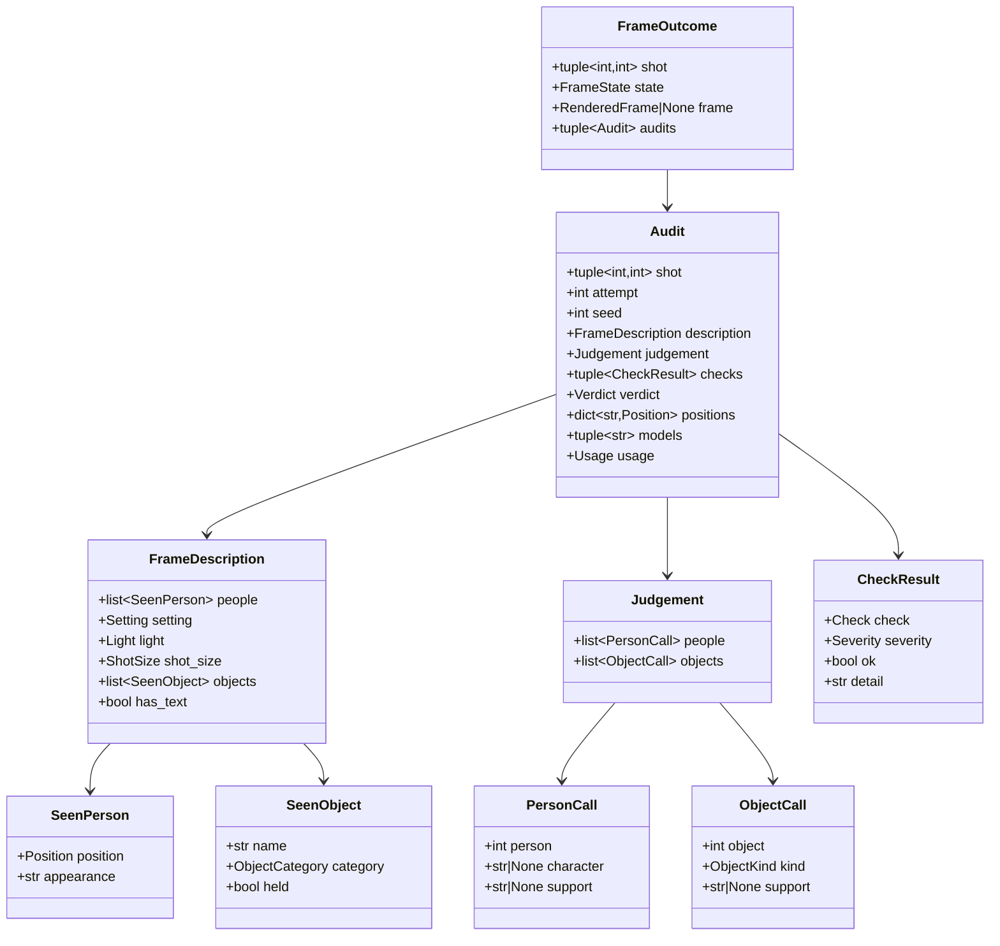
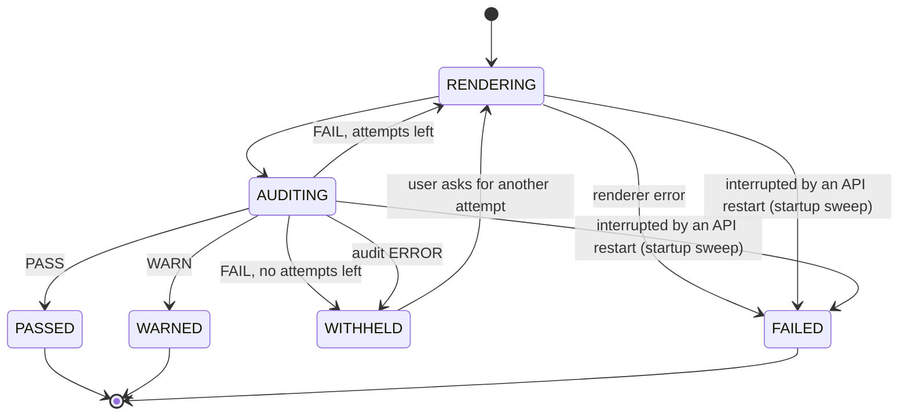

# Design — `verify` (the frame audit and re-render loop)

**Status:** agreed · **Owner:** Katlego (Claude) · **Tasks:** T020 (audit), T021 (re-render loop, audit
log, log in the web app) · **Spec:** [SPEC.md](../../SPEC.md) US2 (frame audit)

---

## 1. What this covers

Checking every rendered frame against its shot before anyone sees it, re-rendering it when it
fails, and logging every verdict. This is where Non-negotiable I is enforced **on pixels**: a frame
that shows a person, prop or event the script doesn't put in that shot is never shown. Up to T026,
grounding is enforced on text; this is the first check on images.

**Not covered:** rendering (T026 provides the renderer this calls: storyboard.md), comic layout (comic.md reads
the audit's speaker positions), portraits (characters.md).

## 2. Reference material

| Kind | Where |
| --- | --- |
| The vision decision | docs/nebius-findings.md § The vision decision: **option A**: no Nemotron model on Token Factory accepts images (U7), so a vision model (`NEBIUS_MODEL_VISION`, DeepSeek-V4.1-Flash since 2026-09-30: GLM-5.3-Flash stopped receiving images, findings § U7 re-check) *describes* the frame and Nemotron *judges* it. Option B, a self-hosted NVIDIA VLM on the ComfyUI GPU, is a stretch |
| Prior art in FrameFlow | **none**: FrameFlow had no image audit, no verdicts and no automatic re-render; "regenerate" was a user button with a random seed |
| Inputs | `Shot` (shots.md §6: framing, characters, props, time_of_day, source, span); `Entity` quotes (grounding.md §6); `Scene.int_ext`, `location` (script.md §6); the rendered frame (T026) |
| LLM seam | `structured_chat`, `Tier.VISION` and `Tier.REASONING` (llm.md §6). Image content parts are OpenAI-style (`image_url` data URLs), as probed in U7 |
| Expected renders | `E[N] = (1 − (1−p)^(k+1)) / p` for pass rate `p` and `k` re-renders (docs/submission/about.md) |

## 3. Domain model



- **The describer is blind to the shot.** It gets the image and a neutral instruction: count the
  people, where each one stands, what they look like in a short phrase, interior or exterior, the
  light, the shot size, the notable objects (each with a category from a fixed list and whether
  someone holds it), and whether any text or letters appear. It is never told
  what it *should* see, so it can't simply agree.
- **The judge is Nemotron** (`Tier.REASONING`, Nemotron 3 Super, thinking on). It gets the shot's
  grounded spec (characters with their quotes, props, location, time of day, the verbatim `source`)
  and the description. It decides only what needs judgement: which described person is which
  character (or nobody), and whether each object is a scripted prop, set dressing, or unscripted.
- **`PersonCall.person` and `ObjectCall.object`** are 0-based indexes into the description's `people`
  and `objects`. The judgement must call **every** person and **every** object **exactly once**; a
  judgement that skips one, repeats one, or indexes out of range is invalid, and the audit is
  `ERROR` (the frame is withheld).
- **`support` must be verbatim.** When the judge says an unnamed person or an object is supported
  by the script ("a crowd gathers"), `support` must quote the shot's `source` or a quote of one of
  the shot's entities. Code checks the quote with `normalize_for_grounding` substring matching,
  exactly as the grounding filter does. **A support that isn't found counts as unscripted.** For
  `set_dressing`, `support` must instead quote the scene heading (the location words that make a
  stove plausible in a kitchen).
- **`positions`**: character → `left | centre | right`, from the judge's person calls (each character
  matches at most one person, so the position is unambiguous). Stored with the audit; the comic
  reads the accepted audit's positions (comic.md §4, `PanelFrame.positions`).

### The checks

| Check | Decided by | Severity | Fails when |
|---|---|---|---|
| `UNSCRIPTED_PERSON` | judge + code | **hard** | a described person is called with no character (or a name not in `shot.characters`) and has no verified `support`; **or** a character is called for more than one person (every person after the first called for it counts as unscripted) |
| `UNSCRIPTED_OBJECT` | judge + code | **hard** | an object called `unscripted`; `scripted_prop` without a verified `support`; or `set_dressing` when the object is `held`, or its category is `animal`, `vehicle`, `weapon`, `screen_or_sign` or `food`, or its `support` isn't found in the heading |
| `TEXT_IN_FRAME` | code | **hard** | `has_text` (letters in the art could be words the script never said) |
| `SETTING` | code | **hard** | `interior`/`exterior` contradicts `Scene.int_ext` (`INT_EXT` accepts either; `unclear` passes) |
| `MISSING_CHARACTER` | code | soft | a shot character matched to no described person |
| `LIGHT` | code | soft | `light` is `day` and the shot's time is night-family (`NIGHT`, `MIDNIGHT`, `EVENING`), or `light` is `night` and the time is day-family (`DAY`, `MORNING`, `AFTERNOON`). Transitional times (`DAWN`, `DUSK`, `SUNRISE`, `SUNSET`, `MAGIC HOUR`), a `None` time, `dawn_or_dusk` and `unclear` always pass |
| `FRAMING` | code | soft | `shot_size` is two or more steps from the shot's framing on wide → medium → close → extreme_close (`over_shoulder`, `pov` count as medium; `insert` as close); `unclear` passes |

**Verdict:** `FAIL` if any hard check fails; `WARN` if only soft checks fail; `PASS` otherwise. Hard
checks are the ones that would put something unscripted on screen; soft checks are quality
(an omission, a wrong light), logged and shown but not blocking.

## 4. Flow

```mermaid
sequenceDiagram
    participant J as Frame job
    participant R as Renderer (T026)
    participant D as Describer (VISION)
    participant N as Judge (Nemotron, REASONING)
    participant L as Audit log (Postgres)
    loop attempt 1 .. max_renders
        J->>R: render(shot, attempt)  (seed from shot + attempt)
        R-->>J: RenderedFrame
        J->>D: image + neutral instruction → FrameDescription
        J->>N: shot spec + description → Judgement
        J->>J: verify supports; run the checks; verdict
        J->>L: Audit (every attempt, pass or fail)
        alt PASS or WARN
            J-->>J: state PASSED / WARNED; stop
        else FAIL and attempts left
            J-->>J: next attempt
        end
    end
    J-->>J: out of attempts: WITHHELD
```

- **Seeds** are deterministic: `seed(shot, attempt)`, so an attempt can be reproduced.
- **`max_renders` = 3** (the first render plus two re-renders, `k = 2`). With a pass rate `p = 0.6`
  that's `E[N] ≈ 1.56` renders per frame; the real `p` comes from T032's measurement.
- **A withheld frame is never shown.** The storyboard shows its shot as a text card:
  the verbatim `source`, the span, and "Frame withheld: failed audit (unscripted person)". The user
  can ask for more attempts later; each is audited the same way. The comic has its own withheld
  card, without the source (its bubbles letter the dialogue): comic.md §4 step 6.

**Failure paths:** the describer or judge call fails (an `LLMError`, or `ValidationError` after the
repair retry) → that attempt's audit is `ERROR`, logged, and the frame is **withheld**, never passed
unaudited. The renderer fails → the frame job fails (a `Job` `FAILED`). A frame is never shown
without a `PASS` or `WARN` audit.

## 5. State



`PASSED` and `WARNED` are the only states whose frame may be displayed. No transition skips
`AUDITING`. The two sweep edges (added with docs/design/web.md, 2026-09-30) are taken only by the
startup sweep, for frames whose job died with the process; T021 implements them.

## 6. Contracts

```python
# app/verify/model.py
class Position(StrEnum): LEFT = "left"; CENTRE = "centre"; RIGHT = "right"
class Setting(StrEnum): INTERIOR = "interior"; EXTERIOR = "exterior"; UNCLEAR = "unclear"
class Light(StrEnum): DAY = "day"; NIGHT = "night"; DAWN_OR_DUSK = "dawn_or_dusk"; UNCLEAR = "unclear"
class ShotSize(StrEnum): WIDE = "wide"; MEDIUM = "medium"; CLOSE = "close"; EXTREME_CLOSE = "extreme_close"; UNCLEAR = "unclear"
class ObjectKind(StrEnum): SCRIPTED_PROP = "scripted_prop"; SET_DRESSING = "set_dressing"; UNSCRIPTED = "unscripted"
class ObjectCategory(StrEnum): FURNITURE = "furniture"; ARCHITECTURE = "architecture"; NATURE = "nature"; CLOTHING = "clothing"; ANIMAL = "animal"; VEHICLE = "vehicle"; WEAPON = "weapon"; SCREEN_OR_SIGN = "screen_or_sign"; FOOD = "food"; OTHER = "other"
class Check(StrEnum): UNSCRIPTED_PERSON; UNSCRIPTED_OBJECT; TEXT_IN_FRAME; SETTING; MISSING_CHARACTER; LIGHT; FRAMING   # value = the name in lower case
class Severity(StrEnum): HARD = "hard"; SOFT = "soft"
class Verdict(StrEnum): PASS = "pass"; WARN = "warn"; FAIL = "fail"; ERROR = "error"
class FrameState(StrEnum): RENDERING; AUDITING; PASSED; WARNED; WITHHELD; FAILED   # value = the name in lower case
@dataclass(frozen=True) class CheckResult: check: Check; severity: Severity; ok: bool; detail: str
@dataclass(frozen=True) class Audit: shot: tuple[int, int]; attempt: int; seed: int; description: FrameDescription | None; judgement: Judgement | None; checks: tuple[CheckResult, ...]; verdict: Verdict; positions: dict[str, Position]; models: tuple[str, ...]; usage: Usage
@dataclass(frozen=True) class FrameOutcome: shot: tuple[int, int]; state: FrameState; frame: RenderedFrame | None; audits: tuple[Audit, ...]

# app/verify/schema.py — the two model calls (strict json_schema)
class SeenPerson(BaseModel): position: Position; appearance: str
class SeenObject(BaseModel): name: str; category: ObjectCategory; held: bool
class FrameDescription(BaseModel): people: list[SeenPerson]; setting: Setting; light: Light; shot_size: ShotSize; objects: list[SeenObject]; has_text: bool
class PersonCall(BaseModel): person: int; character: str | None; support: str | None   # person: 0-based index into description.people
class ObjectCall(BaseModel): object: int; kind: ObjectKind; support: str | None        # object: 0-based index into description.objects
class Judgement(BaseModel): people: list[PersonCall]; objects: list[ObjectCall]

# The renderer T026 must provide (verify depends on this shape, nothing more)
@dataclass(frozen=True) class RenderedFrame: shot: tuple[int, int]; attempt: int; seed: int; png: bytes; width: int; height: int; prompt: str
class Renderer(Protocol):
    async def render(self, shot: Shot, attempt: int, seed: int, width: int, height: int) -> RenderedFrame: ...
    # width × height: the storyboard's 16:9 size, or a comic panel's rect (comic.md §4 step 6)

# app/verify/audit.py (T020)
async def describe_frame(model: NebiusChatModel, png: bytes) -> tuple[FrameDescription, ChatResult]: ...
#   the blind describer on its own (Tier.VISION, no shot details); audit_frame calls it, and so do
#   portraits (characters.md), which need only people and has_text
def seed_for(shot: Shot, attempt: int) -> int: ...          # int.from_bytes(sha256(f"{scene_index}:{number}:{attempt}").digest()[:4], "big")  (unsigned)
def run_checks(shot: Shot, scene: Scene, description: FrameDescription, judgement: Judgement,
               extraction: Extraction) -> tuple[tuple[CheckResult, ...], Verdict, dict[str, Position]]: ...   # pure
async def audit_frame(model: NebiusChatModel, frame: RenderedFrame, shot: Shot, screenplay: Screenplay,
                      extraction: Extraction) -> Audit: ...

# app/verify/loop.py (T021)
async def render_until_accepted(model: NebiusChatModel, renderer: Renderer, shot: Shot, screenplay: Screenplay,
                                extraction: Extraction, *, width: int, height: int, max_renders: int = 3,
                                log: Callable[[Audit], Awaitable[None]],
                                on_state: Callable[[FrameState, int], Awaitable[None]] | None = None) -> FrameOutcome: ...
#   on_state(state, attempt) is awaited on every §5 transition, before the work of the new state:
#   RENDERING and AUDITING for each attempt, then the terminal state. It is how web.md's `frames` rows
#   show a frame in progress (added with docs/design/web.md, 2026-09-30).
```

**Audit log table** (`frame_audits`, T021, one row per attempt): `id`, `job_id`, `scene_index`,
`shot_number`, `attempt`, `seed`, `frame_asset` (Supabase Storage path), `description` (jsonb),
`judgement` (jsonb), `checks` (jsonb), `positions` (jsonb), `verdict`, `models`, `prompt_tokens`, `completion_tokens`,
`created_at`. Nothing in it quotes more of the script than the shot's own `source`.

## 7. Structure

| Path | New? | Responsibility | Task |
| --- | --- | --- | --- |
| `services/api/app/verify/{__init__,model,schema,prompts,audit}.py` | new | `describe_frame` (also used by portraits), judge, checks, verdict | T020 |
| `services/api/app/verify/run.py` | new | live check: audit one PNG against one planned shot on the real account | T020 |
| `services/api/app/verify/loop.py` + migration for `frame_audits` | new | render → audit → retry → state; logging | T021 |
| web: the audit log view (per shot: attempts, verdicts, checks) | new | T021's UI part, built to the web lane's design | T021 |
| `services/api/tests/verify/` | new | §9 | T020, T021 |

## 8. Decisions & alternatives

| Decision | Chosen | Rejected, and why |
|---|---|---|
| Who sees the image | a vision model, blind to the shot | Nemotron directly: no Token Factory Nemotron accepts images (U7); telling the describer what to expect: it would agree |
| Who judges | Nemotron (reasoning tier) + code | the vision model judging itself: not NVIDIA, and it already saw the image without the spec, which is the point |
| Countable checks | code | the judge counting: code is exact and free |
| "Supported by the script" | only with a verbatim quote, verified in code | trusting the judge's say-so: the same failure the grounding filter exists to stop |
| After the last failed attempt | withhold the frame | show the "best" failed frame: that shows something unscripted |
| Audit error | withhold | pass unaudited: the one outcome this module exists to prevent |
| Re-render feedback | a new seed | feeding the failed checks into the prompt: SDXL-Turbo at cfg 1 ignores negative prompts (FrameFlow's own config note); revisit with the T003 model |
| Hard vs soft | hard = would show something unscripted; soft = quality | failing on every soft miss: burns renders on lighting a storyboard can live with |

**Accepted residual risk:** the audit can only judge what the describer reports. A person or object
the describer misses passes unseen. T032 measures exactly this (recall on frames with a deliberately
injected extra person or object); if it's poor, the describer prompt or model changes, or option B.

Deviations from [docs/architecture-defaults.md](../architecture-defaults.md): none. Wording for the
pitch and README (per the vision decision): *"a vision model describes each frame; Nemotron audits
it against the script."*

## 9. How this is verified

- `run_checks` (pure) on hand-built descriptions and judgements: every check's pass and fail —
  including **two people called as one character** (the second is unscripted), a name not in the
  shot, a skipped or repeated index (`ERROR`), a held object or an animal called `set_dressing`,
  every `LIGHT` family and exemption, `unclear` framing — each
  severity's effect on the verdict, `support` quotes verified (and a fake support counted as
  unscripted), `INT_EXT` and `unclear` passing, positions derived.
- `audit_frame` with `httpx2.MockTransport`: the describer call carries the image and **no** shot
  details; the judge call carries the spec and the description; `VISION` then `REASONING` tiers.
- `render_until_accepted` with a fake renderer: pass first time; fail then pass; three fails →
  `WITHHELD`; an audit error → `WITHHELD`; every attempt logged; deterministic seeds.
- **Accuracy (T032):** a labelled set of frames, including ones rendered with a deliberately
  injected extra person or object, gives the audit's precision and recall for the README.

## 10. Open questions

- [x] Does the describer honour `json_schema`? **Answered 2026-09-30 (T020):** GLM-5.3-Flash turned out
  not to receive images at all (findings § U7 re-check), so the describer is now DeepSeek-V4.1-Flash,
  which returned schema-valid descriptions on every live call, no repair needed.
- [ ] How reliable is the describer's `shot_size`? If noisy, `FRAMING` stays soft (it is) or is
  dropped. In T020's three live runs it matched what the frames show.
- [ ] **Precision on correct frames (for T032).** Live, the describer filed plates and bowls under
  `food`, which can never be set dressing, and set `has_text` on two of three frames whose only candidates are papers and plans on a table. Both
  push a frame toward FAIL, the safe side, but a good frame could burn its renders. T032 measures the
  false-FAIL rate; if it's high, the category list or the describer prompt changes, not the rule.
- [ ] Option B (a self-hosted NVIDIA VLM on the ComfyUI GPU) would let Nemotron-family models see
  the image directly; revisit once T003's GPU exists.
