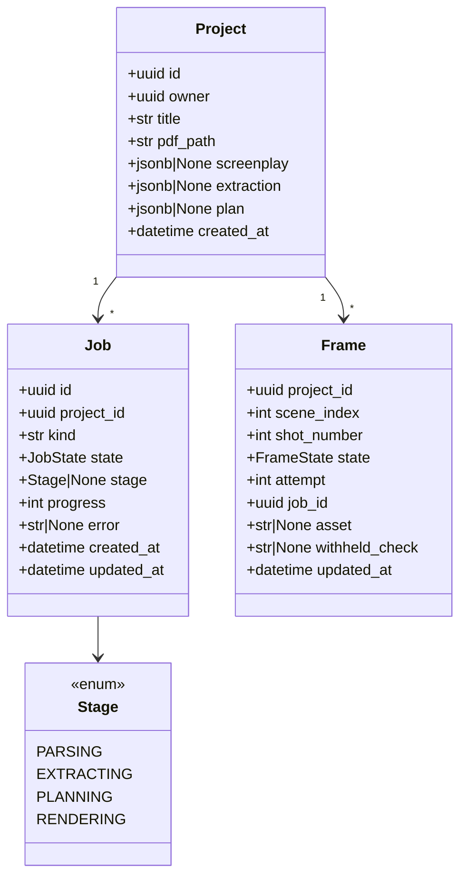
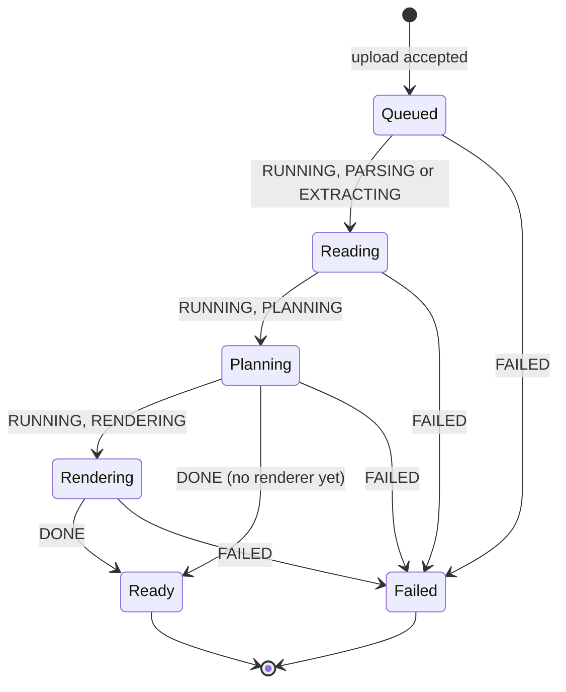

# Design — `web` (sign-in, projects, script, storyboard, frame detail)

**Status:** proposed · **Owner:** Katlego (Claude) · **Tasks:** T009, T053, T043, T046, T044, T047 (API: projects
and upload, the pipeline core, the pipeline as a job, the response schemas and view builders, the
read endpoints), T040–T042, T045 (the screens), T021 (frame state, the
audit section of the frame sheet, "Try another render"), T026 (the rendering stage), T027 (the storyboard PDF) ·
**Spec:** US1, and US2's "the audit log is visible in the app" ([SPEC.md](../../SPEC.md))

---

## 1. What this covers

The web app from sign-in to a storyboard you can click through: upload a screenplay, watch the job,
read what was found in the script, and see every frame beside the script lines it covers. It also
fixes the API the pages read, and the one new table they need (`Project`) plus two new `Job` fields.

This is where Non-negotiable I becomes visible. The storyboard screen is a **lined script**: the
screenplay page, with one vertical line per shot drawn over exactly the lines that shot cites (a
script supervisor's convention: a straight line while the speaker is on screen, a wavy one while
they're off). A frame never appears without the line it came from next to it.

**Not covered:** the comic reader (T024; its own section is added here before T024 starts),
rendering and the PDF itself (T026, T027: docs/design/storyboard.md), the
audit logic (verify.md).

## 2. Reference material

**Build to these.** The PNGs are the visual reference; the HTML beside them is the same screen as
code, and `tokens.css` is the token source every value below comes from.

| Screen | Reference | Mockup source |
| --- | --- | --- |
| Sign-in | [web/signin.png](web/signin.png) | [web/mockups/signin.html](web/mockups/signin.html) |
| Projects + upload | [web/projects.png](web/projects.png) | [web/mockups/projects.html](web/mockups/projects.html) |
| Script | [web/script.png](web/script.png) (full page) | [web/mockups/script.html](web/mockups/script.html) |
| Storyboard | [web/storyboard.png](web/storyboard.png) (full page) | [web/mockups/storyboard.html](web/mockups/storyboard.html) |
| Frame detail (sheet) | [web/storyboard-frame.png](web/storyboard-frame.png) | [web/mockups/storyboard-frame.html](web/mockups/storyboard-frame.html) |
| Storyboard on a phone | [web/storyboard-phone.png](web/storyboard-phone.png) (390 px) | same file, narrow viewport |

- Content in the mockups is the self-written lighthouse script from
  `services/api/tests/script/conftest.py`: its real lines, line numbers and page break. The frame
  images are **pencil sketches standing in for renders**; the app shows real frames (T026, audited by T021) and
  nothing where there is none (§4.3).
- Tokens: [web/mockups/tokens.css](web/mockups/tokens.css): palette, the three typefaces, radius,
  the page shadow, the six shot-line colours and the verdict colours. T040 ports them to
  `apps/web/app/globals.css` (Tailwind v4 `@theme`); shadcn/ui components are restyled with them,
  never shipped with the stock theme.
- Data shapes the pages show: script.md §6 (`Screenplay`, `Span`), grounding.md §6 (`Entity`,
  `GroundingReport`), shots.md §6 (`Shot`), verify.md §6 (`Audit`, `FrameState`).
- Hosting and auth: deploy.md §4 (the browser never calls the API; server-side fetch with the
  user's token), §3 and §5 (`Job`).

### The visual direction

- **Subject:** a writer-director's desk: the script paper on a light table, a storyboard artist's
  non-photo-blue pencil for everything you can act on.
- **Palette:** desk `#dce2e5`, paper `#fafaf7`, ink `#1a222c`, pencil `#2c6e9e` (the one accent,
  deepened to pass AA on paper). Shot lines cycle through the WGA revision-page colours (blue, pink,
  yellow, green, goldenrod, cherry), so neighbouring shots never share a colour. Verdicts: pass
  `#2f7a55`, warn `#9a620f`, withheld `#a23a2f`.
- **Type:** Big Shoulders Display (condensed, slate-like; headings and shot numbers only), Atkinson
  Hyperlegible Next (all body text), Courier Prime (anything quoted from the script, and spans).
  **Script text is always Courier Prime:** anything in Courier is the screenplay's own words,
  anything else is ours. That is how a reader tells a quote from a label at a glance.
- **Signature:** the lined script. It is the one bold element; everything else stays quiet.
- **Light theme only** in this version: paper is the metaphor (§8).

## 3. Domain model

Web view types mirror the API responses (§6). One new table and two new `Job` fields on the API:



- **`Project`** (T009, table `projects`; T046 writes the stage columns): `owner` is the Supabase Auth user id. `pdf_path` is the
  upload's path in Supabase Storage (`scripts/{owner}/{project_id}.pdf`). `screenplay`,
  `extraction` and `plan` are each stage's result, serialised from the dataclasses in script.md,
  grounding.md and shots.md §6. A stage writes its column in the same transaction that advances the
  job, so a page never sees a half-written stage. `title` is what the user typed at upload,
  defaulting to the file name without `.pdf`.
- **`Job`** (deploy.md §3) gains `project_id` and `stage`. `kind` is `"storyboard"` (the upload's
  job) or `"frame_attempt"` (one "Try another render"). `progress` is 0–100 over the whole job:
  parsing 0–5, extracting 5–40, planning 40–60, rendering 60–100 (by frames settled). The bands
  are `BANDS` in `app/projects/pipeline.py` (§6); a stage reports its band's start when it begins,
  and a job that stops after planning ends `DONE` at 60 until the rendering stage exists (T026).
- **`Frame`** (table `frames`: **T047** creates the table, its model and its read; **T021** writes it
  through the `on_state`/`on_frame` hooks, verify.md §6 and storyboard.md §6): one row per shot that has entered verify.md's state machine,
  holding its current `FrameState`, attempt number, the job that last moved it (`frame_audits.job_id`
  is that job) and, for `passed`/`warned` only, the Storage path of the accepted image. It is the
  only source of `FrameView`; `frame_audits` (verify.md §6) holds the history. **No frame reaches the
  web before T021:** T026's renderer output is never exposed on its own, only through a `frames` row
  that T021's loop has moved to `passed` or `warned`.
- **Settled** means `passed`, `warned`, `withheld` or `failed`: nothing more will happen to the
  frame without a user action. `withheld` is a subset of settled. Every count in the app uses this
  definition.
- **`Screenplay.page_starts`** (new field, T043 adds it and updates script.md §6 in the same PR):
  `tuple[int, ...]`, the 1-based first line of each page in `Screenplay.text`, so
  `page_starts[0] == 1` and `len(page_starts) == page_count`. The parser's `page_breaks` omits page
  1; `page_starts` is `(1, *page_breaks)`. The lined script needs it to break pages where the PDF did.
- **`ScriptParseError.code`** (new, T043 adds it and updates script.md §6):
  `"not_a_pdf" | "no_text_layer" | "no_headings"`, one per raise in `app/script/parser.py`, so the
  copy in §4.1 maps on a code, never on a message.

## 4. Flow

### 4.0 Sign-in

Supabase Auth, email and password (`@supabase/ssr`, cookies). Every page except `/sign-in` redirects
there when signed out. The seeded judge account is T030's. Failure copy: "That email and password
don't match. Check both and try again." Reference: signin.png.

- **`apps/web/proxy.ts`** (Next.js 16 renamed the `middleware.ts` convention to `proxy.ts`)
  refreshes the Supabase session cookie on every request and makes the redirects: a signed-out
  page request → `/sign-in`; a signed-in request for `/sign-in` or `/` → `/projects`.
- It **never redirects `/api/*`**: `/api/health` stays public (deploy.md §4's check calls it), and
  every other route handler answers a signed-out request itself with 401
  `{"error": "unauthorized"}`, the API's own shape, so a polling client gets JSON, not a sign-in page.
- The proxy is an optimistic check (Next.js's own guidance), not the guard: each page and route
  handler verifies the user again server-side before it calls the API, and the API checks the
  token itself (§6).

### 4.1 Upload and the job

```mermaid
sequenceDiagram
    participant B as Browser
    participant W as Next.js (server)
    participant A as FastAPI
    participant S as Supabase (Auth, Postgres, Storage)
    participant P as Pipeline (in the API process)
    B->>W: POST /api/projects (PDF, title)  [route handler]
    W->>A: POST /api/v1/projects, Authorization: Bearer <user access token>
    A->>S: verify the token (Auth), store the PDF (Storage)
    A->>S: INSERT project + job (QUEUED)
    A-->>W: 202 {project, job}
    W-->>B: redirect to /projects/{id}/storyboard
    A->>P: start the job (asyncio task)
    loop each stage
        P->>S: job RUNNING, stage, progress
        P->>P: parse → extract → plan → render (storyboard.md build_storyboard, T026; loop T021)
        P->>S: write the stage's column; advance
    end
    P->>S: job DONE (or FAILED, error)
    loop every 2 s while QUEUED or RUNNING
        B->>W: GET /api/projects/{id}/status
        W->>A: GET /api/v1/projects/{id}
        A-->>B: summary + job (via W)
    end
```

- **Until T021's loop exists, the pipeline stops after planning** with the job `DONE`, and the
  storyboard shows shot cards with no frame (§4.3). This is the real state of a project with no
  audited renders, not a stand-in. The rendering stage is storyboard.md §4's `build_storyboard`
  (T026), which renders through verify's loop (T021); the loop writes `frames` and `frame_audits`
  rows as it goes. The storyboard JSON (T027) is an export, not what the pages read.
- **Failures** set `FAILED` with an `error` written for the user, never an exception text:
  - `ScriptParseError.code == "not_a_pdf"` → "This file couldn't be opened as a PDF. Export the
    script from your screenwriting app as a PDF and upload that."
  - `"no_text_layer"` → "This PDF has no text layer. It looks like a scan. Export the script from
    your screenwriting app as a PDF and upload that."
  - `"no_headings"` → "No scene headings found. Panelwise reads screenplays formatted with
    headings like INT. KITCHEN - NIGHT."
  - extraction or planning failed (`ExtractionError`, `ShotError`) → "Reading the script failed at
    scene {n}. Nothing was saved from this run. Upload the script again to retry." `{n}` is the
    scene's `number` as the script prints it (`12A`), from the error's `scene` attribute
    (grounding.md and shots.md §6): for an extraction chunk, the first scene in the chunk.
  - over the extraction budget: `extract()` raises `ExtractionError` before any model call when the
    script splits into more than `max_chunks` (40) chunks (`app/grounding/extract.py`). T043
    checks the chunk count itself (`chunk_scenes`) before calling, so this case is told apart from
    a failed call and no model is called → "This script is longer than this demo reads. Upload a
    shorter one." (An `ExtractionError` whose `scene` is `None` is this budget error, so it maps
    to the same copy.)
  - anything else is a bug, not a user error: `run_pipeline` lets it propagate, and T046 logs it
    with its traceback and fails the job with "Something went wrong on our side while reading this
    script. Upload it again to retry." The exception text never reaches the user.
  - The copy is chosen from `ScriptParseError.code`, the exception type and `scene`, **never from
    an exception's message text**. Each string is a constant in `app/projects/pipeline.py`.
  - the API restarted mid-job: on startup every `QUEUED` or `RUNNING` job, of either kind, becomes
    `FAILED` with "The server restarted while this ran. Upload the script again." (deploy.md §5: a
    retry is a new job), and every `frames` row in `rendering` or `auditing` becomes `failed` (verify.md §5's
    sweep edges), its card reading "Rendering was interrupted by a restart." T009 builds the job
    half of the sweep; T021, which writes `frames` (T047 creates the table), adds the frame half.
- Upload limits (size, pages) are T030's; the API refuses over-limit files with 413 before storing.
  **Constraint for T030:** the upload passes through a Vercel function, whose request body limit is
  about 4.5 MB (Vercel's documented function payload limit; check it when T030 sets the figure), so
  the upload limit must sit below it. Screenplay PDFs with a text layer are typically well under
  1 MB.

### 4.2 Script

Server component: `GET /api/v1/projects/{id}` → `Project` (§6). Three columns (script.png): scenes
(number, heading in Courier, resolved time and whether it was carried from an earlier scene, element
and shot counts), the entities by kind (each with every quote in Courier and its span, and where it
came from: "Found by the model", "Added from dialogue cues", "From the heading"), and the report
(faithfulness and recall **always together**, each with its counts in words, then the models and
tokens). Dropped entities are counted in the report and never listed (SPEC US1). On a phone the
columns stack: intro, report, entities, scenes.

### 4.3 Storyboard

Server component: `Project`, `GET …/lines`, `GET …/shots`, `GET …/frames`, all in parallel. The
client part polls `GET /api/projects/[id]/status` every 2 s **while the latest job is `queued` or
`running`, or any frame is `rendering` or `auditing`** (a "Try another render" runs after the upload's
job is `DONE`). `status` returns the `ProjectSummary` (its `frames` counts included); when the counts
change, the client fetches `GET /api/projects/[id]/frames` and re-renders the board.

- **Lined script** (left, sticky, scrolls on its own): each page is a paper sheet with its lines in
  Courier Prime, line numbers in the margin, the page number top right. Each shot is a line in the
  gutter from its `span.line_start` to `span.line_end`, labelled with its id (`1.4`) and coloured
  `--line-{(k mod 6)+1}` for the k-th shot in script order. A shot's line is **wavy** over the lines
  of a dialogue element whose speaker is not in the shot's characters, and straight elsewhere
  (`ShotView.segments`). A shot that runs past a page's end ends in an arrowhead and continues at
  the top of the next page.
- **Frame board** (right): one heading per scene (number and heading), then a card per shot in
  order: the frame (16:9), the shot id and camera, the verdict, who and what is in frame, the
  verbatim source in Courier with its span. The card's top edge is its shot line's colour.
- **Linking:** hovering or focusing a card highlights its shot line and tints its lines
  (`--pencil-soft`); clicking a shot line scrolls to its card and focuses it. Clicking a card opens
  the frame sheet (§4.4) and sets `?shot=1.4`, so a frame can be linked to.
- **Card states** follow `FrameView.state` (verify.md §5). The frame image is shown **only** for
  `passed` and `warned` (§6: the API sends `image_url` for nothing else):

| `FrameView` | Card media | Verdict label | Extra line |
|---|---|---|---|
| none yet (no `frames` row: before T021, or not reached) | the hatched panel, "Not rendered yet" | — | — |
| `rendering` | hatched panel, three dots, "Rendering attempt {n} of {max}" | "Rendering" | — |
| `auditing` | same, "Auditing attempt {n} of {max}" | "Auditing" | — |
| `passed` | the frame | "Passed audit" | "Passed on attempt {n} of {max}" when n > 1 |
| `warned` | the frame | "Passed with a warning" | each failed soft check: "Light: day light in a night scene" |
| `withheld` | a text card: the verbatim source, its span, "Frame withheld: failed audit ({check})", button "Try another render" | "Withheld" | — |
| `failed` | a text card: the source, its span, "The renderer failed on this frame." (or, after the restart sweep, "Rendering was interrupted by a restart.") | "Render failed" | — |

  Withheld and failed cards carry the source **once**, in the text card; the source line under the
  header is left out for them. Spans on cards read `p.1 l.7–8` (`l.14` for one line), in the body
  face, not Courier: Atkinson Hyperlegible is built to tell `l` from `1`, Courier is not, and a
  span sits next to shot ids like `1.4`.

- **Job strip** under the bar while polling (above): the stage in words ("Reading the script",
  "Planning shots", "Rendering frames"), a meter at settled ÷ total, and "{settled} of {total}
  frames settled · {withheld} withheld" while rendering (§3: withheld counts as settled).
- **Export PDF** (bar, right): disabled with the tooltip "Available when every frame has settled"
  until the storyboard job is `DONE` and every shot has a settled `frames` row, with no frame
  `rendering` or `auditing`; then it downloads T027's PDF, built on demand. (A job that failed on a
  renderer error leaves shots with no row, so Export stays disabled.)
- **Phones** (≤ 1100 px): the lined script is hidden and every card keeps its own source and span
  (storyboard-phone.png), so a frame is still never shown without its lines. The project tabs drop
  to a second row of the bar (≤ 640 px).

### 4.4 Frame sheet

A right-hand sheet over the board (Radix Dialog, focus trapped, Esc and × close it, the URL loses
`?shot=`). Sections, in order (storyboard-frame.png):

1. Header: shot id, framing, movement, time of day, verdict.
2. The frame, or its text card (the same rule as the card).
3. **From the script:** for dialogue, the cue and extension as a small label (they sit outside the
   span), then the verbatim text in Courier with a left rule in the shot's colour, then "Page {p},
   lines {a}–{b} · scene {n}, {heading}".
4. **In frame:** each shot character as a chip with its position from the accepted audit
   (`positions`), then props; then the planner's one-sentence rationale.
5. **Audit · {n} attempts** (T021): one block per attempt, newest last: attempt number, verdict,
   seed; "Seen" (the describer's people, setting, light and shot size, in words); "Judged" (who
   each person was called); the failed checks with their details, then "{k} other checks passed"
   (or "All 7 checks passed"); finally "Described by {vision model} · judged by {judge model}".
   Before T021 lands this section is absent, not empty. (T045 builds steps 1–4.)

## 5. State

The project page's view follows the job (deploy.md §5) and its stage:



- **Queued / Reading:** the Script and Storyboard tabs show the job strip and nothing else.
- **Planning:** Script shows the entities and report; Storyboard shows the job strip.
- **Rendering / Ready:** both tabs are complete; frames follow the card table.
- **Failed:** both tabs show the error (the Projects list does too, projects.png) and the stage it
  failed at. A new upload is the retry.

Frame card states are verify.md §5's `FrameState`; the card never shows an image outside
`passed`/`warned`.

## 6. Contracts

**API** (FastAPI, `/api/v1`, every route requires `Authorization: Bearer <Supabase access token>`,
verified against Supabase Auth; a project belongs to its `owner`, anyone else gets 404):

| Method, path | Body | Response | Task |
|---|---|---|---|
| `POST /projects` | multipart: `file` (PDF), `title` | 202 `{project: ProjectSummary, job: Job}` · 400 `{error: "not_a_pdf"}` (no `%PDF` header) · 400 `{error: "no_file" \| "bad_form"}` · 411 `{error: "length_required"}` · 413 `{error: "too_large"}` · 401 `{error: "unauthorized"}` · 503 `{error: "auth_unavailable" \| "storage_unavailable"}` (§6 *API internals*) | T053 |
| `GET /projects` | — | 200 `ProjectSummary[]`, newest first · 401 · 503 `auth_unavailable` | T053 |
| `GET /projects/{id}` | — | 200 `Project` | T047 |
| `GET /projects/{id}/lines` | — | 200 `LinesView` · 409 while parsing | T047 |
| `GET /projects/{id}/shots` | — | 200 `ShotView[]` in script order · 409 before planning ends | T047 |
| `GET /projects/{id}/frames` | — | 200 `FrameView[]`, one per `frames` row (no rows exist until T021 writes them) | T047 (creates and reads `frames`) |
| `GET /projects/{id}/storyboard.pdf` | — | 200 PDF, built on demand (storyboard.md §6 `layout_document`, `render_pdf`) and stored by content hash · 409 unless the job is `DONE` and every shot is settled | T027 |
| `POST /projects/{id}/frames/{scene_index}/{number}/attempts` | — | 202 `FrameView` (`withheld` → `rendering`, under a new `frame_attempt` job) · 409 in any other state | T021 |

**The pipeline core** (T043; no database: T046 runs it as a job and writes what it reports, T026
adds the rendering stage):

```python
# app/projects/pipeline.py
class Stage(StrEnum):
    PARSING = "parsing"; EXTRACTING = "extracting"; PLANNING = "planning"; RENDERING = "rendering"
BANDS: Mapping[Stage, tuple[int, int]]   # §3: PARSING (0, 5), EXTRACTING (5, 40), PLANNING (40, 60), RENDERING (60, 100)
type StageResult = Screenplay | Extraction | ShotPlan
type OnAdvance = Callable[[Stage, int, StageResult | None], Awaitable[None]]

@dataclass(frozen=True)
class PipelineResult:
    screenplay: Screenplay; extraction: Extraction; plan: ShotPlan

class PipelineError(RuntimeError):
    def __init__(self, stage: Stage, message: str) -> None: ...
    stage: Stage       # the stage that failed
    message: str       # == str(self): one §4.1 string, verbatim; the cause is __cause__, for the log only

# §4.1 copy, verbatim
NOT_A_PDF: str; NO_TEXT_LAYER: str; NO_HEADINGS: str; TOO_LONG: str
READ_FAILED: str   # "Reading the script failed at scene {n}. …", filled with str.format(n=...)
UNEXPECTED: str    # "Something went wrong on our side …": T046's, for an exception run_pipeline doesn't map

async def run_pipeline(
    pdf: bytes, model: NebiusChatModel, *, on_advance: OnAdvance,
    chunk_chars: int = 12_000, max_chunks: int = 40,
) -> PipelineResult: ...
```

`run_pipeline` awaits `on_advance(stage, progress, finished)` as each stage **begins**, with the
band's start and the result of the stage before it, and does not start the stage until the hook
returns (an exception from the hook propagates unchanged):

| Call | Means | T046 writes, in one transaction |
|---|---|---|
| `(PARSING, 0, None)` | parsing begins | job `RUNNING`, stage, progress |
| `(EXTRACTING, 5, screenplay)` | parsed; extraction begins | `projects.screenplay`, stage, progress |
| `(PLANNING, 40, extraction)` | extracted; planning begins | `projects.extraction`, stage, progress |
| returns `PipelineResult` | planned | `projects.plan`, progress 60, job `DONE` |

One hook, not separate progress and result hooks, so a stage's column and the job's advance are one
write and a page never sees one without the other (§3). The chunk budget is checked with
`chunk_scenes(screenplay, chunk_chars)` before `extract` is called with the same `chunk_chars` and
`max_chunks`. Every failure in §4.1 is raised as `PipelineError` (from the original, as its
`__cause__`); nothing else is caught. `python -m app.projects.run <pdf>` runs it on the real
account and prints each advance and a summary (T043's live check).

```python
# app/projects/job.py (T046)
async def run_job(job_id: uuid.UUID, *, sessions: async_sessionmaker[AsyncSession],
                  store: AssetStore, model: NebiusChatModel) -> None: ...
#   reads the job's project and its PDF (store.get(project.pdf_path)), then run_pipeline with an
#   on_advance that makes the writes in the table above; PipelineError → FAILED, stage=error.stage,
#   error=error.message, the columns already written kept; any other exception → logged with its
#   traceback, FAILED with §4.1's "went wrong on our side" copy. Never raises.
```

**API internals: auth, storage, upload** (T009 builds the data layer, T053 the rest):

```python
# app/core/auth.py (T053)
@dataclass(frozen=True)
class Caller:
    user_id: uuid.UUID                     # the token's `sub`: the Supabase Auth user id, `projects.owner`
class AuthError(Exception): ...            # any reason a token is refused; never says which to the client
class TokenVerifier(Protocol):
    async def verify(self, token: str) -> Caller: ...
class SupabaseJwtVerifier:                 # TokenVerifier
    def __init__(self, *, supabase_url: str, client: httpx2.AsyncClient, jwks_ttl_s: float = 600) -> None: ...
#   Verifies locally with PyJWT against {supabase_url}/auth/v1/.well-known/jwks.json. The token's
#   header must carry a string `kid`; the key is the JWK with that `kid`, and the algorithm is the
#   one that key implies (its `alg`, or ES256 for an EC P-256 key with none), never the header's
#   claim alone. Allowed: ES256 and RS256 only; HS256 and `none` are refused (the project signs
#   with ES256, checked 2026-10-02). Required claims, present and valid: exp, iat (30 s leeway),
#   aud == "authenticated", iss == f"{supabase_url}/auth/v1", sub a UUID, role == "authenticated",
#   and is_anonymous not true. **JWKS cache:** kept jwks_ttl_s; an unknown `kid` refetches at most
#   once per 60 s, shared across requests behind one lock (a flood of random `kid`s makes one
#   request a minute, not one each); a failed fetch keeps serving the cached keys, and with no
#   cached keys at all the request is 503 {"error": "auth_unavailable"}, never a 401 (a 401 would
#   sign the user out for Supabase's outage). **Accepted:** verification is local, so a token stays
#   valid until its `exp` (at most an hour) after sign-out or revocation.
async def current_caller(request: Request) -> Caller: ...   # FastAPI dependency
#   `Authorization: Bearer <token>` → app.state.verifier.verify; missing or refused → 401
#   {"error": "unauthorized"} with `WWW-Authenticate: Bearer`; no verifier configured (no
#   SUPABASE_URL) → 503 {"error": "auth_unavailable"}.

# app/storage/store.py (T053): storyboard.md §6 `AssetStore` / `SupabaseStore`, verbatim.

# app/projects/model.py, app/jobs/model.py (T009): SQLAlchemy rows for deploy.md §6's tables
class JobState(StrEnum): QUEUED = "queued"; RUNNING = "running"; DONE = "done"; FAILED = "failed"
class JobKind(StrEnum): STORYBOARD = "storyboard"; FRAME_ATTEMPT = "frame_attempt"
RESTARTED: str   # §4.1, verbatim: "The server restarted while this ran. Upload the script again."

# app/projects/repo.py, app/jobs/repo.py (T009); every function takes an AsyncSession and doesn't commit
async def create_upload(session, *, project_id: uuid.UUID, owner: uuid.UUID, title: str,
                        pdf_path: str) -> tuple[ProjectRow, JobRow]: ...   # the project and its STORYBOARD job, QUEUED
async def list_summaries(session, owner: uuid.UUID) -> list[ProjectSummary]: ...   # newest first, each with its latest job
async def fail_interrupted(session) -> int: ...   # every QUEUED or RUNNING job → FAILED, error RESTARTED, stage kept; returns the count
```

- **`ProjectSummary` before T046.** `pages`, `scenes` and `shots` are `null` until T046 writes the
  stage columns and makes `list_summaries` read them (`codec.py`; T046's Files and Done), and
  `frames` is `null` until T047/T021 add the `frames` table. That is the real state of a project
  nothing has processed, not a stand-in: T053's jobs stay `QUEUED` until T046 runs them.
- **The startup sweep** (§4.1): the API's lifespan calls `fail_interrupted` in its own transaction
  before serving. If the database is unreachable then, it logs and starts anyway (the health check
  reports it), and the next start sweeps.
- **`POST /projects`, in order** (T053). The route takes `request: Request` and no `UploadFile`
  or `Form` parameter, because FastAPI reads a body parameter before any dependency runs, which
  would spool an unlimited upload before the caller is checked: (1) `current_caller` (401/503), and
  no storage configured → 503 `{"error": "storage_unavailable"}`, both before any body is read;
  (2) `Content-Length` missing → 411 `{"error": "length_required"}`; above `upload_max_bytes` plus
  64 KiB of multipart framing → 413 `{"error": "too_large"}`, nothing read; (3)
  `await request.form(max_files=1, max_fields=1)`, with Starlette's form-limit `HTTPException`
  (raised as 400) mapped: too many files or fields → 400 `{"error": "bad_form"}`; no `file` part,
  or a `file` part that isn't a file (sent without a filename, Starlette parses it as text: check
  `isinstance(form.get("file"), UploadFile)`) → 400 `{"error": "no_file"}`; then the file's own size (`UploadFile.size`; Starlette's
  `max_part_size` bounds text fields only, never a file) above `upload_max_bytes` → 413 `too_large`,
  and a `title` field over 1 KiB → 413 `too_large`; (4) bytes not starting `%PDF-` → 400
  `{"error": "not_a_pdf"}`; `title` = the form field, else the file name without `.pdf`, trimmed,
  at most 200 characters, else `"Untitled"`; a new `project_id`; `store.put(f"scripts/{owner}/{project_id}.pdf",
  data, "application/pdf")`; then `create_upload` and commit; 202 `{project, job}`. Storage first,
  so a row never points at a missing file; a failed insert leaves an unreferenced file, which is
  harmless.
- **Settings** (T009/T053): `supabase_url`, `supabase_secret_key`, `supabase_storage_bucket`
  (default `panelwise`; `panelwise-dev` in a local `.env`), `upload_max_bytes` (default 4,000,000:
  under Vercel's ~4.5 MB function body limit, §4.1; T030 may lower it).
- **New dependencies:** `alembic`, `pyjwt[crypto]` (PyJWT and `cryptography`), `python-multipart`
  (FastAPI's form parsing).

**API internals: the reads and the `frames` table** (T047):

- **Errors:** a project id that isn't a UUID, doesn't exist, or belongs to someone else → 404
  `{"error": "not_found"}` (the same answer for all three, so ids can't be probed); `…/lines`
  before the screenplay column exists, and `…/shots` before the plan column exists → 409
  `{"error": "not_ready"}`; every route also answers 401/503 as `current_caller` does. The `{id}`
  path parameter is declared `str` and parsed by hand: typed `uuid.UUID`, FastAPI would answer a
  malformed id with its own 422 instead of the 404.
- **`GET /projects/{id}`** builds `Project` from the row with T044's builders: `scene_list` =
  `scene_views(screenplay, plan)` once the screenplay column exists, else `null`; `entities` =
  `entity_views(extraction)` and `report` = `report_view(extraction, plan)` once the extraction
  column exists, else `null`. The summary fields come from the same query as `list_summaries`
  (`app/projects/repo.py`: one shared query, filtered to one project for this route).
- **`frames` table** (migration `0002`, `lock_down` like every table, deploy.md §6):
  `project_id uuid references projects(id) on delete cascade`, `scene_index int`, `shot_number int`
  (primary key the three), `state text` (`rendering`, `auditing`, `passed`, `warned`, `withheld`,
  `failed`: verify.md §5's `FrameState`, CHECK), `attempt int ≥ 1`, `job_id uuid references
  jobs(id) on delete cascade`, `asset text null` (CHECK: null unless `passed` or `warned`: a
  withheld frame's file is never referenced), `withheld_check text null`, `updated_at timestamptz
  default clock_timestamp()`. T047 creates and reads it; T021 writes it. **`withheld_check`** is
  T021's to derive, since `on_frame`/`on_state` carry no check name: on the transition to
  `withheld` the writer reads the last `frame_audits` row of that frame (written by `log` before
  the transition) and stores its first failed hard check in `Check` order, lower case, or
  `audit_error` when that audit's verdict is `error`.
- **`frame_view(row, screenplay, image_url)`** (`app/frames/views.py`, pure): `shot_id` =
  `f"{screenplay.scenes[row.scene_index].number}.{row.shot_number}"` (T044's `shot_id` format; a
  row whose scene index is outside the screenplay is a bug, not a user error, and raises);
  `max_renders` = the larger of verify.md's 3 and the row's `attempt`, so a user's extra render
  reads "attempt 4 of 4", never "of 3"; `image_url` only for `passed`/`warned` with an asset, a
  signed URL valid **1 hour** (`AssetStore.signed_url`); `audits` `[]` until T021.
  **`ProjectSummary.frames`** is `null` when the project has no plan or no `frames` rows; else
  `total` is the **plan's shot count** (rows exist only for shots that have entered verify's state
  machine, so counting rows would make "settled ÷ total" and Export's "every shot settled" read too
  early), and `settled`, `withheld`, `active` count rows by §3's definitions.
- **`GET /projects/{id}/frames`**: one `FrameView` per row, in `(scene_index, shot_number)` order;
  no storage configured and a row needing a signed URL → 503 `storage_unavailable`.

**Response types** (TypeScript in `apps/web/lib/api/types.ts`; Pydantic mirrors in
`services/api/app/api/v1/schemas.py`, T044: one model per interface and per nested object, `Job`
and `ProjectSummary` included; field names identical):

```ts
type JobState = "queued" | "running" | "done" | "failed";
type Stage = "parsing" | "extracting" | "planning" | "rendering";
interface Job { id: string; state: JobState; stage: Stage | null; progress: number; error: string | null; updated_at: string }

interface ProjectSummary {
  id: string; title: string; created_at: string;
  pages: number | null; scenes: number | null; shots: number | null;          // null until known
  frames: { settled: number; total: number; withheld: number; active: number } | null;
  // null before rendering. settled = passed + warned + withheld + failed (§3); active = rendering + auditing
  job: Job;                                                                    // the latest job
}

interface SpanRef { page: number; line_start: number; line_end: number }        // script.md Span
interface QuoteView { text: string; span: SpanRef }
interface EntityView {
  kind: "character" | "prop" | "location"; name: string;
  source: "model" | "cue" | "heading"; scenes: number[]; quotes: QuoteView[];
}
interface SceneView {
  index: number; number: string; heading: string;
  time_of_day: string | null;            // resolve_times()
  time_carried: boolean;                 // true when time_of_day is not null and the heading itself had no absolute time
  elements: number; shots: number | null;
}
interface ReportView {                   // grounding.md GroundingReport, plus the run's models and tokens (extraction, and planning once it has run)
  faithfulness: number; entities_proposed: number; entities_grounded: number;
  quotes_proposed: number; quotes_located: number;
  recall: number; cues_total: number; cues_found_by_model: number;
  models: string[]; prompt_tokens: number; completion_tokens: number;
}
interface Project extends ProjectSummary {
  scene_list: SceneView[] | null; entities: EntityView[] | null; report: ReportView | null;
}

interface LinesView { lines: string[]; page_starts: number[] }  // Screenplay.text split on "\n"; page_starts[0] == 1

interface ShotView {
  id: string;                            // "{scene number}.{shot number}", e.g. "1.4"
  scene_index: number; number: number;
  framing: "wide" | "medium" | "close_up" | "extreme_close_up" | "over_shoulder" | "pov" | "insert";
  movement: "static" | "pan" | "tilt" | "dolly" | "tracking" | "handheld" | "crane";
  characters: string[]; props: string[]; time_of_day: string | null; rationale: string;
  span: SpanRef; source: string;
  // one per covered element, in order ([] for a heading-only establishing shot); on_screen is
  // false for dialogue whose speaker (match_speaker against the extraction's characters) is not
  // in `characters`, a cue that matches no character included; true for action
  segments: { line_start: number; line_end: number; cue: string | null; on_screen: boolean }[];
}

type FrameStateView = "rendering" | "auditing" | "passed" | "warned" | "withheld" | "failed";
interface CheckView { check: string; severity: "hard" | "soft"; ok: boolean; detail: string }
interface AuditView {                    // one frame_audits row (verify.md §6)
  attempt: number; seed: number; verdict: "pass" | "warn" | "fail" | "error";
  description: {
    people: { position: "left" | "centre" | "right"; appearance: string }[];
    setting: string; light: string; shot_size: string;
    objects: { name: string; category: string; held: boolean }[]; has_text: boolean;
  } | null;
  judgement: {
    people: { person: number; character: string | null; support: string | null }[];
    objects: { object: number; kind: string; support: string | null }[];
  } | null;
  checks: CheckView[]; positions: Record<string, "left" | "centre" | "right">;
  models: string[]; created_at: string;
}
interface FrameView {
  shot_id: string; state: FrameStateView; attempt: number; max_renders: number;
  image_url: string | null;              // a Supabase Storage signed URL; non-null ONLY when passed or warned
  withheld_check: string | null;         // the first failed hard check, when withheld (or "audit_error")
  audits: AuditView[];                   // [] until T021
}
```

**View builders** (T044; pure: no database, no I/O; T047 calls them on a project's loaded
columns):

```python
# app/projects/views.py
def lines_view(screenplay: Screenplay) -> LinesView: ...
def scene_views(screenplay: Screenplay, plan: ShotPlan | None) -> list[SceneView]: ...
#   time_of_day: resolve_times(); time_carried: time_of_day is not None and absolute_time(scene.time_of_day) is None;
#   elements: len(scene.elements); shots: the plan's shots in that scene, None while plan is None
def entity_views(extraction: Extraction) -> list[EntityView]: ...   # extraction order; `scenes` are scene indexes; dropped entities never appear
def report_view(extraction: Extraction, plan: ShotPlan | None) -> ReportView: ...
#   models: the extraction's then the plan's, each once, in first-seen order; tokens: the extraction's plus the plan's
def shot_id(screenplay: Screenplay, shot: Shot) -> str: ...         # f"{scene.number}.{shot.number}", e.g. "1.4", "12A.2"
def shot_views(screenplay: Screenplay, extraction: Extraction, plan: ShotPlan) -> list[ShotView]: ...   # plan order
```

`FrameView` and `AuditView` have schemas only in T044: their data is `frames` and `frame_audits`
rows, so their builders are T047's (`FrameView`, with `audits` `[]`) and T021's (`AuditView`). The
`FrameView` model itself refuses an `image_url` outside `passed`/`warned`, so no builder can send one.

**Web routes** (Next.js App Router): `/sign-in`, `/projects`, `/projects/[id]/script`,
`/projects/[id]/storyboard` (`?shot=` opens the sheet), `/projects/[id]/comic` (T024; until then
the tab is disabled, with the tooltip "Comic pages aren't built yet"). Route handlers proxy the API server-side (deploy.md §4): `POST /api/projects`,
`GET /api/projects/[id]/status`, `GET /api/projects/[id]/frames`, `GET /api/projects/[id]/storyboard.pdf`,
`POST /api/projects/[id]/frames/[scene]/[number]/attempts`.

**Component tree** (`apps/web/components/`, each built on shadcn/ui primitives restyled with the
tokens):

```
AppBar (wordmark, project title?, ProjectTabs?, actions, user menu)
SignInForm
ProjectsPage
├── UploadPanel (DropZone, TitleField, "Board this script" button)
└── ProjectList → ProjectRow (title, facts, JobState line, meter | error)
ScriptPage
├── SceneIndex → SceneItem
├── EntitySection (kind) → EntityCard → QuoteLine (Quote + SpanRef)
└── ReportPanel → ScoreCard ×2, ModelLine
StoryboardPage
├── ExportButton (in AppBar actions; disabled until settled)   [T042]
├── JobStrip
├── LinedScript → ScriptSheet (per page) → ScriptLine*, ShotLine* ; Legend
├── FrameBoard → SceneHeader, FrameCard (FrameMedia | PendingMedia | WithheldCard | FailedCard)   [T042]
└── FrameSheet → FrameMedia, SourceBlock, InFrame   [T045], AuditLog → AttemptItem → CheckList   [T021]
shared (components/shared/, T040): Verdict, SpanRef, Quote (Courier), Meter
```

**Copy** (sentence case, the user's side of the screen; actions keep their names through the flow):

| Where | Text |
|---|---|
| Projects heading | "Board your script" |
| Drop zone | "Drop a screenplay PDF here, or choose a file" · "Export it from your screenwriting app so the text can be read. Scanned pages can't be." |
| Upload button | "Board this script" |
| Script eyebrow | "Read from the script" |
| Faithfulness | "{g} of {p} things the model named are in the script. {l} of {q} quotes found on the page." |
| Recall | "{f} of {c} speaking characters found by the model. A speaker it misses is still added from their dialogue cues." |
| Withheld | "Frame withheld: failed audit ({check in words})" · button "Try another render" |
| Export tooltip | "Available when every frame has settled" |

Check names in words: `unscripted_person` "unscripted person", `unscripted_object` "unscripted
object", `text_in_frame` "text in frame", `setting` "wrong setting", `missing_character` "missing
character", `light` "light", `framing` "framing", `audit_error` "the audit couldn't run".

## 7. Structure

| Path | New? | Responsibility | Task |
| --- | --- | --- | --- |
| `services/api/app/core/auth.py` | new | Supabase access-token check (a FastAPI dependency), §6 *API internals* | T053 |
| `services/api/app/storage/{__init__,store}.py` | new | storyboard.md §6 `AssetStore`/`SupabaseStore`, built with the upload (T053); frame images added by T026 (storyboard.md §3.3) | T053 |
| `services/api/app/jobs/` + migration | new | the `Job` table with `project_id`, `stage`; the restart sweep | T009 |
| `services/api/app/projects/{model,repo}.py` + migration | new | the `projects` table | T009 |
| `services/api/app/api/v1/projects.py` (POST, list) | new | §6 rows marked T053 | T053 |
| `services/api/app/api/v1/schemas.py` | new | every §6 response type as a Pydantic model, field names identical | T044 |
| `services/api/app/projects/views.py` | new | the view builders (§6): scenes, entities, report, lines, shots with `segments` | T044 |
| `services/api/app/projects/{__init__,pipeline}.py` | new | `run_pipeline`: parse → extract → plan, the chunk-budget pre-check, `on_advance` per stage, §4.1 copy by code and type (§6); no database | T043 |
| `services/api/app/projects/run.py` | new | `python -m app.projects.run <pdf>`: the pipeline on the real account, printing each advance and a summary | T043 |
| `services/api/app/grounding/{model,extract}.py`, `services/api/app/shots/{model,planner}.py` | changed | `ExtractionError.scene`, `ShotError.scene`, the scene number the §4.1 copy names (+ grounding.md, shots.md §6) | T043 |
| `services/api/app/projects/job.py` | new | `run_job` (§6): the upload's job runs `run_pipeline`, each stage's column written with the job's advance in one transaction; failures to `FAILED` with the copy | T046 |
| `services/api/app/projects/codec.py` | new | the stage columns' jsonb: `Screenplay`, `Extraction`, `ShotPlan` to JSON and back, lossless (the read endpoints load them, T047) | T046 |
| `services/api/app/api/v1/projects.py` (POST starts the job) | changed | the upload schedules `run_job` as an asyncio task after its commit (§4.1) | T046 |
| `services/api/app/projects/pipeline.py` (RENDERING stage) | changed | in `run_pipeline`: `on_advance(RENDERING, 60, plan)`, then `build_storyboard` with T021's writers, `progress(settled, total)` mapped into 60–100; T046's `run_job` marks the job `DONE` | T026 |
| `services/api/app/frames/{model,repo,views}.py` + migration (`frames`) | new | the table, its read for `…/frames`, `FrameView` from a row | T047 |
| `services/api/app/script/{model,parser}.py` | changed | `Screenplay.page_starts`, `ScriptParseError.code` (+ script.md §6) | T043 |
| `services/api/app/api/v1/projects.py` (read endpoints) | changed | §6 rows marked T047 | T047 |
| `apps/web/app/globals.css`, `apps/web/components/ui/*` | new | tokens as Tailwind `@theme`; shadcn/ui primitives restyled | T040 |
| `apps/web/lib/{supabase,api}/*`, `apps/web/proxy.ts` | new | `@supabase/ssr` session, typed API client, §6 types; the proxy's redirects (§4.0) | T040 |
| `apps/web/app/(auth)/sign-in/`, `apps/web/app/projects/page.tsx`, `apps/web/app/api/projects/route.ts`, `apps/web/components/AppBar.tsx` (ProjectTabs inside), `apps/web/components/SignInForm.tsx`, `apps/web/components/projects/*` (ProjectsPage parts) | new | §4.0, §4.1 | T040 |
| `apps/web/components/shared/{Verdict,SpanRef,Quote,Meter}.tsx` | new | used by every screen | T040 |
| `apps/web/app/projects/[id]/script/`, `components/script/*` | new | §4.2 | T041 |
| `apps/web/app/projects/[id]/storyboard/`, `components/storyboard/LinedScript.tsx` (ScriptSheet, ScriptLine, ShotLine, Legend inside), `FrameBoard.tsx` (SceneHeader inside), `FrameCard.tsx` (PendingMedia, WithheldCard, FailedCard inside), `FrameMedia.tsx` (T045 imports it), `JobStrip.tsx`, `apps/web/app/api/projects/[id]/{status,frames}/route.ts` | new | §4.3 | T042 |
| `components/storyboard/{FrameSheet,SourceBlock,InFrame}*` | new | §4.4 steps 1–4 | T045 |
| `components/storyboard/AuditLog.tsx` (AttemptItem, CheckList inside), the "Try another render" action (an edit to T042's `FrameCard.tsx`), `apps/web/app/api/projects/[id]/frames/[scene]/[number]/attempts/route.ts` | new | §4.4 step 5; §4.3 retry | T021 |
| `apps/web/app/api/projects/[id]/storyboard.pdf/route.ts`, `components/storyboard/ExportButton.tsx` | new | §4.3 export | T042 |

## 8. Decisions & alternatives

| Decision | Chosen | Rejected, and why |
|---|---|---|
| How a frame shows its source | the lined script beside the board, and the source on every card | a "source" tooltip: hides the one thing the product promises; a separate shot-list tab: splits the frame from its lines |
| Shots tab | none: the lined script *is* the shot list | a table of shots: repeats the storyboard without the frames |
| Progress | poll `status` every 2 s while active | websockets / SSE: needs a long-lived connection through Vercel for a few-minute job |
| Stage results | jsonb columns on `projects` | a table per entity: nothing queries inside them yet; the dataclasses already define the shape |
| Frame state storage | a `frames` row per shot (T021), `frame_audits` for history | deriving state from `frame_audits`: it has no row while rendering, so `rendering` and `auditing` can't be told apart |
| A job interrupted by a restart | `FAILED` on startup, upload again | resuming mid-stage: a partial extraction is exactly what grounding.md refuses to show |
| Images | Supabase Storage signed URLs, only for passed or warned frames | public bucket URLs: a withheld frame's file would be one guess away |
| Theme | light only | dark mode: the paper-on-a-light-table metaphor doesn't survive inversion, and the deadline is 2026-10-30 |
| Script text | always Courier Prime | the body face: quotes would look like our words |

Deviations from [docs/architecture-defaults.md](../architecture-defaults.md): none (shadcn/ui,
restyled).

## 9. How this is verified

- **Pipeline core (T043):** pytest, no database, models via `httpx2.MockTransport`: a good PDF
  advances `(PARSING, 0, None)` → `(EXTRACTING, 5, screenplay)` → `(PLANNING, 40, extraction)` and
  returns the plan; each `ScriptParseError.code`, the chunk budget (with no model call), a failed
  extraction chunk and a failed planning call give their §4.1 copy and stage; `page_starts` on
  every sample. Live: `python -m app.projects.run samples/the-red-kite.pdf` on the real account.
- **Schemas and views (T044):** pytest, pure: every builder on the self-written samples;
  `segments` marks an off-screen speaker's dialogue; each model's JSON field names equal this
  section's TypeScript, parsed from this file.
- **API (T009, T053, T046, T047):** pytest with a fake Supabase token verifier and the compose Postgres:
  upload → job runs the stages with `httpx2.MockTransport` models → `GET` endpoints return §6 shapes;
  another user's project is 404; each `ScriptParseError.code` gives its copy; a failed stage leaves
  the columns before it and the user-facing error; the restart sweep fails `QUEUED`/`RUNNING` jobs
  (T009) and `rendering`/`auditing` frames (T021); `…/frames` is `[]` with no `frames` rows; `image_url` is null
  for every state but passed and warned; `page_starts[0] == 1`.
- **Web (T040–T042, T045):** vitest + Testing Library on each component's states: every row of the card
  table renders; **no `` for a frame outside passed/warned**; a shot line's top and height come
  from its span; a dialogue segment off screen draws wavy; the sheet opens from `?shot=`; the lined
  script is hidden and the source shown on a narrow viewport; polling continues while any frame is
  `rendering` or `auditing` after the job is `done`; withheld cards show the source once.
- **Visual:** each screen side by side with its PNG in §2 at 1440 px (and the storyboard at 390 px),
  layout, tokens and copy matching; a difference is fixed in the code or, if the reference is
  wrong, in this doc first.
- **End to end:** DEMO.md steps 1–4 and 9 on the local stack with a real Supabase project.

## 10. Open questions

- [ ] Upload limits (bytes, pages) and the extraction budget message's page figure: T030 sets them.
- [ ] How many extra attempts "Try another render" may start per frame (SPEC open question 4).
- [ ] Who can see a project beyond its owner (SPEC open question 6); this doc assumes owner only.
- [x] Sign-up: **decided 2026-10-02 by Katlego: off.** Supabase's "Allow new users to sign up" is
  switched off in the dashboard (Katlego; required before the demo URL is public), so the sign-up
  endpoint refuses everyone, publishable key or not; only the secret key
  creates users. Accounts: the contributors' (dashboard), the dev-check user, and the judge
  account(s), seeded by T030's script and given to judges in Devpost's testing instructions, never
  in the repo. The app is unchanged: it has a sign-in page only (§4). Judges sharing one account see
  each other's uploads; T030 may seed several (`judge1`…) instead. Privacy rests on the API's owner
  check (§6), backed by row-level security with no policies (deploy.md §6, decided in T009's design).
