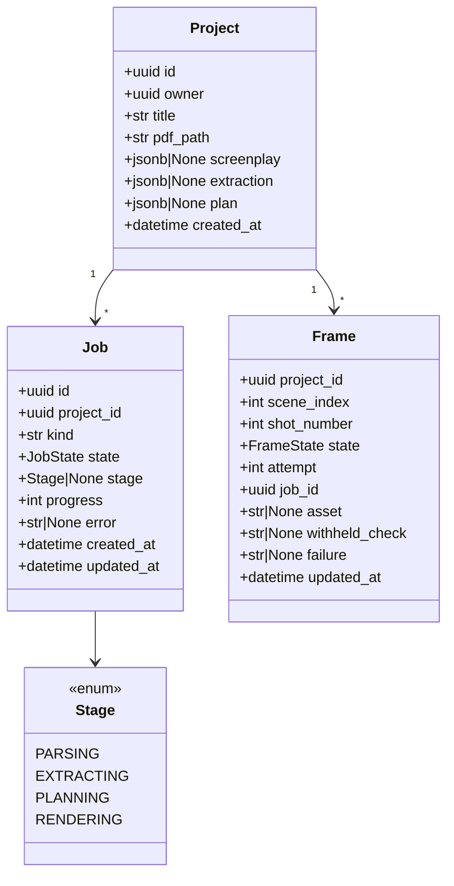
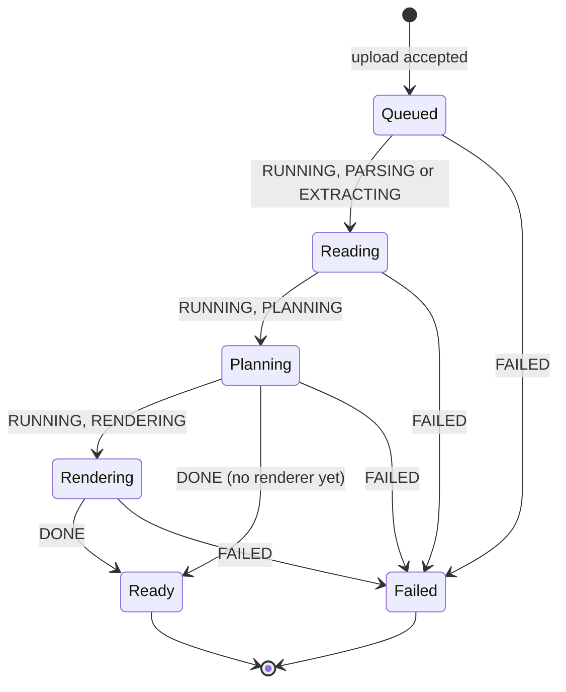

# Design — `web` (sign-in, projects, script, storyboard, frame detail)

**Status:** proposed · **Owner:** Katlego (Claude) · **Tasks:** T009, T053, T043, T046, T044, T047 (API: projects
and upload, the pipeline core, the pipeline as a job, the response schemas and view builders, the
read endpoints), T040–T042, T045 (the screens), T021 (frame state, the audit rows and the retry,
in the API), T061 (the frame sheet's audit section, "Try another render"), T062 (the architecture check), T026 (the rendering stage), T027 (the storyboard PDF) ·
**Spec:** US1, and US2's "the audit log is visible in the app" ([SPEC.md](../../SPEC.md))

---

## 1. What this covers

The web app from sign-in to a storyboard you can click through: upload a screenplay, watch the job,
read what was found in the script, and see every frame beside the script lines it covers. It also
fixes the API the pages read, and the one new table they need (`Project`) plus two new `Job` fields.

This is where Non-negotiable I becomes visible. The storyboard screen is a **lined script**: the
screenplay page, with one vertical line per shot drawn over exactly the lines that shot cites (a
script supervisor's convention: a straight line while the speaker is on screen, a wavy one while
they're off). A frame never appears without the line it came from next to it.

It also covers the comic reader (§4.5, T024): the lettered pages, one at a time, every bubble and
caption traceable to its script line.

**Not covered:** making the comic (comic.md §4a, T064; this doc fixes only its two routes and
`ComicView`), rendering and the PDF itself (T026, T027: docs/design/storyboard.md), the
audit logic (verify.md).

## 2. Reference material

**Build to these.** The PNGs are the visual reference; the HTML beside them is the same screen as
code, and `tokens.css` is the token source every value below comes from.

| Screen | Reference | Mockup source |
| --- | --- | --- |
| Sign-in | [web/signin.png](web/signin.png) | [web/mockups/signin.html](web/mockups/signin.html) |
| Projects + upload | [web/projects.png](web/projects.png) | [web/mockups/projects.html](web/mockups/projects.html) |
| Projects: the states projects.png doesn't draw (§4.1a) | [web/projects-states.png](web/projects-states.png) | [web/mockups/projects-states.html](web/mockups/projects-states.html) |
| Script | [web/script.png](web/script.png) (full page) | [web/mockups/script.html](web/mockups/script.html) |
| Script: failed, and a project that isn't there (§4.2) | [web/script-states.png](web/script-states.png) | [web/mockups/script-states.html](web/mockups/script-states.html) |
| Storyboard | [web/storyboard.png](web/storyboard.png) (full page) | [web/mockups/storyboard.html](web/mockups/storyboard.html) |
| Frame detail (sheet) | [web/storyboard-frame.png](web/storyboard-frame.png) | [web/mockups/storyboard-frame.html](web/mockups/storyboard-frame.html) |
| Storyboard on a phone | [web/storyboard-phone.png](web/storyboard-phone.png) (390 px) | same file, narrow viewport |
| Storyboard: before any frame (today's real state), still reading, failed (§4.3) | [web/storyboard-states.png](web/storyboard-states.png) | [web/mockups/storyboard-states.html](web/mockups/storyboard-states.html) |
| Comic reader (§4.5) | [web/comic.png](web/comic.png) (1440 px) | [web/mockups/comic.html](web/mockups/comic.html) |
| Comic on a phone | [web/comic-phone.png](web/comic-phone.png) (390 px) | same file, narrow viewport |
| Comic: plan not ready; planned but the storyboard still running; no comic, without a renderer (today's real state) and with; being made; failed, with and without a renderer (§4.5) | [web/comic-states.png](web/comic-states.png) | [web/mockups/comic-states.html](web/mockups/comic-states.html) |

- Content in the mockups is the self-written lighthouse script from
  `services/api/tests/script/conftest.py`: its real lines, line numbers and page break. The frame
  images are **pencil sketches standing in for renders**; the app shows real frames (T026, audited by T021) and
  nothing where there is none (§4.3). The comic mockup's page is comic.md's committed reference page 1
  of the-red-kite (real layout and lettering over test-fixture frames), with its real rects.
- Tokens: [web/mockups/tokens.css](web/mockups/tokens.css): palette, the three typefaces, radius,
  the page shadow, the six shot-line colours and the verdict colours. T040 ports them to
  `apps/web/app/globals.css` (Tailwind v4 `@theme`); shadcn/ui components are restyled with them,
  never shipped with the stock theme.
- Data shapes the pages show: script.md §6 (`Screenplay`, `Span`), grounding.md §6 (`Entity`,
  `GroundingReport`), shots.md §6 (`Shot`), verify.md §6 (`Audit`, `FrameState`).
- Hosting and auth: deploy.md §4 (the browser never calls the API; server-side fetch with the
  user's token), §3 and §5 (`Job`).

### The visual direction

- **Subject:** a writer-director's desk: the script paper on a light table, a storyboard artist's
  non-photo-blue pencil for everything you can act on.
- **Palette:** desk `#dce2e5`, paper `#fafaf7`, ink `#1a222c`, pencil `#2c6e9e` (the one accent,
  deepened to pass AA on paper). Shot lines cycle through the WGA revision-page colours (blue, pink,
  yellow, green, goldenrod, cherry), so neighbouring shots never share a colour. Verdicts: pass
  `#2f7a55`, warn `#9a620f`, withheld `#a23a2f`.
- **Type:** Big Shoulders Display (condensed, slate-like; headings and shot numbers only), Atkinson
  Hyperlegible Next (all body text), Courier Prime (anything quoted from the script, and spans).
  **Script text is always Courier Prime:** anything in Courier is the screenplay's own words,
  anything else is ours. That is how a reader tells a quote from a label at a glance.
- **Signature:** the lined script. It is the one bold element; everything else stays quiet.
- **Light theme only** in this version: paper is the metaphor (§8).

## 3. Domain model

Web view types mirror the API responses (§6). One new table and two new `Job` fields on the API:



- **`Project`** (T009, table `projects`; T046 writes the stage columns): `owner` is the Supabase Auth user id. `pdf_path` is the
  upload's path in Supabase Storage (`scripts/{owner}/{project_id}.pdf`). `screenplay`,
  `extraction` and `plan` are each stage's result, serialised from the dataclasses in script.md,
  grounding.md and shots.md §6. A stage writes its column in the same transaction that advances the
  job, so a page never sees a half-written stage. `title` is what the user typed at upload,
  defaulting to the file name without `.pdf`.
- **`Job`** (deploy.md §3) gains `project_id` and `stage`. `kind` is `"storyboard"` (the upload's
  job) or `"frame_attempt"` (one "Try another render"). `progress` is 0–100 over the whole job:
  parsing 0–5, extracting 5–40, planning 40–60, rendering 60–100 (by frames settled). The bands
  are `BANDS` in `app/projects/pipeline.py` (§6); a stage reports its band's start when it begins,
  and a job that stops after planning ends `DONE` at 60 until the rendering stage exists (T026).
- **`Frame`** (table `frames`: **T047** creates the table, its model and its read; **T021** writes it
  through the `on_state`/`on_frame` hooks, verify.md §6 and storyboard.md §6): one row per shot that has entered verify.md's state machine,
  holding its current `FrameState`, attempt number, the job that last moved it (`frame_audits.job_id`
  is that job) and, for `passed`/`warned` only, the Storage path of the accepted image. It is the
  only source of `FrameView`; `frame_audits` (verify.md §6) holds the history. **No frame reaches the
  web before T021:** T026's renderer output is never exposed on its own, only through a `frames` row
  that T021's loop has moved to `passed` or `warned`.
- **Settled** means `passed`, `warned`, `withheld` or `failed`: nothing more will happen to the
  frame without a user action. `withheld` is a subset of settled. Every count in the app uses this
  definition.
- **`Screenplay.page_starts`** (new field, T043 adds it and updates script.md §6 in the same PR):
  `tuple[int, ...]`, the 1-based first line of each page in `Screenplay.text`, so
  `page_starts[0] == 1` and `len(page_starts) == page_count`. The parser's `page_breaks` omits page
  1; `page_starts` is `(1, *page_breaks)`. The lined script needs it to break pages where the PDF did.
- **`ScriptParseError.code`** (new, T043 adds it and updates script.md §6):
  `"not_a_pdf" | "no_text_layer" | "no_headings"`, one per raise in `app/script/parser.py`, so the
  copy in §4.1 maps on a code, never on a message.

## 4. Flow

### 4.0 Sign-in

Supabase Auth, email and password (`@supabase/ssr`, cookies). Every page except `/sign-in` redirects
there when signed out. The seeded judge account is T030's. Failure copy: "That email and password
don't match. Check both and try again." Reference: signin.png.

- **`apps/web/proxy.ts`** (Next.js 16 renamed the `middleware.ts` convention to `proxy.ts`)
  refreshes the Supabase session cookie and makes the redirects: a signed-out page request →
  `/sign-in`; a signed-in request for `/sign-in` → `/projects`; `/` → `/projects` signed in,
  `/sign-in` signed out. There is no page at `/`: the proxy alone answers it.
- **Matcher:** every path except `_next/static`, `_next/image`, `favicon.ico` and any path ending
  in a file extension (fonts, images). `/api/*` **is** matched, so the refreshed cookie reaches
  route handlers, but it is **never redirected**: `/api/health` stays public (deploy.md §4's check
  calls it), and every other route handler answers a signed-out request itself with 401
  `{"error": "unauthorized"}`, the API's own shape, so a polling client gets JSON, not a sign-in page.
- **Refresh:** `createServerClient` (`@supabase/ssr`) with `cookies.getAll`/`setAll` on the
  request, then `auth.getClaims()`. Whatever the proxy returns, the pass-through response or a
  redirect, carries every cookie `setAll` wrote; a redirect that drops them loses the refreshed
  session.
- **The guard** is not the proxy, which is an optimistic check (Next.js's own guidance): each page
  and route handler calls `auth.getClaims()` server-side (it verifies the token against the
  project's JWKS, as the API does; never `getSession()` alone) and only then reads the session's
  access token to call the API, which checks it again (§6).
- **Sign in** is a server action (`signInWithPassword`): success → `/projects`; refused → the
  failure copy above; Supabase unreachable → "Signing in isn't working right now. Try again in a
  minute." While it runs the button reads "Signing in…". **Sign out** (the bar's "Sign out",
  projects.png) is a server action too: `signOut`, then `/sign-in`.

### 4.1 Upload and the job

```mermaid
sequenceDiagram
    participant B as Browser
    participant W as Next.js (server)
    participant A as FastAPI
    participant S as Supabase (Auth, Postgres, Storage)
    participant P as Pipeline (in the API process)
    B->>W: POST /api/projects (PDF, title)  [route handler]
    W->>A: POST /api/v1/projects, Authorization: Bearer <user access token>
    A->>S: verify the token (Auth), store the PDF (Storage)
    A->>S: INSERT project + job (QUEUED)
    A-->>W: 202 {project, job}
    W-->>B: redirect to /projects/{id}/storyboard
    A->>P: start the job (asyncio task)
    loop each stage
        P->>S: job RUNNING, stage, progress
        P->>P: parse → extract → plan → render (storyboard.md build_storyboard, T026; loop T021)
        P->>S: write the stage's column; advance
    end
    P->>S: job DONE (or FAILED, error)
    loop every 2 s while QUEUED or RUNNING
        B->>W: GET /api/projects/{id}/status
        W->>A: GET /api/v1/projects/{id}
        A-->>B: summary + job (via W)
    end
```

- **Until T021's loop exists, the pipeline stops after planning** with the job `DONE`, and the
  storyboard shows shot cards with no frame (§4.3). This is the real state of a project with no
  audited renders, not a stand-in. The rendering stage is storyboard.md §4's `build_storyboard`
  (T026), which renders through verify's loop (T021); the loop writes `frames` and `frame_audits`
  rows as it goes. The storyboard JSON (T027) is an export, not what the pages read.
- **Failures** set `FAILED` with an `error` written for the user, never an exception text:
  - `ScriptParseError.code == "not_a_pdf"` → "This file couldn't be opened as a PDF. Export the
    script from your screenwriting app as a PDF and upload that."
  - `"no_text_layer"` → "This PDF has no text layer. It looks like a scan. Export the script from
    your screenwriting app as a PDF and upload that."
  - `"no_headings"` → "No scene headings found. Panelwise reads screenplays formatted with
    headings like INT. KITCHEN - NIGHT."
  - extraction or planning failed (`ExtractionError`, `ShotError`) → "Reading the script failed at
    scene {n}. Nothing was saved from this run. Upload the script again to retry." `{n}` is the
    scene's `number` as the script prints it (`12A`), from the error's `scene` attribute
    (grounding.md and shots.md §6): for an extraction chunk, the first scene in the chunk.
  - over the extraction budget: `extract()` raises `ExtractionError` before any model call when the
    script splits into more than `max_chunks` (40) chunks (`app/grounding/extract.py`). T043
    checks the chunk count itself (`chunk_scenes`) before calling, so this case is told apart from
    a failed call and no model is called → "This script is longer than this demo reads. Upload a
    shorter one." (An `ExtractionError` whose `scene` is `None` is this budget error, so it maps
    to the same copy.)
  - anything else is a bug, not a user error: `run_pipeline` lets it propagate, and T046 logs it
    with its traceback and fails the job with "Something went wrong on our side while reading this
    script. Upload it again to retry." The exception text never reaches the user.
  - The copy is chosen from `ScriptParseError.code`, the exception type and `scene`, **never from
    an exception's message text**. Each string is a constant in `app/projects/pipeline.py`.
  - the API restarted mid-job: on startup every `QUEUED` or `RUNNING` job, of either kind, becomes
    `FAILED` with "The server restarted while this ran. Upload the script again." (deploy.md §5: a
    retry is a new job), and every `frames` row in `rendering` or `auditing` becomes `failed` (verify.md §5's
    sweep edges), its card reading "Rendering was interrupted by a restart." T009 builds the job
    half of the sweep; T021, which writes `frames` (T047 creates the table), adds the frame half.
- Upload limits (size, pages) are T030's; the API refuses over-limit files with 413 before storing.
  **Constraint for T030:** the upload passes through a Vercel function, whose request body limit is
  about 4.5 MB (Vercel's documented function payload limit; check it when T030 sets the figure), so
  the upload limit must sit below it. Screenplay PDFs with a text layer are typically well under
  1 MB.

### 4.1a The projects page (T040)

`/projects`: the server component reads `GET /api/v1/projects`; a client part polls `GET
/api/projects` every 2 s while any row's job is `queued` or `running` or its `frames.active` is
above 0, and stops otherwise (a 401 there sends the browser to `/sign-in`). References:
projects.png and projects-states.png.

**`ProjectRow`**, newest first, by its latest job (`ProjectSummary.job`) and `frames`:

| Job | Left edge | Verdict (colour) | Then |
|---|---|---|---|
| `queued` | `--pencil` | "Queued" (pending) | meter at 0 |
| `running`, `parsing` or `extracting` | `--pencil` | "Reading the script" (pending) | meter at `progress` |
| `running`, `planning` | `--pencil` | "Planning shots" (pending) | meter at `progress` |
| `running`, `rendering`, `frames` null (no `frames` row written yet) | `--pencil` | "Rendering frames" (pending) | meter at `progress` |
| `running`, `rendering`, `frames` set | `--pencil` | "Rendering frames" (pending) | "{settled} of {total} settled", meter at settled ÷ total |
| `done`, `frames` null | `--pass` | "Shots planned" (pass) | "No frames rendered yet" |
| `done`, `frames` set | `--pass` | "Storyboard ready" (pass) | "{total} frames" ("1 frame"), then " · {withheld} withheld" when above 0 |
| `failed`, stage not `rendering` (null included: the restart sweep, a failure while queued) | `--withheld` | "Couldn't read the script" (withheld) | `job.error`, verbatim, on its own line |
| `failed`, stage `rendering` | `--withheld` | "Couldn't render the frames" (withheld) | `job.error`, verbatim |

- **Title:** Big Shoulders, upper case; a failed row's title is Courier Prime as typed
  (projects.png). **Facts line:** "{pages} pages · {scenes} scenes · {shots} shots" from the
  parts that are not null (singular for 1); all null → "Uploaded {6 Oct, 09:14}" (`created_at`,
  en-GB, the viewer's time zone, so formatted in the browser).
- **"Storyboard ready"** says the job finished, not that every frame came out: `ProjectSummary.frames`
  carries no failed count, and a failed frame shows as its own card on the storyboard (§4.3).
- **`job.error`** is always set on a failed job (T046, the restart sweep); if one ever arrives
  null, the row shows the verdict alone, never a stand-in message.
- **Empty list:** under the heading, "No screenplays yet. Upload one to board it."
- **List unavailable** (the first read failed): under the heading, "Your screenplays can't be loaded
  right now. Reload the page to try again." A failed poll keeps the last list and tries again on
  the next tick.
- **Links (staged):** in T040 a title is plain text, because no project page exists yet;
  **T041** makes every title but a failed row's a link to `/projects/{id}/script`, the first
  project page; **T042** points them at `/projects/{id}/storyboard` (projects.png). The upload
  stays on the list until T042 (step 5 below).

**`UploadPanel`** (projects.png idle, projects-states.png chosen):

1. **Idle:** the drop zone is a `<label>` over a visually hidden `<input type="file"
   accept="application/pdf">`, so click, keyboard and screen readers all reach it; hover, focus
   and a drag over it tint it `--pencil-soft`.
2. **Chosen** (a file picked or dropped): the zone shows the file name, its size ("84 KB") and
   "Choose a different file"; below it the **Title** field (prefilled with the file name without
   `.pdf`, at most 200 characters, the API's limit) and the full-width button "Board this script".
   Before anything is sent: more than one file dropped → "Drop one PDF at a time."; a file that is
   neither `application/pdf` nor named `*.pdf` → the `not_a_pdf` copy below.
3. **Uploading:** fields and button disabled, the button reads "Uploading…".
4. **Error:** the chosen file and title stay; the error sits above the button (sign-in's error
   style). Copy by the response's **status and `error` code**, never its message:
   - 400 `not_a_pdf` → "This file isn't a PDF. Export the script from your screenwriting app as a
     PDF and upload that."
   - 413 (the API's `too_large`, or Vercel's own body limit, which isn't JSON) → "This PDF is
     larger than this demo accepts. Upload a smaller file."
   - 400 `no_file` / `bad_form`, 411 → "The upload didn't arrive whole. Choose the file again and
     try once more."
   - 401 → the browser goes to `/sign-in`.
   - 503, any other status, or no response → "Panelwise can't take uploads right now. Try again in
     a minute."
5. **Accepted (202), staged:** in T040 the panel returns to idle and the list refreshes, the new
   row on top with its live state (the Done of T040). **T042** replaces this with §4.1's redirect
   to `/projects/{id}/storyboard`: the route handler still relays the API's 202 JSON unchanged, and
   `UploadPanel` calls `router.push(`/projects/${project.id}/storyboard`)` with the id from it.

**`POST /api/projects`** (route handler): `getClaims()` (401 JSON if signed out), then forwards the
request body as a stream with its `Content-Type` and `Content-Length` to `POST /api/v1/projects`
with the user's token, and returns the API's status and JSON unchanged. **`GET /api/projects`**
does the same for the list, for the poll.

### 4.2 Script

Server component: `GET /api/v1/projects/{id}` → `Project` (§6). Three columns (script.png): scenes
(number, heading in Courier, resolved time and whether it was carried from an earlier scene, element
and shot counts), the entities by kind (each with every quote in Courier and its span, and where it
came from: "Found by the model", "Added from dialogue cues", "From the heading"), and the report
(faithfulness and recall **always together**, each with its counts in words, then the models and
tokens). Dropped entities are counted in the report and never listed (SPEC US1). On a phone the
columns stack: intro, report, entities, scenes.

**`/projects/[id]/script`** (T041), by the job (§5):

| Project | The page |
|---|---|
| `entities` null, job `queued` or `running` (queued, reading) | the bar, the job strip, nothing else: not the scenes column either, though `scene_list` exists from extracting on (§5: nothing until the reading is done) |
| `entities` set, job `running` (planning, rendering) | the job strip, then the whole page; scenes without a plan show no shot count |
| job `done` | the whole page, no job strip |
| job `failed` | the intro, then the failed card (script-states.png) |

- **Live:** while the job is `queued` or `running` a client part polls `GET /api/projects/[id]/status`
  every 2 s; when the job's `state` or `stage` changes it re-renders the page from the server
  (`router.refresh()`), so a stage's results appear as it finishes. A 401 goes to `/sign-in`.
- **Job strip** (`components/shared/JobStrip.tsx`, T041; T042's storyboard uses the same one;
  storyboard.png draws it): under the bar, `role="status"`. The stage in words, as an eyebrow:
  `queued` "Queued", `parsing`/`extracting` "Reading the script", `planning` "Planning shots",
  `rendering` "Rendering frames". Then a 220 px meter: settled ÷ total while rendering with `frames`
  set, else `job.progress`. Then, while rendering with `frames` set only: "{settled} of {total}
  frames settled · {withheld} withheld" (the withheld part only when above 0).
- **Bar:** the project's title and tabs, Script current, Comic disabled with the tooltip "Comic
  pages aren't built yet" (§6, Web routes), who is signed in (script.png; no sign-out on project
  pages).
- **Intro:** eyebrow "Read from the script", the title, then "{pages} pages · {scenes} scenes ·
  every name below quotes the line it came from" (singular for 1).
- **Scenes** (left column, `SceneIndex` → `SceneItem`): the number (display face), the heading
  (Courier, bold), then a detail line joined with " · ": when `time_carried`, "{Time}, carried
  from scene {n}", where {Time} is `time_of_day` in sentence case and {n} the number of the
  **nearest earlier scene whose own heading set it** (the nearest earlier scene with
  `time_carried` false and a `time_of_day`: `resolve_times` carries the clock from there); then
  "{e} action and dialogue blocks" on the first scene and "{e} blocks" after it (singular for
  1); then "{s} shots" once planned. A scene whose time comes from its own heading shows no time:
  the heading already says it.
- **Entities** (`EntitySection` → `EntityCard` → `QuoteLine`): sections "Characters", "Props",
  "Locations", in that order, each only when it has entities, cards in extraction order.
  Characters are full-width cards; props and locations are smaller cards in a grid (auto-fill,
  230 px minimum). A card: the name (body face, bold), its source tag (`model` "Found by the
  model", `cue` "Added from dialogue cues", `heading` "From the heading"; **props carry no tag**,
  since only the model names props), then where: "Scene {n}" or "Scenes {n}, {m}, {o}" from `scenes`
  mapped to scene numbers, for characters and props (a location's quote is its heading, which
  already says where). Then each quote on its own line: “{text}” in Courier, then its `SpanRef`.
- **Report** (`ReportPanel` → `ScoreCard` ×2, `ModelLine`; right column, sticky): faithfulness,
  then recall, always both: the score to two decimals (display face), its label, its §6 copy.
  A card's left edge is `--pass` at 1.00 and `--warn` below. Then the model line: each model's
  display name, joined " · ", then " · {prompt} tokens in, {completion} out" (en-GB digit
  grouping). Display names: `nvidia/Nemotron-3_5-Lightning` "Nemotron 3.5 Lightning",
  `nvidia/nemotron-3-super-120b-a12b` "Nemotron 3 Super"; any other id is shown as it is.
- **Failed** (script-states.png): the intro's eyebrow and title (no facts line: the counts may
  be partial), then a card with a `--withheld` left edge: the row's
  verdict (§4.1a: "Couldn't read the script", or "Couldn't render the frames" at `rendering`),
  `job.error` verbatim, "It stopped while {stage words}." (the job strip's words, lower case; left
  out when `stage` is null), and a quiet button "Back to your screenplays" (`/projects`).
- **Not there:** a project id the API answers 404 for (malformed, missing or someone else's,
  §6) renders the app's not-found page (`app/not-found.tsx`, script-states.png): a paper card
  with "This screenplay isn't here", "It may have been deleted, or it belongs to another account."
  and the button "Back to your screenplays". The same page serves any unknown route.
- **Unavailable:** the API unreachable or a 503 → under the bar, "This screenplay can't be loaded
  right now. Reload the page to try again."
- **Staged, until T042 builds the storyboard:** the Storyboard tab is disabled with the tooltip
  "The storyboard isn't built yet" and the scenes column has no "Open the storyboard" button;
  a projects-list title (every row but a failed one) links to `/projects/{id}/script`. **T042**
  enables the tab, adds the button (script.png) and points the titles at the storyboard (§4.1a).

### 4.3 Storyboard

Server component: `GET /api/v1/projects/{id}` → `Project`; once its `shots` is set (the plan
exists), `GET …/lines`, `GET …/shots` and `GET …/frames` in parallel (before that, `…/lines` and
`…/shots` answer 409, §6, so they aren't asked). The client part polls
`GET /api/projects/[id]/status` every 2 s **while the latest job is `queued` or `running`, or
`frames.active` is above 0** (a "Try another render" runs after the upload's job is `DONE`).
`status` returns the `ProjectSummary` (its `frames` counts included):

- the job's `state` or `stage` changed → `router.refresh()`, as the script page does (§4.2), so the
  board appears when planning finishes and the failed card when the job fails;
- otherwise, while `frames` is set (rendering, or a frame active after `DONE`) → the client
  fetches `GET /api/projects/[id]/frames` **on that same tick** and re-renders the board from it.
  Every tick, not only when the counts change: a frame going `rendering` → `auditing`, or to its
  next attempt, changes none of `ProjectSummary.frames`' counts. A frame whose `state` and
  `attempt` are unchanged keeps the `image_url` it already has, so a fresh signed URL never
  reloads an image that is on screen.

A 401 goes to `/sign-in`; a failed poll is retried on the next tick.

**`/projects/[id]/storyboard`** (T042), by the job (§5):

| Project | The page |
|---|---|
| `shots` null, job `queued` or `running` (queued, reading, planning) | the bar, the job strip, nothing else (§5: the storyboard waits for the plan) |
| `shots` set, job `running` (rendering, T026) | the job strip, then the board |
| job `done` | the board; the job strip only while `frames.active` > 0 (a "Try another render", T021/T061) |
| job `failed` | the eyebrow "Storyboard", the title, then the script page's failed card (§4.2: `components/script/FailedCard.tsx`, imported, not copied) |

A project the API answers 404 for renders `app/not-found.tsx` and an unreachable API or a 503 the
"can't be loaded right now" line, both exactly as §4.2. **Before T021 and T026** every planned
project is the `done` row with no `frames` rows, so every card is "Not rendered yet": the real
state (§4.1), drawn in storyboard-states.png.

- **Lined script** (left, sticky, scrolls on its own): each page is a paper sheet with its lines in
  Courier Prime, line numbers in the margin, the page number top right. Each shot is a line in the
  gutter from its `span.line_start` to `span.line_end`, labelled with its id (`1.4`) and coloured
  `--line-{(k mod 6)+1}` for the k-th shot in script order. A shot's line is **wavy** over the lines
  of a dialogue element whose speaker is not in the shot's characters, and straight elsewhere
  (`ShotView.segments`). A shot that runs past a page's end ends in an arrowhead and continues at
  the top of the next page.
  **Column:** `minmax(520px, 680px)` beside the board: 680 px holds a 75-character line (13 px
  Courier Prime advances 7.8 px a character, plus the 96 px gutter and margins; the-red-kite's
  longest is 75), so a real script reads without scrolling at 1440 px; a longer line scrolls
  inside the column and is never clipped.
  **Geometry** (storyboard.html, storyboard.css): pages split `LinesView.lines` at `page_starts`
  (page *p* holds lines `page_starts[p-1]` up to the next start, numbered globally, as spans are);
  13 px Courier Prime on a 22 px line, the global line number in a 10 px margin column, every line
  of the page drawn (blank ones too: the PDF's own layout). On a page whose first line is *s*, a
  shot's piece from line *a* to *b* (its span clipped to the page) sits at
  `top = (a − s) × 22 + 2` px with `height = (b − a + 1) × 22 − 4` px. Shots alternate between two
  lanes, x 0 and 30 px, by k mod 2, so labels on neighbouring shots never touch. A piece that ends
  at the page's last line before the shot does is `runs-on` (the arrowhead); the next page's piece
  is `continued` (its label at 75 % opacity). Within a piece, each off-screen segment's lines draw
  wavy and the rest straight, so a shot mixing both shows both. A **heading-only establishing
  shot** (`segments` `[]`) draws straight over its span. A legend closes the column: a straight
  line "speaker on screen", a wavy one "speaker off screen". Each shot line is a link to
  `#shot-{id}` labelled "Shot {id}, {span}".
- **Frame board** (right): one heading per scene (number and heading), then a card per shot in
  order: the frame (16:9), the shot id and camera, the verdict, who and what is in frame, the
  verbatim source in Courier with its span. The card's top edge is its shot line's colour.
  - **Camera:** framing and movement in words, joined " · ": `wide` "Wide", `medium` "Medium",
    `close_up` "Close-up", `extreme_close_up` "Extreme close-up", `over_shoulder` "Over the
    shoulder", `pov` "Point of view", `insert` "Insert"; `static` "Static", `pan` "Pan", `tilt`
    "Tilt", `dolly` "Dolly", `tracking` "Tracking", `handheld` "Handheld", `crane` "Crane".
  - **Who and what:** the characters, then the props, as written, joined " · "; with no characters
    it starts "No one in frame" (storyboard.png 1.2), then any props.
  - **Source:** `ShotView.source` verbatim inside “ ”, its parts (one per covered element, joined
    by `"\n"` in the API) each on its own line, then the span. A heading-only shot's source is its
    heading. An element's own wrapped lines arrive joined by a space (1.4, one dialogue element);
    a parenthetical and a `(CONT'D)` cue each start a new element, and `(MORE)` is page furniture
    the parser drops (script.md), so storyboard.png's 2.2 ("It's gone." (beat) "All of it." page
    break, THABO (CONT'D) "The whole coast.") is three parts on three lines.
- **Linking:** hovering or focusing a card highlights its shot line and tints its lines
  (`--pencil-soft`); clicking a shot line scrolls to its card and focuses it. Clicking a card opens
  the frame sheet (§4.4) and sets `?shot=1.4`, so a frame can be linked to.
  **Staged, until T045 builds the sheet:** a card is an `<article id="shot-{id}" tabindex="-1">`,
  focused by its shot line but not in the tab order and not clickable, since nothing would open;
  **T045** makes its shot id the stretched link that opens the sheet (§4.4) and handles `?shot=`.
- **Card states** follow `FrameView.state` (verify.md §5). The frame image is shown **only** for
  `passed` and `warned` (§6: the API sends `image_url` for nothing else):

| `FrameView` | Card media | Verdict label | Extra line |
|---|---|---|---|
| none yet (no `frames` row: before T021, or not reached) | the hatched panel, "Not rendered yet" | — | — |
| `rendering` | hatched panel, three dots, "Rendering attempt {n} of {max}" | "Rendering" | — |
| `auditing` | same, "Auditing attempt {n} of {max}" | "Auditing" | — |
| `passed` | the frame | "Passed audit" | "Passed on attempt {n} of {max}" when n > 1 |
| `warned` | the frame | "Passed with a warning" | each failed soft check: "Light: day light in a night scene" |
| `withheld` | a text card: the verbatim source, its span, "Frame withheld: failed audit ({check})", button "Try another render" | "Withheld" | — |
| `failed` | a text card: the source, its span, "The renderer failed on this frame." (or, after the restart sweep, "Rendering was interrupted by a restart.": T021's, below) | "Render failed" | — |

  Withheld and failed cards carry the source **once**, in the text card; the source line under the
  header is left out for them. Spans on cards read `p.1 l.7–8` (`l.14` for one line), in the body
  face, not Courier: Atkinson Hyperlegible is built to tell `l` from `1`, Courier is not, and a
  span sits next to shot ids like `1.4`.
  `warned`'s extra lines come from the last audit's failed soft checks, "{Check in words, sentence
  case}: {detail}" (§6's check names), and `{check}` in the withheld card is `withheld_check` in
  words. **Staged, until T061:** the withheld card has no "Try another render" button (T061 adds
  it, on T021's endpoint); no frame can be withheld before T021 writes `frames` rows.
  A `failed` card reads by `FrameView.failure` (T021's field, T061's wording): `render` (or null) "The renderer failed on
  this frame.", `restart` "Rendering was interrupted by a restart." It carries "Try another render"
  too (T066), as the withheld card does.
  **"Try another render"** (T061, on T021's endpoint) is a quiet button in the withheld card, `relative z-10` above the
  card's stretched link (§4.4). It POSTs `/api/projects/[id]/frames/[scene]/[number]/attempts`
  (`scene` the shot's `scene_index`, `number` its number); while sending it reads "Starting…",
  disabled. A 202's `FrameView` replaces that frame on the board at once (now `rendering`, attempt
  n + 1 of n + 1), and the board goes live (`frames.active` > 0 on the next status). A 503
  `renderer_unavailable` → under the button, "Rendering isn't available right now."; a 409 → the
  board refetches `…/frames` (the frame moved on); a 401 → `/sign-in`; anything else → "That
  didn't start. Try again in a minute." The same button sits in the sheet's withheld panel.

- **Job strip** under the bar while polling (above): T041's `JobStrip`, unchanged (§4.2).
- **Export PDF** (bar, right): disabled with the tooltip "Available when every frame has settled"
  until the storyboard job is `DONE` and every shot has a settled `frames` row, with no frame
  `rendering` or `auditing` (`canExport`, read from the project summary the page was drawn with;
  the page refreshes when the job's stage changes). Then a click shows "Making the PDF…", fetches
  `GET /api/projects/[id]/storyboard/pdf` and opens the `pdf_url` it answers (storyboard.md §3.4
  Delivery; the PDF is built on demand); a 409 (a frame went live again since the page was drawn)
  shows "Available when every frame has settled" under the button, a 401 goes to `/sign-in`, and
  anything else shows "The PDF couldn't be made. Try again in a minute." A `failed` frame is
  settled: a storyboard with one is exported with its failed card (storyboard.md §3.4). (A job
  that failed because the renderer looked down, storyboard.md §4, leaves later shots with no row,
  so Export stays disabled.)
  T042 staged it as always disabled ("The PDF export isn't built yet"); T027 adds
  `GET /api/projects/[id]/storyboard/pdf` (answering `StoryboardPdfView`, added to the Response
  types below with T027's code) and the rule above.
- **The staging T042 undoes** (§4.1a, §4.2): a projects-list title (every row but a failed one)
  links to `/projects/{id}/storyboard`; an accepted upload goes there (§4.1 step 5); the script
  page's Storyboard tab is enabled and its scenes column gains "Open the storyboard" (script.png).
- **Phones** (≤ 1100 px): the lined script is hidden and every card keeps its own source and span
  (storyboard-phone.png), so a frame is still never shown without its lines. The project tabs drop
  to a second row of the bar (≤ 640 px).

### 4.4 Frame sheet

A right-hand sheet over the board (Radix Dialog, focus trapped, Esc and × close it, the URL loses
`?shot=`). Sections, in order (storyboard-frame.png):

1. Header: shot id, framing, movement, time of day, verdict.
2. The frame, or its text card (the same rule as the card).
3. **From the script:** for dialogue, the cue and extension as a small label (they sit outside the
   span), then the verbatim text in Courier with a left rule in the shot's colour, then "Page {p},
   lines {a}–{b} · scene {n}, {heading}".
4. **In frame:** each shot character as a chip with its position from the accepted audit
   (`positions`), then props; then the planner's one-sentence rationale.
5. **Audit · {n} attempts** (T061, from T021's rows): one block per attempt, newest last: attempt number, verdict,
   seed; "Seen" (the describer's people, setting, light and shot size, in words); "Judged" (who
   each person was called); the failed checks with their details, then "{k} other checks passed"
   (or "All 7 checks passed"); finally "Described by {vision model} · judged by {judge model}".
   Before T061 lands this section is absent, not empty. (T045 builds steps 1–4.)
   **T061's rules for step 5** (storyboard-frame.png, `.attempts`): shown only when `audits` is not
   empty; the eyebrow "Audit · {n} attempts" ("1 attempt"). Each attempt, oldest first (newest
   last): "Attempt {n}", its verdict (`pass` "Passed" pass tone, `warn` "Passed with a warning",
   `fail` "Failed" withheld tone, `error` "Audit error" withheld tone), "seed {seed}" right; a left
   edge `--pass` for pass/warn, `--withheld` otherwise. **Seen:** the people ("No one", "One
   person: left, {appearance}", "Two people: left, …; right, …", number words to ten, then
   digits), then "{Setting}, {light}, {shot size}." (`interior` "Interior", `exterior` "Exterior",
   `unclear` "Setting unclear"; `day`, `night`, "dawn or dusk", "light unclear"; `wide`,
   `medium`, `close`, "extreme close", "size unclear"); an `error` audit with no description reads
   "The audit couldn't run." and has no Judged line. **Judged:** "person {i} is {character}" or
   "person {i} is no one in the shot", joined " · " (omitted with no people). **Checks:** each
   failed check, ✕, "{Check in words, sentence case}" bold then its detail; then "{k} other checks
   passed", or "All {n} checks passed" when none failed. **Models:** "Described by {models[0]} ·
   judged by {models[1]}" by §4.2's display names (an unknown id shows the part after its last
   "/"). Built by `AuditLog` → `AttemptItem` → `CheckList` from `AuditView` rows (§6), which the
   API builds from the frame's `frame_audits` rows (all its jobs, by attempt).

**T045's rules for steps 1–4** (storyboard-frame.png, storyboard.css `.sheet`):

- **Opening and the URL:** `?shot={id}` is the sheet's only state. Each card's shot id is a link
  to `{page}?shot={id}` (`scroll={false}`, a push) stretched over the whole card
  (`after:absolute after:inset-0`; a `<button>` can't hold the card's blocks), named "Open shot
  {id}" (the visible "1.4" inside it, WCAG 2.5.3), so a card is one tab stop and a click anywhere
  opens the sheet. Its focus ring is the card's (`focus-visible:after:outline`, the `.card.sel`
  outline), not the small id's. Anything interactive later placed inside a card (T061's "Try
  another render") is `relative z-10`, above the link's overlay. The overlay means a card's source
  text can't be selected there: accepted, since the sheet shows the same text, selectable. The
  card's `<article>` is `relative` and keeps no `tabindex`; a shot-line click focuses the card's
  link, and the highlight follows focus by a bubbling `onFocus`/`onBlur` on the article.
- **Closing:** ×, Esc and the scrim close it. A sheet opened from a card (an in-app push) closes with
  `router.back()`, so the history holds no duplicate page; one opened from a loaded or followed
  `?shot=` link closes with `router.replace({page})` (`scroll: false`). "Opened from a card" is
  the id of the last card push this page made, not a one-shot flag, so the browser's Back and
  Forward over that entry still close it with `back()`; a reload forgets it, and is then a loaded
  link. Either way the URL ends as
  the page's own, and `Dialog.Content`'s `onCloseAutoFocus` calls `preventDefault()` and focuses
  that card's link (there is no `Dialog.Trigger`: the URL drives the sheet). On a loaded `?shot=`
  the card is also scrolled into view behind the sheet, so closing lands on it. An id that names
  no shot opens nothing and is left in the URL as it is (harmless, and the page is unchanged).
- **The dialog:** Radix Dialog (`@radix-ui/react-dialog`, new dependency) traps focus; its
  `Dialog.Title` is the header's shot id with a visually hidden "Shot " before it, so the dialog
  is named "Shot 1.4"; no description (`aria-describedby={undefined}`). The sheet is
  `min(520px, 100vw)` wide, full height, scrolling on its own. It reads the board's current
  `frames` by shot id, not a snapshot, so a frame that moves while it is open (auditing → passed,
  a re-signed URL) updates in place; a row that disappears shows the no-row panel.
- **Header:** the shot id (display face, 28 px), then "{Framing} · {Movement} · {time_of_day}" (the
  card's camera words, then the time verbatim, left out when null), then the card's verdict (none
  for a shot with no `frames` row), then × ("Close"), which is pushed right itself (`margin-left:
  auto` when there is no verdict to do it).
- **Media:** a passed or warned frame's image; with no row, rendering or auditing, the card's
  hatched panel and text. A withheld or failed frame shows the dashed panel with its reason only:
  the source follows in "From the script", so it still appears once.
- **From the script:** the eyebrow, then each part of `ShotView.source` in order, each a block with
  a 3 px left rule in the shot's colour (Courier, 15 px, **no quotation marks**: the rule marks it
  as the script's). Part *i* pairs with `segments[i]` (one per covered element, in order). A
  dialogue part's speaker sits **above its rule**, outside it, as a small Courier label, "{cue}
  ({extension})" or "{cue}", and only when it differs from the previous part's label (2.2:
  "THABO" over "It's gone." and "All of it.", then "THABO (CONT'D)" over "The whole coast."). A
  part with no segment at its index (a heading-only establishing shot: one part, `segments` `[]`)
  or an action part has no label. The text is the API's verbatim part, wrapped by the sheet, not
  the PDF's line breaks. Then "Page {p}, lines {a}–{b}" ("line {a}" for one line) " · scene {n},
  {heading}" from `span` and the scene's `SceneView`.
- **In frame:** the eyebrow, then wrapping chips: one per character (bold) with its position in
  words (`left`, `centre`, `right`) from the **accepted audit** (the last of `audits` whose verdict
  is `pass` or `warn`), none for a character the audit didn't place; then one per prop (regular
  weight, no position); "No one in frame" when there are neither. Then `rationale`. Before T021,
  `audits` is `[]`, so chips carry no position: the real state.

### 4.5 Comic (T024)

Build to [comic.png](web/comic.png) (1440 px), [comic-phone.png](web/comic-phone.png) (390 px) and
[comic-states.png](web/comic-states.png). The pages are the API's own PNGs (comic.md §4a: lettering
drawn by `render_pages`, so the screen, the PDF and the reference pages are one image); the web app
draws nothing on a page except the hit areas over it.

Server component: `GET /api/v1/projects/{id}` → `Project`; once `shots` is set, `GET …/comic` →
`ComicView` (§6). The client part polls `GET /api/projects/[id]/comic` every 2 s **while
`ComicView.job` is `queued` or `running`**, and `GET /api/projects/[id]/status` while the upload's job
is (as §4.3); when a polled job's `state` changes → `router.refresh()`. A 401 goes to `/sign-in`; a
failed poll is retried on the next tick. 404 and unavailable as §4.2.

**`/projects/[id]/comic`**, by the project and its `ComicView`:

| State | The page |
|---|---|
| `shots` null, the upload's job `queued`/`running` | the job strip (§4.2's `JobStrip`), the eyebrow "Comic", the title, a note: "The comic is made from the shot plan, which isn't ready yet." / "This page updates when planning finishes." |
| the upload's job `failed` | the script page's failed card, as §4.3 |
| `shots` set, the upload's job still `queued`/`running` (T026's rendering stage) | the job strip, the title, the note "The comic can be made once the storyboard is finished." / "This page updates when it is.", no button (POST would answer 409 `not_ready`) |
| `comic` null, `job` null | the note "No comic yet." / "Making one draws each of the {shots} shots again at its panel's size, audits every drawing against the script, and letters the panels with the script's own dialogue." and **Make the comic**; when `can_make` is false, the line "Drawing isn't set up on this server yet, so a comic can't be made here." above the button, which is disabled (every deployment before T026: the real state) |
| `job` `queued`/`running` (`comic` null) | the strip "Making the comic · {progress}%" with the meter, and the note "Drawing and auditing the panels. The pages appear here when the comic is done." |
| `job` `failed`, `comic` null | the note with a `--withheld` left rule: `job.error` verbatim (comic.md §4a's copy), "Panels the audit already accepted are reused when you make it again." (comic.md §4a step 1), and **Make the comic again** (disabled, with the "isn't set up" line above it, when `can_make` is false: comic-states.png's last screen) |
| `comic` set, `job` `done` or null | **the reader** (below). A remake is not offered in this version (§10) |
| `comic` set, `job` `queued`/`running` or `failed` (a remake started outside the reader, §10) | the reader, with the making strip above it while the job runs, or the failed note above it (no button) when it failed: the previous comic stays readable (comic.md §4a) |

**Make the comic** posts `POST /api/projects/[id]/comic`: "Starting…" while sending; 202 → the
making row at once (the answer's job) and polling starts; 409 `comic_running` → `router.refresh()`;
503 `renderer_unavailable` → the "isn't set up" line and the button disabled; 409 `not_ready` →
`router.refresh()`; 401 → `/sign-in`; anything else → "The comic couldn't be started. Try again." under
the button, which stays enabled.

**The reader** (comic.png):

- **Layout:** the page (left) and a 340 px rail (right) side by side, centred together on the desk
  (`grid-template-columns: auto 340px; justify-content: center`). The page is a white sheet with the
  page shadow, its height `min(100vh − 154px, 1100px)` at the page's aspect ratio (`width / height`
  from `ComicPage`), the pager under it. The rail: the eyebrow "Comic", the title, the meta line
  "{n} pages · {panels} panels · made {made_at}" (the projects list's date format), then the
  **From the script** card, then **Lettering on this page**. The bar's tools hold **Download PDF**, a
  link to `pdf_url` with `download` (absent until a comic exists).
- **One page at a time.** `?page=n` (1-based; missing, not a number or out of range → 1, replaced in
  the URL) so a page can be linked to. **Previous** / **Next** (disabled at the ends) and the ← / →
  keys (ignored while focus is in a text field) change it with `router.replace`, scroll to the top,
  clear the selection, and preload the next page's image. "Page {n} of {N}" between them.
- **Hit areas** over the image, placed by each rect as percentages of the page's `width` and `height`
  (`left = x / width`, …), so they scale with the image:
  - per panel, a link to `/projects/[id]/storyboard?shot={shot_id}` labelled "Shot {shot_id} in the
    storyboard" (", frame withheld" appended when `withheld`); hover or focus shows a dashed pencil
    outline and a "Shot {id}" tag in the corner;
  - per lettering, a `<button aria-pressed>` labelled "{who}: {text} ({span})", stacked above its
    panel's link. **DOM order is tab order:** panel by panel in page order, each panel's link then its
    lettering in order (comic.html is generated in that order).
  - **Page DOM order** is intro, sheet (page and pager), rail; on wide screens the grid
    (`grid-template-areas: "sheet intro" "sheet rail"`) shows the intro beside the page, which changes
    where it is drawn, not the reading or tab order.
- **Tracing a line (the signature):** selecting a lettering (click, Enter or Space, on the page or in
  the list) traces it on the page with a 3 px `--pencil` outline and its span in a pencil tag above
  it, marks its list row (`--pencil-soft`, a pencil inset rule), and fills **From the script**:
  the `cue` (Courier Prime, indented as a cue), the `text` (Courier Prime), then "{span} · {kind
  word} · shot {shot_id}" and **Open shot {id} in the storyboard** (the panel's link). A `SCENE`
  caption shows no cue and reads "{span} · scene heading · shot {id}". Selecting it again or Escape
  clears it; the card then reads "Select any bubble or caption to see the script line it comes
  from." The card is `aria-live="polite"`.
  - **who** (the list's label and the hit area's): `speech` → the speaker; `off_panel` → "{speaker}
    · off panel"; `voice_over` → "{speaker} · voice-over"; `scene` → "Scene". **kind word**:
    "speech", "off panel", "voice-over", "scene heading".
  - Spans use the shared `SpanRef` ("p.2 l.93–94"); quotes the shared Courier `Quote`. Nothing on
    the rail is ours but the labels: every quoted word is the API's verbatim `text` or `cue`.
- **Lettering on this page:** one row per lettering of the page, panel by panel in page order and
  within a panel in `lettering` order (the reading order), each a button with the who, the text and
  the span. It is also the page's text for a screen reader: the image's `alt` is "Comic page {n} of
  {N}. Its lettering is listed beside the page."
- **A withheld panel** is already the withheld card in the page image (comic.md §4 step 6); the
  reader adds nothing but the ", frame withheld" in its link's label.
- **Images:** a plain `` (signed, expiring URLs, as `FrameMedia`). If a page image fails to
  load, the client fetches `…/comic` once and swaps in the fresh URLs; a second failure shows
  "This page couldn't be loaded. Reload to try again." in the sheet.
- **Phone** (comic-phone.png, ≤ 900 px): one column: the intro, the page at full width, the pager,
  then the two rail cards. Hit areas, keys and selection are the same.

## 5. State

The project page's view follows the job (deploy.md §5) and its stage:



- **Queued / Reading:** the Script and Storyboard tabs show the job strip and nothing else.
- **Planning:** Script shows the entities and report; Storyboard shows the job strip.
- **Rendering / Ready:** both tabs are complete; frames follow the card table.
- **Failed:** both tabs show the error (the Projects list does too, projects.png) and the stage it
  failed at. A new upload is the retry.

Frame card states are verify.md §5's `FrameState`; the card never shows an image outside
`passed`/`warned`.

## 6. Contracts

**API** (FastAPI, `/api/v1`, every route requires `Authorization: Bearer <Supabase access token>`,
verified against Supabase Auth; a project belongs to its `owner`, anyone else gets 404):

| Method, path | Body | Response | Task |
|---|---|---|---|
| `POST /projects` | multipart: `file` (PDF), `title` | 202 `{project: ProjectSummary, job: Job}` · 400 `{error: "not_a_pdf"}` (no `%PDF` header) · 400 `{error: "no_file" \| "bad_form"}` · 411 `{error: "length_required"}` · 413 `{error: "too_large"}` · 401 `{error: "unauthorized"}` · 503 `{error: "auth_unavailable" \| "storage_unavailable"}` (§6 *API internals*) | T053 |
| `GET /projects` | — | 200 `ProjectSummary[]`, newest first · 401 · 503 `auth_unavailable` | T053 |
| `GET /projects/{id}` | — | 200 `Project` | T047 |
| `GET /projects/{id}/lines` | — | 200 `LinesView` · 409 while parsing | T047 |
| `GET /projects/{id}/shots` | — | 200 `ShotView[]` in script order · 409 before planning ends | T047 |
| `GET /projects/{id}/frames` | — | 200 `FrameView[]`, one per `frames` row (no rows exist until T021 writes them) | T047 (creates and reads `frames`) |
| `GET /projects/{id}/storyboard/pdf` | — | 200 `{"pdf_url": str}`, a signed URL (an hour) to the PDF, built on demand and stored by its document key (storyboard.md §3.4, §6 `export_pdf`) · 404 `not_found` · 409 `{"error": "not_ready"}` unless the upload's job is `done`, every plan shot has a `frames` row and none is `rendering` or `auditing` · 503 `storage_unavailable` · 503 `{"error": "styles_unavailable"}` when the styles didn't load · 401/503 as every route | T027 |
| `POST /projects/{id}/frames/{scene_index}/{number}/attempts` | — | 202 `FrameView` (`withheld` or `failed` → `rendering`, under a new `frame_attempt` job; `failed` since T066) · 404 `not_found` (no such frame row, or not the owner's) · 409 `{"error": "not_withheld"}` in any other state (the code keeps its T021 name) · 409 `{"error": "not_ready"}` without a plan or that shot · 503 `{"error": "renderer_unavailable"}` with no renderer factory or no model (every deployment before T026) · 503 `{"error": "storage_unavailable"}` with no store · 401/503 as every route ("Try another render, in order") | T021 |
| `POST /projects/{id}/comic` | — | 202 `{job: Job}` (kind `comic`, `RUNNING`) · 404 `not_found` · 409 `{"error": "not_ready"}` (no plan, or the upload's job not `done`) · 409 `{"error": "comic_running"}` · 503 `renderer_unavailable` · 503 `storage_unavailable`, each before anything is written, in comic.md §4a's order · 401/503 as every route | T064 |
| `GET /projects/{id}/comic` | — | 200 `ComicView` (every URL signed for 3600 s) · 409 `not_ready` before the plan · 404 · 503 `storage_unavailable` when signing fails | T064 |

**The pipeline core** (T043; no database: T046 runs it as a job and writes what it reports, T026
adds the rendering stage):

```python
# app/projects/pipeline.py
class Stage(StrEnum):
    PARSING = "parsing"; EXTRACTING = "extracting"; PLANNING = "planning"; RENDERING = "rendering"
BANDS: Mapping[Stage, tuple[int, int]]   # §3: PARSING (0, 5), EXTRACTING (5, 40), PLANNING (40, 60), RENDERING (60, 100)
type StageResult = Screenplay | Extraction | ShotPlan
type OnAdvance = Callable[[Stage, int, StageResult | None], Awaitable[None]]

@dataclass(frozen=True)
class PipelineResult:
    screenplay: Screenplay; extraction: Extraction; plan: ShotPlan

class PipelineError(RuntimeError):
    def __init__(self, stage: Stage, message: str) -> None: ...
    stage: Stage       # the stage that failed
    message: str       # == str(self): one §4.1 string, verbatim; the cause is __cause__, for the log only

# §4.1 copy, verbatim
NOT_A_PDF: str; NO_TEXT_LAYER: str; NO_HEADINGS: str; TOO_LONG: str
READ_FAILED: str   # "Reading the script failed at scene {n}. …", filled with str.format(n=...)
UNEXPECTED: str    # "Something went wrong on our side …": T046's, for an exception run_pipeline doesn't map

async def run_pipeline(
    pdf: bytes, model: NebiusChatModel, *, on_advance: OnAdvance,
    chunk_chars: int = 12_000, max_chunks: int = 40,
) -> PipelineResult: ...
```

`run_pipeline` awaits `on_advance(stage, progress, finished)` as each stage **begins**, with the
band's start and the result of the stage before it, and does not start the stage until the hook
returns (an exception from the hook propagates unchanged):

| Call | Means | T046 writes, in one transaction |
|---|---|---|
| `(PARSING, 0, None)` | parsing begins | job `RUNNING`, stage, progress |
| `(EXTRACTING, 5, screenplay)` | parsed; extraction begins | `projects.screenplay`, stage, progress |
| `(PLANNING, 40, extraction)` | extracted; planning begins | `projects.extraction`, stage, progress |
| returns `PipelineResult` | planned | `projects.plan`, progress 60, job `DONE` |

One hook, not separate progress and result hooks, so a stage's column and the job's advance are one
write and a page never sees one without the other (§3). The chunk budget is checked with
`chunk_scenes(screenplay, chunk_chars)` before `extract` is called with the same `chunk_chars` and
`max_chunks`. Every failure in §4.1 is raised as `PipelineError` (from the original, as its
`__cause__`); nothing else is caught. `python -m app.projects.run <pdf>` runs it on the real
account and prints each advance and a summary (T043's live check).

```python
# app/projects/job.py (T046)
async def run_job(job_id: uuid.UUID, *, sessions: async_sessionmaker[AsyncSession],
                  store: AssetStore, model: NebiusChatModel) -> None: ...
#   reads the job's project and its PDF (store.get(project.pdf_path)), then run_pipeline with an
#   on_advance that makes the writes in the table above; PipelineError → FAILED, stage=error.stage,
#   error=error.message, the columns already written kept; any other exception → logged with its
#   traceback, FAILED with §4.1's "went wrong on our side" copy. Never raises.
```

**API internals: auth, storage, upload** (T009 builds the data layer, T053 the rest):

```python
# app/core/auth.py (T053)
@dataclass(frozen=True)
class Caller:
    user_id: uuid.UUID                     # the token's `sub`: the Supabase Auth user id, `projects.owner`
class AuthError(Exception): ...            # any reason a token is refused; never says which to the client
class TokenVerifier(Protocol):
    async def verify(self, token: str) -> Caller: ...
class SupabaseJwtVerifier:                 # TokenVerifier
    def __init__(self, *, supabase_url: str, client: httpx2.AsyncClient, jwks_ttl_s: float = 600) -> None: ...
#   Verifies locally with PyJWT against {supabase_url}/auth/v1/.well-known/jwks.json. The token's
#   header must carry a string `kid`; the key is the JWK with that `kid`, and the algorithm is the
#   one that key implies (its `alg`, or ES256 for an EC P-256 key with none), never the header's
#   claim alone. Allowed: ES256 and RS256 only; HS256 and `none` are refused (the project signs
#   with ES256, checked 2026-10-02). Required claims, present and valid: exp, iat (30 s leeway),
#   aud == "authenticated", iss == f"{supabase_url}/auth/v1", sub a UUID, role == "authenticated",
#   and is_anonymous not true. **JWKS cache:** kept jwks_ttl_s; an unknown `kid` refetches at most
#   once per 60 s, shared across requests behind one lock (a flood of random `kid`s makes one
#   request a minute, not one each); a failed fetch keeps serving the cached keys, and with no
#   cached keys at all the request is 503 {"error": "auth_unavailable"}, never a 401 (a 401 would
#   sign the user out for Supabase's outage). **Accepted:** verification is local, so a token stays
#   valid until its `exp` (at most an hour) after sign-out or revocation.
async def current_caller(request: Request) -> Caller: ...   # FastAPI dependency
#   `Authorization: Bearer <token>` → app.state.verifier.verify; missing or refused → 401
#   {"error": "unauthorized"} with `WWW-Authenticate: Bearer`; no verifier configured (no
#   SUPABASE_URL) → 503 {"error": "auth_unavailable"}.

# app/storage/store.py (T053): storyboard.md §6 `AssetStore` / `SupabaseStore`, verbatim.

# app/projects/model.py, app/jobs/model.py (T009): SQLAlchemy rows for deploy.md §6's tables
class JobState(StrEnum): QUEUED = "queued"; RUNNING = "running"; DONE = "done"; FAILED = "failed"
class JobKind(StrEnum): STORYBOARD = "storyboard"; FRAME_ATTEMPT = "frame_attempt"
RESTARTED: str   # §4.1, verbatim: "The server restarted while this ran. Upload the script again."

# app/projects/repo.py, app/jobs/repo.py (T009); every function takes an AsyncSession and doesn't commit
async def create_upload(session, *, project_id: uuid.UUID, owner: uuid.UUID, title: str,
                        pdf_path: str) -> tuple[ProjectRow, JobRow]: ...   # the project and its STORYBOARD job, QUEUED
async def list_summaries(session, owner: uuid.UUID) -> list[ProjectSummary]: ...   # newest first, each with its latest job
async def fail_interrupted(session) -> int: ...   # every QUEUED or RUNNING job → FAILED, error RESTARTED, stage kept; returns the count
```

- **`ProjectSummary.job` is the project's latest `storyboard` job.** A `frame_attempt` job ("Try
  another render", T021) never replaces it: that frame shows its own state (§4.3), so a failed
  re-render can't make a read script look failed. Today every job is a storyboard job;
  `list_summaries`' latest-job query gains `kind = 'storyboard'` in T021, which creates the other
  kind, with a test.
- **`ProjectSummary` before T046.** `pages`, `scenes` and `shots` are `null` until T046 writes the
  stage columns and makes `list_summaries` read them (`codec.py`; T046's Files and Done), and
  `frames` is `null` until T047/T021 add the `frames` table. That is the real state of a project
  nothing has processed, not a stand-in: T053's jobs stay `QUEUED` until T046 runs them.
- **The startup sweep** (§4.1): the API's lifespan calls `fail_interrupted` in its own transaction
  before serving. If the database is unreachable then, it logs and starts anyway (the health check
  reports it), and the next start sweeps.
  **T021 adds the frame half** in the same transaction: `fail_interrupted_frames(session)`, every
  `frames` row in `rendering` or `auditing` → `failed` with `failure` `restart` (verify.md §5's
  sweep edges); `asset` stays null.
- **"Try another render", in order** (T021, `POST …/frames/{scene_index}/{number}/attempts`). One
  transaction from step 2 to step 5, the frame row locked (`SELECT … FOR UPDATE`) from its read to
  the commit, so one attempt per frame at a time:
  (1) `current_caller` (401/503 as every route).
  (2) The project by owner and its `frames` row for `(scene_index, number)`, locked: missing or
  someone else's → 404 `not_found`.
  (3) The row neither `withheld` nor `failed` (T066) → 409 `not_withheld` (the code keeps its T021
  name); the project without a plan, or the plan without
  that shot → 409 `not_ready` (a data bug, never sent on to the task).
  (4) Anything the attempt needs missing → 503, nothing written: `app.state.renderer_factory` or
  `app.state.model` None → `renderer_unavailable`; `app.state.store` None → `storage_unavailable`.
  `app.state.renderer_factory` is a `Callable[[Screenplay, Extraction], RecordingRenderer] | None`
  (verify.md §6's `RecordingRenderer`): a **fresh renderer per attempt**, built for that project's
  screenplay and extraction (a renderer's `record` is keyed by shot and attempt, so one shared
  instance would mix projects), in the **default style** (projects store no style yet; T026 may add
  a column and pass it). It is None until T026 sets it in the lifespan.
  (5) A `frame_attempt` job `RUNNING` at stage `rendering`, progress 60; the row → `rendering`,
  attempt n + 1, that job, `withheld_check` and `failure` null; commit; 202 with the row's
  `FrameView`.
  (6) An asyncio task in `app.state.tasks` (as the upload's job, §4.1), with its own sessions from
  `app.state.sessions`: build the renderer, a `FrameWriter(sessions, project_id, job_id)` and
  `frame_hooks(writer, renderer, shot)` (verify.md §6), then `render_until_accepted(...,
  first_attempt=n + 1, max_renders=1, log=…, on_state=…)`; then the job `DONE`, progress 100 (a
  single attempt has no progress between: 60 then 100, deliberately). A renderer exception: the
  writer has already made the frame `failed` (`render`); the job → `FAILED` with "The renderer
  failed on this frame.". Any other exception is logged with its traceback and does the same. An
  exception before the loop starts (building the renderer, loading the columns) has no loop to fail
  the frame, so the task's outer handler always calls `writer.on_frame(shot, FAILED, n + 1, None)`
  itself before failing the job (idempotent when the loop already did): no frame is left
  `rendering` until the next restart.
  **The restart sweep** fails a `frame_attempt` job with the same `RESTARTED` text as any job;
  nothing shows it (`ProjectSummary.job` is the storyboard job), and the frame itself reads
  "Rendering was interrupted by a restart." (`failure` `restart`).
- **`FrameView.audits`** (T021): `audit_view(row)` (`app/frames/views.py`, pure) for each of the
  frame's `frame_audits` rows, by attempt; `GET …/frames` reads them in one query for the project.
- **`POST /projects`, in order** (T053). The route takes `request: Request` and no `UploadFile`
  or `Form` parameter, because FastAPI reads a body parameter before any dependency runs, which
  would spool an unlimited upload before the caller is checked: (1) `current_caller` (401/503), and
  no storage configured → 503 `{"error": "storage_unavailable"}`, both before any body is read;
  (2) `Content-Length` missing → 411 `{"error": "length_required"}`; above `upload_max_bytes` plus
  64 KiB of multipart framing → 413 `{"error": "too_large"}`, nothing read; (3)
  `await request.form(max_files=1, max_fields=1)`, with Starlette's form-limit `HTTPException`
  (raised as 400) mapped: too many files or fields → 400 `{"error": "bad_form"}`; no `file` part,
  or a `file` part that isn't a file (sent without a filename, Starlette parses it as text: check
  `isinstance(form.get("file"), UploadFile)`) → 400 `{"error": "no_file"}`; then the file's own size (`UploadFile.size`; Starlette's
  `max_part_size` bounds text fields only, never a file) above `upload_max_bytes` → 413 `too_large`,
  and a `title` field over 1 KiB → 413 `too_large`; (4) bytes not starting `%PDF-` → 400
  `{"error": "not_a_pdf"}`; `title` = the form field, else the file name without `.pdf`, trimmed,
  at most 200 characters, else `"Untitled"`; a new `project_id`; `store.put(f"scripts/{owner}/{project_id}.pdf",
  data, "application/pdf")`; then `create_upload` and commit; 202 `{project, job}`. Storage first,
  so a row never points at a missing file; a failed insert leaves an unreferenced file, which is
  harmless.
- **Settings** (T009/T053): `supabase_url`, `supabase_secret_key`, `supabase_storage_bucket`
  (default `panelwise`; `panelwise-dev` in a local `.env`), `upload_max_bytes` (default 4,000,000:
  under Vercel's ~4.5 MB function body limit, §4.1; T030 may lower it).
- **New dependencies:** `alembic`, `pyjwt[crypto]` (PyJWT and `cryptography`), `python-multipart`
  (FastAPI's form parsing).

**API internals: the reads and the `frames` table** (T047):

- **Errors:** a project id that isn't a UUID, doesn't exist, or belongs to someone else → 404
  `{"error": "not_found"}` (the same answer for all three, so ids can't be probed); `…/lines`
  before the screenplay column exists, and `…/shots` before the plan column exists → 409
  `{"error": "not_ready"}`; every route also answers 401/503 as `current_caller` does. The `{id}`
  path parameter is declared `str` and parsed by hand: typed `uuid.UUID`, FastAPI would answer a
  malformed id with its own 422 instead of the 404.
- **`GET /projects/{id}`** builds `Project` from the row with T044's builders: `scene_list` =
  `scene_views(screenplay, plan)` once the screenplay column exists, else `null`; `entities` =
  `entity_views(extraction)` and `report` = `report_view(extraction, plan)` once the extraction
  column exists, else `null`. The summary fields come from the same query as `list_summaries`
  (`app/projects/repo.py`: one shared query, filtered to one project for this route).
- **`frames` table** (migration `0002`, `lock_down` like every table, deploy.md §6):
  `project_id uuid references projects(id) on delete cascade`, `scene_index int`, `shot_number int`
  (primary key the three), `state text` (`rendering`, `auditing`, `passed`, `warned`, `withheld`,
  `failed`: verify.md §5's `FrameState`, CHECK), `attempt int ≥ 1`, `job_id uuid references
  jobs(id) on delete cascade`, `asset text null` (CHECK: null unless `passed` or `warned`: a
  withheld frame's file is never referenced), `withheld_check text null`, `failure text null` (T021, migration `0003`: `render` or `restart`, CHECK null unless `failed`), `updated_at timestamptz
  default clock_timestamp()`. T047 creates and reads it; T021 writes it. **`withheld_check`** is
  T021's to derive, since `on_frame`/`on_state` carry no check name: on the transition to
  `withheld` the writer reads the last `frame_audits` row of that frame (written by `log` before
  the transition) and stores its first failed hard check in `Check` order, lower case, or
  `audit_error` when that audit's verdict is `error`.
- **`frame_view(row, screenplay, image_url)`** (`app/frames/views.py`, pure): `shot_id` =
  `f"{screenplay.scenes[row.scene_index].number}.{row.shot_number}"` (T044's `shot_id` format; a
  row whose scene index is outside the screenplay is a bug, not a user error, and raises);
  `max_renders` = the larger of verify.md's 3 and the row's `attempt`, so a user's extra render
  reads "attempt 4 of 4", never "of 3"; `image_url` only for `passed`/`warned` with an asset, a
  signed URL valid **1 hour** (`AssetStore.signed_url`); `audits` `[]` until T021.
  **`ProjectSummary.frames`** is `null` when the project has no plan or no `frames` rows; else
  `total` is the **plan's shot count** (rows exist only for shots that have entered verify's state
  machine, so counting rows would make "settled ÷ total" and Export's "every shot settled" read too
  early), and `settled`, `withheld`, `active` count rows by §3's definitions.
- **`GET /projects/{id}/frames`**: one `FrameView` per row, in `(scene_index, shot_number)` order;
  no storage configured and a row needing a signed URL → 503 `storage_unavailable`.

**Response types** (TypeScript in `apps/web/lib/api/types.ts`; Pydantic mirrors in
`services/api/app/api/v1/schemas.py`, T044: one model per interface and per nested object, `Job`
and `ProjectSummary` included; field names identical):

```ts
type JobState = "queued" | "running" | "done" | "failed";
type Stage = "parsing" | "extracting" | "planning" | "rendering";
interface Job { id: string; state: JobState; stage: Stage | null; progress: number; error: string | null; updated_at: string }

interface ProjectSummary {
  id: string; title: string; created_at: string;
  pages: number | null; scenes: number | null; shots: number | null;          // null until known
  frames: { settled: number; total: number; withheld: number; active: number } | null;
  // null before rendering. settled = passed + warned + withheld + failed (§3); active = rendering + auditing
  job: Job;                                                                    // the latest storyboard job (never a frame_attempt)
}

interface SpanRef { page: number; line_start: number; line_end: number }        // script.md Span
interface QuoteView { text: string; span: SpanRef }
interface EntityView {
  kind: "character" | "prop" | "location"; name: string;
  source: "model" | "cue" | "heading"; scenes: number[]; quotes: QuoteView[];
}
interface SceneView {
  index: number; number: string; heading: string;
  time_of_day: string | null;            // resolve_times()
  time_carried: boolean;                 // true when time_of_day is not null and the heading itself had no absolute time
  elements: number; shots: number | null;
}
interface ReportView {                   // grounding.md GroundingReport, plus the run's models and tokens (extraction, and planning once it has run)
  faithfulness: number; entities_proposed: number; entities_grounded: number;
  quotes_proposed: number; quotes_located: number;
  recall: number; cues_total: number; cues_found_by_model: number;
  models: string[]; prompt_tokens: number; completion_tokens: number;
}
interface Project extends ProjectSummary {
  scene_list: SceneView[] | null; entities: EntityView[] | null; report: ReportView | null;
}

interface LinesView { lines: string[]; page_starts: number[] }  // Screenplay.text split on "\n"; page_starts[0] == 1

interface ShotView {
  id: string;                            // "{scene number}.{shot number}", e.g. "1.4"
  scene_index: number; number: number;
  framing: "wide" | "medium" | "close_up" | "extreme_close_up" | "over_shoulder" | "pov" | "insert";
  movement: "static" | "pan" | "tilt" | "dolly" | "tracking" | "handheld" | "crane";
  characters: string[]; props: string[]; time_of_day: string | null; rationale: string;
  span: SpanRef; source: string;
  // one per covered element, in order ([] for a heading-only establishing shot); on_screen is
  // false for dialogue whose speaker (match_speaker against the extraction's characters) is not
  // in `characters`, a cue that matches no character included; true for action
  segments: { line_start: number; line_end: number; cue: string | null; extension: string | null; on_screen: boolean }[];
  // extension (T045): the dialogue cue's bracket without its parentheses ("O.S.", "V.O."), null for action or none
}

type FrameStateView = "rendering" | "auditing" | "passed" | "warned" | "withheld" | "failed";
interface CheckView { check: string; severity: "hard" | "soft"; ok: boolean; detail: string }
interface AuditView {                    // one frame_audits row (verify.md §6)
  attempt: number; seed: number; verdict: "pass" | "warn" | "fail" | "error";
  description: {
    people: { position: "left" | "centre" | "right"; appearance: string }[];
    setting: string; light: string; shot_size: string;
    objects: { name: string; category: string; held: boolean }[]; has_text: boolean;
  } | null;
  judgement: {
    people: { person: number; character: string | null; support: string | null }[];
    objects: { object: number; kind: string; support: string | null }[];
  } | null;
  checks: CheckView[]; positions: Record<string, "left" | "centre" | "right">;
  models: string[]; created_at: string;
}
interface FrameView {
  shot_id: string; state: FrameStateView; attempt: number; max_renders: number;
  image_url: string | null;              // a Supabase Storage signed URL; non-null ONLY when passed or warned
  withheld_check: string | null;         // the first failed hard check, when withheld (or "audit_error")
  failure: "render" | "restart" | null;  // T021: why a failed frame failed (the renderer, or the restart sweep); null unless failed
  audits: AuditView[];                   // [] until T021
}
// The comic (T064, comic.md §4a). The gate reads a fixed-length tuple such as
// [number, number, number, number] as Pydantic's tuple[int, int, int, int].
type LetteringKind = "speech" | "off_panel" | "voice_over" | "scene";    // comic.md BubbleKind ∪ CaptionKind
interface LetteringView {                // one bubble or caption (comic.md §6 Bubble, Caption)
  kind: LetteringKind;
  speaker: string | null;                // Dialogue.cue verbatim; null for a scene caption
  cue: string | null;                    // the cue as the script prints it: cue, then " (" extension ")" if any; null for a scene caption
  text: string;                          // verbatim: Dialogue.text, or the scene caption's words
  span: SpanRef;
  rect: [number, number, number, number];   // x, y, w, h in page px
}
interface ComicPanelView {
  shot_id: string;                       // as ShotView.id
  rect: [number, number, number, number];
  withheld: boolean;
  lettering: LetteringView[];            // the SCENE caption, then bubbles and voice-over captions in element order
}
interface ComicPageView { number: number; width: number; height: number; image_url: string; panels: ComicPanelView[] }
interface ComicView {
  can_make: boolean;                     // a renderer factory, a model and a store: POST …/comic would not answer 503
  shots: number;                         // panels in a comic of this plan
  job: Job | null;                       // the latest comic job (its error mapped, comic.md §4a)
  comic: { made_at: string; pdf_url: string; pages: ComicPageView[] } | null;   // the last finished comic
}
```

**View builders** (T044; pure: no database, no I/O; T047 calls them on a project's loaded
columns):

```python
# app/projects/views.py
def lines_view(screenplay: Screenplay) -> LinesView: ...
def scene_views(screenplay: Screenplay, plan: ShotPlan | None) -> list[SceneView]: ...
#   time_of_day: resolve_times(); time_carried: time_of_day is not None and absolute_time(scene.time_of_day) is None;
#   elements: len(scene.elements); shots: the plan's shots in that scene, None while plan is None
def entity_views(extraction: Extraction) -> list[EntityView]: ...   # extraction order; `scenes` are scene indexes; dropped entities never appear
def report_view(extraction: Extraction, plan: ShotPlan | None) -> ReportView: ...
#   models: the extraction's then the plan's, each once, in first-seen order; tokens: the extraction's plus the plan's
def shot_id(screenplay: Screenplay, shot: Shot) -> str: ...         # f"{scene.number}.{shot.number}", e.g. "1.4", "12A.2"
def shot_views(screenplay: Screenplay, extraction: Extraction, plan: ShotPlan) -> list[ShotView]: ...   # plan order
```

`FrameView` and `AuditView` have schemas only in T044: their data is `frames` and `frame_audits`
rows, so their builders are T047's (`FrameView`, with `audits` `[]`) and T021's (`AuditView`). The
`FrameView` model itself refuses an `image_url` outside `passed`/`warned`, so no builder can send one.

**Web routes** (Next.js App Router): `/sign-in`, `/projects`, `/projects/[id]/script`,
`/projects/[id]/storyboard` (`?shot=` opens the sheet), `/projects/[id]/comic` (T024, §4.5; `?page=`;
until T024 the tab is disabled, with the tooltip "Comic pages aren't built yet"). `/` has no page: the proxy redirects it (§4.0). Route handlers proxy the API server-side (deploy.md §4): `POST /api/projects`, `GET /api/projects` (the list, polled by `/projects`, §4.1a),
`GET /api/projects/[id]/status` (T041: the job, for the script page's poll and T042's), `GET /api/projects/[id]/frames`, `GET /api/projects/[id]/storyboard/pdf`,
`POST /api/projects/[id]/frames/[scene]/[number]/attempts`, `GET` and `POST /api/projects/[id]/comic` (T024).

**Component tree** (`apps/web/components/`, each built on shadcn/ui primitives restyled with the
tokens):

```
AppBar (wordmark, project title?, ProjectTabs?, actions, user menu)
SignInForm
ProjectsPage
├── UploadPanel (DropZone, TitleField, "Board this script" button)
└── ProjectList → ProjectRow (title, facts, JobState line, meter | error)
ScriptPage   [T041]
├── JobStrip (shared, while the job is queued or running)
├── SceneIndex → SceneItem
├── EntitySection (kind) → EntityCard → QuoteLine (Quote + SpanRef)
├── ReportPanel → ScoreCard ×2, ModelLine
└── FailedCard
StoryboardPage
├── ExportButton (in AppBar actions; disabled until settled)   [T042; enabled by T027]
├── JobStrip (shared, T041)
├── LinedScript → ScriptSheet (per page) → ScriptLine*, ShotLine* ; Legend
├── FailedCard (T041's, from components/script/, for a failed job)
├── FrameBoard → SceneHeader, FrameCard (FrameMedia | PendingMedia | WithheldCard | RenderFailedCard)   [T042]
└── FrameSheet → FrameMedia, SourceBlock, InFrame   [T045], AuditLog → AttemptItem → CheckList   [T061]
ComicPage   [T024]
├── JobStrip (shared), FailedCard (T041's), ComicNote (the §4.5 notes and Make the comic)
├── ComicSheet → page image, PanelHit*, LetteringHit*, Pager
├── TracedCard (From the script)
└── LetteringList → LetteringRow*
shared (components/shared/): Verdict, SpanRef, Quote (Courier), Meter (T040); JobStrip (T041)
```

**Copy** (sentence case, the user's side of the screen; actions keep their names through the flow):

| Where | Text |
|---|---|
| Projects heading | "Board your script" |
| Drop zone | "Drop a screenplay PDF here, or choose a file" · "Export it from your screenwriting app so the text can be read. Scanned pages can't be." |
| Upload button | "Board this script" (while sending: "Uploading…") |
| Upload errors, row states, empty list | §4.1a, verbatim |
| Sign-in (in progress, unavailable) | "Signing in…" · "Signing in isn't working right now. Try again in a minute." |
| Script eyebrow | "Read from the script" |
| Script states (live, failed, not found, unavailable, staged) | §4.2, verbatim |
| Faithfulness | "{g} of {p} things the model named are in the script. {l} of {q} quotes found on the page." |
| Recall | "{f} of {c} speaking characters found by the model. A speaker it misses is still added from their dialogue cues." |
| Withheld | "Frame withheld: failed audit ({check in words})" · button "Try another render" ("Starting…") · "Rendering isn't available right now." · "That didn't start. Try again in a minute." |
| Failed frame (T061) | "The renderer failed on this frame." · "Rendering was interrupted by a restart." |
| Audit log (T061) | §4.4 step 5's rules, verbatim |
| Comic (T024) | §4.5, verbatim: the notes, "Make the comic" ("Starting…"), "Make the comic again", "Making the comic · {p}%", "Download PDF", "From the script", "Lettering on this page", the traced line's facts, the page alt text |
| Export tooltip | "Available when every frame has settled" (T027) |
| Export, while asking | "Making the PDF…" (T027) |
| Export failed | "The PDF couldn't be made. Try again in a minute." (T027) |
| Storyboard cards, states, eyebrows | §4.3, verbatim: "Not rendered yet", "Rendering attempt {n} of {max}", "Auditing attempt {n} of {max}", "Render failed", "The renderer failed on this frame.", "Lined script", "speaker on screen", "speaker off screen", "Storyboard" (the failed page's eyebrow) |

Check names in words: `unscripted_person` "unscripted person", `unscripted_object` "unscripted
object", `text_in_frame` "text in frame", `setting` "wrong setting", `missing_character` "missing
character", `light` "light", `framing` "framing", `audit_error` "the audit couldn't run".

## 7. Structure

| Path | New? | Responsibility | Task |
| --- | --- | --- | --- |
| `services/api/app/core/auth.py` | new | Supabase access-token check (a FastAPI dependency), §6 *API internals* | T053 |
| `services/api/app/storage/{__init__,store}.py` | new | storyboard.md §6 `AssetStore`/`SupabaseStore`, built with the upload (T053); frame images added by T026 (storyboard.md §3.3) | T053 |
| `services/api/app/jobs/` + migration | new | the `Job` table with `project_id`, `stage`; the restart sweep | T009 |
| `services/api/app/projects/{model,repo}.py` + migration | new | the `projects` table | T009 |
| `services/api/app/api/v1/projects.py` (POST, list) | new | §6 rows marked T053 | T053 |
| `services/api/app/api/v1/schemas.py` | new | every §6 response type as a Pydantic model, field names identical | T044 |
| `services/api/app/projects/views.py` | new | the view builders (§6): scenes, entities, report, lines, shots with `segments` | T044 |
| `services/api/app/projects/{__init__,pipeline}.py` | new | `run_pipeline`: parse → extract → plan, the chunk-budget pre-check, `on_advance` per stage, §4.1 copy by code and type (§6); no database | T043 |
| `services/api/app/projects/run.py` | new | `python -m app.projects.run <pdf>`: the pipeline on the real account, printing each advance and a summary | T043 |
| `services/api/app/grounding/{model,extract}.py`, `services/api/app/shots/{model,planner}.py` | changed | `ExtractionError.scene`, `ShotError.scene`, the scene number the §4.1 copy names (+ grounding.md, shots.md §6) | T043 |
| `services/api/app/projects/job.py` | new | `run_job` (§6): the upload's job runs `run_pipeline`, each stage's column written with the job's advance in one transaction; failures to `FAILED` with the copy | T046 |
| `services/api/app/projects/codec.py` | new | the stage columns' jsonb: `Screenplay`, `Extraction`, `ShotPlan` to JSON and back, lossless (the read endpoints load them, T047) | T046 |
| `services/api/app/api/v1/projects.py` (POST starts the job) | changed | the upload schedules `run_job` as an asyncio task after its commit (§4.1) | T046 |
| `services/api/app/projects/pipeline.py` (RENDERING stage) | changed | in `run_pipeline`: `on_advance(RENDERING, 60, plan)`, then `build_storyboard` with T021's writers, `progress(settled, total)` mapped into 60–100; T046's `run_job` marks the job `DONE` | T026 |
| `services/api/app/frames/{model,repo,views}.py` + migration (`frames`) | new | the table, its read for `…/frames`, `FrameView` from a row | T047 |
| `services/api/app/script/{model,parser}.py` | changed | `Screenplay.page_starts`, `ScriptParseError.code` (+ script.md §6) | T043 |
| `services/api/app/api/v1/projects.py` (read endpoints) | changed | §6 rows marked T047 | T047 |
| `apps/web/app/globals.css`, `apps/web/components/ui/*` | new | tokens as Tailwind `@theme`; shadcn/ui primitives restyled | T040 |
| `apps/web/lib/{supabase,api}/*`, `apps/web/proxy.ts` | new | `@supabase/ssr` session, typed API client, §6 types; the proxy's redirects (§4.0) | T040 |
| `apps/web/app/(auth)/sign-in/`, `apps/web/app/projects/page.tsx`, `apps/web/app/api/projects/route.ts`, `apps/web/components/AppBar.tsx` (ProjectTabs inside), `apps/web/components/SignInForm.tsx`, `apps/web/components/projects/*` (ProjectsPage parts) | new | §4.0, §4.1 | T040 |
| `apps/web/components/shared/{Verdict,SpanRef,Quote,Meter}.tsx` | new | used by every screen | T040 |
| `apps/web/app/projects/[id]/script/`, `components/script/*`, `components/shared/JobStrip.tsx`, `apps/web/app/api/projects/[id]/status/route.ts`, `apps/web/app/not-found.tsx` | new | §4.2 | T041 |
| `apps/web/app/projects/[id]/storyboard/`, `components/storyboard/LinedScript.tsx` (ScriptSheet, ScriptLine, ShotLine, Legend inside), `FrameBoard.tsx` (SceneHeader inside), `FrameCard.tsx` (PendingMedia, WithheldCard, RenderFailedCard inside), `FrameMedia.tsx` (T045 imports it), `apps/web/app/api/projects/[id]/frames/route.ts` | new | §4.3 | T042 |
| `components/storyboard/{FrameSheet,SourceBlock,InFrame}*` | new | §4.4 steps 1–4 | T045 |
| `components/storyboard/AuditLog.tsx` (AttemptItem, CheckList inside), the "Try another render" action (an edit to T042's `FrameCard.tsx`), `apps/web/app/api/projects/[id]/frames/[scene]/[number]/attempts/route.ts` | new | §4.4 step 5; §4.3 retry | T061 (the API side: T021) |
| `components/storyboard/ExportButton.tsx` | new | §4.3 export, staged (always disabled until T027) | T042 |
| `apps/web/app/api/projects/[id]/storyboard/pdf/route.ts`, `ExportButton.tsx` and `canExport` (`board.ts`) | new / changed | §4.3 export | T027 |
| `apps/web/app/projects/[id]/comic/`, `components/comic/*` (ComicPage, ComicNote, ComicSheet, TracedCard, LetteringList, `comic.ts` for the words and the rect percentages), `apps/web/app/api/projects/[id]/comic/route.ts` (GET, POST), `AppBar.tsx` (the Comic tab enabled), `lib/api/types.ts` (§6 comic types) | new | §4.5 | T024 |

## 8. Decisions & alternatives

| Decision | Chosen | Rejected, and why |
|---|---|---|
| How a frame shows its source | the lined script beside the board, and the source on every card | a "source" tooltip: hides the one thing the product promises; a separate shot-list tab: splits the frame from its lines |
| Shots tab | none: the lined script *is* the shot list | a table of shots: repeats the storyboard without the frames |
| Progress | poll `status` every 2 s while active | websockets / SSE: needs a long-lived connection through Vercel for a few-minute job |
| Stage results | jsonb columns on `projects` | a table per entity: nothing queries inside them yet; the dataclasses already define the shape |
| Frame state storage | a `frames` row per shot (T021), `frame_audits` for history | deriving state from `frame_audits`: it has no row while rendering, so `rendering` and `auditing` can't be told apart |
| A job interrupted by a restart | `FAILED` on startup, upload again | resuming mid-stage: a partial extraction is exactly what grounding.md refuses to show |
| Images | Supabase Storage signed URLs, only for passed or warned frames | public bucket URLs: a withheld frame's file would be one guess away |
| Theme | light only | dark mode: the paper-on-a-light-table metaphor doesn't survive inversion, and the deadline is 2026-10-30 |
| Script text | always Courier Prime | the body face: quotes would look like our words |

Deviations from [docs/architecture-defaults.md](../architecture-defaults.md): none (shadcn/ui,
restyled).

## 9. How this is verified

- **Pipeline core (T043):** pytest, no database, models via `httpx2.MockTransport`: a good PDF
  advances `(PARSING, 0, None)` → `(EXTRACTING, 5, screenplay)` → `(PLANNING, 40, extraction)` and
  returns the plan; each `ScriptParseError.code`, the chunk budget (with no model call), a failed
  extraction chunk and a failed planning call give their §4.1 copy and stage; `page_starts` on
  every sample. Live: `python -m app.projects.run samples/the-red-kite.pdf` on the real account.
- **Schemas and views (T044):** pytest, pure: every builder on the self-written samples;
  `segments` marks an off-screen speaker's dialogue; each model's JSON field names equal this
  section's TypeScript, parsed from this file.
- **API (T009, T053, T046, T047):** pytest with a fake Supabase token verifier and the compose Postgres:
  upload → job runs the stages with `httpx2.MockTransport` models → `GET` endpoints return §6 shapes;
  another user's project is 404; each `ScriptParseError.code` gives its copy; a failed stage leaves
  the columns before it and the user-facing error; the restart sweep fails `QUEUED`/`RUNNING` jobs
  (T009) and `rendering`/`auditing` frames (T021); `…/frames` is `[]` with no `frames` rows; `image_url` is null
  for every state but passed and warned; `page_starts[0] == 1`.
- **Web (T040–T042, T045):** vitest + Testing Library on each component's states: every `ProjectRow`
  row of §4.1a and each upload error by status and code (T040); the proxy's redirects, the cookies
  a redirect carries, and `/api/*` never redirected (T040); every row of §4.2's page table, the
  carried-from scene, props without a tag, scores always together, the failed card, polling
  that refreshes on a stage change (T041); every row of the card
  table renders; **no `` for a frame outside passed/warned**; a shot line's top and height come
  from its span; a dialogue segment off screen draws wavy; the sheet opens from `?shot=`; the lined
  script is hidden and the source shown on a narrow viewport; polling continues while any frame is
  `rendering` or `auditing` after the job is `done`; withheld cards show the source once (T042, and
  T045 for the sheet); also for T042: pages split at `page_starts` with global line numbers,
  `runs-on` and `continued` pieces, a heading-only shot straight, every row of §4.3's page table
  (not found and unavailable included), `…/frames` fetched on every tick while frames are set (a
  `rendering` → `auditing` change with the same counts reaches the card), an unchanged frame
  keeping its image URL, Export always disabled with its staged tooltip, cards not clickable.
- **Comic reader (T024):** vitest + Testing Library: every row of §4.5's page table; Make the comic
  by status and code; polling only while the comic job is queued or running, `router.refresh()` on a
  state change; the reader: `?page` parsing and replacing, Previous/Next and the arrow keys (not in a
  text field), a hit area's percentages from its rect, tab order panel then lettering, selecting
  from the page and from the list is one selection, the traced card's cue/text/facts and its
  storyboard link, Escape and re-selecting clear it, the who and kind words for all four kinds, the
  withheld label, Download PDF only with a comic, one URL refetch on an image error; the route
  relays GET and POST; the Comic tab enabled. Then on the local stack, a T062 copy's comic (comic.md
  §4a's local check) read in the browser against comic.png and comic-phone.png.
- **Visual:** each screen side by side with its PNG in §2 at 1440 px (and the storyboard and the comic at 390 px),
  layout, tokens and copy matching; a difference is fixed in the code or, if the reference is
  wrong, in this doc first.
- **End to end:** DEMO.md steps 1–4 and 9 on the local stack with a real Supabase project.

## 10. Open questions

- [ ] Upload limits (bytes, pages) and the extraction budget message's page figure: T030 sets them.
- [ ] How many extra attempts "Try another render" may start per frame (SPEC open question 4).
- [ ] Who can see a project beyond its owner (SPEC open question 6); this doc assumes owner only.
- [ ] Remaking a finished comic (after a new upload or a changed plan): the API allows a second
  `POST …/comic`, which replaces the comic when it finishes; the reader offers no button for it yet (T024).
- [x] Sign-up: **decided 2026-10-02 by Katlego: off.** Supabase's "Allow new users to sign up" is
  switched off in the dashboard (Katlego; required before the demo URL is public), so the sign-up
  endpoint refuses everyone, publishable key or not; only the secret key
  creates users. Accounts: the contributors' (dashboard), the dev-check user, and the judge
  account(s), seeded by T030's script and given to judges in Devpost's testing instructions, never
  in the repo. The app is unchanged: it has a sign-in page only (§4). Judges sharing one account see
  each other's uploads; T030 may seed several (`judge1`…) instead. Privacy rests on the API's owner
  check (§6), backed by row-level security with no policies (deploy.md §6, decided in T009's design).
