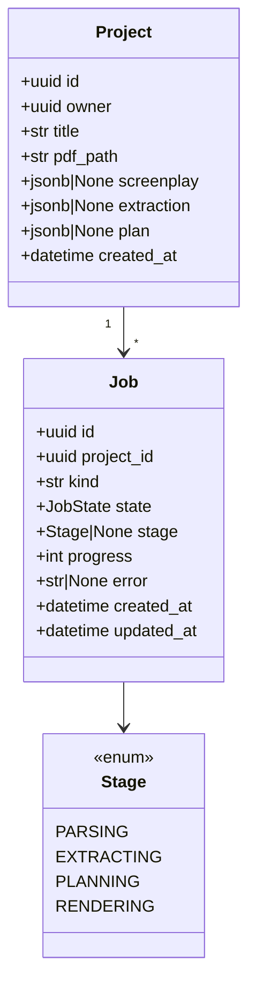
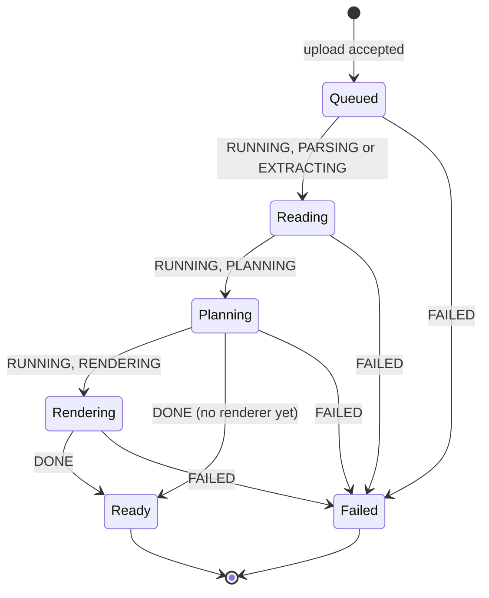

# Design — `web` (sign-in, projects, script, storyboard, frame detail)

**Status:** proposed · **Owner:** Katlego (Claude) · **Tasks:** T009 (API: projects, jobs, pipeline
runner, read endpoints), T040–T042 (the screens), T021 (the audit section of the frame sheet) ·
**Spec:** US1, and US2's "the audit log is visible in the app" ([SPEC.md](../../SPEC.md))

---

## 1. What this covers

The web app from sign-in to a storyboard you can click through: upload a screenplay, watch the job,
read what was found in the script, and see every frame beside the script lines it covers. It also
fixes the API the pages read, and the one new table they need (`Project`) plus two new `Job` fields.

This is where Non-negotiable I becomes visible. The storyboard screen is a **lined script**: the
screenplay page, with one vertical line per shot drawn over exactly the lines that shot cites (a
script supervisor's convention: a straight line while the speaker is on screen, a wavy one while
they're off). A frame never appears without the line it came from next to it.

**Not covered:** the comic reader (T024; its own section is added here before T024 starts),
rendering and the PDF itself (T008, docs/design/storyboard.md), the audit logic (verify.md).

## 2. Reference material

**Build to these.** The PNGs are the visual reference; the HTML beside them is the same screen as
code, and `tokens.css` is the token source every value below comes from.

| Screen | Reference | Mockup source |
| --- | --- | --- |
| Sign-in | [web/signin.png](web/signin.png) | [web/mockups/signin.html](web/mockups/signin.html) |
| Projects + upload | [web/projects.png](web/projects.png) | [web/mockups/projects.html](web/mockups/projects.html) |
| Script | [web/script.png](web/script.png) (full page) | [web/mockups/script.html](web/mockups/script.html) |
| Storyboard | [web/storyboard.png](web/storyboard.png) (full page) | [web/mockups/storyboard.html](web/mockups/storyboard.html) |
| Frame detail (sheet) | [web/storyboard-frame.png](web/storyboard-frame.png) | [web/mockups/storyboard-frame.html](web/mockups/storyboard-frame.html) |
| Storyboard on a phone | [web/storyboard-phone.png](web/storyboard-phone.png) (390 px) | same file, narrow viewport |

- Content in the mockups is the self-written lighthouse script from
  `services/api/tests/script/conftest.py`: its real lines, line numbers and page break. The frame
  images are **pencil sketches standing in for renders**; the app shows real frames (T008) and
  nothing where there is none (§4.3).
- Tokens: [web/mockups/tokens.css](web/mockups/tokens.css): palette, the three typefaces, radius,
  the page shadow, the six shot-line colours and the verdict colours. T040 ports them to
  `apps/web/app/globals.css` (Tailwind v4 `@theme`); shadcn/ui components are restyled with them,
  never shipped with the stock theme.
- Data shapes the pages show: script.md §6 (`Screenplay`, `Span`), grounding.md §6 (`Entity`,
  `GroundingReport`), shots.md §6 (`Shot`), verify.md §6 (`Audit`, `FrameState`).
- Hosting and auth: deploy.md §4 (the browser never calls the API; server-side fetch with the
  user's token), §3 and §5 (`Job`).

### The visual direction

- **Subject:** a writer-director's desk: the script paper on a light table, a storyboard artist's
  non-photo-blue pencil for everything you can act on.
- **Palette:** desk `#dce2e5`, paper `#fafaf7`, ink `#1a222c`, pencil `#2c6e9e` (the one accent,
  deepened to pass AA on paper). Shot lines cycle through the WGA revision-page colours (blue, pink,
  yellow, green, goldenrod, cherry), so neighbouring shots never share a colour. Verdicts: pass
  `#2f7a55`, warn `#9a620f`, withheld `#a23a2f`.
- **Type:** Big Shoulders Display (condensed, slate-like; headings and shot numbers only), Atkinson
  Hyperlegible Next (all body text), Courier Prime (anything quoted from the script, and spans).
  **Script text is always Courier Prime:** anything in Courier is the screenplay's own words,
  anything else is ours. That is how a reader tells a quote from a label at a glance.
- **Signature:** the lined script. It is the one bold element; everything else stays quiet.
- **Light theme only** in this version: paper is the metaphor (§8).

## 3. Domain model

Web view types mirror the API responses (§6). One new table and two new `Job` fields on the API:



- **`Project`** (T009, table `projects`): `owner` is the Supabase Auth user id. `pdf_path` is the
  upload's path in Supabase Storage (`scripts/{owner}/{project_id}.pdf`). `screenplay`,
  `extraction` and `plan` are each stage's result, serialised from the dataclasses in script.md,
  grounding.md and shots.md §6. A stage writes its column in the same transaction that advances the
  job, so a page never sees a half-written stage. `title` is what the user typed at upload,
  defaulting to the file name without `.pdf`.
- **`Job`** (deploy.md §3) gains `project_id` and `stage`. `kind` is `"storyboard"`. `progress` is
  0–100 over the whole job: parsing 0–5, extracting 5–40, planning 40–60, rendering 60–100 (by
  frames settled). Frames themselves are T021's (`frame_audits`, verify.md §6), read through §6's
  `FrameView`.
- **`Screenplay.page_starts`** (new field, T009 adds it and updates script.md §6 in the same PR):
  `tuple[int, ...]`, the 1-based first line of each page in `Screenplay.text`. The parser already
  knows this (`parse_text(text, page_breaks)`); the lined script needs it to break pages where the
  PDF did.

## 4. Flow

### 4.0 Sign-in

Supabase Auth, email and password (`@supabase/ssr`, cookies). Every route except `/sign-in` redirects
there when signed out. The seeded judge account is T030's. Failure copy: "That email and password
don't match. Check both and try again." Reference: signin.png.

### 4.1 Upload and the job

```mermaid
sequenceDiagram
    participant B as Browser
    participant W as Next.js (server)
    participant A as FastAPI
    participant S as Supabase (Auth, Postgres, Storage)
    participant P as Pipeline (in the API process)
    B->>W: POST /api/projects (PDF, title)  [route handler]
    W->>A: POST /api/v1/projects, Authorization: Bearer <user access token>
    A->>S: verify the token (Auth), store the PDF (Storage)
    A->>S: INSERT project + job (QUEUED)
    A-->>W: 202 {project, job}
    W-->>B: redirect to /projects/{id}/storyboard
    A->>P: start the job (asyncio task)
    loop each stage
        P->>S: job RUNNING, stage, progress
        P->>P: parse → extract → plan → render (T008/T021)
        P->>S: write the stage's column; advance
    end
    P->>S: job DONE (or FAILED, error)
    loop every 2 s while QUEUED or RUNNING
        B->>W: GET /api/projects/{id}/status
        W->>A: GET /api/v1/projects/{id}
        A-->>B: summary + job (via W)
    end
```

- **Before T008 and T003 land, the pipeline stops after planning** with the job `DONE`, and the
  storyboard shows shot cards with no frame (§4.3). This is the real state of a project with no
  renderer, not a stand-in.
- **Failures** set `FAILED` with an `error` written for the user, never an exception text:
  - script.md's `ScriptParseError` "no text layer" → "This PDF has no text layer. It looks like a
    scan. Export the script from your screenwriting app as a PDF and upload that."
  - no scene headings → "No scene headings found. Panelwise reads screenplays formatted with
    headings like INT. KITCHEN - NIGHT."
  - extraction or planning failed (`ExtractionError`, `ShotError`) → "Reading the script failed at
    scene {n}. Nothing was saved from this run. Upload the script again to retry."
  - over the extraction budget (grounding.md §4) → "This script is longer than this demo reads
    (about {pages} pages). Upload a shorter one."
  - the API restarted mid-job: on startup every `RUNNING` job becomes `FAILED` with "The server
    restarted while this ran. Upload the script again." (deploy.md §5: a retry is a new job).
- Upload limits (size, pages) are T030's; the API refuses over-limit files with 413 before storing.

### 4.2 Script

Server component: `GET /api/v1/projects/{id}` → `Project` (§6). Three columns (script.png): scenes
(number, heading in Courier, resolved time and whether it was carried from an earlier scene, element
and shot counts), the entities by kind (each with every quote in Courier and its span, and where it
came from: "Found by the model", "Added from dialogue cues", "From the heading"), and the report
(faithfulness and recall **always together**, each with its counts in words, then the models and
tokens). Dropped entities are counted in the report and never listed (SPEC US1). On a phone the
columns stack: intro, report, entities, scenes.

### 4.3 Storyboard

Server component: `Project`, `GET …/lines`, `GET …/shots`, `GET …/frames`, all in parallel. The
client part polls `…/status` while the job is active, and refreshes frames when `progress` changes.

- **Lined script** (left, sticky, scrolls on its own): each page is a paper sheet with its lines in
  Courier Prime, line numbers in the margin, the page number top right. Each shot is a line in the
  gutter from its `span.line_start` to `span.line_end`, labelled with its id (`1.4`) and coloured
  `--line-{(k mod 6)+1}` for the k-th shot in script order. A shot's line is **wavy** over the lines
  of a dialogue element whose speaker is not in the shot's characters, and straight elsewhere
  (`ShotView.segments`). A shot that runs past a page's end ends in an arrowhead and continues at
  the top of the next page.
- **Frame board** (right): one heading per scene (number and heading), then a card per shot in
  order: the frame (16:9), the shot id and camera, the verdict, who and what is in frame, the
  verbatim source in Courier with its span. The card's top edge is its shot line's colour.
- **Linking:** hovering or focusing a card highlights its shot line and tints its lines
  (`--pencil-soft`); clicking a shot line scrolls to its card and focuses it. Clicking a card opens
  the frame sheet (§4.4) and sets `?shot=1.4`, so a frame can be linked to.
- **Card states** follow `FrameView.state` (verify.md §5). The frame image is shown **only** for
  `passed` and `warned` (§6: the API sends `image_url` for nothing else):

| `FrameView` | Card media | Verdict label | Extra line |
|---|---|---|---|
| none yet (no renderer, or not started) | the hatched panel, "Not rendered yet" | — | — |
| `rendering` | hatched panel, three dots, "Rendering attempt {n} of {max}" | "Rendering" | — |
| `auditing` | same, "Auditing attempt {n} of {max}" | "Auditing" | — |
| `passed` | the frame | "Passed audit" | "Passed on attempt {n} of {max}" when n > 1 |
| `warned` | the frame | "Passed with a warning" | each failed soft check: "Light: day light in a night scene" |
| `withheld` | a text card: the verbatim source, its span, "Frame withheld: failed audit ({check})", button "Try another render" | "Withheld" | — |
| `failed` | a text card: the source, its span, "The renderer failed on this frame." | "Render failed" | — |

- **Job strip** under the bar while the job is active: the stage in words ("Reading the script",
  "Planning shots", "Rendering frames"), a meter, and "{settled} of {total} frames settled ·
  {withheld} withheld" while rendering.
- **Export PDF** (bar, right): disabled with the tooltip "Available when every frame has settled"
  until no frame is `rendering` or `auditing`; then it downloads T008's PDF.
- **Phones** (≤ 1100 px): the lined script is hidden and every card keeps its own source and span
  (storyboard-phone.png), so a frame is still never shown without its lines. The project tabs drop
  to a second row of the bar (≤ 640 px).

### 4.4 Frame sheet

A right-hand sheet over the board (Radix Dialog, focus trapped, Esc and × close it, the URL loses
`?shot=`). Sections, in order (storyboard-frame.png):

1. Header: shot id, framing, movement, time of day, verdict.
2. The frame, or its text card (the same rule as the card).
3. **From the script:** for dialogue, the cue and extension as a small label (they sit outside the
   span), then the verbatim text in Courier with a left rule in the shot's colour, then "Page {p},
   lines {a}–{b} · scene {n}, {heading}".
4. **In frame:** each shot character as a chip with its position from the accepted audit
   (`positions`), then props; then the planner's one-sentence rationale.
5. **Audit · {n} attempts** (T021): one block per attempt, newest last: attempt number, verdict,
   seed; "Seen" (the describer's people, setting, light and shot size, in words); "Judged" (who
   each person was called); the failed checks with their details, then "{k} other checks passed"
   (or "All 7 checks passed"); finally "Described by {vision model} · judged by {judge model}".
   Before T021 lands this section is absent, not empty.

## 5. State

The project page's view follows the job (deploy.md §5) and its stage:



- **Queued / Reading:** the Script and Storyboard tabs show the job strip and nothing else.
- **Planning:** Script shows the entities and report; Storyboard shows the job strip.
- **Rendering / Ready:** both tabs are complete; frames follow the card table.
- **Failed:** both tabs show the error (the Projects list does too, projects.png) and the stage it
  failed at. A new upload is the retry.

Frame card states are verify.md §5's `FrameState`; the card never shows an image outside
`passed`/`warned`.

## 6. Contracts

**API** (FastAPI, `/api/v1`, every route requires `Authorization: Bearer <Supabase access token>`,
verified against Supabase Auth; a project belongs to its `owner`, anyone else gets 404):

| Method, path | Body | Response |
|---|---|---|
| `POST /projects` | multipart: `file` (PDF), `title` | 202 `{project: ProjectSummary, job: Job}` · 400 `{error: "not_a_pdf"}` · 413 `{error: "too_large"}` |
| `GET /projects` | — | 200 `ProjectSummary[]`, newest first |
| `GET /projects/{id}` | — | 200 `Project` |
| `GET /projects/{id}/lines` | — | 200 `LinesView` · 409 while parsing |
| `GET /projects/{id}/shots` | — | 200 `ShotView[]` in script order · 409 before planning ends |
| `GET /projects/{id}/frames` | — | 200 `FrameView[]` (one per shot that has one) |
| `GET /projects/{id}/storyboard.pdf` | — | 200 PDF (T008) · 409 while a frame is unsettled |
| `POST /projects/{id}/frames/{scene_index}/{number}/attempts` | — | 202 `FrameView` (T021: `withheld` → `rendering`) · 409 in any other state |

**Response types** (TypeScript in `apps/web/lib/api/types.ts`; Pydantic mirrors in
`services/api/app/api/v1/schemas.py`; field names identical):

```ts
type JobState = "queued" | "running" | "done" | "failed";
type Stage = "parsing" | "extracting" | "planning" | "rendering";
interface Job { id: string; state: JobState; stage: Stage | null; progress: number; error: string | null; updated_at: string }

interface ProjectSummary {
  id: string; title: string; created_at: string;
  pages: number | null; scenes: number | null; shots: number | null;          // null until known
  frames: { settled: number; total: number; withheld: number } | null;         // null before rendering
  job: Job;                                                                    // the latest job
}

interface SpanRef { page: number; line_start: number; line_end: number }        // script.md Span
interface QuoteView { text: string; span: SpanRef }
interface EntityView {
  kind: "character" | "prop" | "location"; name: string;
  source: "model" | "cue" | "heading"; scenes: number[]; quotes: QuoteView[];
}
interface SceneView {
  index: number; number: string; heading: string;
  time_of_day: string | null;            // resolve_times()
  time_carried: boolean;                 // true when the heading itself had no absolute time
  elements: number; shots: number | null;
}
interface ReportView {                   // grounding.md GroundingReport, plus the run's models and tokens
  faithfulness: number; entities_proposed: number; entities_grounded: number;
  quotes_proposed: number; quotes_located: number;
  recall: number; cues_total: number; cues_found_by_model: number;
  models: string[]; prompt_tokens: number; completion_tokens: number;
}
interface Project extends ProjectSummary {
  scene_list: SceneView[] | null; entities: EntityView[] | null; report: ReportView | null;
}

interface LinesView { lines: string[]; page_starts: number[] }  // Screenplay.text split on "\n"; 1-based

interface ShotView {
  id: string;                            // "{scene number}.{shot number}", e.g. "1.4"
  scene_index: number; number: number;
  framing: "wide" | "medium" | "close_up" | "extreme_close_up" | "over_shoulder" | "pov" | "insert";
  movement: "static" | "pan" | "tilt" | "dolly" | "tracking" | "handheld" | "crane";
  characters: string[]; props: string[]; time_of_day: string | null; rationale: string;
  span: SpanRef; source: string;
  // one per covered element, in order; on_screen is false for dialogue whose speaker
  // (match_speaker against the extraction's characters) is not in `characters`
  segments: { line_start: number; line_end: number; cue: string | null; on_screen: boolean }[];
}

type FrameStateView = "rendering" | "auditing" | "passed" | "warned" | "withheld" | "failed";
interface CheckView { check: string; severity: "hard" | "soft"; ok: boolean; detail: string }
interface AuditView {                    // one frame_audits row (verify.md §6)
  attempt: number; seed: number; verdict: "pass" | "warn" | "fail" | "error";
  description: {
    people: { position: "left" | "centre" | "right"; appearance: string }[];
    setting: string; light: string; shot_size: string;
    objects: { name: string; category: string; held: boolean }[]; has_text: boolean;
  } | null;
  judgement: {
    people: { person: number; character: string | null; support: string | null }[];
    objects: { object: number; kind: string; support: string | null }[];
  } | null;
  checks: CheckView[]; positions: Record<string, "left" | "centre" | "right">;
  models: string[]; created_at: string;
}
interface FrameView {
  shot_id: string; state: FrameStateView; attempt: number; max_renders: number;
  image_url: string | null;              // a Supabase Storage signed URL; non-null ONLY when passed or warned
  withheld_check: string | null;         // the first failed hard check, when withheld (or "audit_error")
  audits: AuditView[];                   // [] until T021
}
```

**Web routes** (Next.js App Router): `/sign-in`, `/projects`, `/projects/[id]/script`,
`/projects/[id]/storyboard` (`?shot=` opens the sheet), `/projects/[id]/comic` (T024; until then
the tab is disabled, with the tooltip "Comic pages aren't built yet"). Route handlers proxy the API server-side (deploy.md §4): `POST /api/projects`,
`GET /api/projects/[id]/status`, `GET /api/projects/[id]/storyboard.pdf`,
`POST /api/projects/[id]/frames/[scene]/[number]/attempts`.

**Component tree** (`apps/web/components/`, each built on shadcn/ui primitives restyled with the
tokens):

```
AppBar (wordmark, project title?, ProjectTabs?, actions, user menu)
SignInForm
ProjectsPage
├── UploadPanel (DropZone, TitleField, "Board this script" button)
└── ProjectList → ProjectRow (title, facts, JobState line, meter | error)
ScriptPage
├── SceneIndex → SceneItem
├── EntitySection (kind) → EntityCard → QuoteLine (Quote + SpanRef)
└── ReportPanel → ScoreCard ×2, ModelLine
StoryboardPage
├── JobStrip
├── LinedScript → ScriptSheet (per page) → ScriptLine*, ShotLine* ; Legend
├── FrameBoard → SceneHeader, FrameCard (FrameMedia | PendingMedia | WithheldCard | FailedCard)
└── FrameSheet → FrameMedia, SourceBlock, InFrame, AuditLog → AttemptItem → CheckList
shared: Verdict, SpanRef, Quote (Courier), Meter
```

**Copy** (sentence case, the user's side of the screen; actions keep their names through the flow):

| Where | Text |
|---|---|
| Projects heading | "Board your script" |
| Drop zone | "Drop a screenplay PDF here, or choose a file" · "Export it from your screenwriting app so the text can be read. Scanned pages can't be." |
| Upload button | "Board this script" |
| Script eyebrow | "Read from the script" |
| Faithfulness | "{g} of {p} things the model named are in the script. {l} of {q} quotes found on the page." |
| Recall | "{f} of {c} speaking characters found by the model. A speaker it misses is still added from their dialogue cues." |
| Withheld | "Frame withheld: failed audit ({check in words})" · button "Try another render" |
| Export tooltip | "Available when every frame has settled" |

Check names in words: `unscripted_person` "unscripted person", `unscripted_object` "unscripted
object", `text_in_frame` "text in frame", `setting` "wrong setting", `missing_character` "missing
character", `light` "light", `framing` "framing", `audit_error` "the audit couldn't run".

## 7. Structure

| Path | New? | Responsibility | Task |
| --- | --- | --- | --- |
| `services/api/app/projects/` (`model.py`, `repo.py`, `pipeline.py`) + migration | new | `Project`, the `Job` fields, the stage runner, the restart sweep | T009 |
| `services/api/app/api/v1/{projects,schemas}.py`, `app/core/auth.py` | new | §6 endpoints, Supabase token check | T009 |
| `services/api/app/script/{model,parser}.py` | changed | `Screenplay.page_starts` (+ script.md §6) | T009 |
| `apps/web/app/globals.css`, `apps/web/components/ui/*` | new | tokens as Tailwind `@theme`; shadcn/ui primitives restyled | T040 |
| `apps/web/lib/{supabase,api}/*`, `apps/web/middleware.ts` | new | `@supabase/ssr` session, typed API client, §6 types | T040 |
| `apps/web/app/(auth)/sign-in/`, `apps/web/app/projects/page.tsx`, `apps/web/app/api/projects/**` | new | §4.0, §4.1 | T040 |
| `apps/web/app/projects/[id]/script/`, `components/script/*` | new | §4.2 | T041 |
| `apps/web/app/projects/[id]/storyboard/`, `components/storyboard/*` | new | §4.3, §4.4 (without the audit section) | T042 |
| `components/storyboard/AuditLog.tsx` | new | §4.4 step 5 | T021 |

## 8. Decisions & alternatives

| Decision | Chosen | Rejected, and why |
|---|---|---|
| How a frame shows its source | the lined script beside the board, and the source on every card | a "source" tooltip: hides the one thing the product promises; a separate shot-list tab: splits the frame from its lines |
| Shots tab | none: the lined script *is* the shot list | a table of shots: repeats the storyboard without the frames |
| Progress | poll `status` every 2 s while active | websockets / SSE: needs a long-lived connection through Vercel for a few-minute job |
| Stage results | jsonb columns on `projects` | a table per entity: nothing queries inside them yet; the dataclasses already define the shape |
| A job interrupted by a restart | `FAILED` on startup, upload again | resuming mid-stage: a partial extraction is exactly what grounding.md refuses to show |
| Images | Supabase Storage signed URLs, only for passed or warned frames | public bucket URLs: a withheld frame's file would be one guess away |
| Theme | light only | dark mode: the paper-on-a-light-table metaphor doesn't survive inversion, and the deadline is 2026-10-30 |
| Script text | always Courier Prime | the body face: quotes would look like our words |

Deviations from [docs/architecture-defaults.md](../architecture-defaults.md): none (shadcn/ui,
restyled).

## 9. How this is verified

- **API (T009):** pytest with a fake Supabase token verifier and the compose Postgres: upload →
  job runs the stages with `httpx2.MockTransport` models → `GET` endpoints return §6 shapes; another
  user's project is 404; a failed stage leaves the columns before it and the user-facing error; the
  restart sweep fails a `RUNNING` job; `image_url` is null for every state but passed and warned.
- **Web (T040–T042):** vitest + Testing Library on each component's states: every row of the card
  table renders; **no `` for a frame outside passed/warned**; a shot line's top and height come
  from its span; a dialogue segment off screen draws wavy; the sheet opens from `?shot=`; the lined
  script is hidden and the source shown on a narrow viewport.
- **Visual:** each screen side by side with its PNG in §2 at 1440 px (and the storyboard at 390 px),
  layout, tokens and copy matching; a difference is fixed in the code or, if the reference is
  wrong, in this doc first.
- **End to end:** DEMO.md steps 1–4 and 9 on the local stack with a real Supabase project.

## 10. Open questions

- [ ] Upload limits (bytes, pages) and the extraction budget message's page figure: T030 sets them.
- [ ] How many extra attempts "Try another render" may start per frame (SPEC open question 4).
- [ ] Who can see a project beyond its owner (SPEC open question 6); this doc assumes owner only.
- [ ] Sign-up: the demo uses the seeded judge account (T030); whether anyone else may sign up is a
  deploy decision.
